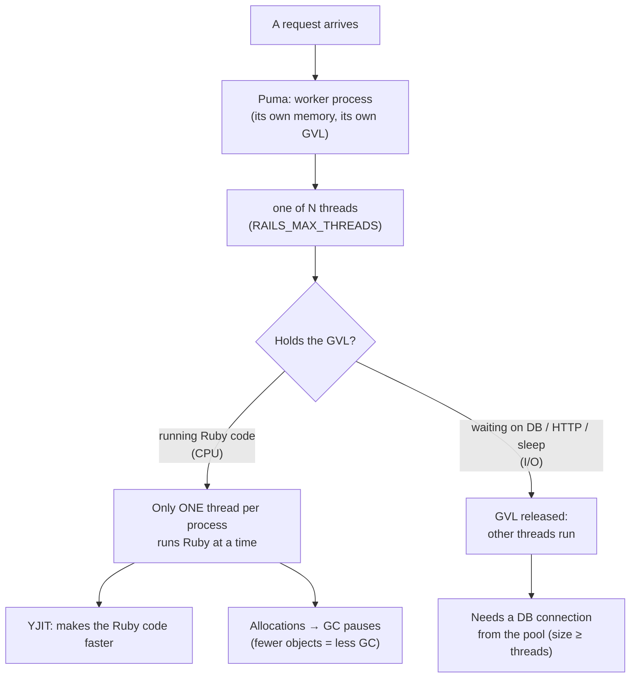

# Step 1 lessons: start here

<!-- nav:top -->
[Course home](../../README.md) › [Step 1 plan](../../steps/01-advanced-ruby.md) · [Glossary](../../GLOSSARY.md)
<!-- nav:end -->

You have written Rails apps for years; this step looks **underneath** them: how Ruby runs your threads, why some endpoints scale with more Puma threads and others do not, what YJIT and the garbage collector are doing, and how to prove a performance change with numbers. The lessons assume you know Rails well and explain the runtime concepts you have probably used without needing to look inside.

**How to use this folder:** each day in [the Step 1 plan](../../steps/01-advanced-ruby.md) starts with **"Read first:"** links. Read the lesson (20-30 minutes), run its example, then do the tasks on `shop-lab` (set it up with the **[shop-lab starter kit](../../starters/shop-lab/README.md)**).

## The lessons

| # | Lesson | Day |
|---|---|---|
| 01 | [The GVL, threads and thread safety](01-gvl-threads-and-thread-safety.md) | Mon 28 Sep, Tue 29 Sep |
| 02 | [Fibers, the Fiber scheduler and Ractors](02-fibers-and-ractors.md) | Wed 30 Sep |
| 03 | [Puma sizing and honest benchmarks](03-puma-and-benchmarking.md) | Thu 1 Oct |
| 04 | [YJIT](04-yjit.md) | Fri 2 Oct |
| 05 | [GC, heap slots and memory](05-gc-and-memory.md) | Sat 3 Oct |
| 06 | [Profiling: Vernier, stackprof and memory_profiler](06-profiling.md) | Sat 3 Oct |

## The mental model for this week

Three questions answer most Rails performance problems:

1. **Is the time spent in Ruby (CPU) or in waiting (I/O)?** Profilers and the GVL tell you. More threads only help I/O.
2. **How many objects does it allocate?** Allocation drives GC time and memory growth.
3. **Is the result measured, repeatable and compared with a baseline?** Otherwise it is an opinion.

## Glossary

| Term | Meaning | Lesson |
|---|---|---|
| **GVL (Global VM Lock)** | CRuby's lock that lets only one thread per process run Ruby code at a time. Released while waiting on I/O. | [01](01-gvl-threads-and-thread-safety.md) |
| **CPU-bound / I/O-bound** | Time spent computing in Ruby / time spent waiting (database, HTTP, disk). | [01](01-gvl-threads-and-thread-safety.md) |
| **Race condition** | A bug where the result depends on the timing of threads (for example lost updates). | [01](01-gvl-threads-and-thread-safety.md) |
| **Mutex** | A lock so only one thread runs a critical section at a time. | [01](01-gvl-threads-and-thread-safety.md) |
| **Thread::Queue** | A thread-safe queue for producer/consumer work. | [01](01-gvl-threads-and-thread-safety.md) |
| **concurrent-ruby** | The gem Rails already depends on, with thread-safe structures (`Concurrent::Map`, atomics, pools). | [01](01-gvl-threads-and-thread-safety.md) |
| **Fiber** | A lightweight, cooperatively scheduled unit of execution inside a thread. | [02](02-fibers-and-ractors.md) |
| **Fiber scheduler** | A hook (Ruby 3.0+) that makes blocking I/O yield to other fibers automatically; used by the `async` gem and Falcon. | [02](02-fibers-and-ractors.md) |
| **Ractor** | An experimental actor-like unit with its own GVL, for real parallel Ruby; objects are isolated. | [02](02-fibers-and-ractors.md) |
| **Shareable object** | An object that may be passed between Ractors (frozen, deeply immutable, or special). | [02](02-fibers-and-ractors.md) |
| **Puma worker / thread** | A forked process (parallel) / a thread inside it (concurrent within the GVL). | [03](03-puma-and-benchmarking.md) |
| **Connection pool** | Active Record's set of DB connections per process; must be ≥ threads. | [03](03-puma-and-benchmarking.md) |
| **Throughput / latency** | Requests per second / time per request. | [03](03-puma-and-benchmarking.md) |
| **p50 / p95 / p99** | Latency percentiles: 50%, 95%, 99% of requests are faster than this. | [03](03-puma-and-benchmarking.md) |
| **Warm-up** | Running load before measuring, so caches and JIT are ready. | [03](03-puma-and-benchmarking.md) |
| **JIT (just-in-time compiler)** | Compiles frequently run Ruby code to machine code while the program runs. | [04](04-yjit.md) |
| **YJIT** | CRuby's production JIT (enabled by default in new Rails apps on Ruby 3.3+). | [04](04-yjit.md) |
| **ZJIT** | A newer, experimental JIT in Ruby 4.0. | [04](04-yjit.md) |
| **GC (garbage collector)** | Frees objects that are no longer referenced. | [05](05-gc-and-memory.md) |
| **Minor / major GC** | Collects only young objects / collects everything (slower). | [05](05-gc-and-memory.md) |
| **Heap slot / heap page** | The fixed-size cell holding one Ruby object / a page of slots. | [05](05-gc-and-memory.md) |
| **Allocation / retained object** | An object created / an object still alive after the operation. | [05](05-gc-and-memory.md), [06](06-profiling.md) |
| **RSS** | Resident set size: the memory a process actually uses in RAM. | [05](05-gc-and-memory.md) |
| **Fragmentation / jemalloc** | Free memory scattered in unusable pieces / an alternative `malloc` that fragments less. | [05](05-gc-and-memory.md) |
| **Sampling profiler** | Records the call stack many times per second to see where time goes (Vernier, stackprof). | [06](06-profiling.md) |
| **Flame graph** | A picture of profile samples: width = time, stacking = call depth. | [06](06-profiling.md) |
| **Wall time / CPU time** | Real elapsed time (including waiting) / time on the CPU only. | [06](06-profiling.md) |
| **Micro-benchmark (benchmark-ips)** | Timing two small implementations against each other; `benchmark-ips` reports iterations per second with a ± margin of error. | [06](06-profiling.md) |

<!-- nav:bottom -->

---

[← Course home](../../README.md) · [Step 1 plan](../../steps/01-advanced-ruby.md) · [First lesson: 01 · The GVL, threads and thread safety →](01-gvl-threads-and-thread-safety.md) · [Step 2 lessons →](../02-rails-at-scale/00-start-here.md)
<!-- nav:end -->
