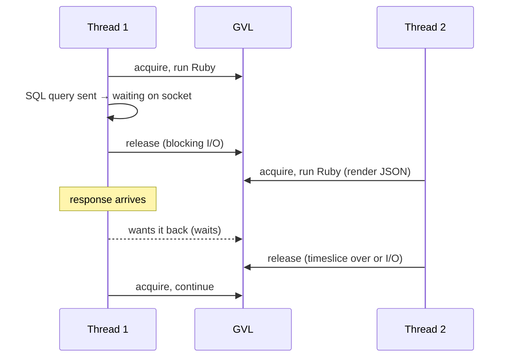

# 01 · The GVL, threads and thread safety

<!-- nav:top -->
[Course home](../../README.md) › [Step 1 plan](../../steps/01-advanced-ruby.md) › [Step 1 lessons](00-start-here.md) · [Glossary](../../GLOSSARY.md)
<!-- nav:end -->

## 1. In one sentence

In CRuby, the **GVL (Global VM Lock)** lets only **one thread per process run Ruby code at a time**, but a thread **releases** it while it waits on I/O (database, HTTP, `sleep`); so threads speed up I/O-bound work, not CPU-bound work, and they still need locks to be **thread-safe**.

## 2. Why it exists

The GVL protects the interpreter's own internals (object allocation, method caches, C extensions) from corruption, which keeps CRuby simpler and single-threaded code fast. The cost: Ruby threads cannot compute in parallel inside one process.

Why you care as a Rails engineer:

- **Puma threads** (`RAILS_MAX_THREADS`, default 3 in Rails 7.2+) help only as much as your requests **wait**. A request spending 80% of its time in SQL and HTTP calls scales well with threads; a request spending its time in Ruby (JSON rendering, big `group_by`s) does not.
- The GVL does **not** make your code thread-safe. Two threads can still interleave between "read" and "write" in your code. Every class-level cache, memoised constant or shared object is a potential race under Puma or Sidekiq.

## 3. Rails analogy

Think of the GVL as **one cash register (the CPU) shared by several cashiers (threads) in a shop (a Puma worker process)**:

- Only one cashier can use the register at a time (running Ruby).
- When a cashier phones a supplier and waits (I/O), they step away and another cashier uses the register.
- To serve more customers who need the register itself (CPU work), you open **another shop** (another Puma worker process), not hire more cashiers.

Where the analogy breaks: the switch between cashiers can happen at many points, not only while phoning, which is why races exist even with one register.

## 4. How it works



- A thread releases the GVL during **blocking I/O** (sockets, files, `sleep`, most database drivers) and some C extensions.
- The VM also switches threads periodically (a timeslice, about 100 ms by default) so one thread cannot starve the others.
- Consequence: **N threads doing I/O can overlap their waits**; N threads doing Ruby computation take about as long as doing it sequentially.

### Thread safety: what the GVL does not protect

A statement like `@count += 1` is several steps: read `@count`, add 1, write `@count`. A thread switch between read and write loses an update. Common Rails-shaped races:

| Code | Race |
|---|---|
| `@count += 1` on a shared object | Lost updates |
| `def self.rates; @rates \|\|= fetch; end` | Several threads call `fetch` (check-then-set) |
| A class-level `Hash` used as a cache, mutated by requests | Lost or corrupted entries |
| A shared non-thread-safe client object (some SDKs) | Interleaved requests |

Tools to fix them:

| Tool | Use for |
|---|---|
| `Mutex#synchronize` | Protect a critical section |
| `Thread::Queue` | Hand work between threads safely (producer/consumer) |
| `Concurrent::Map`, `Concurrent::AtomicFixnum` (concurrent-ruby) | Thread-safe caches and counters |
| Avoid shared mutable state | The best fix: per-request objects, frozen constants, `ActiveSupport::CurrentAttributes` for request-scoped data |

## 5. Minimal working example

### Part A: the GVL, measured

Create `gvl_demo.rb`:

```ruby
require "benchmark"

def fib(n) = n < 2 ? n : fib(n - 1) + fib(n - 2)

def cpu_work = fib(30)     # pure Ruby computation: holds the GVL the whole time
def io_work  = sleep(0.2)  # waiting, like a network or DB call: releases the GVL

def measure(label)
  seconds = Benchmark.realtime { yield }
  puts format("%-24s %.2fs", label, seconds)
end

measure("CPU x4, sequential") { 4.times { cpu_work } }
measure("CPU x4, 4 threads")  { Array.new(4) { Thread.new { cpu_work } }.each(&:join) }
measure("I/O x4, sequential") { 4.times { io_work } }
measure("I/O x4, 4 threads")  { Array.new(4) { Thread.new { io_work } }.each(&:join) }
```

```bash
ruby gvl_demo.rb
```

Output (Ruby 3.3 on a 4-core machine):

```
CPU x4, sequential       0.37s
CPU x4, 4 threads        0.43s
I/O x4, sequential       0.80s
I/O x4, 4 threads        0.20s
```

Four threads did **not** speed up the CPU work (a little slower, because of switching), but made the I/O work **4× faster**.

The same thing, in a real Rails app (`shop-lab`, `/slow_io` waits 100 ms on an HTTP call; `/reports/sales` aggregates in Ruby), measured with the kit's `script/load.rb`:

```
== RAILS_MAX_THREADS=3
/slow_io  c=16  10s  requests=294  errors=0  req/s=29.4  p50=557.4ms  p95=657.0ms  p99=668.4ms
/reports/sales  c=4  15s  requests=12  errors=0  req/s=0.8  p50=5616.3ms  p95=7837.2ms  p99=11151.9ms
== RAILS_MAX_THREADS=16
/slow_io  c=16  10s  requests=1465  errors=0  req/s=146.5  p50=108.2ms  p95=118.7ms  p99=128.2ms
/reports/sales  c=4  15s  requests=12  errors=0  req/s=0.8  p50=6583.9ms  p95=7705.6ms  p99=9253.9ms
```

`/slow_io` went from 29 to 146 req/s. `/reports/sales` stayed at 0.8 req/s: to scale it you need more **processes** (Puma workers) or, better, less Ruby work per request (lesson 06).

### Part B: races, and their fixes

Create `race_demo.rb`:

```ruby
require "concurrent" # concurrent-ruby: already in every Rails app's bundle

# 1. Lost updates: read-modify-write is not atomic, even with the GVL.
class Counter
  attr_reader :value

  def initialize = @value = 0

  def increment
    current = @value
    Thread.pass            # a thread switch can happen here (in real code: I/O, a callback, a log call...)
    @value = current + 1
  end
end

counter = Counter.new
Array.new(10) { Thread.new { 100.times { counter.increment } } }.each(&:join)
puts "unsafe counter: #{counter.value} (expected 1000)"

class SafeCounter < Counter
  def initialize
    super
    @lock = Mutex.new
  end

  def increment = @lock.synchronize { super }
end

safe = SafeCounter.new
Array.new(10) { Thread.new { 100.times { safe.increment } } }.each(&:join)
puts "mutex counter:  #{safe.value}"

# 2. Racy memoisation: ||= is "check, then set", so several threads can do the expensive work.
class ExchangeRates
  @loads = Concurrent::AtomicFixnum.new(0)

  class << self
    attr_reader :loads

    def rates
      @rates ||= begin
        loads.increment
        sleep 0.05 # pretend to call an API
        { "EUR" => 1.17 }
      end
    end
  end
end

Array.new(5) { Thread.new { ExchangeRates.rates } }.each(&:join)
puts "rates loaded #{ExchangeRates.loads.value} times (expected 1)"

class SafeExchangeRates
  LOCK = Mutex.new
  @loads = 0

  class << self
    attr_reader :loads

    def rates
      LOCK.synchronize do
        @rates ||= begin
          @loads += 1
          sleep 0.05
          { "EUR" => 1.17 }
        end
      end
    end
  end
end

Array.new(5) { Thread.new { SafeExchangeRates.rates } }.each(&:join)
puts "safe rates loaded #{SafeExchangeRates.loads} time(s)"
```

```bash
ruby race_demo.rb
```

Output:

```
unsafe counter: 100 (expected 1000)
mutex counter:  1000
rates loaded 5 times (expected 1)
safe rates loaded 1 time(s)
```

`Thread.pass` and `sleep` make the switch happen reliably here; in production, the switch happens at a random point (a log call, an I/O call inside a callback), so the bug appears rarely and is hard to reproduce. That is exactly why you should recognise the patterns in code review.

## 6. Key terms

- **GVL**: CRuby's lock allowing one thread per process to run Ruby at a time.
- **Blocking I/O**: waiting for the network, disk or a timer; releases the GVL.
- **CPU-bound / I/O-bound**: limited by computation / by waiting.
- **Race condition**: a timing-dependent bug between threads.
- **Critical section**: code that must not run in two threads at once.
- **Mutex / Queue / atomic**: tools to make shared state safe.
- **Puma worker**: a separate process with its own GVL (parallelism).

## 7. Common mistakes

- **Adding threads to fix slow CPU-bound endpoints.** It changes nothing (or makes latency worse).
- **Believing "the GVL makes Ruby thread-safe".** It protects the VM, not your data.
- **Class-level memoisation** (`@x ||= ...` in `class << self`) without a lock, in code run by Puma or Sidekiq threads.
- **Mutating constants** (`CACHE = {}` then `CACHE[key] = ...`) from requests.
- **Raising threads without raising the DB pool** (lesson 03): threads then wait for connections instead of the GVL.
- **Holding a mutex around slow I/O**, which turns concurrency back into a queue.

## 8. Check your understanding

1. Why did four threads not speed up `fib(30)` but made four `sleep(0.2)` calls four times faster?
2. `/slow_io` reached 146 req/s with 16 threads. Roughly what would you expect with 32 threads, and what else might limit it?
3. Why is `@rates ||= fetch` unsafe in a class method, even with the GVL?
4. A CPU-heavy endpoint is slow under load. Name two changes that help and one that does not.
5. What is the difference between concurrency and parallelism in CRuby?

<details>
<summary>Answers</summary>

1. `fib` runs Ruby code and needs the GVL all the time, so the threads take turns. `sleep` releases the GVL, so all four waits overlap.
2. Up to about 300 req/s (each thread does about 10 requests per second at 100 ms each), until something else limits it: the DB pool, the upstream service, CPU for the Ruby parts of the request, or the load generator.
3. `||=` means "if nil, compute and assign": two threads can both see `nil` before either assigns, so both call `fetch`. Nothing in the GVL stops the switch between the check and the assignment.
4. Help: more Puma worker processes (parallel), and less Ruby work per request (SQL aggregation, fewer allocations, caching). Does not help: more threads per process.
5. Concurrency: several tasks in progress, interleaved (threads in one process). Parallelism: running at the same instant on several cores (separate processes, or Ractors).

</details>

## 9. Go deeper (optional)

- Jean Boussier (byroot), "So You Want To Remove The GVL?" and related posts on the GVL and Puma sizing: https://byroot.github.io/ (verify titles).
- Ruby docs: [Thread](https://docs.ruby-lang.org/en/3.4/Thread.html), [Thread::Queue](https://docs.ruby-lang.org/en/3.4/Thread/Queue.html), [Mutex](https://docs.ruby-lang.org/en/3.4/Thread/Mutex.html).
- Rails Guides: [Threading and Code Execution in Rails](https://guides.rubyonrails.org/threading_and_code_execution.html).

<!-- nav:bottom -->

---

[← Step 1 lessons: start here](00-start-here.md) · [Step 1 lessons](00-start-here.md) · [02 · Fibers, the Fiber scheduler and Ractors →](02-fibers-and-ractors.md)
<!-- nav:end -->
