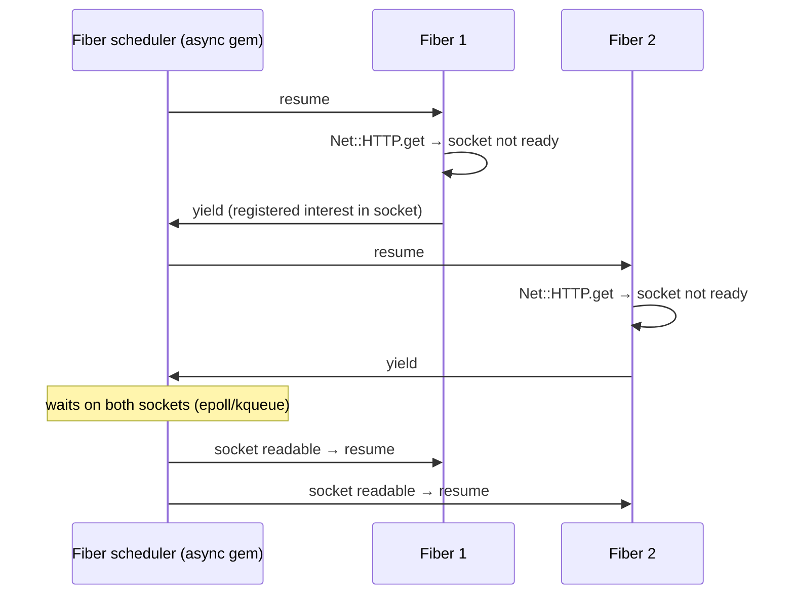

# 02 · Fibers, the Fiber scheduler and Ractors

## 1. In one sentence

**Fibers** are lightweight, cooperatively scheduled units of work inside a thread; with a **Fiber scheduler** (the `async` gem, Falcon) blocking I/O automatically switches to another fiber, giving thread-like I/O concurrency with less overhead; **Ractors** are the opposite tool: experimental, isolated units with **their own GVL** for real CPU parallelism.

## 2. Why it exists

Lesson 01 showed threads overlapping I/O waits. Threads have costs: each has its own stack (about 1 MB of virtual memory), the OS schedules them preemptively, and the VM switches between them on a timer. For work that is **mostly waiting** (thousands of HTTP calls, WebSockets, streaming AI responses), fibers are cheaper: a fiber switch is a function-call-sized operation, and you can have tens of thousands of them.

Ractors exist for the other gap: CPU-bound Ruby code that needs **more than one core in one process**. Each Ractor has its own GVL, so they can compute in parallel, at the price of strict isolation (no shared mutable objects).

For most Rails apps today: Puma threads + processes remain the default; fibers matter when you use Falcon or the `async` gem for I/O fan-out; Ractors are worth understanding but not yet used in typical Rails code.

## 3. Rails analogy

| Concept | Rails-world example |
|---|---|
| Thread | A Puma thread serving a request |
| Fiber + scheduler | Falcon (a Fiber-based server) serving many requests in one thread; `Async { }` blocks in a job fanning out HTTP calls |
| Ractor | Like running `fork` workers, but inside one process, with message passing instead of shared memory |
| `Enumerator` with `next` | You already used fibers: external enumerators are built on them |

## 4. How it works

### Fibers and the scheduler

A fiber runs until it **yields** control. Without a scheduler, you yield explicitly (`Fiber.yield`), which is how `Enumerator#next` works. **With** a scheduler (set by `Async { ... }`), Ruby's blocking operations (`sleep`, socket reads, `Net::HTTP`, many database drivers) call the scheduler instead of blocking the thread, and the scheduler resumes another fiber whose I/O is ready.



All of this happens in **one thread**: no GVL contention, no locks needed between fibers (switches only happen at I/O points).

### Ractors

- `Ractor.new { ... }` runs the block in a new Ractor with its own GVL.
- Objects are **isolated**: arguments are **deep-copied** in (or moved), and only **shareable** objects (frozen and deeply immutable, like frozen strings, numbers, symbols, `Ractor.make_shareable(obj)`) can be seen by several Ractors.
- A block may not reference outer local variables.
- You get a result back with `ractor.take` (Ruby 3.x) or `ractor.value` (Ruby 4.0 replaced `take` with `value` and added `Ractor::Port`).
- Most gems, and Rails itself, are **not Ractor-safe** (they use shared mutable state), which is why Ractors are not used for request handling.

## 5. Minimal working example

### Part A: I/O with fibers vs threads

Start the slow server from the shop-lab kit (`ruby script/slow_server.rb`), install the gem (`gem install async`), then create `fibers_demo.rb`:

```ruby
require "async"
require "benchmark"
require "net/http"

URL = URI("http://127.0.0.1:4567/") # script/slow_server.rb: answers after 100 ms

def fetch = Net::HTTP.get(URL)

sequential = Benchmark.realtime { 10.times { fetch } }

threads = Benchmark.realtime do
  Array.new(10) { Thread.new { fetch } }.each(&:join)
end

fibers = Benchmark.realtime do
  Async do |task|                     # starts a Fiber scheduler (event loop)
    10.times.map { task.async { fetch } }.each(&:wait)  # 10 fibers; Net::HTTP yields while waiting
  end
end

puts format("10 requests  sequential: %.2fs  threads: %.2fs  fibers (async gem): %.2fs",
            sequential, threads, fibers)
```

```bash
ruby fibers_demo.rb
```

Output (Ruby 3.3, async 2.x):

```
10 requests  sequential: 1.02s  threads: 0.11s  fibers (async gem): 0.10s
```

Fibers matched threads for this I/O fan-out, in a single thread, **without changing `fetch`**: the scheduler made `Net::HTTP` non-blocking.

### Part B: Ractors for CPU work

Create `ractor_demo.rb`:

```ruby
require "benchmark"
require "etc" # for Etc.nprocessors (number of CPU cores)

def fib(n) = n < 2 ? n : fib(n - 1) + fib(n - 2)

# Ruby 3.x uses Ractor#take; Ruby 4.0 replaced it with Ractor#value.
def result_of(ractor) = ractor.respond_to?(:value) ? ractor.value : ractor.take

threads = Benchmark.realtime { Array.new(4) { Thread.new { fib(30) } }.each(&:join) }
ractors = Benchmark.realtime do
  Array.new(4) { Ractor.new { fib(30) } }.each { |r| result_of(r) }
end
puts format("4 x fib(30)  threads: %.2fs  ractors: %.2fs  (CPU cores: %d)",
            threads, ractors, Etc.nprocessors)

begin
  config = { retries: 3 } # a normal (unfrozen) Hash is not shareable between Ractors
  Ractor.new(config) { |c| c }.then { |r| result_of(r) }
  puts "copied: arguments are deep-copied into the Ractor"
  shared = 42
  Ractor.new { shared }  # referring to an outer local variable is not allowed
rescue ArgumentError => e
  puts "ArgumentError: #{e.message}"
end
```

```bash
ruby ractor_demo.rb
```

Output on the test machine (Ruby 3.3, 4 cores):

```
warning: Ractor is experimental, and the behavior may change in future versions of Ruby! Also there are many implementation issues.
4 x fib(30)  threads: 0.41s  ractors: 0.71s  (CPU cores: 4)
copied: arguments are deep-copied into the Ractor
ArgumentError: can not isolate a Proc because it accesses outer variables (shared).
```

Read this honestly: on this machine and Ruby version, the Ractor version was **slower** than threads, even though it could use 4 cores. Ractor performance depends on the Ruby version (Ractors are still experimental and change between releases; Ruby 4.0 reworked their API) and on the workload. Run it on your Ruby 3.4 or 4.0 and compare. That is the whole lesson of this week in miniature: **measure, do not assume**.

## 6. Key terms

- **Fiber**: a cooperatively scheduled execution context inside a thread.
- **`Fiber.yield` / `resume`**: manual switching between fibers.
- **Fiber scheduler**: an object (set per thread) that turns blocking I/O into fiber switches.
- **`async` gem / Falcon**: a Fiber scheduler implementation / a Fiber-based web server.
- **Ractor**: an isolated unit with its own GVL, for parallel Ruby.
- **Shareable object**: deeply immutable object that Ractors can share.
- **`Ractor#take` / `#value`**: get a Ractor's result (Ruby 3.x / 4.0).

## 7. Common mistakes

- **Expecting fibers to speed up CPU work.** They are still one thread under one GVL.
- **Using a library that blocks without the scheduler** (some C extensions), which freezes all fibers.
- **Mixing thread-local assumptions with fibers**: `Thread.current[:x]` is actually **fiber**-local, so each fiber sees its own value (use `Thread.current.thread_variable_get` for truly thread-wide values).
- **Trying to use Rails or most gems inside Ractors.**
- **Assuming Ractors are faster** without measuring on your Ruby version.

## 8. Check your understanding

1. Why did the fiber version not need any locks, even though ten requests overlapped?
2. What does the Fiber scheduler change about `Net::HTTP.get` inside `Async { }`?
3. Why can a Ractor not read a local variable from the surrounding method?
4. Give one reason Rails apps do not run requests in Ractors today.
5. When would you choose the `async` gem over threads in a Rails codebase?

<details>
<summary>Answers</summary>

1. Fibers switch only at I/O points (cooperatively), in one thread, so no two fibers run Ruby code at the same moment in the middle of your logic.
2. When the socket is not ready, the call yields to the scheduler instead of blocking the thread, so another fiber can run; it resumes when data arrives.
3. Isolation: sharing an unfrozen outer object would let two Ractors mutate it in parallel; Ruby forbids closures over outer variables.
4. Rails and most gems rely on shared mutable state (class-level caches, configuration, connection pools) that is not Ractor-safe.
5. For heavy I/O fan-out (many concurrent HTTP or streaming calls) in a job or a Falcon-served app, where thousands of threads would be too costly.

</details>

## 9. Go deeper (optional)

- Ruby docs: [Fiber](https://docs.ruby-lang.org/en/3.4/Fiber.html) (including `Fiber::Scheduler`) and the [Ractor guide](https://docs.ruby-lang.org/en/3.4/ractor_md.html).
- [socketry/async](https://github.com/socketry/async) and [Falcon](https://github.com/socketry/falcon).
- Ruby 4.0 [NEWS](https://github.com/ruby/ruby/blob/ruby_4_0/NEWS.md), "Ractor" section: `Ractor::Port` added, `Ractor.yield` and `Ractor#take` removed, `Ractor#join` and `Ractor#value` added.
