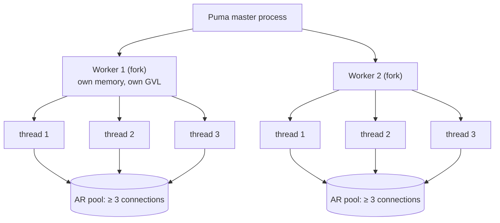

# 03 · Puma sizing and honest benchmarks

<!-- nav:top -->
[Course home](../../README.md) › [Step 1 plan](../../steps/01-advanced-ruby.md) › [Step 1 lessons](00-start-here.md) · [Glossary](../../GLOSSARY.md)
<!-- nav:end -->

## 1. In one sentence

Puma serves requests with **worker processes** (for parallel CPU work) each running **threads** (for overlapping I/O waits); you choose the numbers by **measuring** throughput and latency percentiles under realistic load, with a repeatable benchmark method, and you size the **database pool** to match.

## 2. Why it exists

Rails ships sensible defaults (Rails 7.2+ sets 3 threads per worker; workers come from `WEB_CONCURRENCY`), but the right numbers depend on how much of your request time is Ruby (CPU) and how much is waiting (I/O), on memory per worker, and on how many cores you have. Wrong settings cause real incidents:

- too many threads for CPU-heavy apps → worse p99 latency,
- more threads than DB connections → `ActiveRecord::ConnectionTimeoutError`,
- too many workers → out-of-memory kills.

And every performance claim you make this week needs a **benchmark you can trust**.

## 3. Rails analogy

You already configure this in `config/puma.rb`:

```ruby
# config/puma.rb as generated by Rails 8
threads_count = ENV.fetch("RAILS_MAX_THREADS", 3)
threads threads_count, threads_count
# Workers: Puma reads WEB_CONCURRENCY itself (WEB_CONCURRENCY=4 → cluster mode with 4 workers).
```

and in `config/database.yml`:

```yaml
pool: <%= ENV.fetch("RAILS_MAX_THREADS") { 5 } %>
```

This lesson is about choosing those numbers with evidence.

## 4. How it works



### Workers vs threads

| | Workers (processes) | Threads |
|---|---|---|
| Parallel Ruby execution | Yes (one GVL each) | No (share one GVL) |
| Overlap I/O waits | Yes | Yes |
| Memory cost | High (a full app copy each, partly shared by copy-on-write) | Low |
| Good for | CPU-heavy work, using all cores | I/O-heavy work |

A common starting point: **workers ≈ number of CPU cores**, threads **3-5**, then measure. In cluster mode, Puma (6 and later) preloads the app before forking by default (`preload_app!`), so workers share memory pages (copy-on-write) until they modify them.

### Connections

Each process has its own Active Record pool. The pool must be **at least the number of threads** that use the database in that process (Puma threads; in a Solid Queue worker, its thread count). Total connections to Postgres:

```
(web workers × pool) + (job processes × their pool) + consoles, cron, migrations ...  ≤  max_connections (minus headroom)
```

### Honest benchmarks

| Rule | Why |
|---|---|
| Production-like settings (`eager_load`, no reloading, caching) | Development mode is slower and different |
| Warm up before measuring | JIT compilation, caches, connection setup |
| Fixed duration and concurrency; same machine; nothing else running | Comparability |
| Report **p50, p95, p99** and throughput, plus RSS | Averages hide the tail users feel |
| Change **one thing at a time**, run at least twice | Otherwise you cannot attribute the change |
| Write down the command, versions and data size | Reproducibility |

**Percentiles:** p95 = 212 ms means 95% of requests were faster than 212 ms, 5% slower. With 1,000 requests per minute, 50 requests per minute are slower than your p95.

**Little's Law** helps sanity-check results: *concurrency = throughput × latency*. With 16 threads and 100 ms per request, the best possible throughput is 16 / 0.1 s = 160 req/s. The measured 146 req/s in lesson 01 is close to that ceiling.

## 5. Minimal working example

Use `shop-lab` with the kit's `benchmark` environment (production-like over plain HTTP) and load generator. Terminal 1: `ruby script/slow_server.rb`. Terminal 2: start the server with the settings you are testing. Terminal 3: measure.

```bash
# Baseline: Rails' defaults (1 process, 3 threads)
RAILS_ENV=benchmark bin/rails server

ruby script/load.rb http://127.0.0.1:3000/slow_io 16 3     # warm-up, ignore the output
ruby script/load.rb http://127.0.0.1:3000/slow_io 16 15    # measurement
```

Output on the test machine (from the kit's README; your numbers will differ):

```
/slow_io  c=16  10s  requests=294  errors=0  req/s=29.4  p50=557.4ms  p95=657.0ms  p99=668.4ms
```

Now change **one** variable and repeat:

```bash
RAILS_MAX_THREADS=16 RAILS_ENV=benchmark bin/rails server         # more threads
WEB_CONCURRENCY=4 RAILS_ENV=benchmark bin/rails server            # 4 workers x 3 threads (Puma switches to cluster mode)
```

```
/slow_io  c=16  10s  requests=1465  errors=0  req/s=146.5  p50=108.2ms  p95=118.7ms  p99=128.2ms
```

Check each result against Little's Law, and record every run in `perf/results.md`:

| Change | Endpoint | req/s | p50 | p95 | p99 | RSS (MB) | Notes |
|---|---|---|---|---|---|---|---|
| Baseline (1×3) | /slow_io | 29.4 | 557 | 657 | 668 | | limited by 3 threads × 10 req/s |
| 1×16 | /slow_io | 146.5 | 108 | 119 | 128 | | near the 160 req/s ceiling |

Measure RSS per process with `ps -o pid,rss,command -p $(pgrep -f puma | paste -sd,)` (RSS is in KB) after a few minutes of load.

With [oha](https://github.com/hatoo/oha), the equivalent is `oha -z 15s -c 16 --no-tui http://127.0.0.1:3000/slow_io`; it prints the same metrics with a latency histogram.

## 6. Key terms

- **Worker (Puma)**: a forked process with its own GVL and memory.
- **Thread (Puma)**: concurrent request handling inside a worker.
- **Cluster mode / single mode**: Puma with workers / without.
- **`preload_app!` / copy-on-write**: load before fork so memory pages are shared until modified.
- **Connection pool**: Active Record connections per process.
- **Throughput / latency / percentile**: req/s / time per request / the value below which a share of requests fall.
- **Little's Law**: concurrency = throughput × latency.
- **Warm-up**: load applied before measuring.

## 7. Common mistakes

- **Benchmarking in development mode.**
- **Reporting only averages.**
- **Load generator on an overloaded machine**, measuring itself rather than the app.
- **Changing threads and workers at the same time.**
- **Threads > pool**, then blaming the database.
- **Forgetting memory**: 8 workers × 400 MB may not fit in the container.
- **Ignoring Little's Law**, so an impossible result (above the theoretical ceiling) is not questioned.

## 8. Check your understanding

1. A request takes 200 ms, of which 150 ms is waiting on SQL and HTTP. Roughly how much can extra threads help, and what limits them?
2. You run 4 Puma workers with 5 threads and 2 Solid Queue processes with 3 threads each. What is the minimum number of Postgres connections you need?
3. Why must you warm up before measuring, especially with YJIT?
4. With 8 concurrent clients and p50 = 400 ms, what throughput do you expect?
5. Why is p99 often more important than the average when choosing thread counts?

<details>
<summary>Answers</summary>

1. The 150 ms of waiting can overlap with other requests' Ruby work, so a few threads help a lot; the 50 ms of Ruby per request still runs one at a time per process, capping throughput at about 20 req/s per worker (1 s / 50 ms). More threads beyond that mainly add queueing.
2. At least 4 × 5 + 2 × 3 = 26 (plus consoles, migrations and headroom).
3. JIT compilation, caches and connections are cold at first, so early requests are slower and would distort the results.
4. About 8 / 0.4 s = 20 req/s (Little's Law).
5. More threads can increase contention for the GVL and the DB pool, which hurts the slowest requests first; the average can look fine while p99 gets much worse.

</details>

## 9. Go deeper (optional)

- Puma docs: [Deployment engineering](https://github.com/puma/puma/blob/main/docs/deployment.md) and [Configuration](https://github.com/puma/puma#configuration).
- Rails Guides: [Tuning Performance for Deployment](https://guides.rubyonrails.org/tuning_performance_for_deployment.html).
- Nate Berkopec, *The Complete Guide to Rails Performance* (Puma, Little's Law, memory).

<!-- nav:bottom -->

---

[← 02 · Fibers, the Fiber scheduler and Ractors](02-fibers-and-ractors.md) · [Step 1 lessons](00-start-here.md) · [04 · YJIT →](04-yjit.md)
<!-- nav:end -->
