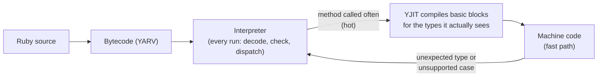

# 04 · YJIT

<!-- nav:top -->
[Course home](../../README.md) › [Step 1 plan](../../steps/01-advanced-ruby.md) › [Step 1 lessons](00-start-here.md) · [Glossary](../../GLOSSARY.md)
<!-- nav:end -->

## 1. In one sentence

**YJIT** is CRuby's built-in **just-in-time compiler**: while your app runs, it compiles frequently executed Ruby code into machine code, typically making CPU-bound Rails work noticeably faster at the cost of some extra memory per process; new Rails apps on Ruby 3.3+ enable it by default.

## 2. Why it exists

Normally CRuby **interprets** bytecode: for every instruction it looks up what to do, checks types, dispatches. That overhead is a large share of the time spent in pure Ruby code (rendering, serialisation, business logic). A JIT removes much of it by generating specialised machine code for the code paths your app actually runs.

For you this week:

- You should **verify** YJIT is on in your apps (it silently is not, if Ruby was built without it).
- You should **measure** its benefit (CPU time, latency) and its **cost** (memory per Puma worker) instead of assuming.
- It changes benchmark method: results before warm-up are misleading.

## 3. Rails analogy

YJIT is like **fragment caching for your code's execution**: the first time a code path runs, Ruby does the slow work (interpreting and compiling); later runs reuse the compiled result. And, like caching, it uses memory and needs warm-up, and it helps most on hot paths.

## 4. How it works



- YJIT compiles **lazily**, small pieces at a time, only for code that runs often, and **specialises** it for the types it observes (lazy basic block versioning).
- If an assumption breaks (a different type shows up), it **falls back** to the interpreter or compiles another version.
- Compiled code and YJIT's metadata live in memory: expect **tens of MB more per process**, configurable.

### Turning it on and checking

| How | When |
|---|---|
| Rails 7.2+ `config.yjit = true` (a default in `load_defaults 7.2`+, applied on Ruby 3.3+) | Normal Rails apps |
| `RUBY_YJIT_ENABLE=1` environment variable | Any Ruby process |
| `ruby --yjit` | Scripts |
| `RubyVM::YJIT.enable` (Ruby 3.3+) | Enable at runtime, for example after boot |

Check in a console of the running app: `RubyVM::YJIT.enabled?`. If `RubyVM::YJIT` is not even defined, your Ruby was **built without YJIT** (it needs a Rust compiler at build time), and you get this on the command line:

```
ruby: warning: Ruby was built without YJIT support. You may need to install rustc to build Ruby with YJIT.
```

(That is real output from the machine this course was tested on; the numbers below are therefore illustrative. Official Ruby Docker images and most version managers build with YJIT when Rust is available.)

### Stats and memory

- `ruby --yjit-stats` (or `RUBY_YJIT_ENABLE=1` plus `--yjit-stats`) prints statistics at exit; `RubyVM::YJIT.runtime_stats` returns a Hash while running. The keys vary by Ruby version; look for the ratio of instructions executed in YJIT (`ratio_in_yjit`, with stats enabled) and the memory used by compiled code.
- Ruby 3.4 adds `--yjit-mem-size=N`, a soft limit on YJIT's total memory in MiB (default 128).
- Ruby 4.0 ships **ZJIT**, a newer method-based JIT, as **experimental** (enable with `ruby --zjit` or `RubyVM::ZJIT.enable`). Its release notes say it is faster than the interpreter but not yet as fast as YJIT, and advise against production use. Stay on YJIT for production and try ZJIT as a stretch goal.

## 5. Minimal working example

### Part A: is YJIT on in your app?

```bash
bin/rails runner 'puts "YJIT enabled: #{defined?(RubyVM::YJIT) && RubyVM::YJIT.enabled?}"'
RAILS_ENV=benchmark bin/rails runner 'puts Rails.application.config.yjit.inspect'
```

### Part B: measure the effect on a CPU-bound endpoint

Run the same load test twice on `shop-lab`, changing only YJIT:

```bash
# YJIT off (the kit's benchmark environment reads YJIT=0)
YJIT=0 RAILS_ENV=benchmark bin/rails server                 # Terminal 2 (restart between runs)
ruby script/load.rb http://127.0.0.1:3000/reports/sales 2 5     # warm-up
ruby script/load.rb http://127.0.0.1:3000/reports/sales 2 30    # measure

# YJIT on
RAILS_ENV=benchmark bin/rails server
ruby script/load.rb http://127.0.0.1:3000/reports/sales 2 5
ruby script/load.rb http://127.0.0.1:3000/reports/sales 2 30
```

Why a `YJIT` variable instead of `RUBY_YJIT_ENABLE=0`? Rails enables YJIT itself after boot whenever `config.yjit` is true, whatever the environment variable says. The kit's `config/environments/benchmark.rb` therefore sets `config.yjit = ENV.fetch("YJIT", "1") != "0"`. Always confirm with Part A.

Record req/s, p50/p95 and RSS for both runs in `perf/results.md`. Illustrative shape of a result (not measured on the test machine; yours will differ):

| Change | Endpoint | req/s | p50 | p95 | RSS per worker |
|---|---|---|---|---|---|
| YJIT off | /reports/sales | 0.8 | 2,400 ms | 2,700 ms | 310 MB |
| YJIT on | /reports/sales | 1.0 | 1,950 ms | 2,250 ms | 345 MB |

Then collect stats for one warmed-up run:

```bash
RAILS_ENV=benchmark bin/rails runner '
  3.times { ActionDispatch::Integration::Session.new(Rails.application).get("/reports/sales") }
  stats = RubyVM::YJIT.runtime_stats
  pp stats.slice(*stats.keys.grep(/ratio_in_yjit|code_region|alloc_size|compiled_iseq/))
'
```

### Deciding

Keep YJIT if the latency or CPU gain is worth the memory. Two typical outcomes: a CPU-heavy API gets a clear latency gain at a modest memory cost (keep it, maybe adjust worker count); a memory-constrained container with mostly I/O-bound requests sees little gain (consider the memory limit option, or keep it off and document why).

## 6. Key terms

- **Interpreter**: executes bytecode instruction by instruction.
- **JIT compiler**: compiles code to machine code while the program runs.
- **YJIT**: CRuby's production JIT (lazy basic block versioning).
- **Warm-up**: the period in which hot code gets compiled.
- **Side exit / fallback**: leaving compiled code for the interpreter when assumptions fail.
- **`ratio_in_yjit`**: the share of instructions executed in compiled code (with stats).
- **ZJIT**: Ruby 4.0's experimental JIT.

## 7. Common mistakes

- **Assuming YJIT is on** because the app is on Ruby 3.3+; check `RubyVM::YJIT.enabled?` in production.
- **Measuring without warm-up**, so YJIT looks slower.
- **Ignoring memory**: more RSS per worker can mean fewer workers fit in a container.
- **Expecting gains on I/O-bound endpoints**: YJIT speeds up Ruby, not waiting.
- **Turning on `--yjit-stats` in production**: stats collection adds overhead; use it for experiments.

## 8. Check your understanding

1. Why does YJIT need warm-up, and how do you account for that in a benchmark?
2. `/slow_io` shows no gain with YJIT. Why?
3. How do you tell whether a Ruby binary was built with YJIT?
4. YJIT made p95 15% faster but RSS grew by 40 MB per worker in a container with a tight memory limit. What do you consider?
5. What is the difference between YJIT and ZJIT for your production plans?

<details>
<summary>Answers</summary>

1. It compiles code only after it has run a number of times; run load for a while before measuring and discard the warm-up numbers.
2. Its time is spent waiting on the slow service (I/O), not executing Ruby, so faster Ruby barely changes the total.
3. `defined?(RubyVM::YJIT)` is nil (and `ruby --yjit` prints "built without YJIT support") if it was not built in.
4. Whether the latency gain is worth fewer workers or a bigger container; you can also cap YJIT memory (`--yjit-mem-size` on 3.4+), then re-measure.
5. YJIT is the production-ready JIT; ZJIT (Ruby 4.0) is experimental: try it in benchmarks, not production.

</details>

## 9. Go deeper (optional)

- [YJIT documentation](https://github.com/ruby/ruby/blob/master/doc/jit/yjit.md) (options, stats, memory) and, next to it, the [ZJIT documentation](https://github.com/ruby/ruby/blob/master/doc/jit/zjit.md).
- Rails Guides: [Tuning Performance for Deployment](https://guides.rubyonrails.org/tuning_performance_for_deployment.html) (YJIT section).
- Shopify Engineering blog posts on YJIT in production (shopify.engineering, verify titles).

<!-- nav:bottom -->

---

[← 03 · Puma sizing and honest benchmarks](03-puma-and-benchmarking.md) · [Step 1 lessons](00-start-here.md) · [05 · GC, heap slots and memory →](05-gc-and-memory.md)
<!-- nav:end -->
