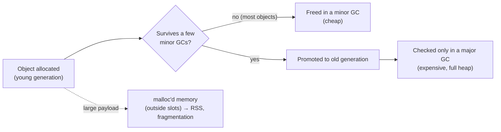

# 05 · GC, heap slots and memory

<!-- nav:top -->
[Course home](../../README.md) › [Step 1 plan](../../steps/01-advanced-ruby.md) › [Step 1 lessons](00-start-here.md) · [Glossary](../../GLOSSARY.md)
<!-- nav:end -->

## 1. In one sentence

Every Ruby object lives in a **heap slot**; the **garbage collector** (GC) frees objects nobody references, mostly with cheap **minor** collections of young objects and occasionally expensive **major** ones, so the most effective memory and latency optimisation is simply **allocating fewer objects**, while process memory (RSS) also depends on `malloc` behaviour you can improve with **jemalloc** or `MALLOC_ARENA_MAX`.

## 2. Why it exists

Two production symptoms send Rails engineers here:

1. **Latency spikes**: GC pauses add milliseconds to requests that allocate heavily (big JSON responses, loading thousands of Active Record objects).
2. **Memory growth**: Puma or Sidekiq workers slowly grow from 300 MB to 1 GB, hit container limits and get killed.

The first is mainly about **allocations**. The second is often not a Ruby leak at all but **fragmentation** in the C memory allocator. Knowing the difference saves days of chasing a "leak" that does not exist.

## 3. Rails analogy

Think of the Ruby heap as a **parking garage**:

- Each object parks in a **slot** (Ruby 3.2+ has several slot sizes: 40, 80, 160, 320 and 640 bytes, via Variable Width Allocation).
- The **GC** is the attendant who walks the garage and frees spaces whose cars were abandoned (no references left).
- **Minor GC** checks only the "short stay" floors (young objects, most of which die young, like the strings built for one request). **Major GC** checks every floor: slower, rarer.
- Big data (long strings, large arrays) does not fit in a slot; it is stored outside the garage via `malloc`, which is where fragmentation happens.

## 4. How it works



### `GC.stat`: your dashboard

| Key | Meaning |
|---|---|
| `count`, `minor_gc_count`, `major_gc_count` | How many collections ran |
| `time` | Total time spent in GC, in milliseconds (Ruby 3.1+) |
| `total_allocated_objects` | Objects ever allocated (diff it around a block of code) |
| `heap_live_slots` / `heap_free_slots` | Slots in use / available |
| `GC.stat_heap` | Per slot-size statistics (Ruby 3.2+) |

### Allocation is the lever

Every temporary string, array, hash or Active Record object is an allocation. Fewer allocations means fewer GC runs, less GC time and a smaller heap. Typical wins in Rails code:

| Instead of | Prefer |
|---|---|
| Loading records to read two columns (`Order.all.map(&:total_cents)`) | `pluck(:total_cents)` or SQL aggregation (`sum`) |
| Building intermediate hashes and arrays per row | `each_with_object`, or doing the work in SQL |
| `"a" + b + "c"` (a new string per `+`) | Interpolation `"a#{b}c"` (one string) |
| Mutable string literals | `# frozen_string_literal: true` (the default in many codebases; Ruby 3.4 warns when you mutate literals) |

### RSS, fragmentation and jemalloc

**RSS** (resident set size) is the memory the OS sees for a process. It includes the Ruby heap **and** everything allocated with `malloc` (string and array contents, C extensions). glibc's `malloc` uses several **arenas** for threaded programs, and freed memory often cannot be returned to the OS: RSS grows even though Ruby's live objects do not. Two well-known fixes:

- **`MALLOC_ARENA_MAX=2`**: fewer arenas, less fragmentation (a simple environment variable; Heroku and others popularised it).
- **jemalloc**: an alternative allocator (for example via `LD_PRELOAD` in the Docker image, or a Ruby compiled with it) that typically fragments less.

Measure RSS **after a sustained load**, not after one request.

### GC tuning, last

Environment variables such as `RUBY_GC_HEAP_INIT_SLOTS` (per-size variants on Ruby 3.3+) can reduce GC runs during boot and warm-up. Tune them only with data: Shopify's **autotuner** gem observes your app in production and suggests values.

## 5. Minimal working example

Create `gc_demo.rb`:

```ruby
def gc_snapshot = GC.stat.slice(:count, :minor_gc_count, :major_gc_count, :total_allocated_objects, :heap_live_slots, :time)

def measure(label)
  GC.start
  before = gc_snapshot
  yield
  after = gc_snapshot
  diff = after.to_h { |key, value| [key, value - before[key]] }
  puts format("%-34s allocated=%9d  GC runs=%3d (minor %3d, major %d)  GC time=%4d ms",
              label, diff[:total_allocated_objects], diff[:count], diff[:minor_gc_count], diff[:major_gc_count], diff[:time])
end

rows = Array.new(200_000) { |i| { id: i, category: %w[books games toys][i % 3], cents: i % 5000 } }

measure("new Hash per row, then group") do
  rows.map { |r| { category: r[:category], cents: r[:cents] } }
      .group_by { |r| r[:category] }
      .transform_values { |rs| rs.sum { |r| r[:cents] } }
end

measure("each_with_object (one Hash)") do
  rows.each_with_object(Hash.new(0)) { |r, totals| totals[r[:category]] += r[:cents] }
end

measure("string building with +") do
  rows.first(50_000).map { |r| "order-" + r[:id].to_s + "-" + r[:category] }
end

measure("string building with interpolation") do
  rows.first(50_000).map { |r| "order-#{r[:id]}-#{r[:category]}" }
end

puts
puts "heap slots in use now: #{GC.stat(:heap_live_slots)}  |  free slots: #{GC.stat(:heap_free_slots)}"
puts "slot sizes (Variable Width Allocation): #{GC.stat_heap.map { |pool, s| "#{s[:slot_size]}B" }.join(', ')}" if GC.respond_to?(:stat_heap)
puts "RSS of this process: #{File.read('/proc/self/status')[/VmRSS:\s+(\d+)/, 1].to_i / 1024} MB" if File.exist?('/proc/self/status')
```

```bash
ruby gc_demo.rb
```

Output (Ruby 3.3):

```
new Hash per row, then group       allocated=   200014  GC runs=  1 (minor   1, major 0)  GC time=  21 ms
each_with_object (one Hash)        allocated=        7  GC runs=  0 (minor   0, major 0)  GC time=   0 ms
string building with +             allocated=   300006  GC runs=  6 (minor   5, major 1)  GC time=  71 ms
string building with interpolation allocated=    99994  GC runs=  0 (minor   0, major 0)  GC time=   0 ms

heap slots in use now: 517733  |  free slots: 243400
slot sizes (Variable Width Allocation): 40B, 80B, 160B, 320B, 640B
RSS of this process: 102 MB
```

The same result computed two ways: 200,014 allocations and a GC run versus 7 allocations. The `+` version of string building allocates 3× more strings than interpolation, triggers six collections (including a major one), and spends 71 ms in GC.

The same effect on a real endpoint (`shop-lab`'s `/reports/sales`, measured in lesson 06): loading Active Record objects allocated about **745,000 objects per call** (91 MB, according to memory_profiler), versus about **187,000** with `pluck`.

Try on `shop-lab` (Saturday's task): run the endpoint under load for 5 minutes with and without `MALLOC_ARENA_MAX=2` and compare RSS per Puma worker.

## 6. Key terms

- **Heap slot / page**: the cell for one object / a block of slots.
- **Variable Width Allocation**: several slot sizes (Ruby 3.2+).
- **Generational GC**: young vs old objects; **minor** vs **major** collections.
- **Allocation / retention**: creating an object / an object still referenced later.
- **RSS**: memory the OS attributes to the process.
- **malloc / arena / fragmentation**: the C allocator / its per-thread pools / unusable gaps in freed memory.
- **jemalloc**: an alternative allocator with less fragmentation.
- **autotuner**: a gem that suggests GC settings from production data.

## 7. Common mistakes

- **Tuning GC variables before reducing allocations.**
- **Calling it a memory leak** when RSS grows but `heap_live_slots` is flat (likely fragmentation).
- **Measuring memory after one request** instead of after sustained load.
- **`GC.start` in production code** "to free memory": it causes a full pause and rarely helps.
- **Loading whole records to read one column.**
- **Forgetting that memory per worker × workers must fit in the container.**

## 8. Check your understanding

1. Why are minor GCs cheaper than major GCs?
2. RSS grows from 400 MB to 900 MB over a day, but `GC.stat[:heap_live_slots]` is stable. What is the likely cause and the first fix to try?
3. Why did string interpolation allocate a third of the objects that `+` did?
4. Give two ways to reduce allocations when reporting over many Active Record rows.
5. When is it reasonable to change `RUBY_GC_HEAP_*` settings?

<details>
<summary>Answers</summary>

1. They only examine young objects (most garbage is young); a major GC walks the entire heap, including long-lived objects.
2. Memory fragmentation in `malloc` (not a Ruby object leak). Try `MALLOC_ARENA_MAX=2` or jemalloc and measure RSS under the same load.
3. Each `+` creates a new intermediate string (`"order-" + id` then `+ "-"` then `+ category`); interpolation builds the final string in one step.
4. `pluck` the needed columns instead of instantiating models; aggregate in SQL (`group`, `sum`); avoid intermediate arrays and hashes (`each_with_object`).
5. After you have reduced allocations, with measurements showing GC time matters (for example many GCs during boot/warm-up), ideally guided by a tool such as autotuner.

</details>

## 9. Go deeper (optional)

- Ruby docs: [GC](https://docs.ruby-lang.org/en/3.4/GC.html) (`GC.stat`, `GC.stat_heap`, `GC.compact`).
- [Shopify/autotuner](https://github.com/Shopify/autotuner).
- Nate Berkopec, "Malloc Can Double Multi-threaded Ruby Program Memory Usage" (speedshop.co, verify title).

<!-- nav:bottom -->

---

[← 04 · YJIT](04-yjit.md) · [Step 1 lessons](00-start-here.md) · [06 · Profiling: Vernier, stackprof and memory_profiler →](06-profiling.md)
<!-- nav:end -->
