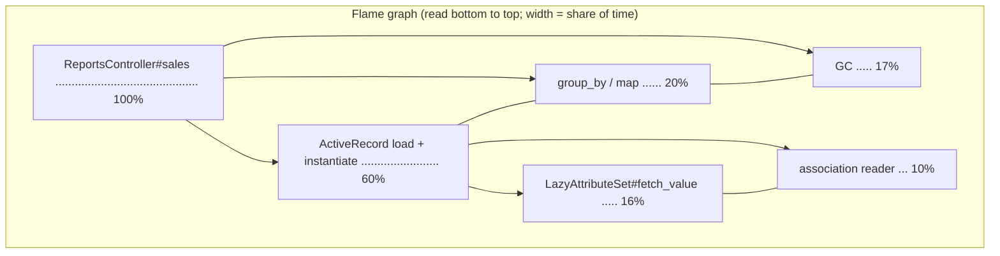

# 06 · Profiling: Vernier, stackprof and memory_profiler

## 1. In one sentence

A **profiler** tells you **where** time and memory go: sampling CPU/wall profilers (**Vernier**, **stackprof**) show which methods the time is spent in, often as a **flame graph**, and **memory_profiler** shows which lines allocate objects; together they turn "this endpoint is slow" into "these three lines are the problem".

## 2. Why it exists

Engineers are famously bad at guessing where time goes. In `shop-lab`'s `/reports/sales`, you might guess "the `group_by`" or "the database". The profile in this lesson shows the truth: most time is spent **building Active Record objects and reading their attributes**, plus 17% in the garbage collector. That points to a completely different fix (do not build 50,000 model objects), which cut the time by more than 10×.

Profiling is the step between "measure" (lesson 03) and "change" in the loop you use all week: **measure → profile → change one thing → measure again**.

## 3. Rails analogy

You already use lightweight profiling:

| You know | Profilers add |
|---|---|
| The Rails log line `Completed 200 OK in 2400ms (Views: 12ms, ActiveRecord: 180ms)` | Where the other 2,200 ms went, method by method |
| rack-mini-profiler's speed badge in development | Full call stacks, GC and GVL time, in production-like mode |
| Bullet / `strict_loading` for N+1 | Allocation counts per line (memory_profiler) |

## 4. How it works

### Sampling profilers

Many times per second (for example every 1 ms), the profiler records the **current call stack** of each thread. Methods that appear in many samples are where the time goes. The overhead is low, so results stay realistic.

- **Wall mode** counts time even when waiting (I/O, locks, GVL): use it for "why is this request slow?".
- **CPU mode** counts only time on the CPU: use it for "why is this computation slow?".
- **Vernier** (Ruby 3.2.1+) records wall time for **all threads**, plus markers for **GC** and **GVL** waits, and opens in the **Firefox Profiler** UI.
- **stackprof** is older and simpler, with a handy text report.

### Reading a flame graph



- Each box is a method; the box **below** it is its caller.
- **Width** is the share of samples (time); order left to right does not matter.
- Look for **wide boxes near the top of the stack**: that is where time is actually spent ("self time"). A wide box at the bottom (like the controller action) just means everything happened inside it.

### Two columns in every text report

| Column | Meaning | Use |
|---|---|---|
| **Total** | Samples where the method was anywhere on the stack | "Everything under this method" |
| **Samples (self)** | Samples where the method was at the top (running itself) | "This method's own code is slow" |

### memory_profiler

`MemoryProfiler.report { code }` records every allocation in the block with its class, gem and source line, and which objects were still alive afterwards (**retained**). Read **"allocated objects by location"**: the top lines are where to cut.

## 5. Minimal working example

The profiled code is `shop-lab`'s `/reports/sales` logic (from the [starter kit](../../starters/shop-lab/README.md)), in a method `naive`, and a first improved version, `plucked`, that reads four columns with `pluck` instead of building model objects:

```ruby
def naive
  line_items = LineItem.includes(:product).where(id: ..50_000).to_a
  line_items.group_by { |item| item.product.category }.map do |category, items|
    revenue_cents = items.map { |item| item.quantity * item.unit_price_cents }.sum
    top_skus = items.map { |item| item.product.sku }.tally.sort_by { |_sku, count| -count }.first(3).map(&:first)
    { category: category, items: items.size, revenue: format("%.2f", revenue_cents / 100.0), top_skus: top_skus }
  end
end

def plucked
  rows = LineItem.joins(:product).where(id: ..50_000)
                 .pluck("products.category", "products.sku", :quantity, :unit_price_cents)
  rows.group_by(&:first).map do |category, items|
    revenue_cents = items.sum { |_cat, _sku, qty, price| qty * price }
    top_skus = items.map { |row| row[1] }.tally.max_by(3) { |_sku, count| count }.map(&:first)
    { category: category, items: items.size, revenue: format("%.2f", revenue_cents / 100.0), top_skus: top_skus }
  end
end
```

### Part A: stackprof, text report

```ruby
# tmp/profile_sales.rb (run with: RAILS_ENV=benchmark bin/rails runner tmp/profile_sales.rb)
require "stackprof"
load "tmp/sales_methods.rb"   # the two methods above
naive                          # warm up
StackProf.run(mode: :wall, out: "tmp/sales-wall.dump", raw: true) { 3.times { naive } }
```

```bash
stackprof tmp/sales-wall.dump --text --limit 12
```

Output (Ruby 3.3, Rails 8.1, full seed):

```
==================================
  Mode: wall(1000)
  Samples: 4503 (0.27% miss rate)
  GC: 752 (16.70%)
==================================
     TOTAL    (pct)     SAMPLES    (pct)     FRAME
       643  (14.3%)         643  (14.3%)     (marking)
       736  (16.3%)         391   (8.7%)     ActiveModel::LazyAttributeSet#fetch_value
       201   (4.5%)         201   (4.5%)     ActiveRecord::Associations#association_instance_get
       912  (20.3%)         176   (3.9%)     ActiveRecord::AttributeMethods::Read#_read_attribute
       464  (10.3%)         140   (3.1%)     ActiveRecord::Associations#association
       506  (11.2%)         136   (3.0%)     Hash#fetch
       126   (2.8%)         126   (2.8%)     ActiveRecord::Result::IndexedRow#fetch
       108   (2.4%)         108   (2.4%)     (sweeping)
       842  (18.7%)         100   (2.2%)     Class#new
       681  (15.1%)          97   (2.2%)     Enumerable#group_by
      3750  (83.3%)          88   (2.0%)     Object#naive
       276   (6.1%)          86   (1.9%)     ActiveRecord::Associations::BelongsToAssociation#stale_state
```

How to read it: **17% of the time is GC** (`(marking)` and `(sweeping)`), and most of the rest is Active Record **attribute reads** (`fetch_value`, `_read_attribute`), **association access** (`item.product`) and **object creation** (`Class#new`). Your own `group_by` is only 15% in total. The problem is not the algorithm; it is building 100,000 model objects (50,000 line items plus their products) to read four values.

### Part B: Vernier, in the Firefox Profiler

```ruby
require "vernier"
Vernier.profile(out: "tmp/sales.vernier.json") { 3.times { naive } }
```

Open https://profiler.firefox.com, choose **Load a profile from file**, and select `tmp/sales.vernier.json`. Use the **Flame Graph** tab for the overall picture, and the **Stack Chart** tab to see GC pauses and GVL waits along the timeline. (Vernier can also profile a whole server: see its README for `vernier run -- bin/rails server`.)

### Part C: allocations, before and after

```ruby
require "memory_profiler"
report = MemoryProfiler.report { naive }
report.pretty_print(to_file: "tmp/sales-memory.txt", scale_bytes: true, normalize_paths: true)
```

Excerpt of `tmp/sales-memory.txt`:

```
Total allocated: 91.44 MB (688590 objects)

allocated objects by gem
-----------------------------------
    410196  activerecord-8.1.4
    259944  activemodel-8.1.4
     18398  other

allocated objects by class
-----------------------------------
    205049  Hash
    136858  Array
     73321  String
     68324  ActiveModel::LazyAttributeSet
     68324  ActiveRecord::Result::IndexedRow
     50000  ActiveRecord::Associations::BelongsToAssociation
     50000  LineItem
```

Almost everything is allocated **inside Active Record and Active Model** on behalf of the model objects. Then compare both versions (time per call, allocations, GC runs):

```
naive      1321 ms/call  allocated= 688550 objects ( 91.4 MB)  retained= 18331  GC runs in 3 calls: minor=2 major=0 (83 ms)
plucked     112 ms/call  allocated= 168590 objects ( 10.8 MB)  retained=     4  GC runs in 3 calls: minor=1 major=0 (14 ms)
same totals: true
```

**12× faster and 76% fewer allocations**, with the same results (checked in the last line). The Step 1 lab asks you to go further (aggregate in SQL) and to prove it with the load test from lesson 03.

### Part D: micro-benchmarks with benchmark-ips

A profiler tells you *where* time goes; to choose between two small implementations of the same thing, use **benchmark-ips** (iterations per second), which the kit installs. It warms up, runs each block for a fixed time, and reports a rate with a **± margin of error**, so you can see whether a difference is real.

```ruby
# script/ips_demo.rb   (run: ruby script/ips_demo.rb)
require "benchmark/ips"

rows = Array.new(10_000) { |i| { product_id: i % 100, quantity: (i % 7) + 1 } }

Benchmark.ips do |x|
  x.config(warmup: 1, time: 3)
  x.report("each + Hash.new(0)") do
    totals = Hash.new(0)
    rows.each { |r| totals[r[:product_id]] += r[:quantity] }
    totals
  end
  x.report("group_by + sum") do
    rows.group_by { |r| r[:product_id] }.transform_values { |rs| rs.sum { |r| r[:quantity] } }
  end
  x.compare!
end
```

Real output (Ruby 3.3.6, no YJIT):

```
Calculating -------------------------------------
  each + Hash.new(0)    721.767 (±10.4%) i/s    (1.39 ms/i) -      2.211k in   3.063314s
      group_by + sum    526.439 (±10.6%) i/s    (1.90 ms/i) -      1.584k in   3.008896s

Comparison:
each + Hash.new(0):      721.8 i/s
    group_by + sum:      526.4 i/s - 1.37x  slower
```

The single-pass version is 1.37× faster, and the ranges (721 ± 10%, 526 ± 11%) do not overlap, so the difference is real. If the margins overlapped, the honest conclusion would be "no measurable difference". Use micro-benchmarks only for code a profile has already shown to be hot; a 1.37× gain in 2% of a request is invisible to users.

## 6. Key terms

- **Sampling profiler**: periodically records call stacks.
- **Wall vs CPU mode**: all elapsed time vs CPU time only.
- **Self time vs total time**: time in the method's own code vs including callees.
- **Flame graph / stack chart**: aggregated stacks by width / stacks over time.
- **Vernier / stackprof / memory_profiler**: modern multi-thread profiler / classic profiler / allocation profiler.
- **Firefox Profiler**: the web UI that reads Vernier's output.
- **Allocated vs retained**: created during the block vs still alive after it.
- **benchmark-ips / i/s / margin of error**: micro-benchmark tool / iterations per second / the ± range; overlapping ranges mean no proven difference.

## 7. Common mistakes

- **Profiling in development mode** (reloading and logging distort the profile).
- **Profiling a cold process**: warm up first.
- **Reading the widest box at the bottom of the flame graph** as the culprit (it is just the caller).
- **Using profile timings as benchmark results**: profilers add overhead; measure improvements with the load test.
- **Optimising code that appears in 2% of samples.**
- **Ignoring GC in the report**: a large GC share means "allocate less", not "tune GC".

## 8. Check your understanding

1. In the stackprof report, why is `Object#naive` at 83% total but only 2% self?
2. What does "GC: 752 (16.70%)" tell you, and what is the fix it suggests?
3. When would you choose wall mode over CPU mode?
4. Why was `plucked` so much faster, even though it still groups in Ruby?
5. Why should you still run the lesson 03 load test after the profiler shows an improvement?

<details>
<summary>Answers</summary>

1. Almost all work happens in methods it calls (Active Record, `group_by`); its own lines are cheap. Total includes callees; self does not.
2. About 17% of samples were in the garbage collector, a sign of heavy allocation; the fix is to allocate less (fewer model objects), not to tune GC.
3. When waiting matters (I/O, locks, GVL contention): wall time shows where a request spends real time, including waits.
4. It never builds model objects: no attribute sets, association objects or per-attribute reads, so far fewer allocations and less GC; plain arrays are cheap to group.
5. Profilers add overhead and measure one call; the load test measures real throughput and latency percentiles under concurrency, which is what users feel.

</details>

## 9. Go deeper (optional)

- [Vernier](https://github.com/jhawthorn/vernier) (README: usage, Rails integration) and the [Firefox Profiler docs](https://profiler.firefox.com/docs/).
- [stackprof](https://github.com/tmm1/stackprof) and [memory_profiler](https://github.com/SamSaffron/memory_profiler).
- Brendan Gregg, "Flame Graphs" (brendangregg.com/flamegraphs.html): where flame graphs come from and how to read them.
