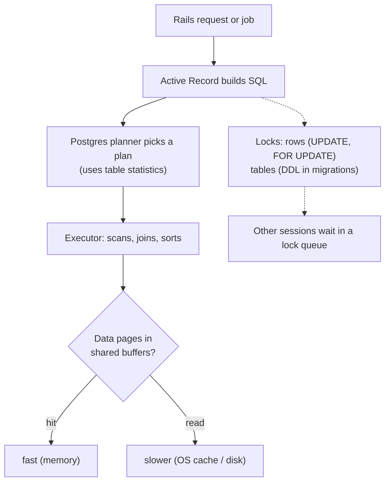

# Step 2 lessons: start here

In Step 1 you measured Ruby. This week you look at the part of a Rails app that is usually the real bottleneck: **PostgreSQL**. You will find the queries that cost the most, read their plans, fix them with indexes, run migrations without taking the site down, and then look at the Rails 8 infrastructure around the database: **Solid Queue** (jobs stored in Postgres) and **Kamal** (deploying containers to your own server).

**How to use this folder:** each day in [the Step 2 plan](../../steps/02-rails-at-scale.md) starts with **"Read first:"** links. Read the lesson (20-30 minutes), run its example on `shop-lab` (built with the [shop-lab starter kit](../../starters/shop-lab/README.md) in Step 1), then do the day's tasks.

All plans and numbers in these lessons are **real output** from `shop-lab` with the full seed (200k orders, 600k line items, 2M events) on PostgreSQL 16, unless a lesson says otherwise. Your numbers will differ; the shape of the results should not.

## The lessons

| # | Lesson | Day |
|---|---|---|
| 01 | [Finding slow queries: pg_stat_statements and EXPLAIN ANALYZE](01-finding-slow-queries-and-explain.md) | Mon 5 Oct |
| 02 | [Indexes, N+1 queries and batching](02-indexes-and-n-plus-one.md) | Tue 6 Oct |
| 03 | [Locks and safe migrations](03-locks-and-safe-migrations.md) | Wed 7 Oct |
| 04 | [Partitioning, replicas and sharding](04-partitioning-and-multi-db.md) | Thu 8 Oct |
| 05 | [Solid Queue internals (and Solid Cache, Solid Cable)](05-solid-queue-internals.md) | Fri 9 Oct |
| 06 | [Kamal 2 architecture and a first deploy](06-kamal-architecture.md) | Sat 10 Oct |

## The mental model for this week

Four questions answer most database problems:

1. **Which queries cost the most in total?** (`pg_stat_statements`)
2. **Why is this query slow?** (`EXPLAIN (ANALYZE, BUFFERS)`: scan type, row estimates, buffers)
3. **What is waiting on what?** (`pg_locks`, `pg_stat_activity`)
4. **Will this change block production?** (lock modes, `lock_timeout`, `strong_migrations`)

## Glossary

| Term | Meaning | Lesson |
|---|---|---|
| **pg_stat_statements** | A Postgres extension that records calls, total and mean time for every normalised query. | [01](01-finding-slow-queries-and-explain.md) |
| **Query plan** | The tree of steps (scans, joins, sorts) Postgres chooses to run a query. | [01](01-finding-slow-queries-and-explain.md) |
| **EXPLAIN / EXPLAIN ANALYZE** | Shows the plan / runs the query and shows the plan with real timings and row counts. | [01](01-finding-slow-queries-and-explain.md) |
| **Seq Scan** | Reads every row of a table. | [01](01-finding-slow-queries-and-explain.md) |
| **Index Scan / Index Only Scan / Bitmap Heap Scan** | Uses an index then reads rows / answers from the index alone / collects matching pages from an index, then reads them. | [01](01-finding-slow-queries-and-explain.md) |
| **Buffers (hit / read)** | 8 kB data pages found in Postgres' memory / fetched from the OS or disk. | [01](01-finding-slow-queries-and-explain.md) |
| **Statistics / ANALYZE** | Postgres' sampled summary of each column's data, used to estimate row counts; `ANALYZE` refreshes it. | [01](01-finding-slow-queries-and-explain.md) |
| **Autovacuum** | The background process that removes dead rows and refreshes statistics. | [01](01-finding-slow-queries-and-explain.md) |
| **Composite index** | An index on several columns; column order decides which queries it helps. | [02](02-indexes-and-n-plus-one.md) |
| **Partial index** | An index on only the rows matching a `WHERE` condition. | [02](02-indexes-and-n-plus-one.md) |
| **Covering index (`INCLUDE`)** | An index that also stores extra columns so a query can be answered from the index alone. | [02](02-indexes-and-n-plus-one.md) |
| **GIN index** | An index type for values with many parts (arrays, JSONB, full-text). | [02](02-indexes-and-n-plus-one.md) |
| **Write amplification / bloat** | Every index makes writes slower / dead space left in tables and indexes after updates and deletes. | [02](02-indexes-and-n-plus-one.md) |
| **N+1 query** | One query for a list plus one more query per item. | [02](02-indexes-and-n-plus-one.md) |
| **`strict_loading`** | Active Record mode that raises instead of lazily loading an association. | [02](02-indexes-and-n-plus-one.md) |
| **`preload` / `eager_load` / `includes`** | Separate queries / one `JOIN` query / Rails chooses between the two. | [02](02-indexes-and-n-plus-one.md) |
| **`load_async`** | Runs a query in a background thread while your code continues. | [02](02-indexes-and-n-plus-one.md) |
| **PgBouncer (transaction mode)** | A connection pooler that hands a server connection to a client only for one transaction. | [02](02-indexes-and-n-plus-one.md) |
| **Row lock** | A lock on one row (`SELECT ... FOR UPDATE`, `UPDATE`); other writers of that row wait. | [03](03-locks-and-safe-migrations.md) |
| **Table lock modes** | `ACCESS SHARE` (reads) to `ACCESS EXCLUSIVE` (most `ALTER TABLE`), which conflicts with everything. | [03](03-locks-and-safe-migrations.md) |
| **Lock queue** | Sessions waiting for a lock, in order; a waiting `ACCESS EXCLUSIVE` blocks the reads behind it. | [03](03-locks-and-safe-migrations.md) |
| **Deadlock** | Two transactions each waiting for a lock the other holds; Postgres cancels one. | [03](03-locks-and-safe-migrations.md) |
| **Optimistic locking (`lock_version`)** | Detects a concurrent update at save time instead of locking in advance. | [03](03-locks-and-safe-migrations.md) |
| **`SKIP LOCKED`** | `FOR UPDATE` that skips rows already locked by others: the basis of Postgres job queues. | [03](03-locks-and-safe-migrations.md) |
| **`lock_timeout` / `statement_timeout`** | Give up waiting for a lock / give up on a statement after a time limit. | [03](03-locks-and-safe-migrations.md) |
| **`strong_migrations`** | A gem that stops unsafe migrations and shows the safe version. | [03](03-locks-and-safe-migrations.md) |
| **Partitioning / partition pruning** | Splitting one table into child tables by a key / the planner skipping partitions that cannot match. | [04](04-partitioning-and-multi-db.md) |
| **Read replica / replication lag** | A read-only copy of the database / how far behind the primary it is. | [04](04-partitioning-and-multi-db.md) |
| **Automatic role switching** | Rails sends GET requests to the replica and other requests to the primary. | [04](04-partitioning-and-multi-db.md) |
| **Sharding** | Splitting data across several databases, each holding a subset (for example by tenant). | [04](04-partitioning-and-multi-db.md) |
| **Solid Queue** | Rails 8's default Active Job backend, storing jobs in database tables. | [05](05-solid-queue-internals.md) |
| **Worker / dispatcher / scheduler / supervisor** | Solid Queue processes: run jobs / move due jobs to ready / enqueue recurring jobs / start and watch the others. | [05](05-solid-queue-internals.md) |
| **Heartbeat** | A periodic "I am alive" timestamp each Solid Queue process writes. | [05](05-solid-queue-internals.md) |
| **Concurrency controls (`limits_concurrency`)** | Limit how many jobs with the same key run at once. | [05](05-solid-queue-internals.md) |
| **Mission Control – Jobs** | A web dashboard for Solid Queue (inspect, retry, discard). | [05](05-solid-queue-internals.md) |
| **Solid Cache / Solid Cable** | Database-backed Rails cache store / Action Cable adapter. | [05](05-solid-queue-internals.md) |
| **Kamal** | A tool that deploys Docker containers to your own servers over SSH. | [06](06-kamal-architecture.md) |
| **kamal-proxy** | Kamal's HTTP proxy on each server; switches traffic to the new container after its health check passes. | [06](06-kamal-architecture.md) |
| **Role / accessory** | A group of servers running the app with one command (web, job) / a supporting service such as Postgres. | [06](06-kamal-architecture.md) |
| **Zero-downtime deploy** | Starting the new version and switching traffic without dropping requests. | [06](06-kamal-architecture.md) |
