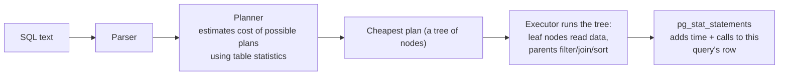

# 01 · Finding slow queries: pg_stat_statements and EXPLAIN ANALYZE

<!-- nav:top -->
[Course home](../../README.md) › [Step 2 plan](../../steps/02-rails-at-scale.md) › [Step 2 lessons](00-start-here.md) · [Glossary](../../GLOSSARY.md)
<!-- nav:end -->

## 1. In one sentence

**`pg_stat_statements`** tells you *which* queries cost the database the most time in total, and **`EXPLAIN (ANALYZE, BUFFERS)`** tells you *why* one query is slow by showing the plan Postgres chose, with real timings, row counts and memory/disk reads for every step.

## 2. Why it exists

Rails logs show you the queries of one request. They cannot tell you that a 13 ms query called 50,000 times an hour costs more than a 2-second report run twice a day. You need an aggregate view across all traffic to decide **what to fix first**, and then a precise view of one query to decide **how to fix it**.

Guessing ("add an index on everything in the `WHERE`") often adds indexes Postgres never uses, which slow down every write. Reading the plan turns guessing into evidence.

## 3. Rails analogy

- `pg_stat_statements` is like the **"slowest endpoints" table in your APM** (New Relic, Skylight, AppSignal), but for SQL, and grouped by query shape: `WHERE id = 1` and `WHERE id = 2` count as one query.
- `EXPLAIN ANALYZE` is like **a profiler for one query**: Step 1's flame graph showed where Ruby time went; the plan shows where SQL time goes. You can call it from Rails too: `Order.where(status: "paid").explain(:analyze, :buffers)` (Rails 7.1+).

## 4. How it works



- The **planner** does not know how many rows match your `WHERE`; it **estimates** from **statistics** (a sample of each column: common values, a histogram, number of distinct values). `ANALYZE` (run by **autovacuum** automatically, or by you) refreshes them. Bad estimates are the root of most bad plans.
- A plan is a **tree**. Execution starts at the innermost (most indented) nodes and results flow upwards.
- **Cost** numbers (`cost=6801.27..6807.10`) are the planner's estimate in abstract units: startup cost .. total cost. They are for comparing plans, not milliseconds.
- **`ANALYZE`** in `EXPLAIN (ANALYZE)` means "actually run it". It shows `actual time` (ms, startup..total, **per loop**), `rows` and `loops`.
- **`BUFFERS`** shows 8 kB pages: `shared hit` = found in Postgres' memory, `read` = fetched from the OS (maybe disk). Many reads on a warm system mean the query touches too much data.

### Enabling pg_stat_statements

It must be preloaded when Postgres starts:

```bash
# postgresql.conf (find it with: psql -c 'SHOW config_file')
shared_preload_libraries = 'pg_stat_statements'
# then restart Postgres; with Docker: command: postgres -c shared_preload_libraries=pg_stat_statements
```

```sql
CREATE EXTENSION IF NOT EXISTS pg_stat_statements;   -- once per database
SELECT pg_stat_statements_reset();                    -- start a clean measurement
```

## 5. Minimal working example

### Part A: the top queries

After `pg_stat_statements_reset()`, run the Step 1 load test against `/products` and a few requests that filter orders, then:

```sql
SELECT calls,
       round(total_exec_time)             AS total_ms,
       round(mean_exec_time::numeric, 2)  AS mean_ms,
       rows,
       left(query, 90)                    AS query
FROM pg_stat_statements
WHERE query NOT ILIKE '%pg_stat_statements%'
ORDER BY total_exec_time DESC
LIMIT 10;
```

Real output from `shop-lab`:

```
 calls | total_ms | mean_ms |  rows  |                                           query
-------+----------+---------+--------+--------------------------------------------------------------------------------------------
    20 |     1400 |   70.02 |     20 | SELECT COUNT(*) FROM "events" WHERE "events"."occurred_at" >= $1
    50 |      651 |   13.02 |   2500 | SELECT "orders".* FROM "orders" WHERE "orders"."status" = $1 AND "orders"."placed_at" >= $
     2 |      105 |   52.52 | 100000 | SELECT "line_items".* FROM "line_items" WHERE "line_items"."id" <= $1
     2 |       51 |   25.59 |  36648 | SELECT "products".* FROM "products" WHERE "products"."id" IN ($1, $2, $3, $4, $5, $6, $7,
   500 |       49 |    0.10 |    500 | SELECT SUM("line_items"."quantity") FROM "line_items" WHERE "line_items"."product_id" = $1
   200 |        5 |    0.02 |    200 | SELECT "customers".* FROM "customers" WHERE "customers"."email" = $1 LIMIT $2
```

How to read it:

- Values are replaced by `$1`, `$2`: one row per query **shape**.
- Sort by **`total_exec_time`**, not mean: it is the time the database spent in total, i.e. what fixing the query would save. Row 1 (events count) and row 2 (orders filter) are the targets.
- Row 5 has a tiny mean (0.10 ms) but **500 calls**: that is the N+1 from `/products` (lesson 02). Individually harmless, collectively visible.
- Row 3 returns 100,000 rows in two calls: loading a whole table into Ruby (the `/reports/sales` endpoint from Step 1).

### Part B: EXPLAIN (ANALYZE, BUFFERS), line by line

The second query, as the app runs it ("latest 50 paid orders from the last 30 days"):

```sql
EXPLAIN (ANALYZE, BUFFERS)
SELECT * FROM orders
WHERE status = 'paid' AND placed_at >= now() - interval '30 days'
ORDER BY placed_at DESC LIMIT 50;
```

Real output (before any new index):

```
 Limit  (cost=6801.27..6807.10 rows=50 width=50) (actual time=18.093..22.138 rows=50 loops=1)       -- ①
   Buffers: shared hit=4094
   ->  Gather Merge  (cost=6801.27..7592.09 rows=6778 width=50) (actual time=18.091..22.130 rows=50 loops=1)   -- ②
         Workers Planned: 2
         Workers Launched: 2
         Buffers: shared hit=4094
         ->  Sort  (cost=5801.25..5809.72 rows=3389 width=50) (actual time=14.697..14.703 rows=42 loops=3)  -- ③
               Sort Key: placed_at DESC
               Sort Method: top-N heapsort  Memory: 36kB
               Buffers: shared hit=4094
               Worker 0:  Sort Method: top-N heapsort  Memory: 36kB
               Worker 1:  Sort Method: top-N heapsort  Memory: 36kB
               ->  Parallel Seq Scan on orders  (cost=0.00..5688.67 rows=3389 width=50) (actual time=0.040..14.239 rows=2740 loops=3)  -- ④
                     Filter: (((status)::text = 'paid'::text) AND (placed_at >= (now() - '30 days'::interval)))
                     Rows Removed by Filter: 63927                                                                             -- ⑤
                     Buffers: shared hit=4022
 Planning:
   Buffers: shared hit=117
 Planning Time: 0.423 ms
 Execution Time: 22.199 ms                                                                                                     -- ⑥
```

Read it from the **inside out** (④ first):

| Mark | Line | What it tells you |
|---|---|---|
| ④ | `Parallel Seq Scan on orders` | No usable index: Postgres reads **every row** of `orders`. `loops=3` means 3 processes (the main one and 2 parallel workers) each scanned a third. `rows=2740` is **per loop**, so about 8,200 rows matched in total. The estimate was `rows=3389` per loop: close enough, so statistics are fine. |
| ⑤ | `Rows Removed by Filter: 63927` | Per loop again: about 192,000 rows read and thrown away to find 8,200. **This ratio is the smell** of a missing index. |
| | `Buffers: shared hit=4022` | 4,022 pages × 8 kB ≈ 31 MB read (from memory, luckily). The whole table. |
| ③ | `Sort ... top-N heapsort Memory: 36kB` | Each process keeps only its best 50 rows by `placed_at DESC` (a "top-N" sort, cheap because of the `LIMIT`). Fits in memory; if it said `external merge Disk: ...`, you would look at `work_mem`. |
| ② | `Gather Merge` | Combines the 3 sorted streams into one, keeping the order. |
| ① | `Limit ... rows=50` | Stops after 50 rows. |
| ⑥ | `Execution Time: 22.199 ms` | The total. 22 ms does not sound bad, but it is all CPU and memory bandwidth, it grows linearly with the table, and it ran 50 times in the load test (651 ms total). |

Paste the same plan into [explain.dalibo.com](https://explain.dalibo.com) to see it as a tree with the slowest node highlighted.

The fix (lesson 02) is a composite index `(status, placed_at)`. The plan after:

```
 Limit  (cost=0.42..95.93 rows=50 width=50) (actual time=0.044..0.194 rows=50 loops=1)
   Buffers: shared hit=51 read=4
   ->  Index Scan Backward using index_orders_on_status_and_placed_at on orders  (cost=0.42..15344.01 rows=8033 width=50) (actual time=0.043..0.190 rows=50 loops=1)
         Index Cond: (((status)::text = 'paid'::text) AND (placed_at >= (now() - '30 days'::interval)))
         Buffers: shared hit=51 read=4
 Planning Time: 0.189 ms
 Execution Time: 0.210 ms
```

- `Index Scan Backward`: walks the index from the newest `placed_at` for `status = 'paid'`, already in the right order, so **no Sort node**, and stops after 50 rows.
- `Index Cond` instead of `Filter`: the condition is answered by the index; nothing is read and discarded.
- 55 pages instead of 4,094; **0.21 ms instead of 22.2 ms (about 100×)**.

### From Rails

```ruby
# In a console the plan prints automatically; in a script, call inspect (Rails 8 returns an ExplainProxy).
puts Order.where(status: "paid").where(placed_at: 30.days.ago..).order(placed_at: :desc).limit(50)
          .explain(:analyze, :buffers).inspect
```

The output starts with the SQL Rails generated, then the same plan as above.

### Node types you will meet

| Node | Meaning | Usually good when |
|---|---|---|
| Seq Scan | Read the whole table | Table is small, or you need most rows |
| Index Scan | Walk the index, fetch each matching row from the table | Few rows match |
| Index Only Scan | Answer from the index alone (`Heap Fetches: 0` is ideal) | Index contains every needed column |
| Bitmap Index Scan + Bitmap Heap Scan | Collect matching row locations from an index, then read those pages in order | A moderate number of rows match |
| Nested Loop | For each row on the outer side, look up the inner side | Outer side is small and the inner side is indexed |
| Hash Join | Build a hash table of one side, probe with the other | Joining larger sets |
| Merge Join | Join two inputs already sorted on the key | Both sides sorted (for example by indexes) |

## 6. Key terms

- **pg_stat_statements**: per-query-shape statistics (calls, total and mean time, rows).
- **Query plan / node**: the tree Postgres runs / one step in it.
- **Estimated vs actual rows**: the planner's guess vs reality; a large mismatch means stale or insufficient statistics.
- **`loops`**: how many times a node ran; `actual time` and `rows` are per loop.
- **Buffers hit / read**: pages from Postgres' cache / from the OS or disk.
- **Statistics, `ANALYZE`, autovacuum**: the data the planner estimates from, the command that refreshes it, the background process that runs it.
- **Parallel query**: Postgres splitting a scan across worker processes (`Gather`).

## 7. Common mistakes

- **Sorting `pg_stat_statements` by mean time** and optimising a rare report instead of a hot query.
- **Running `EXPLAIN ANALYZE` on an empty development database.** Plans depend on data size; use realistic data like the `shop-lab` seed.
- **Forgetting that `EXPLAIN ANALYZE` executes the query.** For `UPDATE`/`DELETE`: `BEGIN; EXPLAIN ANALYZE ...; ROLLBACK;`.
- **Reading `rows` without `loops`.** `rows=2740 loops=3` is about 8,200 rows.
- **Treating cost as milliseconds.**
- **Measuring once with a cold cache.** Run twice; compare the warm result, and note `read` vs `hit`.

## 8. Check your understanding

1. Query A: mean 900 ms, 10 calls a day. Query B: mean 4 ms, 200,000 calls a day. Which do you look at first, and why?
2. A node shows `rows=10` estimated and `rows=400000` actual under a Nested Loop. What went wrong, and what are your first two actions?
3. What does `Rows Removed by Filter: 63927` with `loops=3` tell you?
4. Why did the plan with the composite index have no Sort node?
5. How do you safely run `EXPLAIN ANALYZE` on a `DELETE`?

<details>
<summary>Answers</summary>

1. Query B: about 800 seconds of database time a day versus 9 seconds for A (`total_exec_time`).
2. The planner underestimated rows, so it chose a nested loop that runs its inner side 400,000 times. First run `ANALYZE` on the tables (stale statistics), then check the condition: correlated columns or expressions may need `CREATE STATISTICS` or a rewritten query.
3. Each of the 3 processes read and discarded about 64,000 rows, about 192,000 in total: the query reads far more than it returns, a sign of a missing index.
4. The index stores rows sorted by `(status, placed_at)`, so walking it backwards for one status returns rows already ordered by `placed_at DESC`.
5. `BEGIN; EXPLAIN ANALYZE DELETE ...; ROLLBACK;`

</details>

## 9. Go deeper (optional)

- PostgreSQL docs: [Using EXPLAIN](https://www.postgresql.org/docs/current/using-explain.html) and [pg_stat_statements](https://www.postgresql.org/docs/current/pgstatstatements.html).
- [explain.dalibo.com](https://explain.dalibo.com) (plan visualiser) and [pgMustard's EXPLAIN glossary](https://www.pgmustard.com/docs/explain).
- Andrew Atkinson, *High Performance PostgreSQL for Rails*, chapters on query optimisation.

<!-- nav:bottom -->

---

[← Step 2 lessons: start here](00-start-here.md) · [Step 2 lessons](00-start-here.md) · [02 · Indexes, N+1 queries and batching →](02-indexes-and-n-plus-one.md)
<!-- nav:end -->
