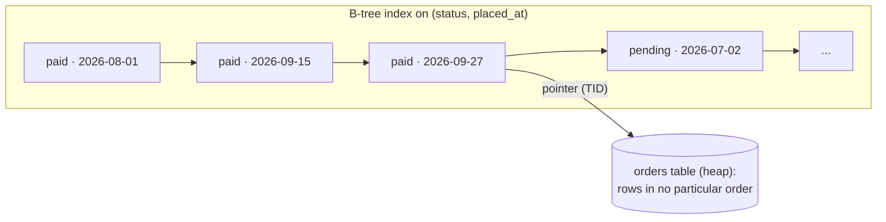

# 02 · Indexes, N+1 queries and batching

## 1. In one sentence

An **index** is a sorted copy of some columns that lets Postgres find rows without reading the whole table (the right column order, a `WHERE` condition or extra `INCLUDE` columns make it fit a query exactly), and most remaining Active Record slowness comes from **too many queries** (N+1) or **too many rows loaded into Ruby**, which `includes`, `strict_loading`, grouping in SQL and batching fix.

## 2. Why it exists

Lesson 01 showed a 22 ms query becoming 0.2 ms with one index, and a `/products` request making 101 queries. These are the two most common Rails performance problems, and both are cheap to fix once you can see them. But indexes are not free: every index slows down every `INSERT`, `UPDATE` and `DELETE` on the table and takes disk and memory, so you add the **right** one, not one per slow query.

## 3. Rails analogy

You already write `add_index :orders, :customer_id`. An index is like the **index at the back of a book**: sorted by term, pointing to pages. A composite index `(status, placed_at)` is like a phone book sorted by last name, then first name: great for "Smith, John", useless for "everyone named John".

## 4. How it works



### Index types and shapes

| Kind | Example (Rails migration) | Use when |
|---|---|---|
| B-tree (default) | `add_index :orders, :customer_id` | Equality and ranges, `ORDER BY` |
| **Composite** | `add_index :orders, [:status, :placed_at]` | Filters on several columns. **Equality columns first, then the range/sort column.** It also serves queries on `status` alone (the leftmost prefix), but not on `placed_at` alone. |
| **Partial** | `add_index :orders, :placed_at, where: "status = 'pending'"` | Queries always target a small subset. Much smaller index. |
| **Covering** | `add_index :orders, :customer_id, include: [:id, :total_cents]` | Enables an Index Only Scan for a hot query that reads a few columns. |
| **GIN** | `add_index :events, :payload, using: :gin` | JSONB containment (`@>`), arrays, full-text search. |
| Unique | `add_index :customers, :email, unique: true` | Enforces a rule; also speeds up lookups. |

### The cost side

- **Write amplification**: an `INSERT` into `orders` with 5 indexes writes 6 structures.
- **Bloat**: updates and deletes leave dead entries; autovacuum cleans up, but indexes can grow.
- **Memory**: indexes compete with table data for the cache.
- **Unused indexes** cost all of the above for nothing. Find them:

```sql
SELECT relname, indexrelname, idx_scan, pg_size_pretty(pg_relation_size(indexrelid)) AS size
FROM pg_stat_user_indexes ORDER BY idx_scan, pg_relation_size(indexrelid) DESC;
```

(`idx_scan = 0` since the last statistics reset is a candidate for removal; check replicas too, they have their own counters.)

### N+1 and the three loading strategies

```ruby
Product.limit(100).each { |p| p.line_items.sum(:quantity) }   # 1 + 100 queries
```

| Method | SQL | When |
|---|---|---|
| `preload(:line_items)` | 2 queries: products, then `line_items WHERE product_id IN (...)` | Default choice |
| `eager_load(:line_items)` | 1 query with `LEFT OUTER JOIN` | You filter or sort on the association |
| `includes(:line_items)` | Rails picks: `preload`, or `eager_load` if you `references` / use the association in `where` | Convenient, but know which you get |

**`strict_loading`** makes lazy loading raise, so N+1s fail in development and tests instead of hiding:

```ruby
# app/models/order.rb
self.strict_loading_by_default = true   # or per query: Order.strict_loading.first
# config/environments/development.rb, to log instead of raise:
# config.active_record.action_on_strict_loading_violation = :log
```

### Loading less

- **Aggregate in SQL**, not Ruby: `group(:product_id).sum(:quantity)` instead of loading line items.
- **`pluck`** when you need values, not models (Step 1 lesson 06: about 4× fewer objects and 8× faster on `/reports/sales`).
- **`in_batches` / `find_each`** to process big tables in chunks of 1,000.
- **`insert_all` / `upsert_all`** for bulk writes in one statement. They **skip validations and callbacks** and do not set timestamps unless the columns have defaults (Rails 7+ fills `created_at`/`updated_at` automatically when `record_timestamps` is on, the default).
- **`load_async`** starts a query on a background thread so several independent queries run in parallel. Each running query needs its **own connection** from the pool (and `config.active_record.async_query_executor` must be set, for example `:global_thread_pool`).

### Connection poolers

With many Puma and job processes you can run out of Postgres connections (each costs server memory). **PgBouncer in transaction mode** shares a small number of server connections by giving one to a client only for the length of a transaction. The catch: anything that lives on a *session* breaks: session-level `SET`, advisory locks held across transactions, `LISTEN/NOTIFY`, and prepared statements unless your PgBouncer version supports them (1.21+ with `max_prepared_statements`) or you set `prepared_statements: false` in `database.yml`.

## 5. Minimal working example

### Part A: three kinds of index (on `shop-lab`)

The composite index from lesson 01, as a safe Rails migration (lesson 03 explains `concurrently`):

```ruby
class AddIndexToOrdersStatus < ActiveRecord::Migration[8.1]
  disable_ddl_transaction!

  def change
    add_index :orders, [:status, :placed_at], algorithm: :concurrently
  end
end
```

Result: `Parallel Seq Scan` → `Index Scan Backward`, **22.2 ms → 0.21 ms**.

**Covering index** for `Order.where(customer_id: 42).pluck(:id, :total_cents)`:

```
-- before: the plain customer_id index
 Bitmap Heap Scan on orders  (actual time=0.071..0.085 rows=8 loops=1)
   Recheck Cond: (customer_id = 42)
   Heap Blocks: exact=8                              -- 8 table pages visited
   ->  Bitmap Index Scan on index_orders_on_customer_id  (actual time=0.063..0.063 rows=8 loops=1)
 Execution Time: 0.101 ms

-- after: CREATE INDEX ... ON orders (customer_id) INCLUDE (id, total_cents); VACUUM orders;
 Index Only Scan using index_orders_on_customer_id_including_total on orders  (actual time=0.050..0.051 rows=8 loops=1)
   Index Cond: (customer_id = 42)
   Heap Fetches: 0                                   -- the table was not touched at all
 Execution Time: 0.068 ms
```

Small win here (it was already fast); on a hot query with cold data it saves one random read per row. `Heap Fetches: 0` needs a recent `VACUUM` (the visibility map says which pages are all-visible).

**Partial index** for a job that scans pending orders:

```ruby
add_index :orders, :placed_at, where: "status = 'pending'", algorithm: :concurrently,
          name: "index_orders_pending_on_placed_at"
```

Sizes on `shop-lab` (`pg_stat_user_indexes`): the full `(status, placed_at)` index is **6,480 kB**; the partial index covering only the 33k pending orders is **752 kB**. If you only ever query pending orders, the partial index gives the same speed at about a ninth of the size and write cost.

### Part B: the N+1 on `/products`

```ruby
# count queries (bin/rails runner)
count = 0
cb = ->(*, payload) { count += 1 unless payload[:name] == "SCHEMA" }
ActiveSupport::Notifications.subscribed(cb, "sql.active_record") do
  Product.order(:id).limit(100).map { |p| p.line_items.sum(:quantity) }
end
puts "naive: #{count} queries"

count = 0
ActiveSupport::Notifications.subscribed(cb, "sql.active_record") do
  products = Product.order(:id).limit(100).to_a
  sold = LineItem.where(product_id: products.map(&:id)).group(:product_id).sum(:quantity)
  products.map { |p| sold.fetch(p.id, 0) }
end
puts "grouped: #{count} queries"
```

Real output:

```
naive: 101 queries
grouped: 2 queries
```

Note that `includes(:line_items)` would also remove the N+1, but it would load every line item into Ruby only to add up one column; grouping in SQL loads 100 numbers.

### Part C: strict_loading

```ruby
Order.strict_loading.first.line_items.to_a
# ActiveRecord::StrictLoadingViolationError: `Order` is marked for strict_loading.
#   The LineItem association named `:line_items` cannot be lazily loaded.

Order.includes(:line_items).strict_loading.first.line_items.size   # => 2, no error
```

## 6. Key terms

- **B-tree**: the default, sorted index structure.
- **Composite / partial / covering / GIN / unique index**: see the table in section 4.
- **Leftmost prefix**: a composite index helps queries on its first column(s), in order.
- **Index Only Scan, Heap Fetches, visibility map**: answering from the index; rows it still had to check in the table; the map (kept by `VACUUM`) that lets it skip that check.
- **N+1**, **`preload` / `eager_load` / `includes`**, **`strict_loading`**: see section 4.
- **`insert_all` / `upsert_all`**: bulk writes without callbacks and validations.
- **`load_async`**: run a query in the background; needs a free pool connection.
- **PgBouncer transaction mode**: server connection per transaction; session features break.

## 7. Common mistakes

- **Wrong column order**: `(placed_at, status)` cannot jump to one status; the range column goes last.
- **Indexing every column separately** and hoping Postgres combines them (it can, with bitmap scans, but it is slower than one fitting index).
- **Adding an index without checking existing ones**; `(status)` is redundant next to `(status, placed_at)`.
- **Adding an index inside a normal migration** on a big table: it blocks writes (lesson 03).
- **Fixing an N+1 with `includes`** when you only need an aggregate.
- **Using `upsert_all` and expecting callbacks or validations to run.**
- **Turning on `load_async` without enough pool connections.**

## 8. Check your understanding

1. You have `WHERE customer_id = ? AND created_at > ? ORDER BY created_at DESC`. Which index, in which column order, and why?
2. Why can adding an index make the whole app slower?
3. When would you pick a partial index over a full one?
4. `Order.includes(:line_items).where(line_items: { quantity: 3 })`: one query or two? Why?
5. What breaks when you put PgBouncer in transaction mode in front of a Rails app that uses advisory locks?

<details>
<summary>Answers</summary>

1. `(customer_id, created_at)`: equality column first, so the index jumps to one customer, then the range/sort column, so the rows come out already ordered and the range is one contiguous slice.
2. Every write must update every index (write amplification), indexes use cache memory, and they bloat; on write-heavy tables this can outweigh the read gain.
3. When queries always filter on the same condition that matches a small share of rows (for example `status = 'pending'`): smaller, cheaper to maintain, same speed.
4. One: a condition on the association makes `includes` switch to `eager_load` (a `LEFT OUTER JOIN`).
5. Session-level advisory locks can be held on one server connection and released (or checked) on another, so locks leak or protect nothing; use transaction-level advisory locks or a session-mode pool for that code.

</details>

## 9. Go deeper (optional)

- PostgreSQL docs: [Indexes](https://www.postgresql.org/docs/current/indexes.html) (especially "Multicolumn Indexes", "Partial Indexes", "Index-Only Scans and Covering Indexes").
- Rails Guides: [Active Record Query Interface: Eager Loading Associations](https://guides.rubyonrails.org/active_record_querying.html#eager-loading-associations) and [strict_loading](https://guides.rubyonrails.org/active_record_querying.html#strict-loading).
- Andrew Atkinson, *High Performance PostgreSQL for Rails*, chapters on indexes; [PgHero](https://github.com/ankane/pghero) for unused and duplicate index reports.
