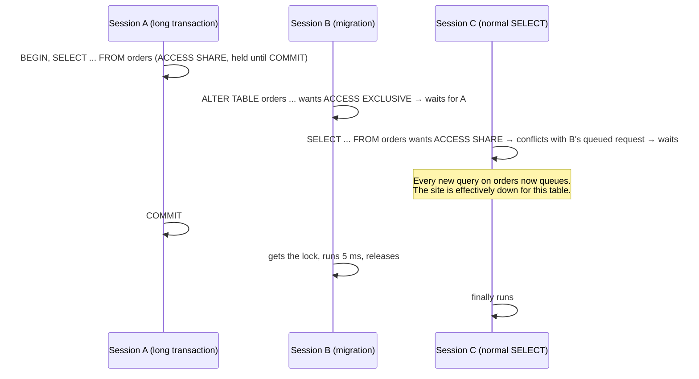

# 03 · Locks and safe migrations

<!-- nav:top -->
[Course home](../../README.md) › [Step 2 plan](../../steps/02-rails-at-scale.md) › [Step 2 lessons](00-start-here.md) · [Glossary](../../GLOSSARY.md)
<!-- nav:end -->

## 1. In one sentence

Postgres uses **row locks** so two transactions cannot change the same row at once and **table locks** so schema changes do not collide with queries; a migration that waits for a strong table lock makes **every later query on that table wait behind it**, so you write migrations that take weak locks, give up quickly (`lock_timeout`) and let `strong_migrations` catch the dangerous ones.

## 2. Why it exists

Two problems, one mechanism:

- **Correctness under concurrency.** Two Puma threads or two job workers update the same order. Without locks you get lost updates (like the Ruby race in Step 1 lesson 01, but in the database).
- **Availability during deploys.** A migration that "takes 50 ms" can cause a multi-minute outage if it has to wait for a lock. This is one of the most common causes of Rails production incidents.

## 3. Rails analogy

- `order.with_lock { ... }` is a **`Mutex#synchronize` for a database row**, shared by all processes.
- `lock_version` is **optimistic**: like `If-Match` / ETags in an API, you do not lock; you check that nobody changed the record since you read it.
- A migration's `ALTER TABLE` needs the table to itself for a moment, like **putting the site in maintenance mode for one table**. Fine for 5 ms, a disaster if it has to wait in line first.

## 4. How it works

### Row-level choices

| Tool | Rails | SQL | Use when |
|---|---|---|---|
| Pessimistic lock | `Order.lock.find(id)`, `order.with_lock { }` | `SELECT ... FOR UPDATE` | Conflicts are likely and short (balances, stock counts) |
| Optimistic lock | `lock_version` integer column (automatic) | `UPDATE ... WHERE id = ? AND lock_version = ?` | Conflicts are rare, or a human edits a form for minutes |
| Skip locked | `Order.lock("FOR UPDATE SKIP LOCKED")` | `FOR UPDATE SKIP LOCKED` | Several workers take work from a queue (Solid Queue, lesson 05) |

**Deadlock**: transaction 1 locks row A then wants B; transaction 2 locks B then wants A. Neither can continue. Postgres detects this after `deadlock_timeout` (1 s by default) and cancels one of them with an error. The cure is a **consistent lock order** (for example always by ascending `id`).

### Table lock modes (the ones that matter for Rails)

| Mode | Taken by | Conflicts with |
|---|---|---|
| `ACCESS SHARE` | every `SELECT` | only `ACCESS EXCLUSIVE` |
| `ROW EXCLUSIVE` | `INSERT`, `UPDATE`, `DELETE` | `SHARE` and stronger |
| `SHARE` | `CREATE INDEX` (non-concurrent) | writes (`ROW EXCLUSIVE`) |
| `SHARE UPDATE EXCLUSIVE` | `CREATE INDEX CONCURRENTLY`, `VALIDATE CONSTRAINT`, `VACUUM` | other schema changes, not reads or writes |
| `ACCESS EXCLUSIVE` | most `ALTER TABLE`, `DROP`, `TRUNCATE` | **everything**, including `SELECT` |

### The lock queue



Locks are granted in order. C's `ACCESS SHARE` does not conflict with A's, but it **does** conflict with B's waiting `ACCESS EXCLUSIVE`, so it lines up behind B. `lock_timeout` makes B give up instead of blocking everyone; you retry the migration later.

### Safe patterns

| Change | Unsafe | Safe |
|---|---|---|
| Add an index | `add_index` (blocks writes for the whole build) | `algorithm: :concurrently` + `disable_ddl_transaction!` |
| Add a column with a default | (safe since Postgres 11 for constant defaults) | `add_column` directly |
| Add `NOT NULL` | `change_column_null` on a big table (full scan under `ACCESS EXCLUSIVE`) | `add_check_constraint ..., "col IS NOT NULL", validate: false` → `validate_check_constraint` → then `change_column_null` (Postgres 12+ uses the valid constraint and skips the scan) |
| Add a foreign key | `add_foreign_key` (validates under a lock on both tables) | `add_foreign_key ..., validate: false` → `validate_foreign_key` in a second migration |
| Backfill data | `update_all` in the schema migration | a separate migration or job with `in_batches`, outside the DDL transaction |
| Remove a column | `remove_column` while the app still reads it | `self.ignored_columns += ["col"]`, deploy, then remove |
| Rename a column | `rename_column` (old code breaks) | add new, write both, backfill, switch reads, drop old |

## 5. Minimal working example

### Part A: row locks, deadlock, optimistic lock (one script)

Save as `script/lock_demo.rb` in `shop-lab`, run with `bin/rails runner script/lock_demo.rb`:

```ruby
a, b = Order.order(:id).first(2).map(&:id)
q = Queue.new
t1 = Thread.new do
  Order.transaction do
    Order.lock.find(a); q << :locked_a; sleep 0.5
    Order.lock.find(b)                       # waits for thread 2, which waits for us
  end
  puts "thread 1 committed"
rescue => e
  puts "thread 1: #{e.class}: #{e.message.lines.first.strip}"
end
t2 = Thread.new do
  q.pop
  Order.transaction do
    Order.lock.find(b); sleep 0.1
    Order.lock.find(a)                       # opposite order → deadlock
  end
  puts "thread 2 committed"
rescue => e
  puts "thread 2: #{e.class}: #{e.message.lines.first.strip}"
end
[t1, t2].each(&:join)

# Optimistic locking: add a lock_version column for the demo, then remove it again
conn = ActiveRecord::Base.connection
conn.add_column(:customers, :lock_version, :integer, default: 0, null: false)
Customer.reset_column_information
c1 = Customer.find(1); c2 = Customer.find(1)   # two users open the same form
c1.update!(name: "First writer")
begin
  c2.update!(name: "Second writer")
rescue => e
  puts "#{e.class}: #{e.message}"
end
conn.remove_column(:customers, :lock_version)
```

Real output:

```
thread 2: ActiveRecord::Deadlocked: PG::TRDeadlockDetected: ERROR:  deadlock detected
thread 1 committed
ActiveRecord::StaleObjectError: Attempted to update a stale object: Customer.
```

Postgres picked thread 2 as the victim; thread 1 finished. With consistent ordering (`Order.lock.where(id: [a, b]).order(:id).to_a` in both threads) the deadlock disappears. For the stale object, the usual UI response is "someone else changed this record; reload and try again".

### Part B: reproduce a lock queue (three terminals, `psql` against `shop-lab`)

```sql
-- Terminal A: a long transaction that has read orders
BEGIN; SELECT count(*) FROM orders;      -- leave it open

-- Terminal B: the "migration"
ALTER TABLE orders ADD COLUMN note text; -- hangs

-- Terminal C: an ordinary read
SELECT id FROM orders LIMIT 1;           -- hangs too!

-- Terminal D: who waits for what
SELECT a.pid, left(a.query, 45) AS query, a.wait_event_type AS waiting_on, l.mode, l.granted
FROM pg_stat_activity a JOIN pg_locks l ON l.pid = a.pid AND l.relation = 'orders'::regclass
WHERE a.pid <> pg_backend_pid() ORDER BY l.granted DESC, a.backend_start;
```

Real output (A was scripted with `pg_sleep(6)` to end on its own, hence `Timeout`):

```
  pid  |                     query                     | waiting_on |        mode         | granted
-------+-----------------------------------------------+------------+---------------------+---------
 12263 | BEGIN; SELECT count(*) FROM orders; SELECT pg | Timeout    | AccessShareLock     | t
 12269 | ALTER TABLE orders ADD COLUMN note text;      | Lock       | AccessExclusiveLock | f
 12275 | SELECT id FROM orders LIMIT 1;                | Lock       | AccessShareLock     | f
```

The simple read in C waited **4.08 s**, only because of the queued `ALTER`. Now repeat B with a timeout:

```sql
SET lock_timeout = '1s'; ALTER TABLE orders ADD COLUMN note text;
-- ERROR:  canceling statement due to lock timeout
```

The migration fails fast, and a read issued right after took **0.039 s**. A failed migration you can retry is far better than an outage. `SELECT pg_blocking_pids(<pid>)` tells you which session blocks a given one.

### Part C: strong_migrations

```bash
bundle add strong_migrations
bin/rails g strong_migrations:install
```

The generated initializer (real, version 2.8.0) sets:

```ruby
StrongMigrations.start_after = 20260928103529   # only check migrations newer than this
StrongMigrations.lock_timeout = 10.seconds
StrongMigrations.statement_timeout = 1.hour
StrongMigrations.auto_analyze = true
```

A plain `add_index :orders, [:status, :placed_at]` migration now fails with:

```
=== Dangerous operation detected #strong_migrations ===

Adding an index non-concurrently blocks writes. Instead, use:

class AddIndexToOrdersStatus < ActiveRecord::Migration[8.1]
  disable_ddl_transaction!

  def change
    add_index :orders, [:status, :placed_at], algorithm: :concurrently
  end
end
```

The safe version ran in 0.24 s on 200k orders without blocking writes. For your lab, prove it by running a `SELECT`/`UPDATE` loop in another terminal while the migration runs and showing no pauses.

## 6. Key terms

- **Row lock**, **pessimistic lock** (`FOR UPDATE`, `with_lock`), **optimistic lock** (`lock_version`, `StaleObjectError`).
- **`SKIP LOCKED` / `NOWAIT`**: skip rows others hold / fail immediately instead of waiting.
- **Deadlock** and **consistent lock ordering**.
- **Table lock modes**, especially `ACCESS EXCLUSIVE`.
- **Lock queue**: requests are granted in order; a waiting strong lock blocks later weak ones.
- **`lock_timeout` / `statement_timeout`**: limits on waiting for a lock / on running a statement.
- **`CREATE INDEX CONCURRENTLY`**: builds without blocking writes; cannot run inside a transaction.
- **`NOT VALID` + `VALIDATE`**: add a constraint without checking old rows, then check them under a weak lock.
- **`ignored_columns`**: makes Active Record forget a column before you drop it.

## 7. Common mistakes

- **No `lock_timeout` on migrations**, so a migration waits behind a long query and blocks the site.
- **`CREATE INDEX CONCURRENTLY` inside a transaction**: it fails; Rails needs `disable_ddl_transaction!`.
- **Backfilling in the same migration as the schema change**, holding locks for the whole backfill.
- **`with_lock` around slow work** (HTTP calls inside the lock): other workers queue for seconds.
- **Locking rows in different orders in different code paths**, causing deadlocks under load.
- **Long-running transactions** in jobs or consoles: they hold `ACCESS SHARE` and block every migration.
- **Dropping a column the running code still selects** (`SELECT *` caches column lists): use `ignored_columns` first.

## 8. Check your understanding

1. A migration that normally takes 50 ms caused a 2-minute outage. Explain the lock queue and how `lock_timeout` prevents it.
2. Two workers process the same order at the same time. When do you choose `with_lock`, `lock_version`, or `SKIP LOCKED`?
3. Why does `CREATE INDEX CONCURRENTLY` need `disable_ddl_transaction!` in Rails?
4. How do you add `NOT NULL` to a column on a 50M-row table without a long `ACCESS EXCLUSIVE` lock?
5. You see `ActiveRecord::Deadlocked` in production twice a day. What do you look for in the code?

<details>
<summary>Answers</summary>

1. A long transaction held `ACCESS SHARE`; the migration's `ALTER TABLE` queued for `ACCESS EXCLUSIVE`; every later query on the table queued behind it until the long transaction ended. With `lock_timeout` the migration gives up after, say, 5 s, the queue drains, and you retry.
2. `with_lock` when the work must be serialised and is short (both need to update the same row correctly); `lock_version` when conflicts are rare and you can tell the loser to retry; `SKIP LOCKED` when the workers are picking *different* items from a shared queue and should not wait for each other.
3. Rails wraps each migration in a transaction by default, and Postgres refuses to build an index concurrently inside a transaction block.
4. Add a `CHECK (col IS NOT NULL) NOT VALID` constraint (instant), `VALIDATE CONSTRAINT` (scans under a weak lock), then `SET NOT NULL` (Postgres 12+ trusts the valid constraint, no scan), then drop the check constraint.
5. Two code paths that lock the same rows (or tables) in a different order, often through callbacks or nested updates; fix by locking in a consistent order (for example sorted ids) or narrowing the transaction.

</details>

## 9. Go deeper (optional)

- PostgreSQL docs: [Explicit Locking](https://www.postgresql.org/docs/current/explicit-locking.html) (table of conflicting modes).
- [strong_migrations README](https://github.com/ankane/strong_migrations) (every unsafe operation with the safe alternative).
- Rails Guides: [Active Record Migrations](https://guides.rubyonrails.org/active_record_migrations.html) and the API docs for [`ActiveRecord::Locking::Pessimistic`](https://api.rubyonrails.org/classes/ActiveRecord/Locking/Pessimistic.html) and [`Optimistic`](https://api.rubyonrails.org/classes/ActiveRecord/Locking/Optimistic.html).

<!-- nav:bottom -->

---

[← 02 · Indexes, N+1 queries and batching](02-indexes-and-n-plus-one.md) · [Step 2 lessons](00-start-here.md) · [04 · Partitioning, replicas and sharding →](04-partitioning-and-multi-db.md)
<!-- nav:end -->
