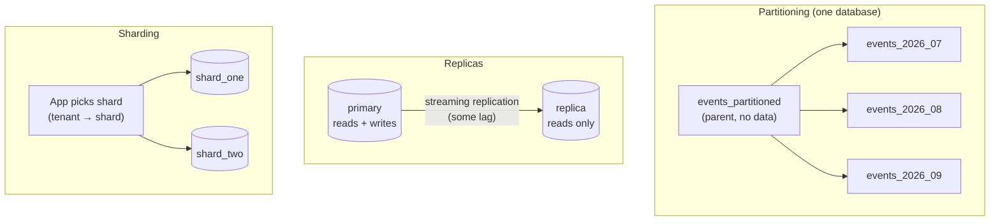

# 04 · Partitioning, replicas and sharding

<!-- nav:top -->
[Course home](../../README.md) › [Step 2 plan](../../steps/02-rails-at-scale.md) › [Step 2 lessons](00-start-here.md) · [Glossary](../../GLOSSARY.md)
<!-- nav:end -->

## 1. In one sentence

When one table or one database gets too big or too busy, you can **partition** a table (split it into child tables by a key such as month, inside one database), add **read replicas** (read-only copies that take read traffic), or **shard** (split the data across several databases), and each brings a new cost, so you choose the smallest step that solves a measured problem.

## 2. Why it exists

Indexes (lesson 02) solve most query problems. Some problems remain:

- **Huge, append-only tables** (events, logs, audit trails): indexes grow, vacuum takes longer, and deleting old data with `DELETE` is slow and bloats the table. Partitioning lets you drop a whole month in milliseconds.
- **Read load** larger than one server can handle: replicas multiply read capacity.
- **Write load or data size** larger than one server: only sharding helps, and it is by far the most expensive option.

## 3. Rails analogy

- **Partitioning** is invisible to Active Record: `Event.where(occurred_at: ...)` does not change. It is like Rails' **Active Storage services**: one interface, several places the data physically lives.
- **Replicas** in Rails are configured like **multiple databases** (which you already have in Rails 8: `primary`, `queue`, `cache`, `cable`), with `replica: true` and automatic switching for GET requests.
- **Sharding** is like running **one Rails app per customer group**, with code that picks the right database for each request.

## 4. How it works



### Partitioning

- **Declarative range partitioning**: `CREATE TABLE ... PARTITION BY RANGE (occurred_at)`, then one child table per range (`FOR VALUES FROM ... TO ...`).
- **Partition pruning**: when the `WHERE` fixes the partition key, the planner scans only matching partitions.
- **Constraints**: the primary key (and every unique index) must **include the partition key**, so `PRIMARY KEY (id, occurred_at)`. Queries that do not filter on the key scan **all** partitions.
- **Maintenance**: create future partitions ahead of time (a recurring job, or the `pg_partman` extension); drop old ones with `DROP TABLE events_2025_08` (or `DETACH PARTITION` first) instead of mass `DELETE`.
- Rails' `schema.rb` cannot describe partitions: switch to `config.active_record.schema_format = :sql` (`db/structure.sql`) and write the DDL in the migration with `execute`.

### Replicas and automatic role switching

```yaml
# config/database.yml
production:
  primary:
    <<: *default
    database: shop_lab_production
  primary_replica:
    <<: *default
    database: shop_lab_production
    host: replica.internal
    username: shop_lab_readonly
    replica: true          # never migrated, only read
```

```ruby
class ApplicationRecord < ActiveRecord::Base
  primary_abstract_class
  connects_to database: { writing: :primary, reading: :primary_replica }
end
```

`bin/rails g active_record:multi_db` creates `config/initializers/multi_db.rb` with the (commented) settings for the **database selector** middleware:

```ruby
Rails.application.configure do
  config.active_record.database_selector = { delay: 2.seconds }
  config.active_record.database_resolver = ActiveRecord::Middleware::DatabaseSelector::Resolver
  config.active_record.database_resolver_context = ActiveRecord::Middleware::DatabaseSelector::Resolver::Session
end
```

With it, `GET`/`HEAD` requests read from the replica, **except within 2 seconds after the same session wrote**, which then read from the primary. That protects "I just saved my profile and it shows the old name" from **replication lag** (the replica applies changes a little later). Background jobs and non-GET requests use the primary unless you wrap code in `connected_to(role: :reading)`.

### Sharding in Rails

```ruby
class ShardedRecord < ApplicationRecord
  self.abstract_class = true
  connects_to shards: {
    shard_one: { writing: :shard_one, reading: :shard_one_replica },
    shard_two: { writing: :shard_two, reading: :shard_two_replica }
  }
end

ShardedRecord.connected_to(shard: :shard_two) { Order.where(tenant_id: 42).count }
```

Rails handles connections; **you** handle routing (tenant → shard), cross-shard queries (none, or in application code), migrations on every shard, rebalancing and unique ids. Consider it only after indexes, caching, replicas, partitioning and a bigger server stop being enough.

## 5. Minimal working example

### Part A: partition `events` by month

As a migration (after switching to `structure.sql`):

```ruby
class CreateEventsPartitioned < ActiveRecord::Migration[8.1]
  def up
    execute <<~SQL
      CREATE TABLE events_partitioned (
        id bigint NOT NULL, name varchar, payload jsonb, occurred_at timestamp(6) NOT NULL,
        created_at timestamp(6) NOT NULL, updated_at timestamp(6) NOT NULL,
        PRIMARY KEY (id, occurred_at)
      ) PARTITION BY RANGE (occurred_at);

      DO $$
      DECLARE m date := date_trunc('month', now() - interval '13 months');
      BEGIN
        WHILE m <= date_trunc('month', now()) LOOP
          EXECUTE format('CREATE TABLE events_%s PARTITION OF events_partitioned FOR VALUES FROM (%L) TO (%L)',
                         to_char(m, 'YYYY_MM'), m, m + interval '1 month');
          m := m + interval '1 month';
        END LOOP;
      END $$;
    SQL
  end

  def down
    execute "DROP TABLE events_partitioned"   # drops the partitions too
  end
end
```

Copy the data and compare a one-month count:

```sql
INSERT INTO events_partitioned SELECT id, name, payload, occurred_at, created_at, updated_at FROM events;
ANALYZE events_partitioned;
EXPLAIN (ANALYZE, COSTS OFF)
SELECT count(*) FROM events_partitioned WHERE occurred_at >= '2026-08-01' AND occurred_at < '2026-09-01';
```

Real results on 2M events (the copy took 5.0 s):

```
-- plain events table, no index
         ->  Parallel Seq Scan on events (actual time=0.031..69.214 rows=56611 loops=3)
               Rows Removed by Filter: 610055
 Execution Time: 78.614 ms

-- partitioned: only one partition appears in the plan (pruning)
         ->  Parallel Seq Scan on events_2026_08 events_partitioned (actual time=0.025..16.679 rows=84917 loops=2)
 Execution Time: 27.928 ms

-- plain events table WITH an index on occurred_at
         ->  Parallel Index Only Scan using index_events_on_occurred_at on events (actual time=0.065..7.582 rows=56611 loops=3)
               Heap Fetches: 0
 Execution Time: 16.566 ms
```

Read this honestly: **pruning works** (13 of 14 partitions skipped: they are not in the plan at all), and it is 2.8× faster than scanning the whole table. But a plain **index** on `occurred_at` is faster still for this query. Partitioning's real wins are elsewhere: dropping a month instantly, smaller per-partition indexes and vacuum, and keeping recent data hot in memory. Write that nuance in your report.

### Part B: prove reads go to a replica (without a second server)

Use a read-only database user on the same database as a stand-in replica:

```sql
CREATE ROLE shop_lab_readonly LOGIN PASSWORD 'readonly';
GRANT SELECT ON ALL TABLES IN SCHEMA public TO shop_lab_readonly;
```

Configure `development:` with `primary` and `primary_replica` (as above, `username: shop_lab_readonly`, `password: readonly`, `replica: true`) and add `connects_to` to `ApplicationRecord`. Then:

```ruby
ActiveRecord::Base.connected_to(role: :reading) do
  puts "role=#{ActiveRecord::Base.current_role} user=#{Order.connection.select_value('SELECT current_user')} orders=#{Order.count}"
  Customer.first.update!(name: "x")
rescue => e
  puts "#{e.class}: #{e.message}"
end
puts "role=#{ActiveRecord::Base.current_role} user=#{Order.connection.select_value('SELECT current_user')}"
```

Real output:

```
role=reading user=shop_lab_readonly orders=200000
ActiveRecord::ReadOnlyError: Write query attempted while in readonly mode: UPDATE "customers" SET "name" = 'x', ...
role=writing user=postgres
```

Rails blocked the write itself (before sending it). With the database selector enabled, `curl localhost:3000/products` should show `current_user` = `shop_lab_readonly` if you log it, while a `POST` uses `postgres`.

## 6. Key terms

- **Partitioning (range, list, hash)**, **partition key**, **partition pruning**.
- **`structure.sql`**: SQL schema dump that can represent partitions, triggers and other features `schema.rb` cannot.
- **Read replica**, **streaming replication**, **replication lag**.
- **`connects_to` / `connected_to`**: declare database roles / switch role or shard for a block.
- **Database selector** (automatic role switching) and its **delay**.
- **Horizontal sharding**: `connects_to shards:`; the app routes each request to a shard.

## 7. Common mistakes

- **Partitioning to fix a missing index.** Measure with an index first (see the numbers above).
- **Queries without the partition key**, which scan every partition and can be slower than before.
- **Forgetting to create future partitions**: inserts for a month without a partition fail.
- **Running migrations against a replica** (`replica: true` prevents this; forgetting it does not).
- **Reading your own writes from a replica** in jobs or APIs without the session-based delay.
- **Sharding early**, before cheaper options, and then paying for cross-shard features forever.

## 8. Check your understanding

1. When does partitioning make queries **slower**?
2. With automatic role switching, a user updates their profile and immediately sees old data. Why, and how does Rails mitigate it?
3. Why must the primary key of a partitioned table include `occurred_at`?
4. Your events table is 500 GB and you delete data older than 13 months every night. Why does partitioning help here more than for single queries?
5. Name three things you must build yourself when you shard a Rails app.

<details>
<summary>Answers</summary>

1. When queries do not filter on the partition key (every partition is scanned, with more planning work), or when there are very many partitions.
2. The read went to a replica that had not yet applied the write (replication lag). The database selector sends reads to the primary for `delay` seconds after the session last wrote.
3. Postgres enforces uniqueness per partition; only a key that includes the partition column can be guaranteed unique across all partitions.
4. Dropping or detaching one partition is instant and leaves no dead rows, while a nightly `DELETE` of millions of rows is slow, generates WAL and bloats the table.
5. Routing (tenant → shard) for requests and jobs, running migrations on every shard, and anything cross-shard (reports, unique ids, moving tenants between shards).

</details>

## 9. Go deeper (optional)

- PostgreSQL docs: [Table Partitioning](https://www.postgresql.org/docs/current/ddl-partitioning.html).
- Rails Guides: [Multiple Databases with Active Record](https://guides.rubyonrails.org/active_record_multiple_databases.html) (replicas, automatic switching, horizontal sharding).
- [pg_partman](https://github.com/pgpartman/pg_partman) for automatic partition maintenance.

<!-- nav:bottom -->

---

[← 03 · Locks and safe migrations](03-locks-and-safe-migrations.md) · [Step 2 lessons](00-start-here.md) · [05 · Solid Queue internals (and Solid Cache, Solid Cable) →](05-solid-queue-internals.md)
<!-- nav:end -->
