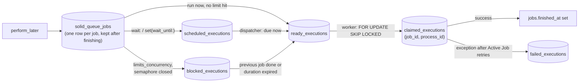

# 05 · Solid Queue internals (and Solid Cache, Solid Cable)

<!-- nav:top -->
[Course home](../../README.md) › [Step 2 plan](../../steps/02-rails-at-scale.md) › [Step 2 lessons](00-start-here.md) · [Glossary](../../GLOSSARY.md)
<!-- nav:end -->

## 1. In one sentence

**Solid Queue** is Rails 8's default Active Job backend: jobs are rows in a set of database tables, **workers** poll the "ready" table and claim rows with `SELECT ... FOR UPDATE SKIP LOCKED` so they never take the same job twice, and a **supervisor**, **dispatcher** and **scheduler** handle process health, delayed jobs, concurrency limits and recurring jobs.

## 2. Why it exists

Before Rails 8, most apps used Sidekiq with Redis. That works well, but it means one more service to run, monitor, back up and pay for, and jobs are not in the same transaction as your data. Solid Queue removes Redis by using the database you already have. The price: every enqueue, poll and claim is a SQL query, so you need to understand what it does to your database, and how it behaves when things go wrong (a worker killed mid-job, a deploy, a stuck lock). Solid Cache and Solid Cable do the same for caching and Action Cable.

## 3. Rails analogy

You already know the Active Job side: `perform_later`, `retry_on`, `discard_on`, queues. Solid Queue is only the **storage and execution engine** behind it, like choosing `:sidekiq` or `:solid_queue` in `config.active_job.queue_adapter`. Its tables are ordinary Active Record models (`SolidQueue::Job`, `SolidQueue::ReadyExecution`, ...), which you can query in a console.

## 4. How it works

### Tables and the life of a job



Other tables: `processes` (every running Solid Queue process with a heartbeat), `semaphores` (concurrency limits), `pauses` (paused queues), `recurring_tasks` and `recurring_executions` (recurring jobs, one row per run so a job is enqueued **once** even with several schedulers), plus `batches` / `batch_executions` in recent versions (1.7.0 has them).

### The processes

| Process | Job | Defaults (Solid Queue 1.7.0 source) |
|---|---|---|
| **Supervisor** | Starts the others (as forks by default), restarts any that die, deregisters them on shutdown | `bin/jobs` starts it |
| **Worker** | Polls `ready_executions`, claims a batch, runs jobs in a thread pool | `threads: 3`, `processes: 1`, `polling_interval: 0.1` (the Rails 8 `config/queue.yml` sets `1`) |
| **Dispatcher** | Moves due scheduled jobs to ready; unblocks blocked jobs (concurrency maintenance) | `batch_size: 500`, `polling_interval: 1`, `concurrency_maintenance_interval: 600` |
| **Scheduler** | Enqueues recurring tasks from `config/recurring.yml` | `polling_interval: 5` |

### Claiming without double execution

A worker with 3 free threads runs, in one transaction (simplified from `SolidQueue::ReadyExecution.claim`):

```sql
SELECT id, job_id FROM solid_queue_ready_executions
WHERE queue_name IN (...) ORDER BY priority, job_id LIMIT 3
FOR UPDATE SKIP LOCKED;                    -- rows locked by another worker are skipped, not waited for
INSERT INTO solid_queue_claimed_executions (job_id, process_id) VALUES ...;
DELETE FROM solid_queue_ready_executions WHERE id IN (...);
```

`SKIP LOCKED` is what lets many workers poll the same table without blocking each other (lesson 03). Two `psql` sessions show it (real output, a 6-row demo table):

```
worker B claimed 104,105,106          -- while worker A holds 101-103 in an open transaction
worker A claimed 101,102,103
-- the same query without SKIP LOCKED, with lock_timeout = 1s:
ERROR:  canceling statement due to lock timeout
CONTEXT:  while locking tuple (0,1) in relation "ready_executions"
```

### Heartbeats and crashed workers

Every process updates `last_heartbeat_at` every **60 s** (`process_heartbeat_interval`). What happens to a job whose worker dies mid-job:

- **Forked worker killed** (OOM, `kill -9`): the supervisor notices the child exited and marks its claimed jobs **failed** with `SolidQueue::Processes::ProcessExitError`, then starts a replacement worker.
- **Whole machine gone**: nobody notices the exit, but heartbeats stop. After `process_alive_threshold` (**5 minutes**) another process prunes the dead process and fails its claimed jobs with `ProcessPrunedError`.
- **Graceful shutdown** (`SIGTERM` during a deploy): workers stop claiming, wait up to `shutdown_timeout` (**5 s**) for running jobs, and put unfinished claimed jobs **back to ready**.

So a crashed job is not lost, but it is **not retried automatically either**: it shows up as failed (retry it in Mission Control or with `SolidQueue::FailedExecution#retry`). Jobs must be **idempotent** anyway, because a job can run, succeed at its side effect, and crash before being marked finished.

### Concurrency controls

```ruby
class ChargeOrderJob < ApplicationJob
  limits_concurrency to: 1, key: ->(order) { order.customer_id }, duration: 5.minutes
end
```

At enqueue time Solid Queue checks a **semaphore** for the key (`"ChargeOrderJob/13221"`). Open: the job goes to ready. Closed: it goes to `blocked_executions`. When a job finishes (success or failure) it signals the semaphore and releases the next blocked job. `duration` is a safety net if a job never releases its semaphore. `on_conflict: :discard` drops conflicting jobs instead of blocking them.

### Where it runs

- `bin/jobs` as a **separate process or Kamal role** (recommended for real load), or
- inside Puma with `SOLID_QUEUE_IN_PUMA=1` (the Rails 8 `config/puma.rb` has `plugin :solid_queue if ENV["SOLID_QUEUE_IN_PUMA"]`), fine for small apps on one server.
- It uses a **separate database** (`queue:` in `database.yml`, `config.solid_queue.connects_to = { database: { writing: :queue } }`) so job traffic does not compete with app queries and `db/queue_schema.rb` stays apart.
- **Connections**: the README recommends `threads` ≤ the queue database pool size **minus 2** (polling and heartbeat use connections too), per worker process, in addition to your app's pool. Solid Queue 1.7 also offers `fibers: N` workers (Fibers from Step 1 lesson 02) that need fewer connections.

### Solid Cache and Solid Cable in one paragraph each

**Solid Cache** (`config.cache_store = :solid_cache_store`) stores cache entries in a database table. Reads are slower than Redis (a SQL query, often served from Postgres' memory, instead of an in-memory lookup), but disk is cheap, so the cache can be **much larger** (hundreds of GB) and entries live longer, which often **raises the hit rate**. It evicts **FIFO** (oldest first) by `max_age`, `max_size` or `max_entries` in `config/cache.yml`. Measure: hit rate, p95 of `cache_read`, and database load.

**Solid Cable** is an Action Cable adapter that writes broadcasts to a table and has each server **poll** it (`polling_interval: 0.1.seconds`, `message_retention: 1.day` in the Rails 8 `config/cable.yml`). Simple and fine for moderate traffic; Redis pub/sub has lower latency and no polling queries at high volume.

## 5. Minimal working example

Run Solid Queue in development on `shop-lab`:

```ruby
# config/environments/development.rb
config.active_job.queue_adapter = :solid_queue
config.solid_queue.connects_to = { database: { writing: :queue } }
```

```yaml
# config/database.yml
development:
  primary:
    <<: *default
    database: shop_lab_development
  queue:
    <<: *default
    database: shop_lab_development_queue
    migrations_paths: db/queue_migrate
```

```yaml
# config/recurring.yml (add a development section)
development:
  refresh_sales_report:
    class: RefreshSalesReportJob
    schedule: every minute
```

Add `ChargeOrderJob` from section 4 (with `sleep 2` in `perform` and a log line) and a trivial `RefreshSalesReportJob`. Then `bin/rails db:prepare` (creates the queue database from `db/queue_schema.rb`) and enqueue before starting any worker:

```ruby
# bin/rails runner
c = Order.first.customer_id
Order.where(customer_id: c).limit(3).each { |o| ChargeOrderJob.perform_later(o) }   # same customer
ChargeOrderJob.perform_later(Order.where.not(customer_id: c).first)                  # other customer
RefreshSalesReportJob.set(wait: 10.minutes).perform_later
%w[jobs ready_executions blocked_executions scheduled_executions semaphores].each do |t|
  print "#{t}=#{SolidQueue::Record.connection.select_value("SELECT count(*) FROM solid_queue_#{t}")}  "
end
```

Real output:

```
jobs=5  ready_executions=2  blocked_executions=2  scheduled_executions=1  semaphores=2
```

Two jobs for the same customer are **blocked** by the `to: 1` limit. Now start `bin/jobs` and look at the tables:

```
 id |       kind       |                 name                  |  pid
----+------------------+---------------------------------------+-------
  1 | Supervisor(fork) | supervisor(fork)-dc59df1c01c5f358c5a8 | 13574
  2 | Dispatcher       | dispatcher-42b8650f0bcaadf7bbe7       | 13580
  3 | Worker           | worker-4541d1146aa831b96389           | 13584
  4 | Scheduler        | scheduler-4f21daff3a6e41aced7b        | 13589
```

`log/development.log` shows the concurrency limit working: jobs for customer 13221 run one after another, each releasing the next:

```
ChargeOrderJob: charged order 183961
ChargeOrderJob: charged order 2
SolidQueue-1.7.0 Release blocked job (13.1ms)  job_id: 2, concurrency_key: "ChargeOrderJob/13221", released: true
ChargeOrderJob: charged order 38279
SolidQueue-1.7.0 Release blocked job (9.4ms)  job_id: 3, concurrency_key: "ChargeOrderJob/13221", released: true
ChargeOrderJob: charged order 59841
```

Finally, kill a worker mid-job. With a `SlowJob` that sleeps 30 s running:

```bash
kill -9 <worker pid from solid_queue_processes>
```

```
SolidQueue-1.7.0 Fail claimed jobs (77.2ms)  job_ids: [6], process_ids: [7], error: "SolidQueue::Processes::ProcessExitError Process pid=13654 exited unexpectedly. Received unhandled signal 9."
```

The job is in `solid_queue_failed_executions`, and the supervisor started a new worker. Now retry it from a dashboard, **Mission Control – Jobs**. Tested on the API-only `shop-lab` (mission_control-jobs 1.3.1):

```bash
bundle add mission_control-jobs
bundle add propshaft    # API-only apps only: without an asset pipeline the app fails to boot
                        # ("undefined method `assets' for ... Rails::Application::Configuration")
```

```ruby
# config/routes.rb
mount MissionControl::Jobs::Engine, at: "/jobs"

# config/initializers/mission_control.rb (development only; for real environments use
# `bin/rails mission_control:jobs:authentication:configure`, which stores them in credentials)
MissionControl::Jobs.http_basic_auth_user = "dev"
MissionControl::Jobs.http_basic_auth_password = "secret"
```

HTTP basic auth is **on and closed by default**: without credentials configured, nobody can open it. With the settings above, `curl localhost:3000/jobs` returns 401, and the browser (user `dev`, password `secret`) shows the Queues page. Open "Failed jobs", click **Retry** on the `SlowJob`, and it moves from `solid_queue_failed_executions` back to `solid_queue_ready_executions`. In production, add `bin/rails assets:precompile` to your Docker build for the dashboard's CSS and JavaScript (the gem's README explains this for API-only apps).

## 6. Key terms

- **Execution tables**: ready, scheduled, claimed, blocked, failed, recurring.
- **Worker / dispatcher / scheduler / supervisor**: see the table in section 4.
- **Polling**: checking a table at an interval instead of being notified.
- **`FOR UPDATE SKIP LOCKED`**: claim rows without waiting for other workers.
- **Heartbeat, `process_alive_threshold`, pruning**: liveness signal, how long before a silent process is considered dead, removing it and failing its jobs.
- **Semaphore / `limits_concurrency`**: per-key limit on concurrent jobs.
- **Recurring task**: a cron-like job defined in `config/recurring.yml`.
- **Idempotent job**: running it twice has the same effect as running it once.
- **Solid Cache (FIFO eviction), Solid Cable (polling adapter).**

## 7. Common mistakes

- **Assuming a crashed job is retried**: it is marked failed; you retry it (and it must be idempotent).
- **Putting the queue in the primary database under heavy load** without measuring the extra queries.
- **Too many worker threads for the queue DB pool**, giving connection timeouts.
- **Long-running jobs with a short `shutdown_timeout`** during deploys: they get released and run again from the start.
- **A `limits_concurrency` key that is too broad** (for example the job class), turning a queue into a single-file line.
- **Forgetting `config/recurring.yml` environments**: tasks are defined per environment (`production:` by default).

## 8. Check your understanding

1. What does Solid Queue do with a job whose worker process was killed mid-job? And if the whole server disappears?
2. Why does claiming use `SKIP LOCKED` instead of plain `FOR UPDATE`?
3. Where does a job enqueued with `set(wait: 10.minutes)` live, and which process moves it on?
4. Five `ChargeOrderJob`s for the same customer are enqueued with `to: 1`. Describe what the tables look like just before `bin/jobs` starts.
5. You move from a Redis cache to Solid Cache. What gets better, what gets worse, and what would you measure?

<details>
<summary>Answers</summary>

1. The supervisor sees the forked worker exit and marks its claimed jobs failed (`ProcessExitError`). If the whole server disappears, its heartbeats stop and after `process_alive_threshold` (5 minutes by default) another process prunes it and fails its claimed jobs (`ProcessPrunedError`). Either way you retry them.
2. With plain `FOR UPDATE`, a second worker would wait for the rows the first worker holds; with `SKIP LOCKED` it takes the next free rows immediately, so workers never block each other.
3. In `solid_queue_scheduled_executions`; the dispatcher moves it to `ready_executions` when it is due.
4. 5 rows in `jobs`, 1 in `ready_executions`, 4 in `blocked_executions`, 1 semaphore for the customer's key.
5. Better: no Redis to run, a much larger cache (disk), often a higher hit rate and longer-lived entries. Worse: higher latency per read, load on the database, FIFO instead of LRU eviction. Measure hit rate, p95 read latency, total request latency and database CPU/IO.

</details>

## 9. Go deeper (optional)

- [Solid Queue README](https://github.com/rails/solid_queue) (configuration, concurrency controls, recurring tasks, failed jobs).
- [Solid Cache README](https://github.com/rails/solid_cache) and [Solid Cable README](https://github.com/rails/solid_cable).
- [Mission Control – Jobs](https://github.com/rails/mission_control-jobs).

<!-- nav:bottom -->

---

[← 04 · Partitioning, replicas and sharding](04-partitioning-and-multi-db.md) · [Step 2 lessons](00-start-here.md) · [06 · Kamal 2 architecture and a first deploy →](06-kamal-architecture.md)
<!-- nav:end -->
