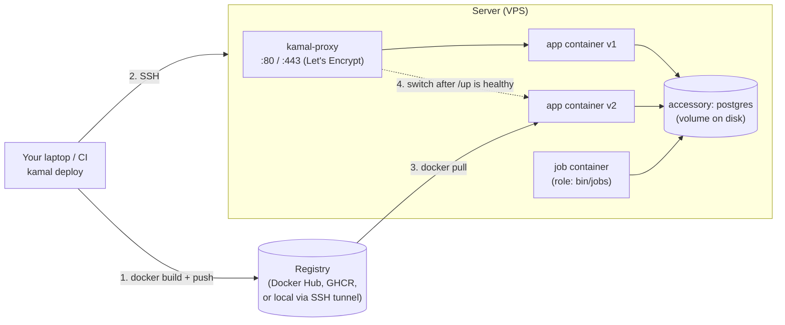

# 06 · Kamal 2 architecture and a first deploy

## 1. In one sentence

**Kamal** deploys your app as **Docker containers** to any server you can reach over SSH: it builds and pushes an image, starts the new container next to the old one, and **kamal-proxy** (a small HTTP proxy on each server) switches traffic to the new container once its health check (`/up`) passes, which gives zero-downtime deploys without a PaaS or Kubernetes.

## 2. Why it exists

Heroku-style platforms are easy but expensive at scale; Kubernetes is flexible but a lot of work. Rails 8 ships with Kamal configured (`config/deploy.yml`, `.kamal/secrets`, a production `Dockerfile`), so a Rails developer can put an app on a €10/month VPS with SSL, background jobs and a database. Knowing how it works matters when a deploy hangs, a health check fails or a migration blocks.

## 3. Rails analogy

If you used Capistrano: Kamal is **Capistrano for containers**. Instead of `git pull` + `bundle install` + restart on the server, it ships a finished image. If you used Heroku: `kamal deploy` is `git push heroku main`, a **role** is a **process type** in a `Procfile` (`web`, `worker`), and an **accessory** is an **add-on** (Postgres), except you run it yourself.

## 4. How it works



### The pieces

| Piece | What it is | In `config/deploy.yml` |
|---|---|---|
| **Service / image** | Your app's name and image name | `service:`, `image:` |
| **Servers and roles** | Which hosts run which command. `web` runs the Dockerfile's `CMD`; other roles set `cmd:` | `servers: web: [...]`, `job: { hosts: [...], cmd: bin/jobs }` |
| **kamal-proxy** | Reverse proxy per server: routes by host, terminates SSL (automatic Let's Encrypt certificates), health-checks and switches containers | `proxy: { ssl: true, host: app.example.com }` |
| **Registry** | Where images go. Recent Kamal 2 versions start a local registry and reach it through an SSH tunnel (`server: localhost:5555`, the Rails 8.1 default) | `registry:` |
| **Env and secrets** | `clear` values in the file; `secret` names read from `.kamal/secrets` | `env: { clear: {...}, secret: [...] }` |
| **Accessories** | Long-running services Kamal starts once and does not redeploy (Postgres, Redis) | `accessories:` |
| **Builder** | Docker build settings, including target CPU architecture | `builder: { arch: amd64 }` |
| **Hooks** | Scripts run at stages (`pre-build`, `pre-deploy`, `post-deploy`, ...) | `.kamal/hooks/` |

### A deploy, step by step

1. **Build** the image (tagged with the git commit) and **push** it to the registry.
2. On each server: **pull** the image.
3. **Start the new container**. Rails' `bin/docker-entrypoint` runs `bin/rails db:prepare` (so **migrations run here**, on each web container start) before `rails server`.
4. kamal-proxy calls **`/up`** (Rails' built-in health check route) every second until it returns 200, up to `deploy_timeout` (30 s by default).
5. kamal-proxy **switches new requests** to the new container and lets in-flight requests on the old one finish (`drain_timeout`, 30 s by default).
6. The old container is **stopped** (kept for rollback: `retain_containers`, 5 by default). If step 4 times out, the new container is stopped and **traffic never left the old one**.

What still breaks in a "zero-downtime" deploy:

- **Migrations** that lock tables (lesson 03) run while the old version serves traffic.
- **Schema/code compatibility**: for a few seconds old and new code run at the same time against the new schema. Removing or renaming a column needs the multi-step dance (`ignored_columns` first).
- **Jobs**: a job container gets `SIGTERM`; Solid Queue has `shutdown_timeout` (5 s) to finish, then releases jobs back to the queue (lesson 05).
- **Long requests / WebSockets** longer than the drain timeout get cut.

## 5. Minimal working example

You need: a VPS with 2 GB RAM and Ubuntu (any provider), your SSH key on it, a DNS name pointing at it (or skip SSL and use the IP), and Docker on your laptop.

### `config/deploy.yml` for `shop-lab`

```yaml
service: shop-lab
image: your-user/shop-lab

servers:
  web:
    - 203.0.113.10          # your server's IP
  job:
    hosts:
      - 203.0.113.10
    cmd: bin/jobs           # Solid Queue as its own role (instead of SOLID_QUEUE_IN_PUMA)

proxy:
  ssl: true
  host: shop-lab.example.com

registry:
  server: localhost:5555    # the Rails 8.1 default: a local registry via SSH tunnel

env:
  secret:
    - RAILS_MASTER_KEY
    - SHOP_LAB_DATABASE_PASSWORD
  clear:
    DB_HOST: shop-lab-db    # the accessory's container name on Kamal's Docker network

accessories:
  db:
    image: postgres:17
    host: 203.0.113.10
    port: "127.0.0.1:5432:5432"   # only reachable from the server itself
    env:
      clear:
        POSTGRES_USER: shop_lab
        POSTGRES_DB: shop_lab_production
      secret:
        - POSTGRES_PASSWORD
    directories:
      - data:/var/lib/postgresql/data

builder:
  arch: amd64
```

Rails 8's generated `config/database.yml` reads `DB_HOST` and `SHOP_LAB_DATABASE_PASSWORD` for production; set the production `username:` to `shop_lab` to match the accessory. With `ssl: true`, also set `config.assume_ssl = true` and `config.force_ssl = true` in `production.rb` (the generated `deploy.yml` comments say so).

### `.kamal/secrets` (committed, but contains **no values**, only where to get them)

```bash
RAILS_MASTER_KEY=$(cat config/master.key)
SHOP_LAB_DATABASE_PASSWORD=$SHOP_LAB_DATABASE_PASSWORD
POSTGRES_PASSWORD=$SHOP_LAB_DATABASE_PASSWORD
```

### Deploy

```bash
export SHOP_LAB_DATABASE_PASSWORD=$(openssl rand -hex 16)   # keep it in your password manager
kamal setup            # first time: installs Docker on the server, boots the accessory and proxy, deploys
kamal app logs -r job  # see Solid Queue start and run the recurring job
curl -s https://shop-lab.example.com/up

# change something, add a migration, then:
kamal deploy
kamal app details      # which containers run
kamal rollback <version>   # back to a previous image if needed
```

To observe the zero-downtime switch, run a load test (Step 1's `script/load.rb` or `oha`) against the URL **during** `kamal deploy` and check that `errors=0`.

A useful mental check before each deploy: "If the old code runs for 30 more seconds against the new schema, does anything break?"

## 6. Key terms

- **Image / container / registry**: the built app / a running instance of it / where images are stored.
- **kamal-proxy**: per-server HTTP proxy that health-checks and switches containers, and handles SSL.
- **Role**: servers plus the command they run (`web`, `job`).
- **Accessory**: a supporting service (Postgres) booted once, not redeployed.
- **Health check (`/up`)**: the route kamal-proxy polls before switching traffic.
- **Deploy timeout / drain timeout**: how long to wait for the new container to be healthy / for old requests to finish.
- **`.kamal/secrets`**: maps secret names to commands or env vars that produce them.
- **Thruster**: the small HTTP/2 proxy in front of Puma inside the Rails 8 container (`./bin/thrust ./bin/rails server`).

## 7. Common mistakes

- **Putting real secret values in `.kamal/secrets` or `deploy.yml`** and committing them.
- **Building on an ARM Mac for an AMD64 server** without `builder: arch: amd64` (or with a slow emulated build; consider a remote builder).
- **Exposing the database port to the internet** (`port: 5432:5432` instead of `127.0.0.1:5432:5432`).
- **Blocking migrations** assumed to be safe because "Kamal is zero-downtime".
- **Running Solid Queue both in Puma and as a `job` role**, doubling workers and connections.
- **Forgetting backups for the Postgres accessory**: it is your database now; add a backup job.

## 8. Check your understanding

1. How does Kamal achieve zero-downtime deploys, and what can still break during a deploy?
2. What happens if the new container's `/up` never returns 200?
3. Where do migrations run in a Rails 8 Kamal deploy, and why does that matter with two web servers?
4. What is the difference between a role and an accessory?
5. Why is it safe to commit `.kamal/secrets`, and what would make it unsafe?

<details>
<summary>Answers</summary>

1. It starts the new container beside the old one, waits for `/up` to succeed, then kamal-proxy moves new requests to it and lets the old one drain. Blocking or incompatible migrations, old code running against the new schema, jobs interrupted at shutdown, and long requests beyond the drain timeout can still break.
2. After `deploy_timeout` the deploy fails, the new container is stopped, and traffic stays on the old container.
3. In `bin/docker-entrypoint` (`db:prepare`) when each web container starts. With two web servers both run it; Rails' migration advisory lock makes one wait, but slow or locking migrations then delay or break both boots. Some teams run migrations once in a `pre-deploy` hook or a separate step instead.
4. A role runs your app image with a command and is redeployed every time; an accessory runs another image (Postgres) and is booted once and managed separately.
5. It only contains references (`$(cat config/master.key)`, `$ENV_VAR`, password manager commands), not values; writing a literal password into it would make it unsafe.

</details>

## 9. Go deeper (optional)

- [Kamal documentation](https://kamal-deploy.org) (configuration reference, commands, hooks) and `kamal docs proxy` in your terminal.
- [kamal-proxy](https://github.com/basecamp/kamal-proxy) README (how the switch and drain work).
- Rails Guides: [Getting Started: Deploying to production](https://guides.rubyonrails.org/getting_started.html#deploying-to-production) (verify section name).
