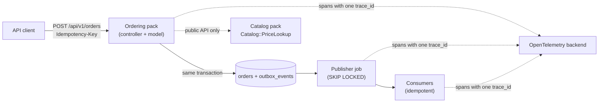

# Step 3 lessons: start here

Steps 1 and 2 made `shop-lab` fast. This week makes it **well-structured and observable**: clear boundaries inside the monolith (Packwerk), events that are never lost or processed twice (the transactional outbox), an API that behaves correctly under retries and load, and tracing that lets you follow one request from HTTP into a background job. You also practise writing decisions down (ADRs), which is how senior engineers make their thinking visible.

**How to use this folder:** each day in [the Step 3 plan](../../steps/03-architecture-system-design.md) starts with **"Read first:"** links. Read the lesson, run its example on `shop-lab`, then do the day's tasks. Outputs in these lessons are real, from `shop-lab` on Rails 8.1.4 unless marked otherwise.

## The lessons

| # | Lesson | Day |
|---|---|---|
| 01 | [Bounded contexts and Packwerk](01-bounded-contexts-and-packwerk.md) | Mon 12 Oct, Tue 13 Oct |
| 02 | [Events and the transactional outbox](02-events-and-outbox.md) | Wed 14 Oct |
| 03 | [API design: cursors, idempotency keys, errors, rate limits](03-api-design.md) | Thu 15 Oct |
| 04 | [OpenTelemetry for Rails](04-opentelemetry.md) | Fri 16 Oct, Sat 17 Oct |
| 05 | [ADRs and one-page design docs](05-adrs-and-design-docs.md) | Mon 12 Oct, Sun 18 Oct |

## The mental model for this week

## Glossary

| Term | Meaning | Lesson |
|---|---|---|
| **Bounded context** | A part of the business with its own model and language (Catalog, Ordering, Billing). | [01](01-bounded-contexts-and-packwerk.md) |
| **Context map** | A diagram of the contexts and how they depend on each other. | [01](01-bounded-contexts-and-packwerk.md) |
| **Modular monolith** | One deployable app split into modules with enforced boundaries. | [01](01-bounded-contexts-and-packwerk.md) |
| **Pack (package)** | A folder with its own `package.yml`, treated by Packwerk as a module. | [01](01-bounded-contexts-and-packwerk.md) |
| **Packwerk** | A static checker that reports references between packs that are not declared or not public. | [01](01-bounded-contexts-and-packwerk.md) |
| **Dependency violation** | Code in pack A uses a constant from pack B without declaring the dependency. | [01](01-bounded-contexts-and-packwerk.md) |
| **Privacy violation** | Code outside a pack uses a constant that is not in the pack's public folder. | [01](01-bounded-contexts-and-packwerk.md) |
| **`package_todo.yml`** | The recorded list of existing violations, so only new ones fail CI. | [01](01-bounded-contexts-and-packwerk.md) |
| **Public API (of a pack)** | The small set of classes other packs may call (`app/public/`). | [01](01-bounded-contexts-and-packwerk.md) |
| **Domain event** | A record that something happened in the business (`order.placed`). | [02](02-events-and-outbox.md) |
| **`Rails.event`** | Rails 8.1's structured event reporter (`notify`, tags, context, subscribers). | [02](02-events-and-outbox.md) |
| **`ActiveSupport::Notifications`** | Rails' instrumentation pub/sub (timed blocks, used by Rails internals). | [02](02-events-and-outbox.md) |
| **Dual-write problem** | Writing to the database and to another system separately, so one can succeed while the other fails. | [02](02-events-and-outbox.md) |
| **Transactional outbox** | Writing the event to an `outbox_events` table in the same transaction, then publishing it later. | [02](02-events-and-outbox.md) |
| **At-most-once / at-least-once** | Messages may be lost but never repeated / never lost but may be repeated. | [02](02-events-and-outbox.md) |
| **Idempotent consumer** | A handler that produces the same result when it processes the same event twice. | [02](02-events-and-outbox.md) |
| **Savepoint (`requires_new: true`)** | A nested transaction that can roll back without aborting the outer one. | [02](02-events-and-outbox.md) |
| **Keyset (cursor) pagination** | Paging by "rows after this sort key" instead of `OFFSET`. | [03](03-api-design.md) |
| **Idempotency key** | A client-chosen key that makes a retried `POST` return the first result instead of acting twice. | [03](03-api-design.md) |
| **RFC 9457 problem details** | A standard JSON error format (`type`, `title`, `status`, `detail`, `instance`). | [03](03-api-design.md) |
| **Rate limiting (`rate_limit`)** | Rejecting clients that send too many requests in a time window (HTTP 429). | [03](03-api-design.md) |
| **API versioning / deprecation** | Changing an API without breaking existing clients / announcing and removing old behaviour. | [03](03-api-design.md) |
| **OpenTelemetry (OTel)** | The vendor-neutral standard and SDKs for traces, metrics and logs. | [04](04-opentelemetry.md) |
| **Trace / span** | The whole journey of one request / one timed operation inside it. | [04](04-opentelemetry.md) |
| **Attribute** | A key-value on a span (`order.id`, `http.route`). | [04](04-opentelemetry.md) |
| **Context propagation** | Passing the trace id across threads, processes and services (for example into a job). | [04](04-opentelemetry.md) |
| **Exporter / OTLP / collector** | Sends spans out / the standard protocol / a service that receives, processes and forwards telemetry. | [04](04-opentelemetry.md) |
| **Sampling (head / tail)** | Keeping only some traces, deciding at the start / after the trace ends. | [04](04-opentelemetry.md) |
| **RED metrics / SLO** | Rate, Errors, Duration / a target such as "99% of requests under 300 ms". | [04](04-opentelemetry.md) |
| **Cardinality** | The number of distinct values of a label; high cardinality makes metrics expensive. | [04](04-opentelemetry.md) |
| **ADR** | Architecture Decision Record: a short document of one decision, its context and consequences. | [05](05-adrs-and-design-docs.md) |
| **Design doc** | A short proposal describing a problem, options and a plan before building. | [05](05-adrs-and-design-docs.md) |
