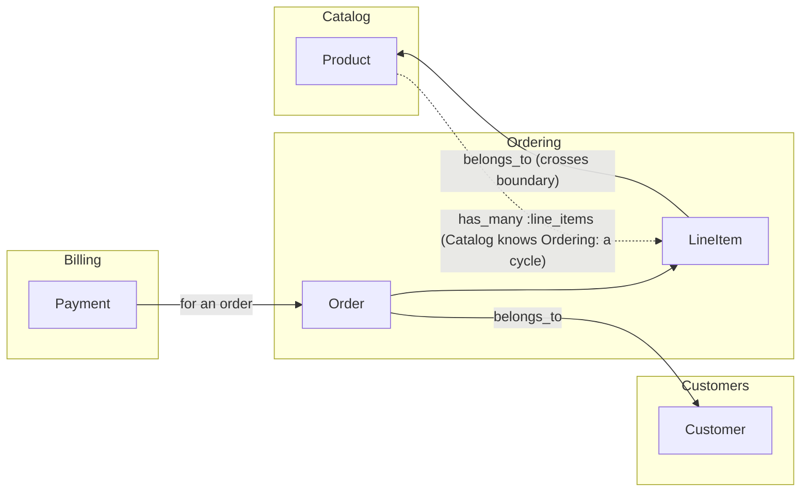

# 01 · Bounded contexts and Packwerk

<!-- nav:top -->
[Course home](../../README.md) › [Step 3 plan](../../steps/03-architecture-system-design.md) › [Step 3 lessons](00-start-here.md) · [Glossary](../../GLOSSARY.md)
<!-- nav:end -->

## 1. In one sentence

A **bounded context** is a part of the business with its own model and vocabulary (Catalog, Ordering, Billing); **Packwerk** lets you turn those contexts into **packs** inside one Rails app and fails CI when code reaches across a boundary it has not declared or uses another pack's private classes.

## 2. Why it exists

In a large Rails app every model can call every other model. After a few years `Order` knows about `Product` pricing rules, `User` knows about invoices, and a change in one place breaks something far away. Teams then consider microservices, which bring network calls, distributed data and much harder deploys.

A **modular monolith** is the middle way: one app, one deploy, one database, but with boundaries that tools enforce. Rails has no built-in module boundaries (Zeitwerk autoloads everything everywhere), so Shopify built Packwerk to add them statically.

## 3. Rails analogy

- A **pack** is like a **Rails engine without the ceremony**: its own `app/models`, `app/controllers`, ..., but no gem, no mounting, and the same autoloader.
- A pack's **public API** is like the **public methods of a service object**: other code calls `Catalog::PriceLookup.for(ids)`, not `Product.where(...).pluck(...)`.
- `package_todo.yml` works like **`.rubocop_todo.yml`**: existing violations are recorded so only new ones fail the build.

## 4. How it works

### Finding contexts

Start from the business, not the code: which **nouns mean different things to different teams**? "Product" to the catalog team is a description, images and a price; to fulfilment it is a SKU, weight and stock level. Each meaning is a candidate context. Then check the code: which models change together, and which references cross the line.



The dotted arrow is the typical problem: `Product has_many :line_items` makes Catalog depend on Ordering, while Ordering depends on Catalog. Cycles mean the two cannot be understood or changed separately.

### Packwerk's model

| File | Purpose |
|---|---|
| `packwerk.yml` (root) | Global settings; `require:` for extra checkers such as privacy |
| `package.yml` (root, `.`) | The root pack: everything not in a pack |
| `packs/<name>/package.yml` | `enforce_dependencies: true`, `dependencies: [...]`, and with `packwerk-extensions`, `enforce_privacy: true` |
| `packs/<name>/package_todo.yml` | Recorded existing violations of this pack (generated by `bin/packwerk update-todo`) |
| `packs/<name>/app/public/` | The public API when privacy is enforced |

Packwerk parses Ruby files, finds **constant references** (`Product`, `Catalog::PriceLookup`) and uses Zeitwerk's load paths to decide which pack defines each constant. It does not run your code, so it cannot see dynamic references such as `"Product".constantize`, and associations count as references to the class they name.

Two checks:

- **Dependency**: pack A references a constant in pack B, but B is not in A's `dependencies`. Dependencies must form a graph without cycles.
- **Privacy** (from `packwerk-extensions`): a constant is referenced from outside its pack but is not in `app/public/`.

## 5. Minimal working example

(Real output from `shop-lab`, Packwerk 3.3.1, packwerk-extensions 0.4.0.)

### Part A: create packs

```bash
bundle add packwerk
bundle binstub packwerk          # creates bin/packwerk, the command Packwerk's messages use (`bundle exec packwerk` works too)
bin/packwerk init
mkdir -p packs/catalog/app/models packs/ordering/app/models
git mv app/models/product.rb packs/catalog/app/models/
git mv app/models/order.rb app/models/line_item.rb packs/ordering/app/models/
```

Tell Rails to autoload the packs (or use the `packs-rails` gem, which does this for you):

```ruby
# config/application.rb, inside the Application class
Dir[Rails.root.join("packs/*/app/*")].each do |path|
  config.autoload_paths << path
  config.eager_load_paths << path
end
```

```yaml
# packs/catalog/package.yml and packs/ordering/package.yml
enforce_dependencies: true
dependencies: []
```

### Part B: see the violations

```
$ bin/packwerk check
packs/ordering/app/models/line_item.rb:3:2
Dependency violation: ::Product belongs to 'packs/catalog', but 'packs/ordering' does not specify a dependency on 'packs/catalog'.
Are the constant and its references in the right packages?

Inference details: this is a reference to ::Product which seems to be defined in packs/catalog/app/models/product.rb.
...
packs/ordering/app/models/order.rb:4:2
Dependency violation: ::Customer belongs to '.', but 'packs/ordering' does not specify a dependency on '.'.
...
7 offenses detected
```

The 7 offenses: both packs use `ApplicationRecord` (root), Ordering uses `Customer` (root) and `Product` (Catalog, twice), and Catalog uses `LineItem` (Ordering) through `has_many :line_items`: the cycle from the diagram.

### Part C: fix two, record the rest

1. **Declare intended dependencies**: Ordering may use Catalog and the root; Catalog may use only the root.

```yaml
# packs/ordering/package.yml
enforce_dependencies: true
dependencies:
  - "."
  - packs/catalog
```

2. **Break the cycle**: remove `has_many :line_items` from `Product`. "Units sold" is an Ordering question, so it moves to Ordering.

3. **Add a public API and turn on privacy** (`bundle add packwerk-extensions`, then in `packwerk.yml`: `require: [packwerk/privacy/checker]`):

```ruby
# packs/catalog/app/public/catalog/price_lookup.rb
module Catalog
  # The public API other packs use instead of reaching into Product.
  module PriceLookup
    # => { product_id => price_cents }
    def self.for(product_ids)
      Product.where(id: product_ids).pluck(:id, :price_cents).to_h
    end
  end
end
```

```yaml
# packs/catalog/package.yml
enforce_dependencies: true
enforce_privacy: true
dependencies:
  - "."
```

Now Packwerk shows exactly where other code still reaches into Catalog's internals:

```
$ bin/packwerk check
app/controllers/products_controller.rb:4:15
Privacy violation: '::Product' is private to 'packs/catalog' but referenced from '.'.
Is there a public entrypoint in 'packs/catalog/app/public/' that you can use instead?
packs/ordering/app/models/line_item.rb:3:2
Privacy violation: '::Product' is private to 'packs/catalog' but referenced from 'packs/ordering'.
...
3 offenses detected

$ bin/rails runner 'p Catalog::PriceLookup.for([1, 2])'
{1=>6860, 2=>4689}
```

Record the remaining ones (the `belongs_to :product` association is a deliberate, documented exception for now) and make CI strict about new ones:

```bash
bin/packwerk update-todo     # writes package_todo.yml in the packs that contain the violations
bin/packwerk check           # "No offenses detected"; add this command to CI
```

## 6. Key terms

- **Bounded context**, **context map**, **modular monolith**: see the glossary.
- **Pack / `package.yml`**: a folder Packwerk treats as a module, and its settings.
- **Dependency violation / privacy violation**: undeclared use / use of a non-public constant.
- **`package_todo.yml` / `update-todo`**: recorded existing violations / the command that records them.
- **Public API folder** (`app/public/`): what other packs may reference.
- **Dependency cycle**: A depends on B and B on A; Packwerk's `validate` rejects cycles in declared dependencies.
- **`packs-rails`**: a gem that sets up autoloading for `packs/*`.

## 7. Common mistakes

- **Packs by technical layer** (`packs/services`, `packs/models`) instead of business capability.
- **Declaring every dependency** to make the check pass; the dependency list becomes meaningless.
- **Growing `package_todo.yml`** instead of shrinking it; review it like tech debt.
- **Public APIs that return Active Record models**, so callers still depend on the private schema; return plain values or small structs.
- **Expecting runtime enforcement**: Packwerk is static; `constantize` and `send` slip through.
- **Big-bang moves** of hundreds of files in one PR; move one context at a time.

## 8. Check your understanding

1. How do you decide where the boundary between Ordering and Catalog goes? What evidence would make you move it?
2. Why is `Product has_many :line_items` a problem once Catalog and Ordering are packs?
3. Packwerk reports 300 violations in a legacy app. What is your plan for the first month?
4. What does a privacy violation tell you that a dependency violation does not?
5. When would you choose a Rails engine or a separate service instead of a pack?

<details>
<summary>Answers</summary>

1. By business language and change patterns: what each team means by a word, and which code changes together. If most changes to one pack also touch the other, or the public API keeps growing, the boundary is in the wrong place.
2. It makes Catalog depend on Ordering while Ordering depends on Catalog: a cycle, so neither can be understood, tested or extracted alone.
3. Record them all with `update-todo` and turn on `check` in CI so no new ones appear; then group the recorded ones by constant, and remove the most common by adding a public API (often a few constants cause most violations).
4. That the dependency is allowed but the caller uses an internal class instead of the pack's public API, so the pack cannot change its internals safely.
5. An engine when you want stronger isolation (own routes, own gem boundary) or reuse across apps; a separate service only when you need independent deploys, scaling or a different technology, and can pay for network calls and distributed data.

</details>

## 9. Go deeper (optional)

- [Packwerk README and USAGE](https://github.com/Shopify/packwerk) and [packwerk-extensions](https://github.com/rubyatscale/packwerk-extensions).
- [Ruby at Scale](https://github.com/rubyatscale) tools, including `packs-rails`.
- Vlad Khononov, *Learning Domain-Driven Design*, chapters 1-4 (bounded contexts, context maps).

<!-- nav:bottom -->

---

[← Step 3 lessons: start here](00-start-here.md) · [Step 3 lessons](00-start-here.md) · [02 · Events and the transactional outbox →](02-events-and-outbox.md)
<!-- nav:end -->
