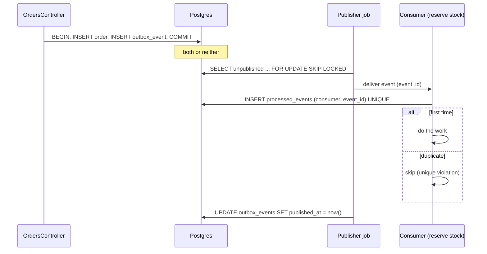

# 02 · Events and the transactional outbox

<!-- nav:top -->
[Course home](../../README.md) › [Step 3 plan](../../steps/03-architecture-system-design.md) › [Step 3 lessons](00-start-here.md) · [Glossary](../../GLOSSARY.md)
<!-- nav:end -->

## 1. In one sentence

A **domain event** ("order placed") lets other parts of the system react without the order code knowing about them; the **transactional outbox** makes sure the event is recorded **in the same database transaction** as the order and delivered later by a job, and **idempotent consumers** make the unavoidable duplicate deliveries harmless.

## 2. Why it exists

When an order is placed you want to reserve stock, send an email and notify a partner webhook. Calling all of that from `OrdersController#create` couples Ordering to everything. Publishing an event decouples them, but raises a reliability problem, the **dual write**:

- Publish **inside** the transaction: the event goes out, then the transaction rolls back. Consumers act on an order that does not exist.
- Publish **after commit** (`after_commit`): the order is saved, then the process crashes (deploy, OOM) before publishing. The event is lost; stock is never reserved.

No ordering of "write to DB" and "send to X" is safe, because they are two systems. The outbox turns it into **one** write (to the database) plus a retryable delivery.

## 3. Rails analogy

You already use the pattern without the name: `perform_later` with **Solid Queue** inside a transaction is an outbox, because the job row is in the database. (With Sidekiq/Redis it is a dual write; Active Job's per-job setting `self.enqueue_after_transaction_commit = true` defers the enqueue until after commit, which avoids phantom jobs but can still lose the job if the process dies right after commit. It is `false` by default in Rails 8.1.) The outbox generalises this: a table of events, a publisher job, and consumers.

## 4. How it works



### Delivery guarantees

| Guarantee | Meaning | How you get it |
|---|---|---|
| At-most-once | Never duplicated, may be lost | Publish after commit, never retry |
| **At-least-once** | Never lost, may be duplicated | Outbox + retries |
| "Exactly once" | In practice: at-least-once delivery **plus** idempotent processing | Outbox + idempotent consumers |

The publisher can always crash **after** delivering and **before** marking the row published, so duplicates will happen. The consumer must handle them.

### Idempotent consumers

Record "consumer X processed event Y" with a **unique index** on `(consumer, event_id)`, in the same transaction as the consumer's own database work. A second delivery violates the index and is skipped. "Check then insert" (`exists?` then `create`) is not enough: two deliveries at the same time both see "not processed".

Side effects outside the database (an email, an HTTP call) cannot share the transaction. Options: make the external call idempotent too (many APIs accept an idempotency key, lesson 03), or record the attempt first and accept "at most once" for that side effect.

### In-process events: `Rails.event` and `ActiveSupport::Notifications`

| | `ActiveSupport::Notifications` | `Rails.event` (Rails 8.1) |
|---|---|---|
| Purpose | Instrumentation: timing a block (`sql.active_record`, `process_action.action_controller`) | Structured business/observability events |
| Payload | Name, payload hash, duration | Name, payload, **tags**, **context** (for example request id), timestamp, source location |
| Subscribers | Blocks or objects per event name | Objects with an `emit(event)` method, receiving all events |
| Durable? | No | No |

Both are **in-memory and synchronous**. They are great for logging, metrics and decoupling code in one process, but they are **not** an outbox: if the process dies, the event is gone. Use them to *trigger* writing an outbox row, or for observability.

### Event design

- Name events in the past tense (`order.placed`), include an `event_id` (UUID), a `version`, and the minimum data consumers need (ids, not whole records).
- Evolve schemas by **adding** fields; for breaking changes publish `order.placed.v2` alongside v1 until consumers move.

## 5. Minimal working example

### Part A: `Rails.event` vs `ActiveSupport::Notifications` (`bin/rails runner`)

```ruby
class PrintSubscriber
  def emit(event) = pp(event)
end
Rails.event.subscribe(PrintSubscriber.new)
Rails.event.tagged("checkout") do
  Rails.event.set_context(request_id: "req-123")
  Rails.event.notify("order.placed", order_id: 42, total_cents: 1999)
end

payloads = []
ActiveSupport::Notifications.subscribe("order.placed") { |e| payloads << [e.name, e.payload, e.duration.round(2)] }
ActiveSupport::Notifications.instrument("order.placed", order_id: 42) { sleep 0.01 }
p payloads
```

Real output (Rails 8.1.4):

```
{:name=>"order.placed",
 :payload=>{:order_id=>42, :total_cents=>1999},
 :tags=>{:checkout=>true},
 :context=>{:request_id=>"req-123"},
 :timestamp=>1790592338354555593,
 :source_location=>{:filepath=>"/tmp/ev.rb", :lineno=>9, :label=>"block in <top (required)>"}}
[["order.placed", {:order_id=>42}, 10.23]]
```

### Part B: an outbox with an idempotent consumer

Tables (a migration in `shop-lab`):

```ruby
create_table :outbox_events do |t|
  t.uuid :event_id, null: false, default: -> { "gen_random_uuid()" }, index: { unique: true }
  t.string :event_type, null: false
  t.jsonb :payload, null: false
  t.datetime :published_at
  t.timestamps
end
add_index :outbox_events, :id, where: "published_at IS NULL", name: "index_outbox_events_unpublished"

create_table :processed_events do |t|
  t.uuid :event_id, null: false
  t.string :consumer, null: false
  t.timestamps
end
add_index :processed_events, [:consumer, :event_id], unique: true
```

Writing, publishing and consuming (in the real app the publisher is a Solid Queue recurring job and each consumer its own job; here it is one script to see every step):

```ruby
def place_order(customer_id, fail: false)
  ActiveRecord::Base.transaction do
    order = Order.create!(customer_id:, status: "paid", total_cents: 1999, placed_at: Time.current)
    OutboxEvent.create!(event_type: "order.placed", payload: { order_id: order.id })
    raise "payment declined" if fail
    order
  end
end

def publish_batch(limit: 100)
  OutboxEvent.transaction do
    events = OutboxEvent.where(published_at: nil).order(:id).limit(limit).lock("FOR UPDATE SKIP LOCKED").to_a
    events.each { |e| yield e }
    OutboxEvent.where(id: events.map(&:id)).update_all(published_at: Time.current)
    events.size
  end
end

def reserve_stock(event)
  ProcessedEvent.transaction(requires_new: true) do   # a savepoint (see below)
    ProcessedEvent.create!(event_id: event.event_id, consumer: "reserve_stock")
    puts "reserving stock for order #{event.payload['order_id']}"
  end
rescue ActiveRecord::RecordNotUnique
  puts "skipping duplicate #{event.event_id[0, 8]}"
end

place_order(1)
place_order(2)
begin
  place_order(3, fail: true)
rescue => e
  puts "rolled back: #{e.message}"
end
puts "unpublished outbox rows: #{OutboxEvent.where(published_at: nil).count}"
puts "published #{publish_batch { |e| reserve_stock(e) }}"

OutboxEvent.update_all(published_at: nil)          # simulate a crash before marking published
publish_batch { |e| reserve_stock(e) }             # everything is delivered again
puts "processed_events rows: #{ProcessedEvent.count}"
```

Real output:

```
rolled back: payment declined
unpublished outbox rows: 2
reserving stock for order 200007
reserving stock for order 200008
published 2
skipping duplicate a4b9edba
skipping duplicate c5932f22
processed_events rows: 2
```

The failed order left **no** event; the redelivery did **no** double work.

**A real bug found while writing this lesson:** without `requires_new: true`, the consumer's `transaction` block joins the publisher's transaction. The duplicate insert then fails *inside* it, Postgres marks the whole transaction aborted, and the next statement fails with `PG::InFailedSqlTransaction: ERROR: current transaction is aborted, commands ignored until end of transaction block`. `requires_new: true` creates a **savepoint**, so only the consumer's part rolls back. (Running each consumer as its own job avoids the nesting entirely.)

## 6. Key terms

- **Domain event**, **event_id**, **event versioning**.
- **Dual-write problem**: two systems, no shared transaction.
- **Transactional outbox**, **publisher**, **consumer**.
- **At-most-once / at-least-once / effectively-once**.
- **Idempotent consumer** with a **unique constraint**.
- **Savepoint** (`transaction(requires_new: true)`).
- **`Rails.event`** (tags, context, `emit` subscribers) and **`ActiveSupport::Notifications`** (timed instrumentation).

## 7. Common mistakes

- **Publishing to an external broker inside the transaction** or in `after_save`.
- **Treating `after_commit` as reliable delivery**: a crash between commit and publish loses the event.
- **Idempotency by "check then insert"** without a unique index.
- **Swallowing a unique violation inside an outer transaction** without a savepoint (see above).
- **Events that carry whole records**, so every schema change breaks consumers.
- **Never cleaning the outbox**: delete or archive published rows on a schedule.

## 8. Check your understanding

1. Why is publishing an event in `after_commit` still not fully reliable? What does the outbox add?
2. Your consumer sends an email and then records the event as processed, but crashes in between. What happens, and how do you make it safer?
3. Why does the publisher use `FOR UPDATE SKIP LOCKED`?
4. What is the difference between `Rails.event.notify` and writing an outbox row?
5. Why did the consumer need `requires_new: true` in the example?

<details>
<summary>Answers</summary>

1. The process can die after the commit and before the publish, so the event is lost. The outbox stores the event in the same transaction, so it is published eventually, with retries.
2. The event is redelivered and the email is sent twice. Record the event as processed in the same transaction as the database work, and use an idempotency key with the email provider (or record "email sent" before sending and accept at-most-once for the email).
3. So several publisher processes can run at once without waiting for each other or publishing the same rows at the same time.
4. `Rails.event.notify` is an in-memory, synchronous notification to subscribers in the same process; nothing survives a crash. An outbox row is durable, committed with the business data.
5. Without a savepoint the consumer's failed insert aborts the publisher's whole transaction; with it only the nested part rolls back.

</details>

## 9. Go deeper (optional)

- Chris Richardson: [Transactional outbox pattern](https://microservices.io/patterns/data/transactional-outbox.html) and [Idempotent consumer](https://microservices.io/patterns/communication-style/idempotent-consumer.html).
- Rails 8.1 [release notes](https://guides.rubyonrails.org/8_1_release_notes.html) and the API docs for `ActiveSupport::EventReporter` (the class behind `Rails.event`).
- Martin Kleppmann, *Designing Data-Intensive Applications*, chapters on transactions and stream processing.

<!-- nav:bottom -->

---

[← 01 · Bounded contexts and Packwerk](01-bounded-contexts-and-packwerk.md) · [Step 3 lessons](00-start-here.md) · [03 · API design: cursors, idempotency keys, errors, rate limits →](03-api-design.md)
<!-- nav:end -->
