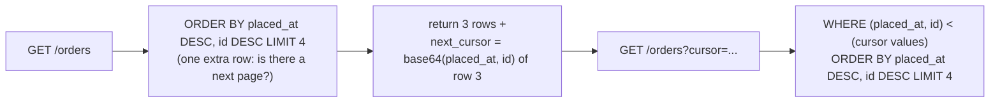

# 03 · API design: cursors, idempotency keys, errors, rate limits

## 1. In one sentence

A good JSON API stays correct when the data changes during paging (**keyset cursors** instead of `OFFSET`), when clients retry (**idempotency keys** so a repeated `POST` does not create a second order), when things fail (**consistent RFC 9457 error bodies**) and when a client sends too much (**rate limits** with HTTP 429).

## 2. Why it exists

Mobile apps, partner integrations and AI agents (Steps 7-8) call your API over unreliable networks. They **retry** on timeouts, page through lists **while** new rows arrive, and need errors they can parse. Each of these has a well-known failure:

- `OFFSET` pagination skips or repeats rows when rows are inserted, and gets slower with every page (`OFFSET 100000` still reads 100,000 rows).
- A `POST` that timed out on the client may have **succeeded** on the server; retrying creates a duplicate order and a double charge.
- Every controller inventing its own error JSON makes clients fragile.
- One misbehaving client can exhaust your Puma threads and database connections.

## 3. Rails analogy

- Keyset pagination is what `find_each` does internally (`WHERE id > last_id ORDER BY id LIMIT 1000`), exposed to clients as an opaque cursor.
- An idempotency key is like a **unique index on a form submission token**: the second submit finds the first result instead of inserting again.
- `rate_limit` (Rails 7.2+) is a `before_action` that counts requests in your **cache store**.
- Problem details are one `rescue_from` concern shared by all API controllers.

## 4. How it works

### Keyset (cursor) pagination



- The sort must be **unique**: add `id` as a tie-breaker.
- An index on `(placed_at, id)` makes every page as fast as the first (an Index Scan that starts at the cursor).
- The cursor is **opaque** (base64 JSON) so you can change its contents later.
- You lose "jump to page 37" and total counts; for APIs that is usually fine.

### Idempotency keys

The client generates a unique key (a UUID) per logical operation and sends it in an `Idempotency-Key` header (an IETF draft standard, used by Stripe and others). The server:

1. Inserts the key into a table with a **unique index** (the database decides who is first, even under concurrency).
2. **Locks** that row, so a second request with the same key arriving at the same moment waits.
3. If a stored response exists, **replays** it. If the same key comes with a **different body**, rejects it (422).
4. Otherwise does the work and stores the response **in the same transaction**.

Keys expire after a while (for example 24 hours; delete old rows with a recurring job).

### RFC 9457 problem details

Content type `application/problem+json`, members `type` (a URI identifying the problem type; `about:blank` when you have none), `title`, `status`, `detail`, `instance`, plus your own extension members (for example `errors` for field errors).

### Status codes that matter

| Code | Use |
|---|---|
| 201 Created | Resource created (return it, plus `Location`) |
| 202 Accepted | Work queued, not done yet |
| 400 Bad Request | Malformed request (missing header, bad JSON) |
| 404 Not Found | No such resource (also for "exists but not yours", to avoid leaking) |
| 409 Conflict | State conflict (for example an edit based on an old version) |
| 422 Unprocessable Content | Valid JSON, but fails validation |
| 429 Too Many Requests | Rate limited (add `Retry-After`) |

### Rate limiting in Rails

`rate_limit to: 5, within: 1.minute, only: :create` counts requests per `request.remote_ip` (change with `by:`) in the controller's cache store (change with `store:`), and when exceeded raises `ActionController::TooManyRequests`, which Rails maps to 429 (change with `with:`). The counter lives in the cache: with `:memory_store` each Puma process counts separately; use a shared store (Solid Cache, Redis) in production. For protection against abusive traffic before it reaches Rails, add a proxy-level limit too (`rack-attack`, a CDN or load balancer).

### Versioning and deprecation

URL versioning (`/api/v1/`) is simple and visible; header versioning keeps URLs stable but is harder to test in a browser. Either way: only **add** fields within a version, announce removals with a `Deprecation`/`Sunset` header and a date, and watch logs for clients still using the old version.

## 5. Minimal working example

Tested in `shop-lab` (Rails 8.1.4), with routes `namespace :api { namespace :v1 { resources :orders, only: [:index, :create] } }` and a table:

```ruby
create_table :idempotency_keys do |t|
  t.string :key, null: false, index: { unique: true }
  t.string :request_fingerprint, null: false
  t.integer :response_status
  t.jsonb :response_body
  t.timestamps
end
# app/models/idempotency_key.rb: class IdempotencyKey < ApplicationRecord; end
```

`app/controllers/concerns/problem_details.rb`:

```ruby
# Renders errors as RFC 9457 problem details (application/problem+json).
module ProblemDetails
  extend ActiveSupport::Concern

  included do
    rescue_from ActiveRecord::RecordNotFound do |e|
      render_problem(status: 404, title: "Not found", detail: e.message)
    end
    rescue_from ActiveRecord::RecordInvalid do |e|
      render_problem(status: 422, title: "Validation failed", detail: e.record.errors.full_messages.to_sentence,
                     errors: e.record.errors.to_hash)
    end
    rescue_from ActionController::TooManyRequests do
      render_problem(status: 429, title: "Too many requests", detail: "Try again in a minute.")
    end
  end

  private

  def render_problem(status:, title:, detail: nil, type: "about:blank", **extra)
    body = { type:, title:, status:, detail:, instance: request.path }.compact.merge(extra)
    render json: body, status:, content_type: "application/problem+json"
  end
end
```

`app/controllers/api/v1/orders_controller.rb` (`PAGE_SIZE = 3` only to make paging visible):

```ruby
module Api
  module V1
    class OrdersController < ApplicationController
      include ProblemDetails
      rate_limit to: 5, within: 1.minute, only: :create

      PAGE_SIZE = 3

      # GET /api/v1/orders?cursor=...
      def index
        scope = Order.order(placed_at: :desc, id: :desc).limit(PAGE_SIZE + 1)
        if params[:cursor].present?
          placed_at, id = decode_cursor(params[:cursor])
          scope = scope.where("(placed_at, id) < (?, ?)", placed_at, id)
        end
        orders = scope.to_a
        next_cursor = encode_cursor(orders[PAGE_SIZE - 1]) if orders.size > PAGE_SIZE
        render json: { data: orders.first(PAGE_SIZE).map { |o| o.slice(:id, :status, :placed_at) }, next_cursor: }
      end

      # POST /api/v1/orders  (header: Idempotency-Key)
      def create
        key = request.headers["Idempotency-Key"]
        return render_problem(status: 400, title: "Idempotency-Key header required") if key.blank?

        fingerprint = Digest::SHA256.hexdigest(request.raw_post)
        IdempotencyKey.transaction do
          record = IdempotencyKey.create_or_find_by!(key:) { |r| r.request_fingerprint = fingerprint }
          record.lock! # a concurrent request with the same key waits here until we commit
          if record.request_fingerprint != fingerprint
            return render_problem(status: 422, title: "Idempotency-Key reused with a different request")
          end
          return render json: record.response_body, status: record.response_status if record.response_status

          order = Order.create!(order_params.merge(status: "pending", placed_at: Time.current))
          body = order.slice(:id, :status, :customer_id, :total_cents)
          record.update!(response_status: 201, response_body: body)
          render json: body, status: :created
        end
      end

      private

      def order_params = params.expect(order: [:customer_id, :total_cents])
      def encode_cursor(o) = Base64.urlsafe_encode64([o.placed_at.iso8601(6), o.id].to_json, padding: false)
      def decode_cursor(c) = JSON.parse(Base64.urlsafe_decode64(c))
    end
  end
end
```

Exercise it (`bin/rails runner` with `ActionDispatch::Integration::Session`, or `curl`):

```bash
curl -s localhost:3000/api/v1/orders
curl -s "localhost:3000/api/v1/orders?cursor=<next_cursor from the first response>"
curl -s -X POST localhost:3000/api/v1/orders -H 'Content-Type: application/json' \
     -H 'Idempotency-Key: 3f1c-demo-key' -d '{"order":{"customer_id":1,"total_cents":2500}}'
```

Real results:

```
page 1: [158427, 196647, 179988] next_cursor=WyIyMDI2LTA5LTI4VDEwOjAzOjA2LjA1MzUwNloiLDE3OTk4OF0
page 2: [147511, 115848, 159268]
POST -> 201 {"id":200012,"status":"pending","customer_id":1,"total_cents":2500}
POST -> 201 {"id":200012,"status":"pending","customer_id":1,"total_cents":2500}          <- replayed, no second order
POST (same key, different body) -> 422 application/problem+json {"type":"about:blank","title":"Idempotency-Key reused with a different request","status":422,"instance":"/api/v1/orders"}
POST (invalid) -> 422 {"type":"about:blank","title":"Validation failed","status":422,"detail":"Customer must exist","instance":"/api/v1/orders","errors":{"customer":["must exist"]}}
POST (over 5 in a minute) -> 429 {"type":"about:blank","title":"Too many requests","status":429,"detail":"Try again in a minute.","instance":"/api/v1/orders"}
concurrent POST -> 201 {"id":200014,"status":"pending","customer_id":1,"total_cents":2500}
concurrent POST -> 201 {"id":200014,"status":"pending","customer_id":1,"total_cents":2500}   <- two threads, same key, one order
```

The cursor decodes to `["2026-09-28T10:03:06.053506Z",179988]`: the sort key of the last row on page 1. Because a failed validation raises inside the transaction, the idempotency row is rolled back too, so the client can fix the request and retry with the same key.

## 6. Key terms

- **Offset vs keyset (cursor) pagination**, **tie-breaker column**, **opaque cursor**.
- **Idempotency key**, **request fingerprint**, **replay**.
- **`create_or_find_by!`**: insert first, and on a unique violation find the existing row (race-safe, unlike `find_or_create_by`).
- **Problem details** (`application/problem+json`).
- **`rate_limit`**, **429**, **`Retry-After`**.
- **Versioning**, **`Deprecation` / `Sunset` headers**.

## 7. Common mistakes

- **Sorting a cursor by a non-unique column** (`placed_at` alone): rows with equal timestamps are skipped or repeated.
- **Idempotency via `find_or_create_by`** (check then insert): races under concurrency.
- **Storing the idempotent response outside the transaction** that did the work.
- **Serialising Active Record objects directly** (`render json: order`), leaking every column and freezing your schema.
- **A different error format per controller.**
- **Per-process rate limit counters** (`:memory_store`) behind several Puma workers.
- **Returning 500 for validation errors** or 200 with `{"error": ...}`.

## 8. Check your understanding

1. Why does offset pagination give wrong results when rows are inserted during paging? How does a keyset cursor fix it?
2. Two requests with the same idempotency key arrive at the same moment. How does this implementation avoid creating two orders?
3. Why does the server compare a request fingerprint, and what should happen on a mismatch?
4. Which status code for: missing `Idempotency-Key`, a customer that does not exist, too many requests?
5. Where does `rate_limit` keep its counters, and what does that mean with 4 Puma workers and `:memory_store`?

<details>
<summary>Answers</summary>

1. `OFFSET 20` means "skip 20 rows of the current result"; if a new row is inserted at the top between requests, every row shifts and one is shown twice (or, with deletes, skipped). A keyset cursor says "rows after this exact sort key", which does not move when other rows are added.
2. The unique index lets only one insert succeed; `create_or_find_by!` makes the second find that row, and `lock!` makes it wait until the first transaction commits, so it then sees the stored response and replays it.
3. To catch a client bug that reuses a key for a different operation; replaying the old response would silently ignore the new request, so reject it (422).
4. 400, 422 (validation failed), 429.
5. In the controller's cache store. With `:memory_store` each worker process has its own counters, so the effective limit is 4 times higher and inconsistent; use a shared store such as Solid Cache.

</details>

## 9. Go deeper (optional)

- [RFC 9457: Problem Details for HTTP APIs](https://www.rfc-editor.org/rfc/rfc9457).
- IETF draft: [The Idempotency-Key HTTP Header Field](https://datatracker.ietf.org/doc/draft-ietf-httpapi-idempotency-key-header/) and Stripe's [idempotent requests](https://docs.stripe.com/api/idempotent_requests) documentation.
- Rails API docs: [`ActionController::RateLimiting`](https://api.rubyonrails.org/classes/ActionController/RateLimiting/ClassMethods.html).
