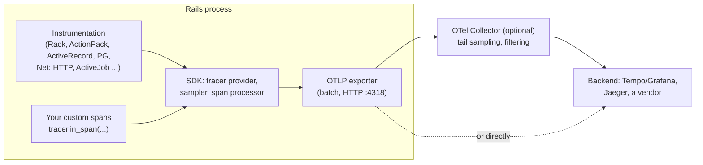

# 04 · OpenTelemetry for Rails

<!-- nav:top -->
[Course home](../../README.md) › [Step 3 plan](../../steps/03-architecture-system-design.md) › [Step 3 lessons](00-start-here.md) · [Glossary](../../GLOSSARY.md)
<!-- nav:end -->

## 1. In one sentence

**OpenTelemetry** (OTel) is the vendor-neutral standard for telemetry: its Ruby SDK records a **trace** for each request, made of timed **spans** (HTTP, controller, SQL, outgoing HTTP, jobs) linked by a shared `trace_id`, and **exports** them over **OTLP** to any backend (Grafana, Jaeger, Honeycomb, Datadog), so you can see where time goes in production and follow one request into its background jobs.

## 2. Why it exists

Logs tell you *that* something happened; metrics tell you *how often* and *how slow on average*. Neither answers "why was **this** checkout 4 seconds slow?". A trace does: it shows the 115 SQL queries, the 3-second call to the payment API and the job it enqueued, in one timeline.

Before OTel, every vendor had its own agent and format, and switching vendors meant re-instrumenting. OTel standardises the API, the data model and the wire protocol, so you instrument once.

## 3. Rails analogy

You have seen a trace already: the Rails development log (`Completed 200 OK in 182ms (ActiveRecord: 120.3ms)`) and tools like rack-mini-profiler or Skylight show per-request breakdowns. OTel produces the same breakdown in a standard format, for every request in production, across processes. Under the hood the Rails instrumentation subscribes to the same `ActiveSupport::Notifications` events you met in lesson 02.

## 4. How it works



### The data model

| Concept | Meaning | Example |
|---|---|---|
| **Trace** | One end-to-end operation, identified by a 16-byte `trace_id` | One checkout |
| **Span** | One timed step with a name, start/end, status, parent span | `GET /products`, `SELECT shop_lab_development` |
| **Attributes** | Key-values on a span, named by **semantic conventions** | `http.route`, `db.system`, `order.id` |
| **Span kind** | server, client, producer, consumer, internal | `server` for an incoming request |
| **Context propagation** | Carrying the current trace across boundaries (HTTP headers `traceparent`, job metadata) | Web request → Active Job |
| **Resource** | Attributes of the process | `service.name = shop-lab` |

### Rails specifics (tested with opentelemetry-sdk 1.13, instrumentation-all 0.96)

- Configure in **`config/initializers/opentelemetry.rb`**. `c.use_all` installs Railties/middleware hooks, which must happen during boot; calling it later (for example in a `rails runner` script) failed in testing with `Instrumentation: OpenTelemetry::Instrumentation::ActionPack unhandled exception during install`.
- **Jobs:** the Active Job instrumentation's `propagation_style` defaults to **`:link`**: the job gets its **own trace**, linked to the enqueuing span. To see web → job as **one trace**, set it to `:child`.
- **Exporter:** with `opentelemetry-exporter-otlp` installed, the SDK uses OTLP by default (`OTEL_TRACES_EXPORTER` defaults to `otlp`) and reads `OTEL_EXPORTER_OTLP_ENDPOINT`.
- **Sampling:** standard env vars work, for example `OTEL_TRACES_SAMPLER=parentbased_traceidratio` and `OTEL_TRACES_SAMPLER_ARG=0.1` keeps 10% of traces (decided at the start: **head sampling**). Keeping *all* errors and slow requests needs **tail sampling**, which is done in an OTel Collector (the `tail_sampling` processor) after the trace is complete.

### Logs and metrics

- **Log correlation:** put `trace_id` and `span_id` in every log line (JSON logs), so a log search leads to the trace and a trace leads to its logs.
- **RED metrics:** Rate, Errors, Duration per endpoint. Many backends derive them from spans (for example Tempo's span metrics in the `grafana/otel-lgtm` image; verify for your backend). An **SLO** turns them into a target: "99% of `POST /api/v1/orders` under 300 ms over 28 days".
- **Cardinality:** span attributes can hold ids (`order.id`); **metric labels must not** (one time series per distinct value).

## 5. Minimal working example

### Part A: install and configure

```bash
bundle add opentelemetry-sdk opentelemetry-exporter-otlp opentelemetry-instrumentation-all
docker run --rm -p 3001:3000 -p 4317:4317 -p 4318:4318 grafana/otel-lgtm   # Grafana on :3001 (Rails uses :3000)
```

```ruby
# config/initializers/opentelemetry.rb
require "opentelemetry/sdk"
require "opentelemetry/exporter/otlp"
require "opentelemetry/instrumentation/all"

OpenTelemetry::SDK.configure do |c|
  c.service_name = "shop-lab"
  c.use_all("OpenTelemetry::Instrumentation::ActiveJob" => { propagation_style: :child })
end
```

```bash
OTEL_EXPORTER_OTLP_ENDPOINT=http://localhost:4318 bin/rails server
curl -s localhost:3000/products > /dev/null
# Grafana at http://localhost:3001 → Explore → Tempo → search service.name = shop-lab
```

To print spans without a backend (what this lesson did), add a processor with an in-memory exporter in the same `configure` block:

```ruby
OTEL_DEMO_EXPORTER = OpenTelemetry::SDK::Trace::Export::InMemorySpanExporter.new
# inside configure:
c.add_span_processor(OpenTelemetry::SDK::Trace::Export::SimpleSpanProcessor.new(OTEL_DEMO_EXPORTER))
```

### Part B: what the automatic spans show

Real output for two `shop-lab` requests (root spans with their first children):

```
GET /slow_io                                  120.66 ms  {"http.request.method"=>"GET", "http.route"=>"/slow_io", "http.response.status_code"=>200, "code.function"=>"show", ...}
GET /products                                 182.47 ms  {"http.request.method"=>"GET", "http.route"=>"/products", "http.response.status_code"=>200, "code.function"=>"index", ...}
  connect                                        22.48 ms  {"db.system"=>"postgresql", "net.peer.name"=>"localhost"}
  SET shop_lab_development                        0.20 ms  {"db.system"=>"postgresql", ...}
  SET shop_lab_development                        0.17 ms  {"db.system"=>"postgresql", ...}
  ... and 115 more child spans
```

The N+1 from Step 2 is visible at a glance: over a hundred SQL spans under one request.

### Part C: a custom span, a job in the same trace, and log correlation

```ruby
# app/jobs/reserve_stock_job.rb
class ReserveStockJob < ApplicationJob
  TRACER = OpenTelemetry.tracer_provider.tracer("shop-lab")

  def perform(order_id)
    TRACER.in_span("reserve_stock", attributes: { "order.id" => order_id, "event.type" => "order.placed" }) do
      span = OpenTelemetry::Trace.current_span
      Rails.logger.info({ msg: "reserving stock", order_id:, trace_id: span.context.hex_trace_id,
                          span_id: span.context.hex_span_id }.to_json)
      LineItem.where(order_id: order_id).sum(:quantity)
    end
  end
end
```

Enqueued inside a request span (`POST /api/v1/orders`), with `propagation_style: :child`, real output (trace and span ids shortened):

```
LOG {"msg":"reserving stock","order_id":1,"trace_id":"9e3b6e4d365b171e0813b14423382f05","span_id":"df22a500c688574e"}
trace=9e3b6e4d span=ccc71d00 parent=00000000  POST /api/v1/orders
trace=9e3b6e4d span=7f019dcb parent=ccc71d00  Order query
trace=9e3b6e4d span=62f680b3 parent=ccc71d00  default publish              {"messaging.system"=>"active_job"}
trace=9e3b6e4d span=ee2e78ec parent=62f680b3  default process              {"messaging.system"=>"active_job"}
trace=9e3b6e4d span=df22a500 parent=ee2e78ec  reserve_stock                {"order.id"=>1}
trace=9e3b6e4d span=55a0f848 parent=df22a500  PREPARE shop_lab_development {"db.system"=>"postgresql"}
trace=9e3b6e4d span=2041d2e1 parent=df22a500  EXECUTE shop_lab_development {"db.system"=>"postgresql"}
```

One `trace_id` from the request through **publish** (enqueue), **process** (the job) and the custom `reserve_stock` span down to its SQL; the log line carries the same ids. Span names like `default publish` come from the default `span_naming: :queue` (the queue name); `span_naming: :job_class` names them after the job class.

For request logs, add the ids in `ApplicationController`:

```ruby
around_action do |_, action|
  ctx = OpenTelemetry::Trace.current_span.context
  logger.tagged("trace_id=#{ctx.hex_trace_id}", "span_id=#{ctx.hex_span_id}") { action.call }
end
```

## 6. Key terms

- **Trace, span, parent span, attributes, span kind, resource**.
- **Semantic conventions**: standard attribute names (`http.route`, `db.system`).
- **Context propagation**, **`traceparent`** header, **span link** vs **child span**.
- **Exporter, OTLP, collector, backend**.
- **Head sampling / tail sampling**.
- **Log correlation** (`trace_id` in logs).
- **RED metrics, SLO, error budget**, **cardinality**.

## 7. Common mistakes

- **Configuring OTel outside an initializer**, so Rails hooks are never installed.
- **Expecting jobs in the same trace** with the default `:link` propagation.
- **Sampling 100% in production** without looking at cost; or sampling 1% at the head and losing the rare errors (use tail sampling for those).
- **Putting user ids or order ids in metric labels** (cardinality explosion); they belong on spans.
- **Sensitive data in attributes** (SQL with values, emails, tokens); check what the instrumentation records and use its obfuscation options.
- **No log correlation**, so people still grep logs by timestamp.

## 8. Check your understanding

1. What is the difference between a trace, a span and a log line, and when is each the best tool?
2. Your job spans appear in a separate trace from the request that enqueued them. Why, and how do you change it?
3. Tracing every request is too expensive. How do you sample while still catching slow and failed requests?
4. Why may `order.id` be a span attribute but not a metric label?
5. Write an SLO for `POST /api/v1/orders` and say which RED metric it uses.

<details>
<summary>Answers</summary>

1. A trace is one request's whole journey (use it to see *where* time went), a span is one step in it (use it to see *which* step), a log line is a discrete message with detail (use it for *what exactly* happened, error messages, decisions). Correlated by `trace_id`.
2. The Active Job instrumentation defaults to `propagation_style: :link`, which starts a new trace linked to the enqueuing span; set `:child` to keep one trace.
3. Keep a fraction at the head for general traffic, and use tail sampling in a Collector with policies that keep every trace with an error or with duration above a threshold.
4. Spans are stored individually, so a unique value per span is fine; metrics are aggregated per unique label combination, so an id creates one time series per order (cardinality explosion).
5. For example: "99% of `POST /api/v1/orders` requests complete in under 300 ms, measured over 28 days" (Duration), possibly with "and 99.9% succeed" (Errors).

</details>

## 9. Go deeper (optional)

- [OpenTelemetry Ruby docs](https://opentelemetry.io/docs/languages/ruby/) (getting started, instrumentation, exporters, sampling).
- [opentelemetry-ruby-contrib](https://github.com/open-telemetry/opentelemetry-ruby-contrib) (each instrumentation's README lists its options, such as `propagation_style`).
- Google SRE book, chapter "Service Level Objectives" ([sre.google/sre-book/service-level-objectives](https://sre.google/sre-book/service-level-objectives/)).

<!-- nav:bottom -->

---

[← 03 · API design: cursors, idempotency keys, errors, rate limits](03-api-design.md) · [Step 3 lessons](00-start-here.md) · [05 · ADRs and one-page design docs →](05-adrs-and-design-docs.md)
<!-- nav:end -->
