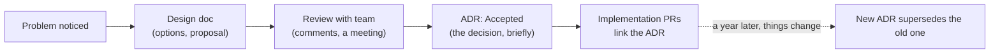

# 05 · ADRs and one-page design docs

<!-- nav:top -->
[Course home](../../README.md) › [Step 3 plan](../../steps/03-architecture-system-design.md) › [Step 3 lessons](00-start-here.md) · [Glossary](../../GLOSSARY.md)
<!-- nav:end -->

## 1. In one sentence

An **Architecture Decision Record (ADR)** is a short, numbered Markdown file that records **one** significant technical decision with its context, the options considered and the consequences, and a **one-page design doc** proposes a change before you build it, so that decisions can be reviewed now and understood a year later.

## 2. Why it exists

Six months after a decision, nobody remembers *why* the team chose Packwerk over engines, or why events go through an outbox. New engineers either repeat old debates or undo good decisions by accident. Code shows **what** was decided; only writing shows **why** and **what else was considered**.

For your career, ADRs and design docs are the most visible proof of senior-level thinking: they show you can weigh trade-offs, not just implement.

## 3. Rails analogy

- An ADR is like a **migration file for decisions**: numbered, immutable once accepted, and superseded by a newer one rather than edited (`0005` supersedes `0001`, just as a new migration changes an old table).
- A design doc is like a **PR description written before the code**: the problem, the approach, the risks, how you will know it works.
- Rails itself works this way: large changes start as discussions and PRs explaining the motivation before the code lands.

## 4. How it works



### ADR format (after Michael Nygard; keep it to one page)

| Section | Content |
|---|---|
| Title | `0001. Use a modular monolith with Packwerk` (numbered, a decision stated as a phrase) |
| Status | Proposed / Accepted / Superseded by 0005 / Deprecated |
| Date | When it was accepted |
| Context | The forces: the problem, constraints, facts (with numbers) |
| Options considered | 2-4 options with honest pros and cons |
| Decision | "We will ..." in active voice |
| Consequences | What becomes easier, what becomes harder, what we must now do |

Store them in the repository (`docs/adr/`), reviewed in PRs like code. MADR is a popular, slightly more structured template.

### What deserves an ADR

A decision that is **hard to reverse**, **affects several people or teams**, or that someone will **question later**: architecture style, a new datastore, event delivery, API conventions, a major dependency. Not: naming, small refactors.

### One-page design doc

| Section | Questions it answers |
|---|---|
| Problem and goal | What is wrong, for whom, how do we measure success? |
| Non-goals | What we are deliberately not doing |
| Proposal | The design, with one diagram |
| Alternatives | What else we considered and why not |
| Risks and rollout | What could go wrong; how we ship safely (flags, backfills, rollback) |
| Open questions | What we need input on |

## 5. Minimal working example

```bash
mkdir -p docs/adr
```

`docs/adr/0001-modular-monolith-with-packwerk.md`:

```markdown
# 0001. Use a modular monolith with Packwerk

- Status: Accepted
- Date: 2026-10-12

## Context

shop-lab has 5 models and will grow to Catalog, Ordering, Billing and Customers.
Today every model can reference every other; `bin/packwerk check` on a trial branch
found 7 cross-context references, including a Catalog ↔ Ordering cycle
(`Product has_many :line_items`). We deploy as one app with one database and
have one team; we do not need independent deploys.

## Options considered

1. **Keep a plain Rails app.** No cost now; boundaries erode as the app grows.
2. **Rails engines per context.** Strong isolation; more boilerplate (gemspecs, mounting,
   separate test setup) and slower to change boundaries.
3. **Packwerk packs.** Static checks in CI, same app and autoloader, cheap to move code;
   enforcement is static only (misses `constantize`).
4. **Separate services.** Independent deploys and scaling; network calls, distributed
   data and operational cost we cannot justify for one team.

## Decision

We will split the app into packs (`packs/catalog`, `packs/ordering`, later
`packs/billing`) with `enforce_dependencies` and privacy checks, run
`bin/packwerk check` in CI, and record existing violations in `package_todo.yml`.

## Consequences

- New cross-context calls must go through a pack's public API (`app/public/`).
- Existing violations are visible and must shrink; we review `package_todo.yml` monthly.
- Moving files changes paths in blame history; we move one context per PR.
- If a context later needs independent scaling, its public API is the seam for extraction.
```

Link the ADR from the PR that introduces Packwerk, and from your weekly update.

## 6. Key terms

- **ADR**, **status** (proposed, accepted, superseded, deprecated), **supersede**.
- **Context / decision / consequences**.
- **MADR**: Markdown Architectural Decision Records, a common template.
- **Design doc**, **non-goals**, **rollout plan**.

## 7. Common mistakes

- **Writing the ADR after the fact as a justification**, with no real alternatives.
- **Editing old ADRs** when the decision changes, which erases history; write a new one that supersedes it.
- **ADRs without context or numbers** ("Packwerk is better"): useless in a year.
- **Design docs that are 20 pages long**; one page gets read and reviewed.
- **Only listing benefits**; the consequences section should include costs.
- **Keeping ADRs in a wiki nobody updates** instead of next to the code.

## 8. Check your understanding

1. What makes an ADR useful a year later, and what makes it useless?
2. The team replaces the outbox with a managed event bus. What happens to ADR-0002?
3. Which of these deserve an ADR: switching from Sidekiq to Solid Queue; renaming a service object; adopting RFC 9457 errors for all APIs?
4. What is the difference between a design doc and an ADR?
5. Why include "non-goals" in a design doc?

<details>
<summary>Answers</summary>

1. Useful: the context with facts, the real alternatives and the consequences, so a reader can tell whether the reasons still hold. Useless: only the decision, no context, or written as marketing.
2. It stays, with status "Superseded by 00NN"; a new ADR records the new decision and why.
3. Solid Queue (infrastructure, hard to reverse) and RFC 9457 (a convention for many people) yes; the rename no.
4. A design doc explores a problem and proposes a solution before building, and invites discussion; an ADR records the decision that came out of it, briefly and permanently.
5. To stop scope creep and focus review on what you are actually proposing.

</details>

## 9. Go deeper (optional)

- Michael Nygard, ["Documenting Architecture Decisions"](https://cognitect.com/blog/2011/11/15/documenting-architecture-decisions) (the original ADR post).
- [adr.github.io](https://adr.github.io/) (templates including MADR, and tools).
- Will Larson, *Staff Engineer*, the chapters on writing design documents and engineering strategy.

<!-- nav:bottom -->

---

[← 04 · OpenTelemetry for Rails](04-opentelemetry.md) · [Step 3 lessons](00-start-here.md) · [Back to the Step 3 plan →](../../steps/03-architecture-system-design.md)
<!-- nav:end -->
