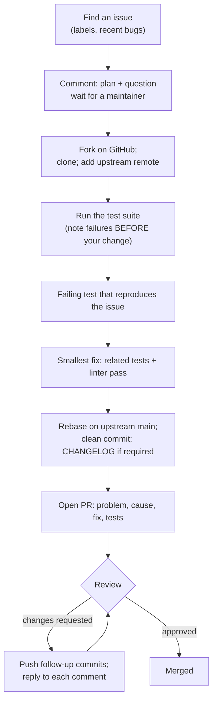

# 01 · The contribution workflow: fork, test suite, PR, review

## 1. In one sentence

Contributing to an open-source project means: agree with maintainers that a change is wanted, **fork** the repository, get its **test suite running** locally, write a **failing test** that shows the problem, make the smallest fix, open a **PR** that is easy to review, and respond to **review** until it is merged.

## 2. Why it exists

Maintainers are few and busy; contributors are many. The workflow exists so that maintainers can accept changes from strangers **safely and cheaply**: a test proves the bug and the fix, a clear description saves them reading time, and following the project's conventions avoids back-and-forth. Most PRs that stall do so because they skipped one of these steps, not because the code was wrong.

## 3. Rails analogy

It is the same PR workflow you use at work, with three differences:

- **You do not know the codebase or the reviewers.** Read `CONTRIBUTING.md`, recent merged PRs and the CI config the way you would read an onboarding doc.
- **You push to your fork, not to the main repository.** Like a feature branch, but in your own copy.
- **Nobody is obliged to review.** Scope, clarity and patience matter more than at work.

## 4. How it works



### Issue fit checks

A good first issue for you this week: **reproducible** (clear steps), **scoped** (touches a few files), **wanted** (a maintainer confirmed or labelled it), **recent** (the code has not moved on), **not claimed** (nobody said "I'm on it" in the last few weeks), and ideally **in code you used** (Solid Queue, Kamal, Rails internals from Steps 1-3).

### Git setup for a fork

```bash
# after clicking "Fork" on GitHub
git clone git@github.com:YOUR-USER/solid_queue.git
cd solid_queue
git remote add upstream https://github.com/rails/solid_queue.git
git fetch upstream
git switch -c fix-nil-totals upstream/main     # branch from the latest upstream code

# later, before opening the PR or when upstream moved on:
git fetch upstream
git rebase upstream/main
git push --force-with-lease origin fix-nil-totals
```

`origin` is your fork (you push there); `upstream` is the original (you only fetch from it).

### Finding your way in unfamiliar code

| Tool | Use |
|---|---|
| `git grep "claim"` | Find where a word or method appears |
| `git log -S "SKIP LOCKED" --oneline` | Find the commits that added or removed that text |
| `git blame -L 30,60 path/to/file.rb` | Who changed these lines, and in which PR (read it) |
| `binding.b` (the `debug` gem) | Stop inside a test and inspect state |
| Last 3 merged PRs touching the file | How maintainers like changes shaped, tested and described |
| Rails' `guides/bug_report_templates/` | Single-file scripts (`active_record.rb`, `action_controller.rb`, ...) that load Rails inline with an in-memory database: the fastest way to reproduce a Rails bug and paste it into an issue |

### A PR description that gets reviewed

```markdown
Fixes #1234

**Problem**: `Report.export(format: :csv)` raises `NoMethodError` when a row has a `nil` total,
e.g. `Report.export(rows: [{ total: nil }], format: :csv)`. [One or two sentences, a concrete example.]

**Cause**: `CsvFormatter#format_money` calls `round` on the value without a nil check (lib/report/csv_formatter.rb:42).

**Fix**: return an empty cell for `nil`, matching what the JSON formatter already does.

**Tests**: added `test "exports nil totals as empty cells"`; it fails on main and passes with this change.
Ran the formatter tests and the linter locally.

**Notes**: the XLSX formatter has the same pattern; happy to fix it in a follow-up PR if wanted.
```

(The gem and bug are **invented** to show the shape of a good description.)

### Handling review

- Reply to **every** comment: "Done in abc123", or a short, evidence-based reason if you disagree ("I kept X because Y; happy to change if you prefer").
- Push follow-up commits unless the project asks you to squash; squash at the end if asked.
- Maintainers may rewrite your approach entirely. That is normal; the merged result still counts, and you learn the project's taste.
- If there is no response after 1-2 weeks, one polite ping ("Is there anything I can do to help move this forward?") is fine. Then move on to another contribution.

## 5. Minimal working example: running a real project's test suite

Worked example: Solid Queue at commit `73602fe` (31 Aug 2026), on the machine used to test this course (no Docker available).

```bash
git clone https://github.com/rails/solid_queue.git && cd solid_queue
cat Rakefile bin/setup test/dummy/config/database.yml    # how does this project run its tests?
```

Some projects also ship a **devcontainer** (`.devcontainer/devcontainer.json`): a Docker-based development environment that VS Code or GitHub Codespaces can start with every service the tests need; Rails has one. Solid Queue uses `docker compose` instead.

What reading those files showed: tests run against **three databases**, selected with `TARGET_DB=mysql|postgres|sqlite`; `bin/setup` starts MySQL and Postgres with `docker compose`, runs `bundle` and `rails db:reset`; `rake test` loops over all three. The gemspec lists `mysql2`, `pg` and `sqlite3` as development dependencies, so `bundle install` needs the **client libraries** for all of them even if you only test one:

```
$ bundle install
Installing mysql2 0.5.6 with native extensions
Gem::Ext::BuildError: ERROR: Failed to build gem native extension.
mysql client is missing. You may need to 'sudo apt-get install libmariadb-dev', ...
```

Fix (Ubuntu): `sudo apt-get install libmariadb-dev libpq-dev` (on macOS: `brew install mysql-client libpq` and follow the printed instructions). Then the fastest path without Docker is SQLite:

```bash
bundle install
TARGET_DB=sqlite bin/rails db:reset
TARGET_DB=sqlite bin/rails test test/models/solid_queue/ready_execution_test.rb      # one file
TARGET_DB=sqlite bin/rails test test/models/solid_queue/ready_execution_test.rb:12   # one test, by line
TARGET_DB=sqlite bin/rails test                                                      # everything
```

Real output:

```
# one file
19 runs, 109 assertions, 0 failures, 0 errors, 0 skips          (2.4 s)

# one test
1 runs, 5 assertions, 0 failures, 0 errors, 0 skips

# full suite, unmodified main
Finished in 222.846464s, 1.6155 runs/s, 7.8485 assertions/s.
360 runs, 1749 assertions, 4 failures, 1 errors, 10 skips       (3 min 45 s)
```

The 5 problems were all in `test/integration/puma/` (`PluginForkTest`, `PluginAsyncTest`), on a clone with **no changes**: they depend on starting Puma processes, which did not work in that sandbox. This is the most important habit of the day: **run the suite before you change anything, and write down what already fails**, so you do not waste an evening debugging failures that are not yours. Then iterate on the one test file you care about (2 seconds instead of 4 minutes), and let CI run the rest.

Write this into your `contribution-notes.md`: setup commands, suite time, how to run one test, and the baseline failures.

## 6. Key terms

- **Upstream / fork / `origin` / `upstream` remote**.
- **Devcontainer**: a container definition for a ready-made development environment.
- **Bug report template**: a single-file script that reproduces a bug with Rails loaded inline.
- **Issue fit**: reproducible, scoped, wanted, recent, unclaimed.
- **Failing test first**, **reproduction**.
- **Baseline failures** (flaky or environmental).
- **Rebase on upstream**, **`--force-with-lease`**.
- **CHANGELOG entry**, **squash**, **CLA / DCO**, **CODEOWNERS**.

## 7. Common mistakes

- **Starting work without a maintainer's go-ahead** on anything bigger than a typo.
- **Opening a PR from your fork's `main`** instead of a topic branch; later work gets mixed in.
- **Not running the suite before changing code**, then chasing failures you did not cause.
- **Big PRs** that fix the issue *and* refactor nearby code.
- **Ignoring the project's style** (RuboCop/Standard config, commit message format, changelog rules).
- **Defensive replies to review.** Ask questions, show evidence, and accept the maintainer's call on taste.
- **Force-pushing without `--force-with-lease`**, which can overwrite commits a maintainer pushed to your branch.

## 8. Check your understanding

1. Why do you add an `upstream` remote, and which remote do you push to?
2. The full suite shows 5 failures on your machine before you change anything. What do you do?
3. What four things should every PR description state?
4. A reviewer suggests a different approach you think is worse. How do you respond?
5. Why write the failing test before the fix?

<details>
<summary>Answers</summary>

1. To fetch the latest code from the original project and rebase onto it; you push to `origin` (your fork) and open the PR from there.
2. Record them as the baseline (which tests, the error), check whether they depend on your environment (services, processes, OS), and if they are unrelated to your area, work with the relevant test files and rely on CI; mention it in the PR if relevant.
3. The problem, the cause, the fix, and how it was tested (plus any trade-offs or open questions).
4. Explain your reasoning briefly with evidence (a benchmark, a test case, a link), then accept the maintainer's decision; it is their project.
5. It proves the bug exists and that your change fixes it, and it stops the bug from coming back; reviewers can check it fails on main.

</details>

## 9. Go deeper (optional)

- Rails Guides: [Contributing to Ruby on Rails](https://guides.rubyonrails.org/contributing_to_ruby_on_rails.html) (setup, bug report templates, the PR process).
- GitHub Docs: [Contributing to a project](https://docs.github.com/en/get-started/exploring-projects-on-github/contributing-to-a-project) (fork and pull request flow).
- The `CONTRIBUTING.md` of each project on your shortlist.
