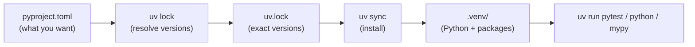

# 01 · Tooling: uv, ruff and mypy

## 1. In one sentence

**uv** installs Python and manages each project's dependencies and virtual environment (like rbenv + Bundler), **ruff** lints and formats your code (like RuboCop), and **mypy** checks your type hints (like Sorbet or Steep).

## 2. Why it exists

Python's packaging history is messy: `pip`, `virtualenv`, `venv`, `pipenv`, `poetry`, `pyenv`, `requirements.txt`, `setup.py`... Tutorials mix them, and beginners end up installing packages into the system Python and breaking things.

In 2026 a clean, fast default exists: **uv** does all of it with one tool. Add **ruff** and **mypy**, and you get a workflow that feels like a well-set-up Rails project: one command to install, one to run, one to lint, one to type-check, and a lockfile for reproducible installs.

## 3. Rails analogy

| Ruby / Rails | Python with uv | Notes |
|---|---|---|
| `rbenv install 3.4.1`, `.ruby-version` | `uv python install 3.13`, `.python-version` | uv downloads and manages Python builds |
| `Gemfile` | `pyproject.toml` (`[project] dependencies`) | Standard Python project file |
| `Gemfile.lock` | `uv.lock` | Commit it for applications |
| `bundle install` | `uv sync` | Creates `.venv/` and installs exactly what the lockfile says |
| `bundle add rails` | `uv add fastapi` | Updates `pyproject.toml` and `uv.lock` |
| `bundle add rspec --group test` | `uv add --dev pytest` | Development-only dependencies |
| `bundle exec rspec` | `uv run pytest` | Runs inside the project environment |
| `irb` / `bin/rails console` | `uv run python` | The REPL |
| `gem exec rubocop` | `uvx ruff` | Run a tool without adding it to the project |
| `rubocop -a` | `uv run ruff check --fix` + `uv run ruff format` | Lint and format |
| Sorbet / Steep | `uv run mypy src` | Static type checking |

**The virtual environment.** Where Bundler keeps gems in a shared location and picks the right versions at runtime, Python installs packages into a **folder per project**: `.venv/`. Nothing is installed globally. `uv run` automatically uses the project's `.venv`, so you rarely need to "activate" it. (You may see `source .venv/bin/activate` in tutorials; with uv it is optional.)

## 4. How it works



You rarely call `uv lock` or `uv sync` yourself: `uv add` and `uv run` do them automatically when needed.

### A typical `pyproject.toml`

```toml
[project]
name = "python-katas"
version = "0.1.0"
requires-python = ">=3.13"
dependencies = []                 # runtime dependencies (uv add ...)

[dependency-groups]
dev = ["mypy", "pytest", "ruff"]  # uv add --dev ...

[tool.ruff]
line-length = 100

[tool.ruff.lint]
select = ["E", "F", "I", "B", "UP", "SIM"]  # errors, pyflakes, imports, bugbear, pyupgrade, simplify

[tool.mypy]
strict = true
```

The ruff rule groups you enabled:

| Code | Name | Catches |
|---|---|---|
| `E` / `F` | pycodestyle errors / Pyflakes | Syntax-style issues, unused imports and variables, undefined names |
| `I` | isort | Unsorted imports |
| `B` | flake8-bugbear | Likely bugs, such as mutable default arguments |
| `UP` | pyupgrade | Old syntax that has a modern equivalent |
| `SIM` | flake8-simplify | Code that can be written more simply |

## 5. Minimal working example

Set up a project from scratch:

```bash
uv python install 3.13
uv init --package python-katas
cd python-katas
uv add --dev pytest ruff mypy
uv run python --version
```

`uv init --package` creates a `src/python_katas/` folder, a `pyproject.toml`, a `.python-version` and a `README.md`. The first `uv add` creates `.venv/` and `uv.lock`.

Now see what ruff and mypy catch. The file below is deliberately wrong in several ways.

Create `bad.py`:

```python
import os
import json


def add_tag(tag, tags=[]):
    tags.append(tag)
    return tags


def total_price(prices: list[int]) -> int:
    total = 0
    for p in prices:
        total += p
    return str(total)


if add_tag("x") == None:
    print("nothing")
```

Lint it:

```bash
uv run ruff check --select E,F,I,B,UP,SIM --output-format concise bad.py
```

Output (tested; wording may differ slightly between ruff versions):

```
bad.py:1:1: I001 [*] Import block is un-sorted or un-formatted
bad.py:1:8: F401 [*] `os` imported but unused
bad.py:2:8: F401 [*] `json` imported but unused
bad.py:5:23: B006 Do not use mutable data structures for argument defaults
bad.py:17:20: E711 Comparison to `None` should be `cond is None`
Found 5 errors.
[*] 3 fixable with the `--fix` option (2 hidden fixes can be enabled with the `--unsafe-fixes` option).
```

Type-check it:

```bash
uv run mypy --strict bad.py
```

Output:

```
bad.py:5: error: Function is missing a type annotation  [no-untyped-def]
bad.py:14: error: Incompatible return value type (got "str", expected "int")  [return-value]
bad.py:17: error: Call to untyped function "add_tag" in typed context  [no-untyped-call]
Found 3 errors in 1 file (checked 1 source file)
```

Read the findings:

- **`F401` unused imports** and **`I001` unsorted imports**: Python imports are explicit, so unused ones are clutter (and can slow start-up).
- **`B006` mutable default argument**: a real bug (lesson 04 explains it).
- **`E711` comparison to `None`**: use `is None`.
- **mypy `return-value`**: the function promises `int` and returns `str`.
- **mypy `no-untyped-def`**: strict mode wants every function annotated.

Fix most of them automatically, then format:

```bash
uv run ruff check --fix bad.py
uv run ruff format bad.py
```

Add these to your editor (the Ruff and Mypy extensions for VS Code, or your editor's equivalent) so you see problems as you type.

## 6. Key terms

- **uv**: Python version, environment and dependency manager.
- **Virtual environment (`.venv`)**: per-project folder with Python and packages.
- **`pyproject.toml`**: project metadata, dependencies and tool configuration.
- **`uv.lock`**: exact resolved versions; commit it.
- **Dependency group (`dev`)**: packages only needed for development.
- **`uvx`**: run a tool in a temporary environment.
- **ruff**: linter and formatter; rules have codes like `B006`.
- **mypy**: static type checker; `--strict` enables all checks.

## 7. Common mistakes

- **`pip install` into the system Python.** Use `uv add` inside a project.
- **Running `python script.py` outside the project environment** and getting `ModuleNotFoundError`. Use `uv run python script.py`.
- **Committing `.venv/`.** Add it to `.gitignore` (uv's generated `.gitignore` does).
- **Not committing `uv.lock`** for an application.
- **Mixing tools** from old tutorials (`pipenv`, `poetry`, `requirements.txt`) with uv in one project.
- **Ignoring ruff's `B` rules.** They find real bugs, not style issues.

## 8. Check your understanding

1. What is the Python equivalent of `bundle exec rspec`, and why do you not need to "activate" anything?
2. Where are a project's packages installed, and what file records their exact versions?
3. What is the difference between `uv add pytest` and `uv add --dev pytest`?
4. What does ruff's `B006` protect you from?
5. mypy reports `Incompatible return value type (got "str", expected "int")`. Does Python refuse to run the code?

<details>
<summary>Answers</summary>

1. `uv run pytest`. `uv run` finds the project's `.venv` and runs the command inside it automatically.
2. In the project's `.venv/` folder; `uv.lock` records the exact versions.
3. The first adds a runtime dependency (`[project] dependencies`); the second adds it to the `dev` group, used for development only.
4. Mutable default arguments (like `tags=[]`), which are shared between calls.
5. No. Type hints are not enforced at runtime; mypy is a separate check (like running Sorbet in CI).

</details>

## 9. Go deeper (optional)

- [uv docs](https://docs.astral.sh/uv/): "Working on projects" and "Installing Python".
- [ruff docs](https://docs.astral.sh/ruff/): rules reference and configuration.
- [mypy docs](https://mypy.readthedocs.io/en/stable/): "Getting started" and the cheat sheet.
