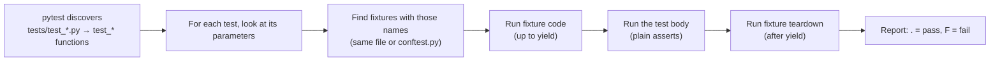

# 06 · Testing with pytest

<!-- nav:top -->
[Course home](../../README.md) › [Step 5 plan](../../steps/05-python-fundamentals.md) › [Step 5 lessons](00-start-here.md) · [Glossary](../../GLOSSARY.md)
<!-- nav:end -->

## 1. In one sentence

**pytest** runs any function named `test_*` in files named `test_*.py`, uses plain `assert` for expectations, and gives you **fixtures** (like RSpec's `let` and `before`) and **parametrize** (one test, many inputs).

## 2. Why it exists

Python's standard library includes `unittest` (class-based, xUnit style, like Minitest's classic style). Almost every modern Python project uses **pytest** instead, because:

- tests are plain functions with plain `assert` (pytest shows both sides of a failed comparison),
- fixtures give dependency-injected setup that composes well,
- parametrize removes copy-pasted tests,
- a large plugin ecosystem (coverage, async, HTTP mocking) plugs in easily.

You will use pytest in every remaining step: katas (Step 5), `kb-api` (Step 6), evals (Step 7) and your tool (Step 8).

## 3. Rails analogy

| RSpec | pytest |
|---|---|
| `spec/models/order_spec.rb` | `tests/test_order.py` |
| `describe Order do ... end` | a file, or a `class TestOrder:` (optional) |
| `it "computes the total" do` | `def test_computes_the_total():` |
| `expect(total).to eq(3750)` | `assert total == 3750` |
| `expect { call }.to raise_error(ArgumentError, /quantity/)` | `with pytest.raises(ValueError, match="quantity"):` |
| `let(:order) { build(:order) }` | `@pytest.fixture def order(): return Order(...)`, then a test parameter named `order` |
| `before { ... }` / `after { ... }` | a fixture with `yield` (code before and after the `yield`) |
| `shared_examples` / table-driven specs | `@pytest.mark.parametrize("given, expected", [...])` |
| `allow(Time).to receive(:now)` | `monkeypatch.setattr(...)` |
| `Dir.mktmpdir` | the built-in `tmp_path` fixture |
| `spec/support/`, `rails_helper.rb` | `tests/conftest.py` (shared fixtures, found automatically) |
| `rspec --only-failures` | `pytest --lf` (last failed) |
| `rspec spec/x_spec.rb:12` | `pytest tests/test_x.py::test_name` |

Where the analogy breaks: fixtures are requested **by parameter name**. If a test function has a parameter called `order`, pytest finds the fixture called `order` and passes its value. No `let` DSL, just function arguments.

## 4. How it works



### Fixtures

```python
@pytest.fixture
def price_list():            # like let(:price_list)
    return {"book": 1250, "pen": 199}

@pytest.fixture
def report_file(tmp_path):   # fixtures can use other fixtures
    path = tmp_path / "report.txt"
    yield path               # the test runs here
    # code after yield = teardown (like after { ... })
```

Fixture **scope** controls how often it runs: `function` (default, every test), `module`, or `session` (once per test run, for expensive setup such as a database schema).

### Parametrize

```python
@pytest.mark.parametrize(
    ("unit", "qty", "expected"),
    [(1250, 1, 1250), (1250, 3, 3750), (0, 5, 0)],
)
def test_total(unit, qty, expected):
    assert total_cents(unit, qty) == expected
```

pytest runs this as three separate tests and reports each one.

### Useful commands

| Command | Does |
|---|---|
| `uv run pytest` | Run everything |
| `uv run pytest -q` / `-v` | Quiet / verbose output |
| `uv run pytest -k vat` | Only tests whose name contains "vat" |
| `uv run pytest --lf` | Only the tests that failed last time |
| `uv run pytest -x` | Stop at the first failure |
| `uv run pytest --pdb` | Open the debugger at a failure |

## 5. Minimal working example

Create `src/katas/pricing.py`:

```python
VAT_RATE = 0.20


def total_cents(unit_cents: int, quantity: int, *, with_vat: bool = False) -> int:
    if quantity < 0:
        raise ValueError(f"quantity must be >= 0, got {quantity}")
    subtotal = unit_cents * quantity
    return round(subtotal * (1 + VAT_RATE)) if with_vat else subtotal


def write_receipt(path, lines: dict[str, int]) -> None:
    body = "\n".join(f"{name}: {cents}" for name, cents in lines.items())
    path.write_text(body + "\n")
```

Create `tests/test_pricing.py`:

```python
import pytest

from katas import pricing
from katas.pricing import total_cents, write_receipt


@pytest.fixture
def basket() -> dict[str, int]:
    return {"book": 1250, "pen": 199}


@pytest.mark.parametrize(
    ("unit", "qty", "expected"),
    [(1250, 1, 1250), (1250, 3, 3750), (0, 5, 0)],
)
def test_total_without_vat(unit, qty, expected):
    assert total_cents(unit, qty) == expected


def test_total_with_vat():
    assert total_cents(1000, 2, with_vat=True) == 2400


def test_negative_quantity_is_rejected():
    with pytest.raises(ValueError, match="quantity must be >= 0"):
        total_cents(1250, -1)


def test_vat_rate_can_be_changed(monkeypatch):
    monkeypatch.setattr(pricing, "VAT_RATE", 0.05)  # undone automatically after the test
    assert total_cents(1000, 1, with_vat=True) == 1050


def test_receipt_file(tmp_path, basket):
    receipt = tmp_path / "receipt.txt"
    write_receipt(receipt, basket)
    assert receipt.read_text() == "book: 1250\npen: 199\n"


def test_a_failure_looks_like_this(basket):
    assert basket == {"book": 1250, "pen": 200}  # deliberately wrong
```

Run the tests:

```bash
uv run pytest -v tests/test_pricing.py
```

Output (the last test fails on purpose so you can see a failure report; the platform, rootdir and plugins lines under the first line are left out, and timings are removed):

```
============================= test session starts ==============================
collecting ... collected 8 items

tests/test_pricing.py::test_total_without_vat[1250-1-1250] PASSED        [ 12%]
tests/test_pricing.py::test_total_without_vat[1250-3-3750] PASSED        [ 25%]
tests/test_pricing.py::test_total_without_vat[0-5-0] PASSED              [ 37%]
tests/test_pricing.py::test_total_with_vat PASSED                        [ 50%]
tests/test_pricing.py::test_negative_quantity_is_rejected PASSED         [ 62%]
tests/test_pricing.py::test_vat_rate_can_be_changed PASSED               [ 75%]
tests/test_pricing.py::test_receipt_file PASSED                          [ 87%]
tests/test_pricing.py::test_a_failure_looks_like_this FAILED             [100%]

=================================== FAILURES ===================================
________________________ test_a_failure_looks_like_this ________________________

basket = {'book': 1250, 'pen': 199}

    def test_a_failure_looks_like_this(basket):
>       assert basket == {"book": 1250, "pen": 200}  # deliberately wrong
        ^^^^^^^^^^^^^^^^^^^^^^^^^^^^^^^^^^^^^^^^^^^
E       AssertionError: assert {'book': 1250, 'pen': 199} == {'book': 1250, 'pen': 200}
E         
E         Omitting 1 identical items, use -vv to show
E         Differing items:
E         {'pen': 199} != {'pen': 200}
E         
E         Full diff:
E           {...
E         
E         ...Full output truncated (6 lines hidden), use '-vv' to show

tests/test_pricing.py:41: AssertionError
=========================== short test summary info ============================
FAILED tests/test_pricing.py::test_a_failure_looks_like_this - AssertionError...
========================= 1 failed, 7 passed ==========================
```

Read the failure: pytest shows **both** dictionaries and points at the exact difference (`{'pen': 199} != {'pen': 200}`). Delete the last test and run again to see all green.

## 6. Key terms

- **Test discovery**: pytest finds `test_*.py` files and `test_*` functions automatically.
- **Plain `assert`**: pytest rewrites asserts to show detailed failure messages.
- **Fixture**: reusable setup requested by parameter name; teardown after `yield`.
- **`conftest.py`**: a file for fixtures shared by many test files.
- **Parametrize**: run one test function with several inputs.
- **`monkeypatch`**: temporarily replace attributes, environment variables or dict items.
- **`tmp_path`**: a fresh temporary directory per test.

## 7. Common mistakes

- **Test files or functions not named `test_*`**: pytest silently skips them.
- **`assert` with parentheses and a comma**: `assert (x == 1, "msg")` is a non-empty tuple, so it is always true. Write `assert x == 1, "msg"`.
- **Shared mutable fixtures with a wide scope** leaking state between tests.
- **Mocking everything.** Prefer real objects and `tmp_path`; mock only slow or external things (network, time).
- **Copy-pasted tests** that differ in one value; use parametrize.
- **Catching a broad exception** in `pytest.raises(Exception)`; name the specific one and use `match=`.

## 8. Check your understanding

1. How does pytest know to pass the `basket` fixture into `test_receipt_file`?
2. Translate `expect { total_cents(1, -1) }.to raise_error(ValueError)` into pytest.
3. What is the difference between returning and yielding from a fixture?
4. Why is `assert (total == 3750, "wrong total")` a bug?
5. You need a database schema created once for the whole test run. What fixture scope do you use?

<details>
<summary>Answers</summary>

1. The test has a parameter named `basket`, and a fixture with that name exists; pytest calls it and passes the result.
2. `with pytest.raises(ValueError): total_cents(1, -1)`
3. `yield` lets you run teardown code after the test (like `after`); `return` has no teardown.
4. The parentheses make a two-element tuple, which is always truthy, so the assertion can never fail.
5. `scope="session"`.

</details>

## 9. Go deeper (optional)

- [pytest docs](https://docs.pytest.org/en/stable/): "Get Started", "How to use fixtures", "How to parametrize fixtures and test functions".
- pytest docs: [`monkeypatch`](https://docs.pytest.org/en/stable/how-to/monkeypatch.html) and [`tmp_path`](https://docs.pytest.org/en/stable/how-to/tmp_path.html).
- Brian Okken, *Python Testing with pytest*, 2nd edition (Pragmatic Bookshelf, 2022).

<!-- nav:bottom -->

---

[← 05 · Modules, packages and imports](05-modules-packages-and-imports.md) · [Step 5 lessons](00-start-here.md) · [07 · Errors, files and `with` →](07-errors-files-and-with.md)
<!-- nav:end -->
