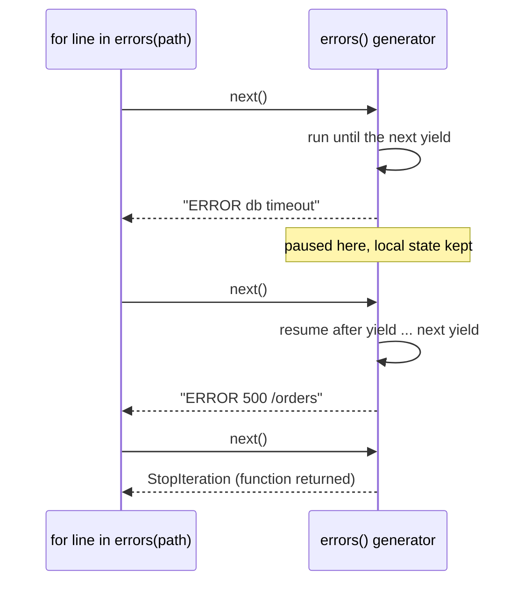

# 09 · Iterators and generators

<!-- nav:top -->
[Course home](../../README.md) › [Step 5 plan](../../steps/05-python-fundamentals.md) › [Step 5 lessons](00-start-here.md) · [Glossary](../../GLOSSARY.md)
<!-- nav:end -->

## 1. In one sentence

A **generator** is a function containing `yield` that produces values **one at a time, on demand**, so you can process a 2 GB log file or an endless stream in constant memory. It is Python's version of Ruby's `Enumerator` and `.lazy`, **not** Ruby's `yield`-to-a-block.

## 2. Why it exists

Two needs meet here:

1. **Large or endless data.** Reading a whole file into a list (`f.readlines()`) or building a million-element list uses memory for all of it at once. A generator holds only the current item.
2. **Pipelines.** "Read lines → keep errors → parse → take the first 10" reads naturally as a chain of small steps, each lazy.

Ruby gives you this with `each_line`, `Enumerator.new { |y| y << ... }` and `.lazy`. Python builds it into the language: every `for` loop uses the **iterator protocol**, and `yield` makes writing your own iterators trivial.

The big trap for Rubyists: in Ruby, `yield` **calls the block you were given**. In Python, `yield` **pauses the function and hands a value to whoever is looping over it**. Same word, opposite direction.

## 3. Rails analogy

| Ruby | Python |
|---|---|
| `File.foreach(path) { \|line\| ... }` | `for line in open(path):` (files are lazy iterators) |
| `Enumerator.new { \|y\| y << 1; y << 2 }` | `def gen(): yield 1; yield 2` |
| `(1..Float::INFINITY).lazy.map { }.select { }.first(5)` | a generator pipeline + `itertools.islice(..., 5)` |
| `each_slice(100)` | `itertools.batched(iterable, 100)` (Python 3.12+) |
| `find_each(batch_size: 1000)` in Active Record | a generator that yields batches from a query |
| `enum.next` | `next(iterator)` |
| Block-based `yield` (`def each; yield x; end`) | Pass a function, or implement `__iter__` / write a generator |

## 4. How it works

### The iterator protocol

A `for` loop does this behind the scenes:

```python
iterator = iter(things)        # calls things.__iter__()
while True:
    try:
        item = next(iterator)  # calls iterator.__next__()
    except StopIteration:
        break
    ...                        # loop body
```

- An **iterable** is anything you can loop over (list, dict, file, range, generator).
- An **iterator** is the object that remembers where you are; `next()` gets the next item, and `StopIteration` means "finished".

### Generator functions



Calling a generator function **does not run it**; it returns a generator object. The body runs a bit each time `next()` is called, pausing at every `yield` with all its local variables intact.

### Generator expressions

Like a list comprehension with round brackets: `(line.upper() for line in f)`. It builds nothing up front. You can pass one straight into a function: `sum(len(line) for line in f)`.

### One pass only

A generator can be iterated **once**. After it is exhausted, looping again gives nothing (no error). If you need the data twice, store it in a list, or create a new generator.

### `itertools`

| Function | Does | Ruby |
|---|---|---|
| `islice(it, 5)` | first 5 items, lazily | `lazy.first(5)` |
| `batched(it, 100)` (3.12+) | tuples of up to 100 items | `each_slice(100)` |
| `chain(a, b)` | one after another | `a.lazy + b` / `chain` |
| `groupby(sorted_it, key)` | consecutive groups (sort first!) | `chunk_while` / `group_by` on sorted data |
| `count()`, `cycle()`, `repeat()` | infinite sequences | `(1..)`, `cycle` |

## 5. Minimal working example

Create `logs.py`. It writes a sample log, then processes it lazily with a pipeline of generators:

```python
import itertools
import sys
from collections.abc import Iterator
from pathlib import Path

LOG = Path("production.log")
LOG.write_text(
    "\n".join(
        f"{'ERROR' if n % 4 == 0 else 'INFO'} request {n} took {n * 7 % 300}ms"
        for n in range(1, 100_001)
    ),
    encoding="utf-8",
)


def read_lines(path: Path) -> Iterator[str]:
    with path.open(encoding="utf-8") as f:
        for line in f:              # the file object is itself a lazy iterator
            yield line.rstrip("\n")


def errors(lines: Iterator[str]) -> Iterator[str]:
    for line in lines:
        if line.startswith("ERROR"):
            yield line


def durations(lines: Iterator[str]) -> Iterator[int]:
    for line in lines:
        yield int(line.rsplit(" ", 1)[-1].removesuffix("ms"))


# A lazy pipeline: nothing has been read yet when these three lines run.
pipeline = durations(errors(read_lines(LOG)))
print("pipeline object:", type(pipeline).__name__)

print("first 3 error durations:", list(itertools.islice(pipeline, 3)))
print("slow errors (>250ms) in the rest:", sum(1 for ms in pipeline if ms > 250))
print("pipeline again (exhausted):", list(pipeline))

# Memory: a list holds everything, a generator holds almost nothing.
as_list = [n * 2 for n in range(100_000)]
as_gen = (n * 2 for n in range(100_000))
print(f"list: {sys.getsizeof(as_list):,} bytes, generator: {sys.getsizeof(as_gen)} bytes")

# Batches, like each_slice / find_each (Python 3.12+).
for batch in itertools.islice(itertools.batched(range(1, 11), 4), 3):
    print("batch:", batch)
```

```bash
uv run python logs.py
```

Output:

```
pipeline object: generator
first 3 error durations: [28, 56, 84]
slow errors (>250ms) in the rest: 4000
pipeline again (exhausted): []
list: 800,984 bytes, generator: 200 bytes
batch: (1, 2, 3, 4)
batch: (5, 6, 7, 8)
batch: (9, 10)
```

Notice three things: the pipeline object is a `generator` until you consume it; the second consumer (`sum(...)`) continued **where `islice` stopped**; and the third read found it **exhausted**.

## 6. Key terms

- **Iterable / iterator**: something you can loop over / the object tracking the position.
- **`iter()` / `next()` / `StopIteration`**: the iterator protocol.
- **Generator function**: a function with `yield`; calling it returns a generator.
- **Generator expression**: `(expr for x in xs)`, a lazy comprehension.
- **Lazy evaluation**: computing values only when needed.
- **Exhausted**: a generator that has produced all its values.
- **`itertools`**: standard library tools for working with iterators.

## 7. Common mistakes

- **Expecting Ruby's `yield`.** Python's `yield` produces a value for the loop; it does not call a block.
- **Iterating a generator twice** and silently getting nothing the second time.
- **Calling `list()` on a huge generator** "to have a look", which loads everything into memory.
- **`f.readlines()` or `f.read()` on big files** instead of iterating the file.
- **`itertools.groupby` on unsorted data**: it groups only consecutive equal keys.
- **Returning a list from a function that is only ever looped over once.** A generator is simpler on memory.

## 8. Check your understanding

1. What does calling a generator function return, and when does its body start running?
2. In `logs.py`, why did `sum(...)` not start again from the first line?
3. How is Python's `yield` different from Ruby's `yield`?
4. Rewrite `orders.lazy.select(&:paid?).map(&:total).first(10)` in Python.
5. You process a 5 GB log. Which is better: `for line in f.readlines():` or `for line in f:`, and why?

<details>
<summary>Answers</summary>

1. A generator object. The body starts running on the first `next()` (for example, when a `for` loop begins), and pauses at each `yield`.
2. The generator keeps its position; `islice` consumed the first three items, so `sum` continued from the fourth.
3. Ruby's `yield` calls the block passed to the method; Python's `yield` hands a value out to the code iterating over the generator and pauses the function.
4. `list(itertools.islice((o.total for o in orders if o.paid), 10))`
5. `for line in f:`. It reads one line at a time; `readlines()` loads all 5 GB into a list first.

</details>

## 9. Go deeper (optional)

- The Python Tutorial: [Iterators](https://docs.python.org/3/tutorial/classes.html#iterators) and [Generators](https://docs.python.org/3/tutorial/classes.html#generators).
- Python docs: [`itertools`](https://docs.python.org/3/library/itertools.html) (including the "recipes" section).
- *Fluent Python*, 2nd ed., chapter 17 ("Iterators, Generators, and Classic Coroutines").

<!-- nav:bottom -->

---

[← 08 · Classes and dataclasses](08-classes-and-dataclasses.md) · [Step 5 lessons](00-start-here.md) · [10 · Type hints and mypy →](10-type-hints-and-mypy.md)
<!-- nav:end -->
