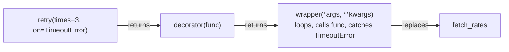

# 11 · Decorators and context managers

## 1. In one sentence

A **decorator** (`@retry(times=3)` above a function) is a function that takes a function and returns a wrapped version of it, and a **context manager** (used with `with`) runs setup code before a block and guaranteed cleanup after it; together they replace much of what Ruby does with blocks, `around` callbacks and `ensure`.

## 2. Why it exists

You have already used both: `@dataclass`, `@property`, `@pytest.fixture`, `@mcp.tool()`, `with open(...)`. You also need to **write** them, because they are the Pythonic way to handle cross-cutting concerns:

- **Decorators:** timing, logging, retries, caching, permission checks, registering a function as a route or tool (`@app.get("/orders")` in FastAPI).
- **Context managers:** transactions, locks, temporary settings, timers, "always clean up" logic.

In Ruby you would write `around_action`, `ActiveRecord::Base.transaction do ... end`, or a method that takes a block and wraps `yield` in `begin/ensure`. Python splits these into two tools with clear roles.

## 3. Rails analogy

| Ruby / Rails | Python |
|---|---|
| `around_action :log_time` | a `@log_time` decorator |
| `retry_on Timeout, attempts: 3` (Active Job) | `@retry(times=3, on=TimeoutError)` |
| `memoize` / `@x \|\|=` | `@functools.cache` |
| `get "/orders", to: "orders#index"` (registering) | `@app.get("/orders")` (a decorator that registers) |
| `def with_timer; t = now; yield; ensure log(now - t); end` | a `@contextmanager` function with `yield` inside `try/finally` |
| `ActiveRecord::Base.transaction do ... end` | `with session.begin(): ...` (SQLAlchemy, Step 6) |
| `File.open(p) { }`, `Dir.chdir(d) { }` | `with open(p):`, `with contextlib.chdir(d):` (3.11+) |

## 4. How it works

### A decorator is just a function

```python
@log_calls
def charge(amount): ...
```

is exactly the same as:

```python
def charge(amount): ...
charge = log_calls(charge)
```

So a decorator is a function that **receives a function and returns a function** (usually a wrapper that calls the original):

```python
import functools

def log_calls(func):
    @functools.wraps(func)            # copy the name and docstring onto the wrapper
    def wrapper(*args, **kwargs):     # accept any arguments
        print(f"calling {func.__name__}{args}")
        result = func(*args, **kwargs)
        print(f"{func.__name__} returned {result!r}")
        return result
    return wrapper
```

### Decorators with arguments

`@retry(times=3)` has one more level: `retry(times=3)` is called first and **returns** the actual decorator.



### Context managers

`with EXPR as NAME:` calls `EXPR.__enter__()` (its return value goes into `NAME`), runs the block, then **always** calls `__exit__(exc_type, exc, traceback)`, even if the block raised. If `__exit__` returns `True`, the exception is suppressed (rarely what you want).

The easy way to write one is `contextlib.contextmanager`: write a generator that yields **once**. Code before `yield` is setup, code after it (in `finally`) is cleanup:

```python
import os
from contextlib import contextmanager

@contextmanager
def temporary_env(name, value):
    old = os.environ.get(name)
    os.environ[name] = value
    try:
        yield                      # the with-block runs here
    finally:
        if old is None:
            del os.environ[name]
        else:
            os.environ[name] = old
```

This is exactly the Ruby pattern `def with_env(...); ...; yield; ensure ...; end`, just spelled with `with`.

## 5. Minimal working example

Create `wrappers.py`:

```python
import functools
import os
from collections.abc import Callable, Iterator
from contextlib import contextmanager
from typing import Any

CALLS: dict[str, int] = {}


# 1. A simple decorator: count calls (like an around_action).
def counted(func: Callable[..., Any]) -> Callable[..., Any]:
    @functools.wraps(func)
    def wrapper(*args: Any, **kwargs: Any) -> Any:
        CALLS[func.__name__] = CALLS.get(func.__name__, 0) + 1
        return func(*args, **kwargs)

    return wrapper


# 2. A decorator with arguments: retry on specific errors.
def retry(times: int, on: type[Exception]) -> Callable[[Callable[..., Any]], Callable[..., Any]]:
    def decorator(func: Callable[..., Any]) -> Callable[..., Any]:
        @functools.wraps(func)
        def wrapper(*args: Any, **kwargs: Any) -> Any:
            for attempt in range(1, times + 1):
                try:
                    return func(*args, **kwargs)
                except on as error:
                    print(f"  attempt {attempt} failed: {error}")
                    if attempt == times:
                        raise

        return wrapper

    return decorator


failures_left = 2


@counted
@retry(times=3, on=TimeoutError)
def fetch_rates(currency: str) -> float:
    """Pretend to call a flaky API: fails twice, then succeeds."""
    global failures_left
    if failures_left > 0:
        failures_left -= 1
        raise TimeoutError("rates API timed out")
    return 1.17 if currency == "EUR" else 1.0


print("rate:", fetch_rates("EUR"))
print("calls:", CALLS, "| name kept by wraps:", fetch_rates.__name__, "|", fetch_rates.__doc__)


# 3. A context manager with @contextmanager: temporary environment variable.
@contextmanager
def temporary_env(name: str, value: str) -> Iterator[None]:
    old = os.environ.get(name)
    os.environ[name] = value
    try:
        yield
    finally:
        if old is None:
            del os.environ[name]
        else:
            os.environ[name] = old


with temporary_env("RAILS_ENV", "test"):
    print("inside:", os.environ["RAILS_ENV"])
print("after:", os.environ.get("RAILS_ENV"))


# 4. A class-based context manager: a transaction that rolls back on error.
class Transaction:
    def __init__(self, log: list[str]) -> None:
        self.log = log

    def __enter__(self) -> "Transaction":
        self.log.append("BEGIN")
        return self

    def __exit__(self, exc_type: Any, exc: Any, tb: Any) -> bool:
        self.log.append("ROLLBACK" if exc_type else "COMMIT")
        return False  # do not swallow the exception


log: list[str] = []
with Transaction(log):
    log.append("insert order")
try:
    with Transaction(log):
        log.append("insert line item")
        raise ValueError("stock missing")
except ValueError as error:
    log.append(f"caught: {error}")
print(log)
```

```bash
uv run python wrappers.py
```

Output:

```
  attempt 1 failed: rates API timed out
  attempt 2 failed: rates API timed out
rate: 1.17
calls: {'fetch_rates': 1} | name kept by wraps: fetch_rates | Pretend to call a flaky API: fails twice, then succeeds.
inside: test
after: None
['BEGIN', 'insert order', 'COMMIT', 'BEGIN', 'insert line item', 'ROLLBACK', 'caught: stock missing']
```

Two details to notice: `@counted` counted **one** call even though `retry` tried three times, because decorators apply bottom-up (`counted` wraps the already-retrying function). And the second transaction logged `ROLLBACK` and still let the `ValueError` reach the `except`, because `__exit__` returned `False`.

## 6. Key terms

- **Decorator**: a function that takes a function and returns a (usually wrapped) function; applied with `@`.
- **Wrapper**: the inner function a decorator returns.
- **`functools.wraps`**: copies the original function's name and docstring onto the wrapper.
- **Decorator factory**: a function taking arguments that returns a decorator (`@retry(times=3)`).
- **Context manager**: an object with `__enter__` / `__exit__`, used with `with`.
- **`@contextmanager`**: builds a context manager from a one-`yield` generator.

## 7. Common mistakes

- **Forgetting `@functools.wraps`**: the wrapped function loses its name and docstring (and tools such as FastAPI, pytest and MCP may misbehave, because they inspect the signature).
- **Forgetting to `return func(...)`** in the wrapper, so the decorated function returns `None`.
- **`@retry` vs `@retry()`**: a decorator factory must be called, even with no arguments.
- **Decorator order**: they apply bottom-up; think about which wrapper should be outermost.
- **No `try/finally` around `yield`** in a `@contextmanager`, so cleanup is skipped when the block raises.
- **Returning `True` from `__exit__`** by accident, silently swallowing exceptions.

## 8. Check your understanding

1. Rewrite `@log_calls def charge(): ...` without the `@` syntax.
2. Why does a decorator that takes arguments need three nested functions?
3. What does `functools.wraps` preserve, and why do frameworks care?
4. In a `@contextmanager`, where does the `with` block run, and how do you make cleanup run even after an exception?
5. In the example, why was `CALLS["fetch_rates"]` 1 and not 3?

<details>
<summary>Answers</summary>

1. `def charge(): ...` followed by `charge = log_calls(charge)`.
2. The outer function receives the arguments and returns the decorator; the decorator receives the function and returns the wrapper; the wrapper runs on each call.
3. The original `__name__`, `__doc__` and signature information (`__wrapped__`). Frameworks inspect functions (FastAPI reads parameters, pytest reads names, MCP reads the docstring and types) and would see the wrapper otherwise.
4. At the `yield`. Put the `yield` inside `try:` and the cleanup in `finally:`.
5. `@counted` is the outer decorator, so it wraps the retrying function and sees one call; the retries happen inside, below it.

</details>

## 9. Go deeper (optional)

- Python docs: [`functools.wraps`](https://docs.python.org/3/library/functools.html#functools.wraps) and [`contextlib`](https://docs.python.org/3/library/contextlib.html).
- Python docs: [The `with` statement](https://docs.python.org/3/reference/compound_stmts.html#the-with-statement).
- *Fluent Python*, 2nd ed., chapter 9 ("Decorators and Closures") and chapter 18 ("with, match, and else Blocks").
