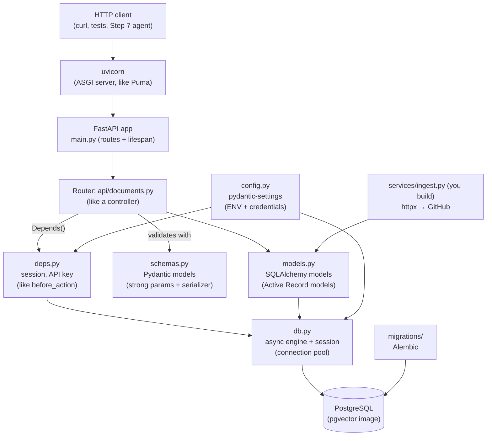

# Step 6 lessons: start here

<!-- nav:top -->
[Course home](../../README.md) › [Step 6 plan](../../steps/06-applied-python.md) · [Glossary](../../GLOSSARY.md)
<!-- nav:end -->

In Step 6 you build **`kb-api`**, a real service, in Python. Every tool in this step has a Rails counterpart you already know well, so the lessons are organised around one question: **"What is the Rails equivalent, and where does it differ?"**

**How to use this folder:** each day in [the Step 6 plan](../../steps/06-applied-python.md) starts with **"Read first:"** links. Read the lesson (20-40 minutes), run its example, then work on `kb-api`. You do not start from an empty folder: the **[kb-api starter](../../starters/kb-api/README.md)** is a small, tested service (one resource, migrations, auth, tests, Docker, CI) that you extend.

## The lessons

| # | Lesson | Day |
|---|---|---|
| 01 | [HTTP clients: requests and httpx](01-http-clients-requests-and-httpx.md) | Mon 9 Nov |
| 02 | [asyncio basics](02-asyncio-basics.md) | Mon 9 Nov |
| 03 | [pandas basics](03-pandas-basics.md) | Tue 10 Nov |
| 04 | [FastAPI basics](04-fastapi-basics.md) | Tue 10 Nov |
| 05 | [Pydantic v2 and settings](05-pydantic-and-settings.md) | Wed 11 Nov |
| 06 | [SQLAlchemy 2.x with asyncio](06-sqlalchemy-async.md) | Thu 12 Nov |
| 07 | [Alembic migrations](07-alembic-migrations.md) | Thu 12 Nov |
| 08 | [Dependency injection in FastAPI](08-dependency-injection.md) | Fri 13 Nov |
| 09 | [Full-text search and cursor pagination](09-full-text-search-and-cursor-pagination.md) | Sat 14 Nov |
| 10 | [Testing FastAPI with a real database](10-testing-fastapi.md) | Mon 16 Nov |
| 11 | [Docker for Python services](11-docker-for-python-services.md) | Thu 19 Nov |
| 12 | [GitHub Actions CI](12-github-actions-ci.md) | Fri 20 Nov |

## How the pieces of kb-api connect

A request's journey, the way you would describe it in Rails:

1. **uvicorn** (the server, like Puma) receives the HTTP request and passes it to the **FastAPI app** (like the Rails app object).
2. FastAPI matches the **route** (like `routes.rb`) and finds the **path operation function** (like a controller action).
3. Before calling it, FastAPI resolves its **dependencies** (like `before_action`s): it opens a database **session** and checks the **API key**.
4. The request body is parsed and validated by a **Pydantic model** (like strong parameters plus model validations). Invalid input returns **422** automatically.
5. The function uses **SQLAlchemy** (like Active Record) to query Postgres, `await`ing the database instead of blocking.
6. The return value is converted to JSON through the **response model** (like a serializer), and the session is closed.

## The Rails-to-Python map for this step

| Rails | kb-api (Python) | Lesson |
|---|---|---|
| Puma | uvicorn | [04](04-fastapi-basics.md) |
| Rails app, `routes.rb`, controllers | FastAPI app, `APIRouter`, path operation functions | [04](04-fastapi-basics.md) |
| Strong parameters, serializers, model validations | Pydantic models (`DocumentCreate`, `DocumentRead`) | [05](05-pydantic-and-settings.md) |
| `credentials.yml.enc`, `ENV` | pydantic-settings (`Settings`) | [05](05-pydantic-and-settings.md) |
| Active Record models and queries | SQLAlchemy 2.x models, `select()`, `AsyncSession` | [06](06-sqlalchemy-async.md) |
| `db/migrate`, `bin/rails db:migrate` | Alembic, `alembic upgrade head` | [07](07-alembic-migrations.md) |
| `before_action`, `current_user` | FastAPI dependencies (`Depends`) | [08](08-dependency-injection.md) |
| `pg_search` scopes, Kaminari/Pagy | `tsvector` + `ts_rank`, keyset (cursor) pagination | [09](09-full-text-search-and-cursor-pagination.md) |
| Request specs, `use_transactional_fixtures` | pytest + httpx `ASGITransport`, rolled-back transaction per test | [10](10-testing-fastapi.md) |
| Faraday / Net::HTTP | httpx (and requests) | [01](01-http-clients-requests-and-httpx.md) |
| Threads / Fibers for concurrent I/O | `asyncio`, `async`/`await` | [02](02-asyncio-basics.md) |
| Kamal / Dockerfile generated by Rails 8 | Dockerfile with uv, `compose.yaml` | [11](11-docker-for-python-services.md) |
| GitHub Actions for RSpec + RuboCop | GitHub Actions for pytest + ruff + mypy | [12](12-github-actions-ci.md) |
| A Rake task that builds a CSV report | A pandas script | [03](03-pandas-basics.md) |

## Glossary

| Term | Meaning | Lesson |
|---|---|---|
| **HTTP client** | A library for calling other services' APIs (Faraday in Ruby; `requests`, `httpx` in Python). | [01](01-http-clients-requests-and-httpx.md) |
| **Timeout** | The maximum time to wait for a response before giving up. Always set one. | [01](01-http-clients-requests-and-httpx.md) |
| **Rate limit** | A limit on how many requests an API accepts per time window (GitHub: `403`/`429` with headers). | [01](01-http-clients-requests-and-httpx.md) |
| **asyncio** | Python's built-in framework for concurrent I/O in one thread, using an event loop. | [02](02-asyncio-basics.md) |
| **Event loop** | The scheduler that runs coroutines and switches between them while they wait for I/O. | [02](02-asyncio-basics.md) |
| **Coroutine / `async def` / `await`** | A pausable function / how you define one / where it pauses to wait. | [02](02-asyncio-basics.md) |
| **`asyncio.gather` / `Semaphore`** | Run coroutines concurrently / limit how many run at once. | [02](02-asyncio-basics.md) |
| **DataFrame** | pandas' table: rows and named columns, with fast column operations. | [03](03-pandas-basics.md) |
| **ASGI** | The interface between async Python web servers and apps (Python's async Rack). | [04](04-fastapi-basics.md) |
| **uvicorn** | The ASGI server that runs FastAPI (like Puma). | [04](04-fastapi-basics.md) |
| **Path operation** | A FastAPI route function, such as `@router.get("/documents")`. | [04](04-fastapi-basics.md) |
| **OpenAPI / `/docs`** | A machine-readable API description, generated automatically; `/docs` is its interactive UI. | [04](04-fastapi-basics.md) |
| **Pydantic model** | A class that validates and converts data from type hints (`BaseModel`). | [05](05-pydantic-and-settings.md) |
| **`model_dump` / `model_validate`** | Convert a model to a dict / build a model from data (with validation). | [05](05-pydantic-and-settings.md) |
| **pydantic-settings** | Reads configuration from environment variables and `.env` into a typed object. | [05](05-pydantic-and-settings.md) |
| **ORM** | Object-relational mapper: maps classes to tables (Active Record, SQLAlchemy). | [06](06-sqlalchemy-async.md) |
| **Engine / session** | The connection pool / a unit of work with its own transaction (like a request's DB connection plus identity map). | [06](06-sqlalchemy-async.md) |
| **`Mapped` / `mapped_column`** | SQLAlchemy 2.x's typed way to declare model columns. | [06](06-sqlalchemy-async.md) |
| **Lazy loading / `selectinload`** | Loading a relationship on first access (not allowed in async) / loading it up front in one extra query (like `preload`). | [06](06-sqlalchemy-async.md) |
| **Alembic / revision / autogenerate** | SQLAlchemy's migration tool / one migration / generating it by comparing models with the database. | [07](07-alembic-migrations.md) |
| **Dependency (`Depends`)** | A function FastAPI calls before your route to provide something (session, user, settings). | [08](08-dependency-injection.md) |
| **`dependency_overrides`** | Replacing a dependency in tests (for example, the test database session). | [08](08-dependency-injection.md), [10](10-testing-fastapi.md) |
| **`tsvector` / `tsquery` / `ts_rank`** | Postgres full-text search types and ranking function. | [09](09-full-text-search-and-cursor-pagination.md) |
| **Keyset (cursor) pagination** | "Give me the next N rows after id X": stable and fast, unlike `OFFSET`. | [09](09-full-text-search-and-cursor-pagination.md) |
| **ASGITransport** | Lets `httpx` call a FastAPI app in memory, without a network server. | [10](10-testing-fastapi.md) |
| **respx** | A library that mocks `httpx` requests in tests (like WebMock). | [10](10-testing-fastapi.md) |
| **Coverage** | The share of code lines executed by the tests. | [10](10-testing-fastapi.md) |
| **Multi-stage Docker build** | Build in one image, copy only the result into a small final image. | [11](11-docker-for-python-services.md) |
| **Service container (CI)** | A database container that GitHub Actions starts next to your job. | [12](12-github-actions-ci.md) |

<!-- nav:bottom -->

---

[← Step 5 lessons](../05-python-fundamentals/00-start-here.md) · [Step 6 plan](../../steps/06-applied-python.md) · [First lesson: 01 · HTTP clients: requests and httpx →](01-http-clients-requests-and-httpx.md) · [Step 7 lessons →](../07-agentic-ai/00-start-here.md)
<!-- nav:end -->
