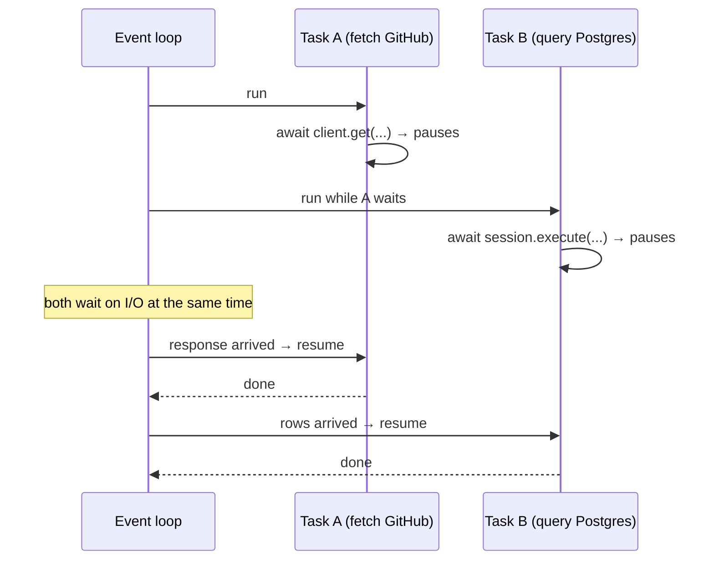

# 02 · asyncio basics

## 1. In one sentence

**asyncio** lets one Python thread run many I/O-bound tasks concurrently: functions declared with `async def` pause at every `await` (for example while waiting for the network or the database), and the **event loop** runs other tasks in the meantime.

## 2. Why it exists

Web services and AI apps spend most of their time **waiting**: for Postgres, for GitHub, for a model API that takes 5 seconds. In Step 1 you saw how Ruby handles this with threads (limited by the GVL but released during I/O) and with Fibers and the `async` gem. Python's answer for modern services is `asyncio`:

- FastAPI is built on it: while one request awaits the database, the same process serves other requests.
- SQLAlchemy's async mode, httpx's `AsyncClient` and the Anthropic SDK's `AsyncAnthropic` all plug into it.
- You can run 20 downloads or model calls at once with a few lines (`asyncio.gather`).

The catch: async only helps if **every** slow operation is awaited. One blocking call freezes everything.

## 3. Rails analogy

asyncio is closest to **Ruby's Fiber scheduler with the `async` gem** (Step 1): cooperative multitasking in one thread.

| Ruby (async gem / Fibers) | Python asyncio |
|---|---|
| `Async do ... end` (a task) | `asyncio.create_task(coro())` or `asyncio.gather(...)` |
| The reactor / Fiber scheduler | The **event loop** |
| A Fiber that yields while waiting on I/O | A coroutine that pauses at `await` |
| `Async::Semaphore.new(4)` | `asyncio.Semaphore(4)` |
| `task.wait` | `await task` |
| `sleep` inside a Fiber (non-blocking with the scheduler) | `await asyncio.sleep(1)` (non-blocking); `time.sleep(1)` **blocks** |
| Puma threads for concurrency | One event loop serving many requests (plus more worker processes for CPU) |

Where the analogy breaks: in Ruby with the Fiber scheduler, ordinary blocking calls (`sleep`, many IO methods) become non-blocking automatically. In Python, **you must use async libraries and write `await`** explicitly; ordinary blocking calls (`time.sleep`, `requests.get`, a sync DB driver) block the whole loop.

## 4. How it works



### The vocabulary

- **`async def f():`** defines a **coroutine function**. Calling `f()` does **not** run it; it returns a coroutine object.
- **`await something`** runs `something` and pauses this coroutine until it finishes, letting other tasks run. You can only `await` inside `async def`.
- **`asyncio.run(main())`** starts the event loop, runs `main()` to completion and closes the loop. Use it once, at the top of a script. (FastAPI and uvicorn run the loop for you.)
- **`asyncio.gather(a(), b(), c())`** runs several coroutines concurrently and returns their results in order.
- **`asyncio.Semaphore(n)`**: `async with sem:` lets at most *n* tasks in at once.
- **`asyncio.timeout(5)`** (Python 3.11+): `async with asyncio.timeout(5):` cancels the block if it takes longer.
- **`asyncio.to_thread(fn, ...)`**: run a **blocking** function in a thread so it does not freeze the loop.

### What async does not do

- It does **not** make CPU-heavy code faster; one thread still runs one thing at a time (like Ruby's GVL). For CPU work, use processes.
- It does **not** make a single request faster; it lets you do **more things at once** while waiting.

## 5. Minimal working example

Create `async_demo.py`. It simulates slow I/O with `asyncio.sleep` so the timings are predictable:

```python
import asyncio
import time


async def fetch(name: str, seconds: float) -> str:
    await asyncio.sleep(seconds)  # stands in for a network or database call
    return f"{name} done"


async def sequential() -> list[str]:
    return [await fetch("a", 0.3), await fetch("b", 0.3), await fetch("c", 0.3)]


async def concurrent() -> list[str]:
    return await asyncio.gather(fetch("a", 0.3), fetch("b", 0.3), fetch("c", 0.3))


async def limited(n_tasks: int, max_in_flight: int) -> int:
    sem = asyncio.Semaphore(max_in_flight)

    async def one(i: int) -> str:
        async with sem:
            return await fetch(str(i), 0.1)

    return len(await asyncio.gather(*(one(i) for i in range(n_tasks))))


async def blocking_mistake() -> None:
    async def bad() -> None:
        time.sleep(0.3)  # BLOCKS the whole event loop

    await asyncio.gather(bad(), bad(), bad())


async def blocking_fixed() -> None:
    await asyncio.gather(*(asyncio.to_thread(time.sleep, 0.3) for _ in range(3)))


async def with_timeout() -> str:
    try:
        async with asyncio.timeout(0.2):
            return await fetch("slow", 1.0)
    except TimeoutError:
        return "timed out after 0.2s"


async def main() -> None:
    for label, coro in [
        ("sequential awaits", sequential()),
        ("gather (concurrent)", concurrent()),
        ("20 tasks, 5 at a time", limited(20, 5)),
        ("time.sleep in async (bug)", blocking_mistake()),
        ("to_thread (fix)", blocking_fixed()),
        ("timeout", with_timeout()),
    ]:
        started = time.perf_counter()
        result = await coro
        print(f"{label:<27} {time.perf_counter() - started:.1f}s  {result}")

    print("calling fetch() without await gives:", type(fetch("x", 0)).__name__)


asyncio.run(main())
```

```bash
uv run python async_demo.py
```

Output (timings rounded to 0.1 s):

```
sequential awaits           0.9s  ['a done', 'b done', 'c done']
gather (concurrent)         0.3s  ['a done', 'b done', 'c done']
20 tasks, 5 at a time       0.4s  20
time.sleep in async (bug)   0.9s  None
to_thread (fix)             0.3s  None
timeout                     0.2s  timed out after 0.2s
calling fetch() without await gives: coroutine
/path/to/project/async_demo.py:60: RuntimeWarning: coroutine 'fetch' was never awaited
  print("calling fetch() without await gives:", type(fetch("x", 0)).__name__)
RuntimeWarning: Enable tracemalloc to get the object allocation traceback
```

Read the timings: three 0.3 s waits take 0.9 s when awaited one after another, but 0.3 s with `gather`. Twenty 0.1 s tasks, five at a time, take 0.4 s (four waves). The `time.sleep` version takes 0.9 s even with `gather`, because it blocks the loop, which is the bug to avoid in FastAPI routes. The last line shows the other classic mistake: calling a coroutine function without `await` just creates a coroutine object that never runs (Python warns about it).

## 6. Key terms

- **Event loop**: runs tasks and switches between them at `await` points.
- **Coroutine**: the object returned by calling an `async def` function.
- **`await`**: run and wait for an awaitable, letting other tasks run meanwhile.
- **Task**: a coroutine scheduled on the loop (`create_task`, `gather`).
- **Concurrency vs parallelism**: overlapping waits in one thread vs running at the same time on several cores.
- **Blocking call**: a call that holds the thread (`time.sleep`, `requests.get`).
- **`to_thread`**: runs a blocking function in a worker thread.

## 7. Common mistakes

- **Forgetting `await`**: you get a coroutine object and a "was never awaited" warning.
- **Blocking calls in `async def`** (`requests`, `time.sleep`, sync DB drivers, heavy CPU loops).
- **`asyncio.run()` inside code that already runs in a loop** (for example inside a FastAPI route): just `await`.
- **Unbounded `gather`** over thousands of items: add a semaphore.
- **Expecting async to speed up CPU work.**
- **Mixing sync and async SQLAlchemy sessions** in one code path.

## 8. Check your understanding

1. What does calling `fetch("a", 1)` return if you forget `await`?
2. Three awaited calls of 0.3 s each: how long sequentially, and how long with `gather`? Why?
3. Why does `time.sleep` inside `async def` defeat `gather`?
4. You must call a library that only has a blocking API from an async route. What do you do?
5. When does asyncio **not** help?

<details>
<summary>Answers</summary>

1. A coroutine object; the body never runs.
2. About 0.9 s sequentially, about 0.3 s with `gather`: the waits overlap because each coroutine pauses at `await asyncio.sleep` and the loop runs the others.
3. `time.sleep` does not pause the coroutine; it blocks the thread, so the event loop cannot switch to other tasks.
4. Run it with `await asyncio.to_thread(blocking_function, ...)` (or find an async library).
5. For CPU-bound work, and for a single sequential call: it improves throughput for many concurrent waits, not the speed of one operation.

</details>

## 9. Go deeper (optional)

- Python docs: [Coroutines and Tasks](https://docs.python.org/3/library/asyncio-task.html) (`gather`, `timeout`, `to_thread`).
- FastAPI docs: [Concurrency and async / await](https://fastapi.tiangolo.com/async/) (an excellent plain-English explanation).
- *Fluent Python*, 2nd ed., chapter 21 ("Asynchronous Programming").
