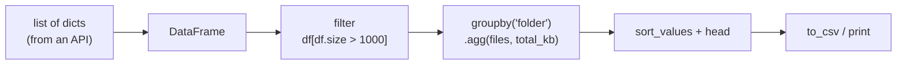

# 03 · pandas basics

## 1. In one sentence

**pandas** gives you the **DataFrame**, an in-memory table with named columns, and fast operations to filter, group, aggregate, sort and export it, which makes it the standard tool for quick data scripts and reports in Python.

## 2. Why it exists

You will regularly need small data jobs: "which folders in this repo have the most documentation?", "summarise eval results by model", "export a CSV for my manager". In Rails you would write a Rake task with `group_by` and `sum`, or run SQL. In Python, pandas does these in a few readable lines and is used everywhere in data work, including AI evals (Step 7 and 8 results are perfect DataFrames).

You only need the basics for this roadmap: load records, add a column, filter, group, sort, export.

## 3. Rails analogy

A DataFrame is like the result of an Active Record query **loaded into memory**, where you can then run SQL-like operations on the columns:

| SQL / Active Record | pandas |
|---|---|
| `Document.all` loaded as rows | `df = pd.DataFrame(records)` |
| `select(:path, :size)` | `df[["path", "size"]]` |
| `where("size > 1000")` | `df[df["size"] > 1000]` |
| `order(size: :desc).limit(5)` | `df.sort_values("size", ascending=False).head(5)` |
| `group(:folder).sum(:size)` | `df.groupby("folder")["size"].sum()` |
| `group(:folder).count` | `df["folder"].value_counts()` |
| Computed attribute | `df["kb"] = df["size"] / 1024` |
| `to_csv` via the `csv` library | `df.to_csv("report.csv", index=False)` |

Where the analogy breaks: pandas works on **whole columns at once** (vectorised), not row by row. Writing `for row in df.iterrows()` is usually the slow, un-idiomatic way.

## 4. How it works

- A **DataFrame** has columns (each a **Series**, a typed column of values) and an **index** (row labels; by default 0, 1, 2...).
- Build one from a list of dicts (one dict per row): `pd.DataFrame(rows)`.
- A comparison on a column (`df["size"] > 1000`) gives a column of `True`/`False`; putting it in `df[...]` keeps the `True` rows (**boolean indexing**).
- `groupby("col")` splits the rows into groups; then you aggregate each group (`sum`, `mean`, `count`, or several at once with `agg`).
- Most operations **return a new DataFrame**; they do not modify the original.



## 5. Minimal working example

Create `repo_report.py`. It uses a fixed list of file records (in Step 6 you get these from the GitHub API with httpx, lesson 01):

```python
import pandas as pd

files = [
    {"path": "README.md", "size": 18_421},
    {"path": "docs/configuration.md", "size": 9_870},
    {"path": "docs/recurring_tasks.md", "size": 4_210},
    {"path": "docs/upgrading.md", "size": 2_950},
    {"path": "lib/solid_queue/worker.rb", "size": 3_120},
    {"path": "lib/solid_queue/dispatcher.rb", "size": 2_640},
    {"path": "lib/solid_queue/supervisor.rb", "size": 5_980},
    {"path": "test/models/job_test.rb", "size": 6_400},
]

df = pd.DataFrame(files)

# New columns, computed for the whole column at once.
df["folder"] = df["path"].str.rsplit("/", n=1).str[0].where(df["path"].str.contains("/"), "(root)")
df["kind"] = df["path"].str.rsplit(".", n=1).str[-1]
df["kb"] = (df["size"] / 1024).round(1)

print("All files:\n", df[["path", "folder", "kind", "kb"]], "\n")

# Filter + sort + limit: the 3 largest Markdown files.
docs = df[df["kind"] == "md"].sort_values("size", ascending=False).head(3)
print("Largest docs:\n", docs[["path", "kb"]].to_string(index=False), "\n")

# Group and aggregate: files and total KB per folder.
summary = (
    df.groupby("folder")
    .agg(files=("path", "count"), total_kb=("kb", "sum"))
    .sort_values("total_kb", ascending=False)
)
print("Per folder:\n", summary, "\n")

print("Files per kind:", df["kind"].value_counts().to_dict())
summary.to_csv("repo_report.csv")
print("Wrote repo_report.csv")
```

```bash
uv add pandas
uv run python repo_report.py
```

Output:

```
All files:
                             path           folder kind    kb
0                      README.md           (root)   md  18.0
1          docs/configuration.md             docs   md   9.6
2        docs/recurring_tasks.md             docs   md   4.1
3              docs/upgrading.md             docs   md   2.9
4      lib/solid_queue/worker.rb  lib/solid_queue   rb   3.0
5  lib/solid_queue/dispatcher.rb  lib/solid_queue   rb   2.6
6  lib/solid_queue/supervisor.rb  lib/solid_queue   rb   5.8
7        test/models/job_test.rb      test/models   rb   6.2 

Largest docs:
                    path   kb
              README.md 18.0
  docs/configuration.md  9.6
docs/recurring_tasks.md  4.1 

Per folder:
                  files  total_kb
folder                          
(root)               1      18.0
docs                 3      16.6
lib/solid_queue      3      11.4
test/models          1       6.2 

Files per kind: {'md': 4, 'rb': 4}
Wrote repo_report.csv
```

The `folder` line is the trickiest: `str.rsplit("/", n=1).str[0]` takes everything before the last `/`, and `.where(condition, "(root)")` keeps that value where the path contains a `/` and uses `"(root)"` elsewhere. Everything else reads almost like SQL.

## 6. Key terms

- **DataFrame / Series**: a table / one column.
- **Index**: row labels.
- **Vectorised operation**: applies to a whole column at once (fast).
- **Boolean indexing**: `df[condition]` keeps matching rows.
- **`groupby` + aggregate**: split rows into groups and summarise each.
- **`.str` accessor**: string methods for a whole column (`.str.contains`, `.str.rsplit`).

## 7. Common mistakes

- **Looping over rows** (`iterrows`) instead of column operations.
- **Chained assignment** (`df[df.x > 1]["y"] = 0`), which may not change `df`. Use `df.loc[df["x"] > 1, "y"] = 0`.
- **Forgetting that most operations return a new DataFrame** (assign the result).
- **Using pandas for tiny data** where a list comprehension is clearer, or for huge data that does not fit in memory.
- **Writing the index to CSV by accident**: pass `index=False` when the index has no meaning.

## 8. Check your understanding

1. Translate `Document.where("size > 5000").order(size: :desc).pluck(:path)` into pandas.
2. What does `df["kind"] == "md"` produce on its own?
3. How do you count files per folder?
4. Why is `for _, row in df.iterrows(): ...` usually the wrong approach?
5. What does `.agg(files=("path", "count"), total_kb=("kb", "sum"))` produce?

<details>
<summary>Answers</summary>

1. `df[df["size"] > 5000].sort_values("size", ascending=False)["path"].tolist()`
2. A Series of `True`/`False` values, one per row (a boolean mask).
3. `df["folder"].value_counts()` or `df.groupby("folder")["path"].count()`.
4. It is slow and verbose; pandas is designed for whole-column (vectorised) operations.
5. One row per group, with a `files` column (number of paths) and a `total_kb` column (sum of `kb`).

</details>

## 9. Go deeper (optional)

- pandas docs: [10 minutes to pandas](https://pandas.pydata.org/docs/user_guide/10min.html).
- pandas docs: [Group by: split-apply-combine](https://pandas.pydata.org/docs/user_guide/groupby.html).
- Wes McKinney, *Python for Data Analysis*, 3rd edition (free online at wesmckinney.com/book), chapters 5 and 10.
