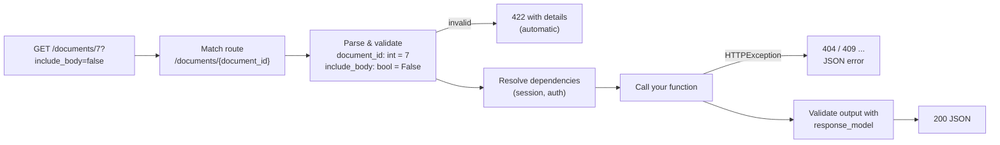

# 04 · FastAPI basics

<!-- nav:top -->
[Course home](../../README.md) › [Step 6 plan](../../steps/06-applied-python.md) › [Step 6 lessons](00-start-here.md) · [Glossary](../../GLOSSARY.md)
<!-- nav:end -->

## 1. In one sentence

**FastAPI** is a web framework where each route is a Python function whose **type hints** declare the path parameters, query parameters and request body; FastAPI validates the input, converts the output to JSON, and generates interactive **OpenAPI docs** at `/docs` automatically.

## 2. Why it exists

In Rails, a JSON API needs routes, a controller, strong parameters, a serializer, and something like rswag for docs. FastAPI folds these into one idea: **the function signature is the contract**.

```python
@router.get("/documents/{document_id}", response_model=DocumentRead)
async def get_document(document_id: int) -> Document: ...
```

From that line alone, FastAPI knows the URL, that `document_id` must be an integer (a string gives a 422 error), and what the JSON response looks like, and documents it all in `/docs`. It is also **async-first**, which suits I/O-heavy services (lesson 02). It is the most common choice for Python APIs and AI backends today.

## 3. Rails analogy

| Rails | FastAPI |
|---|---|
| `config/routes.rb` + controller action | a decorated function: `@router.get("/documents")` |
| `resources :documents` | an `APIRouter(prefix="/documents")` with one function per action |
| `params[:id]` from the path | a function parameter matching `{document_id}` in the path |
| `params[:limit]` from the query string | a function parameter not in the path (`limit: int = 20`) |
| `params.require(:document).permit(...)` | a Pydantic model parameter (`payload: DocumentCreate`) |
| `render json: doc, status: :created` | `return doc` + `status_code=201` on the decorator |
| Serializer / `as_json` | `response_model=DocumentRead` |
| `raise ActiveRecord::RecordNotFound` → 404 | `raise HTTPException(status_code=404, detail="...")` |
| `before_action` | dependencies (`Depends`, lesson 08) |
| `ActionController::API` app | `FastAPI()` app |
| Puma | uvicorn |
| rswag / OpenAPI docs | built in: `/docs` (Swagger UI) and `/openapi.json` |
| `bin/rails server` | `uv run fastapi dev src/kb_api/main.py` (with reload) |

## 4. How it works



Where each parameter comes from is decided by its type and name:

| Declared as | Comes from | Example |
|---|---|---|
| Name appears in the path (`{document_id}`) | the path | `document_id: int` |
| Simple type (`int`, `str`, `bool`), not in the path | the query string | `limit: int = 20` |
| A Pydantic model | the JSON request body | `payload: DocumentCreate` |
| `Annotated[str, Header()]` | a header | `x_api_key` → `X-API-Key` |
| `Annotated[X, Depends(fn)]` | a dependency | session, current user |

Use `Query(ge=1, le=100)` (and `Path`, `Header`) inside `Annotated[...]` to add validation rules and descriptions: `limit: Annotated[int, Query(ge=1, le=100)] = 20`.

### `async def` or `def`?

- Use **`async def`** when the function awaits async libraries (async SQLAlchemy, httpx `AsyncClient`). This is `kb-api`'s default.
- Use plain **`def`** if it calls blocking libraries: FastAPI then runs it in a thread pool so it does not block the event loop.
- Never call blocking code inside `async def` (lesson 02).

### The app object and routers

`main.py` creates `app = FastAPI(...)` and includes routers (`app.include_router(documents.router)`), like drawing routes from several files. The **lifespan** function runs code at startup and shutdown (create or close connection pools), a bit like an initializer plus an `at_exit` hook.

## 5. Minimal working example

This example is a small, self-contained version of the `kb-api` documents API, using an in-memory dict instead of a database so you can focus on FastAPI itself. (The [kb-api starter](../../starters/kb-api/src/kb_api/api/documents.py) has the database version.)

Create `mini_api.py`:

```python
from typing import Annotated

from fastapi import FastAPI, HTTPException, Query, status
from pydantic import BaseModel, Field

app = FastAPI(title="mini kb-api")


class DocumentIn(BaseModel):
    title: str = Field(min_length=1, max_length=200)
    body: str


class DocumentOut(BaseModel):
    id: int
    title: str
    words: int  # computed: not stored, but part of the response


DOCS: dict[int, DocumentIn] = {}


def to_out(doc_id: int, doc: DocumentIn) -> DocumentOut:
    return DocumentOut(id=doc_id, title=doc.title, words=len(doc.body.split()))


@app.post("/documents", response_model=DocumentOut, status_code=status.HTTP_201_CREATED)
async def create_document(payload: DocumentIn) -> DocumentOut:
    doc_id = len(DOCS) + 1
    DOCS[doc_id] = payload
    return to_out(doc_id, payload)


@app.get("/documents/{document_id}", response_model=DocumentOut)
async def get_document(document_id: int) -> DocumentOut:
    if document_id not in DOCS:
        raise HTTPException(status_code=404, detail=f"Document {document_id} not found")
    return to_out(document_id, DOCS[document_id])


@app.get("/documents", response_model=list[DocumentOut])
async def list_documents(
    q: str | None = None, limit: Annotated[int, Query(ge=1, le=100)] = 20
) -> list[DocumentOut]:
    matches = [to_out(i, d) for i, d in DOCS.items() if q is None or q.lower() in d.title.lower()]
    return matches[:limit]
```

Create `try_mini_api.py`, which calls the app in memory with FastAPI's `TestClient` (no server needed):

```python
from fastapi.testclient import TestClient

from mini_api import app

client = TestClient(app)


def show(label: str, response) -> None:
    print(f"{label:<28} {response.status_code} {response.json()}")


show("POST valid", client.post("/documents", json={"title": "Solid Queue", "body": "Jobs in Postgres"}))
show("POST empty title", client.post("/documents", json={"title": "", "body": "x"}))
show("GET /documents/1", client.get("/documents/1"))
show("GET /documents/abc", client.get("/documents/abc"))
show("GET /documents/99", client.get("/documents/99"))
show("GET /documents?q=solid", client.get("/documents", params={"q": "solid"}))
show("GET /documents?limit=500", client.get("/documents", params={"limit": 500}))
print("OpenAPI paths:", list(client.get("/openapi.json").json()["paths"]))
```

```bash
uv add "fastapi[standard]"
uv run python try_mini_api.py
```

Output:

```
POST valid                   201 {'id': 1, 'title': 'Solid Queue', 'words': 3}
POST empty title             422 {'detail': [{'type': 'string_too_short', 'loc': ['body', 'title'], 'msg': 'String should have at least 1 character', 'input': '', 'ctx': {'min_length': 1}}]}
GET /documents/1             200 {'id': 1, 'title': 'Solid Queue', 'words': 3}
GET /documents/abc           422 {'detail': [{'type': 'int_parsing', 'loc': ['path', 'document_id'], 'msg': 'Input should be a valid integer, unable to parse string as an integer', 'input': 'abc'}]}
GET /documents/99            404 {'detail': 'Document 99 not found'}
GET /documents?q=solid       200 [{'id': 1, 'title': 'Solid Queue', 'words': 3}]
GET /documents?limit=500     422 {'detail': [{'type': 'less_than_equal', 'loc': ['query', 'limit'], 'msg': 'Input should be less than or equal to 100', 'input': '500', 'ctx': {'le': 100}}]}
OpenAPI paths: ['/documents', '/documents/{document_id}']
```

(With recent Starlette versions you may also see a `StarletteDeprecationWarning` suggesting the `httpx2` package for `TestClient`; it is harmless here, and `uv add --dev httpx2` removes it. `kb-api`'s own tests use `httpx.AsyncClient` directly, lesson 10.)

Every 422 above came from FastAPI and Pydantic, not from code you wrote: an empty title, a non-integer path parameter, and a `limit` above 100. Now run the real server and open the interactive docs:

```bash
uv run fastapi dev mini_api.py      # then open http://127.0.0.1:8000/docs
```

## 6. Key terms

- **Path operation (function)**: a route handler, declared with `@app.get`, `@router.post` and so on.
- **Path / query / body parameter**: where an input comes from, decided by name and type.
- **`response_model`**: the Pydantic model used to validate and serialise the output.
- **`HTTPException`**: raise to return an error status with a JSON `detail`.
- **422 Unprocessable Content**: FastAPI's automatic response for invalid input.
- **`APIRouter`**: a group of related routes, included into the app.
- **Lifespan**: startup and shutdown code for the app.
- **uvicorn / ASGI**: the server / the interface between server and app.
- **OpenAPI / `/docs`**: the generated API description / its interactive UI.

## 7. Common mistakes

- **Blocking calls inside `async def`** (for example `requests.get`, a sync DB driver).
- **Returning database objects without a `response_model`**, leaking fields you did not mean to expose.
- **One Pydantic model for input and output**, so clients can send `id` or `created_at`.
- **Validating by hand** what a type or `Query(...)` constraint would do for you.
- **Putting all routes in `main.py`**; use routers per resource.
- **Forgetting the status code**: creation should be `201`, deletion usually `204`.

## 8. Check your understanding

1. How does FastAPI decide that `limit` comes from the query string and `payload` from the body?
2. What happens if a client calls `GET /documents/abc` when the parameter is `document_id: int`?
3. Why have separate `DocumentIn` and `DocumentOut` models?
4. When should a route be `def` instead of `async def`?
5. Where do you find the generated API documentation, and why is it valuable for Step 7?

<details>
<summary>Answers</summary>

1. `limit` is a simple type (`int`) not named in the path, so it is a query parameter; `payload` is a Pydantic model, so it is read from the JSON body.
2. FastAPI returns a 422 response describing the validation error; your function is never called.
3. Input and output differ: the client must not set `id`, and the output includes computed fields (`words`). Separate models make each contract explicit and safe.
4. When it calls blocking (synchronous) libraries; FastAPI then runs it in a thread pool.
5. At `/docs` (and `/openapi.json`). It is an exact, machine-readable description of your API, which helps you design tools and test calls in Step 7.

</details>

## 9. Go deeper (optional)

- [FastAPI Tutorial - User Guide](https://fastapi.tiangolo.com/tutorial/): "First Steps" to "Bigger Applications - Multiple Files".
- FastAPI docs: [Response Model](https://fastapi.tiangolo.com/tutorial/response-model/) and [Handling Errors](https://fastapi.tiangolo.com/tutorial/handling-errors/).
- FastAPI docs: [Lifespan Events](https://fastapi.tiangolo.com/advanced/events/).

<!-- nav:bottom -->

---

[← 03 · pandas basics](03-pandas-basics.md) · [Step 6 lessons](00-start-here.md) · [05 · Pydantic v2 and settings →](05-pydantic-and-settings.md)
<!-- nav:end -->
