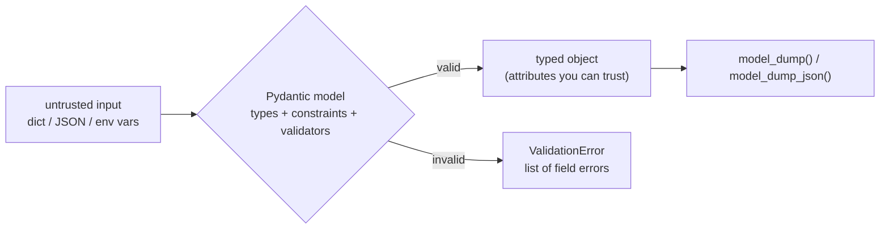

# 05 · Pydantic v2 and settings

## 1. In one sentence

**Pydantic** turns a class with type hints into a **validator and converter**: give it untrusted data (JSON, form input, environment variables) and you get either a typed object you can trust or a clear `ValidationError`; **pydantic-settings** does the same for configuration from environment variables.

## 2. Why it exists

Every service has a boundary where untrusted data comes in: request bodies, query strings, API responses, `.env` files. In Rails, this is spread across strong parameters, model validations, serializers and `ENV.fetch`. Pydantic handles all of these with one tool, driven by type hints:

- FastAPI uses Pydantic models for **request bodies** (validate input) and **response models** (shape output).
- You use it to validate **data from other APIs** (GitHub responses, model outputs in Step 7: the Anthropic SDK's `messages.parse` returns a Pydantic object).
- pydantic-settings loads **configuration** with types and defaults.

Pydantic v2 (current) is fast (its core is written in Rust) and its API differs from v1, so beware of old tutorials.

## 3. Rails analogy

| Rails | Pydantic |
|---|---|
| `params.require(:document).permit(:title, :body)` | `class DocumentCreate(BaseModel): title: str; body: str` (unknown fields are ignored by default) |
| `validates :title, length: { in: 1..200 }` | `title: str = Field(min_length=1, max_length=200)` |
| `validate :custom_rule` | `@field_validator("path")` / `@model_validator(mode="after")` |
| `errors.full_messages` | `ValidationError` with `.errors()` (field, message, input) |
| Serializer / `as_json(only: [...])` | a response model + `model_dump()` |
| `doc.attributes` | `model.model_dump()` |
| `ENV.fetch("DATABASE_URL")` | `Settings().database_url` (pydantic-settings) |
| `config/credentials.yml.enc` | environment variables / `.env` (never committed) + your secret store |

Where the analogy breaks: Pydantic **converts** input when it safely can (`"42"` becomes `42` for an `int` field) in its default "lax" mode, and a model is a plain data object, not tied to a database row.

## 4. How it works



### Defining models

```python
from pydantic import BaseModel, Field, field_validator

class DocumentCreate(BaseModel):
    title: str = Field(min_length=1, max_length=200)
    path: str
    tags: list[str] = []          # a new list per instance (Pydantic copies defaults)

    @field_validator("path")
    @classmethod
    def must_be_markdown(cls, value: str) -> str:
        if not value.endswith(".md"):
            raise ValueError("path must end with .md")
        return value
```

### The v2 method names

| Task | Pydantic v2 | (v1, in old tutorials) |
|---|---|---|
| Validate a dict | `Model.model_validate(data)` | `Model.parse_obj(data)` |
| Validate a JSON string | `Model.model_validate_json(text)` | `Model.parse_raw(text)` |
| Build from an object's attributes (for example a SQLAlchemy row) | `model_config = ConfigDict(from_attributes=True)` then `model_validate(obj)` | `orm_mode = True`, `from_orm` |
| To a dict / JSON | `model_dump()` / `model_dump_json()` | `.dict()` / `.json()` |
| Only fields the client sent (for PATCH) | `model_dump(exclude_unset=True)` | `.dict(exclude_unset=True)` |
| Copy with changes | `model_copy(update={...})` | `.copy(update=...)` |

### Create, update and read models

For each resource, `kb-api` uses three models, as in the starter's `schemas.py`:

- `DocumentCreate`: what a client may send to create (no `id`, no timestamps).
- `DocumentUpdate`: every field optional; applied with `exclude_unset=True` so that fields the client did not send are not overwritten with `None`.
- `DocumentRead`: what the API returns (includes `id` and timestamps; `from_attributes=True` to read from the SQLAlchemy object).

### Settings

```python
from pydantic_settings import BaseSettings, SettingsConfigDict

class Settings(BaseSettings):
    model_config = SettingsConfigDict(env_file=".env", extra="ignore")
    database_url: str = "postgresql+asyncpg://kb:kb@localhost:5432/kb"
    api_key: str
    github_token: str | None = None
```

Each field is read from the environment variable with the same name, case-insensitively (`DATABASE_URL`, `API_KEY`), then from `.env`, then from the default. A missing required field (`api_key` here) fails **at startup** with a clear error, instead of failing later on first use.

## 5. Minimal working example

Create `schemas_demo.py`:

```python
import os
from datetime import datetime

from pydantic import BaseModel, ConfigDict, Field, SecretStr, ValidationError, field_validator
from pydantic_settings import BaseSettings


class DocumentCreate(BaseModel):
    title: str = Field(min_length=1, max_length=200)
    path: str
    tags: list[str] = []

    @field_validator("path")
    @classmethod
    def must_be_markdown(cls, value: str) -> str:
        if not value.endswith(".md"):
            raise ValueError("path must end with .md")
        return value


class DocumentUpdate(BaseModel):
    title: str | None = Field(default=None, min_length=1, max_length=200)
    tags: list[str] | None = None


class DocumentRead(BaseModel):
    model_config = ConfigDict(from_attributes=True)
    id: int
    title: str
    created_at: datetime


# 1. Valid input, with type conversion and unknown fields ignored.
doc = DocumentCreate.model_validate({"title": "Kamal", "path": "docs/kamal.md", "admin": True})
print("1.", doc)

# 2. Invalid input: every problem reported at once.
try:
    DocumentCreate.model_validate({"title": "", "path": "docs/kamal.txt", "tags": "ops"})
except ValidationError as error:
    for e in error.errors():
        print("2.", e["loc"], "-", e["msg"])

# 3. PATCH semantics: only the fields the client sent.
patch = DocumentUpdate.model_validate({"tags": ["deploy"]})
print("3.", patch.model_dump(), "| exclude_unset:", patch.model_dump(exclude_unset=True))


# 4. Reading from an object's attributes (like a SQLAlchemy row).
class FakeRow:
    id = 7
    title = "Solid Queue"
    created_at = "2026-11-12T09:30:00Z"  # a string: converted to datetime
    secret_notes = "not exposed"


print("4.", DocumentRead.model_validate(FakeRow()).model_dump_json())


# 5. Settings from environment variables.
class Settings(BaseSettings):
    database_url: str = "postgresql+asyncpg://kb:kb@localhost:5432/kb"
    api_key: SecretStr  # masked when printed or logged
    github_token: SecretStr | None = None


os.environ["API_KEY"] = "s3cret"
os.environ["DATABASE_URL"] = "postgresql+asyncpg://kb:kb@db:5432/kb"
settings = Settings()
print("5.", settings)
print("   real value when you need it:", settings.api_key.get_secret_value())

del os.environ["API_KEY"]
try:
    Settings()
except ValidationError as error:
    print("6.", error.errors()[0]["loc"], "-", error.errors()[0]["msg"])
```

```bash
uv add pydantic-settings
uv run python schemas_demo.py
```

Output:

```
1. title='Kamal' path='docs/kamal.md' tags=[]
2. ('title',) - String should have at least 1 character
2. ('path',) - Value error, path must end with .md
2. ('tags',) - Input should be a valid list
3. {'title': None, 'tags': ['deploy']} | exclude_unset: {'tags': ['deploy']}
4. {"id":7,"title":"Solid Queue","created_at":"2026-11-12T09:30:00Z"}
5. database_url='postgresql+asyncpg://kb:kb@db:5432/kb' api_key=SecretStr('**********') github_token=None
   real value when you need it: s3cret
6. ('api_key',) - Field required
```

Line 4 shows two useful behaviours: the string timestamp became a `datetime`, and `secret_notes` does not appear because `DocumentRead` only declares the fields to expose. Line 5 shows `SecretStr`: printing or logging the settings masks secret values, and your code reads the real value only where it needs it, with `.get_secret_value()`. Line 6 is the "fail at startup" behaviour: a missing `API_KEY` is reported immediately.

## 6. Key terms

- **`BaseModel`**: the base class for Pydantic models.
- **Validation / coercion**: checking data / converting it to the declared type when safe.
- **`Field(...)`**: constraints and metadata for a field (`min_length`, `ge`, `examples`).
- **`field_validator` / `model_validator`**: custom checks for one field / the whole model.
- **`ValidationError`**: raised with a list of all field errors.
- **`from_attributes`**: build a model from an object's attributes (ORM rows).
- **`model_dump(exclude_unset=True)`**: only the fields that were explicitly provided.
- **`BaseSettings`**: a model filled from environment variables and `.env`.
- **`SecretStr`**: a string type that is masked (`**********`) when printed or logged.

## 7. Common mistakes

- **Mixing v1 and v2 APIs** from old tutorials (`orm_mode`, `.dict()`, `parse_obj`).
- **One model for create, update and read.**
- **Applying a PATCH without `exclude_unset=True`**, which overwrites untouched fields with `None`.
- **Reading `os.environ` all over the code** instead of one `Settings` object.
- **Committing `.env`.** Commit `.env.example` instead.
- **Plain `str` for secrets in settings**, so they appear in logs and error reports. Use `SecretStr`.
- **Returning ORM objects without a response model**, which may expose fields you did not intend.

## 8. Check your understanding

1. A client sends `{"title": "x", "path": "a.md", "is_admin": true}` to `DocumentCreate`. What happens to `is_admin`?
2. Why does `DocumentUpdate` make every field optional, and what does `exclude_unset=True` add?
3. What does `from_attributes=True` let you do?
4. What happens at startup if a required setting such as `API_KEY` is missing?
5. Translate `validates :path, format: { with: /\.md\z/ }` into Pydantic.

<details>
<summary>Answers</summary>

1. It is ignored (not part of the model), so a client cannot set it: like strong parameters.
2. A PATCH may send any subset of fields. `exclude_unset=True` returns only the fields actually sent, so you only change those.
3. Build a model from any object's attributes (such as a SQLAlchemy row) with `model_validate(obj)`.
4. Creating `Settings()` raises a `ValidationError` naming the missing field, so the app fails fast at startup.
5. A `@field_validator("path")` that raises `ValueError` if `not value.endswith(".md")` (or `Field(pattern=r"\.md$")`).

</details>

## 9. Go deeper (optional)

- [Pydantic docs](https://docs.pydantic.dev/latest/): Models, Fields, Validators, and the [v2 migration guide](https://docs.pydantic.dev/latest/migration/).
- [pydantic-settings docs](https://docs.pydantic.dev/latest/concepts/pydantic_settings/).
- FastAPI docs: [Body - Updates](https://fastapi.tiangolo.com/tutorial/body-updates/) (PATCH with `exclude_unset`).
