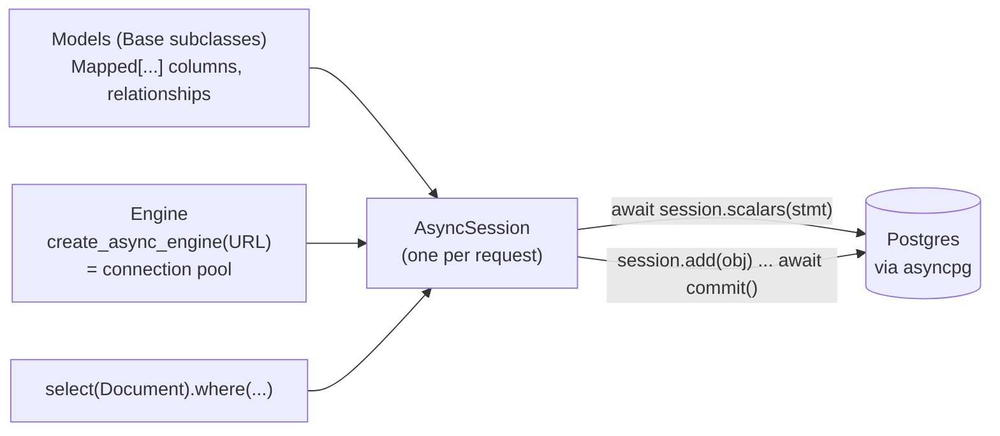

# 06 · SQLAlchemy 2.x with asyncio

<!-- nav:top -->
[Course home](../../README.md) › [Step 6 plan](../../steps/06-applied-python.md) › [Step 6 lessons](00-start-here.md) · [Glossary](../../GLOSSARY.md)
<!-- nav:end -->

## 1. In one sentence

**SQLAlchemy** is Python's main ORM (the Active Record of Python, but with a different design): you declare **models** with typed columns, build queries with **`select()`**, and run them through a **session**, which with `AsyncSession` and the `asyncpg` driver lets you `await` the database without blocking the event loop.

## 2. Why it exists

`kb-api` stores documents, sources and (in Step 7) chunks with embeddings in Postgres. You need:

- models mapped to tables, with types that mypy understands,
- a query builder that covers everything from simple lookups to full-text and vector search,
- transactions you control,
- **async** access, so a slow query does not block other requests (lesson 02).

SQLAlchemy 2.x provides all of this. Its design differs from Active Record in one important way (the **session**), and async mode forbids one Active Record habit (**lazy loading**). Those two points are most of what you need to learn.

## 3. Rails analogy

| Active Record | SQLAlchemy 2.x |
|---|---|
| `class Document < ApplicationRecord` | `class Document(Base):` with `__tablename__ = "documents"` |
| Columns come from the database schema | Columns are **declared** in the model: `title: Mapped[str] = mapped_column(String(200))` |
| `belongs_to :source` / `has_many :documents` | `relationship()` on both sides, plus a `ForeignKey` column |
| `Document.find(7)` | `await session.get(Document, 7)` |
| `Document.where(source_id: 3).order(:title).limit(5)` | `select(Document).where(Document.source_id == 3).order_by(Document.title).limit(5)` then `await session.scalars(stmt)` |
| `Document.create!(...)` | `session.add(Document(...))`, then `await session.commit()` |
| `doc.update!(title: "x")` | `doc.title = "x"`, then `await session.commit()` |
| `doc.destroy!` | `await session.delete(doc)`, then commit |
| `includes(:documents)` / `preload` | `.options(selectinload(Source.documents))` |
| `joins(:source)` | `.join(Document.source)` |
| `ActiveRecord::Base.transaction do` | `async with session.begin():` |
| Connection pool | the **engine** |
| (implicit per request) | an explicit **session** per request (lesson 08) |

**The key difference: the session (unit of work).** In Active Record, each model saves itself (`save!`) through a shared connection. In SQLAlchemy, a **session** tracks all objects you loaded or added. You change them like plain objects, and `commit()` writes all changes in one transaction. Nothing is written until you flush or commit.

## 4. How it works



### Declaring models (typed)

```python
class Base(DeclarativeBase):
    pass

class Source(Base):
    __tablename__ = "sources"
    id: Mapped[int] = mapped_column(primary_key=True)
    repo: Mapped[str] = mapped_column(String(200), unique=True)
    documents: Mapped[list["Document"]] = relationship(back_populates="source")

class Document(Base):
    __tablename__ = "documents"
    id: Mapped[int] = mapped_column(primary_key=True)
    title: Mapped[str] = mapped_column(String(200))
    source_id: Mapped[int | None] = mapped_column(ForeignKey("sources.id"))
    source: Mapped["Source | None"] = relationship(back_populates="documents")
```

`Mapped[str]` means NOT NULL; `Mapped[int | None]` means nullable. mypy understands these types.

### Querying: build a statement, then execute it

```python
stmt = select(Document).where(Document.title.ilike("%queue%")).order_by(Document.id).limit(10)
documents = (await session.scalars(stmt)).all()      # list[Document]
count = await session.scalar(select(func.count()).select_from(Document))
```

- `session.scalars(stmt)` returns model objects; `session.execute(stmt)` returns rows (tuples), useful when selecting several columns.
- Statements are **plain objects** you can compose, like Active Record relations, but nothing runs until you `await` them in a session.

### Why lazy loading fails in async

In Active Record, `source.documents` runs a query the first time you touch it (lazy loading). In async SQLAlchemy, touching an unloaded relationship would need a hidden, blocking query, so it **raises an error** (`MissingGreenlet`) instead. You must load relationships **up front**:

```python
stmt = select(Source).options(selectinload(Source.documents))   # like preload: one extra IN query
```

This is a feature: N+1 queries become impossible to write by accident.

### Sessions and transactions

- One `AsyncSession` per request (the starter's `get_session` dependency does this).
- `await session.commit()` writes pending changes; on an exception, call `await session.rollback()` (or let `async with session.begin():` do it).
- `expire_on_commit=False` (set in the starter) keeps attributes readable after commit without another query, which matters in async code.

## 5. Minimal working example

Start Postgres from the starter (`docker compose up -d db` in `kb-api`).

Create `sqla_demo.py`:

```python
import asyncio
import os

from sqlalchemy import ForeignKey, String, func, select
from sqlalchemy.exc import MissingGreenlet
from sqlalchemy.ext.asyncio import async_sessionmaker, create_async_engine
from sqlalchemy.orm import DeclarativeBase, Mapped, mapped_column, relationship, selectinload

DATABASE_URL = os.environ.get("DATABASE_URL", "postgresql+asyncpg://kb:kb@localhost:5432/kb")


class Base(DeclarativeBase):
    pass


class Source(Base):
    __tablename__ = "demo_sources"
    id: Mapped[int] = mapped_column(primary_key=True)
    repo: Mapped[str] = mapped_column(String(200), unique=True)
    documents: Mapped[list["Document"]] = relationship(back_populates="source")


class Document(Base):
    __tablename__ = "demo_documents"
    id: Mapped[int] = mapped_column(primary_key=True)
    title: Mapped[str] = mapped_column(String(200))
    words: Mapped[int]
    source_id: Mapped[int] = mapped_column(ForeignKey("demo_sources.id"))
    source: Mapped[Source] = relationship(back_populates="documents")


async def main() -> None:
    engine = create_async_engine(DATABASE_URL)
    async with engine.begin() as conn:  # demo only: in kb-api, Alembic creates tables
        await conn.run_sync(Base.metadata.drop_all)
        await conn.run_sync(Base.metadata.create_all)

    Session = async_sessionmaker(engine, expire_on_commit=False)

    # 1. Create: add objects to the session, then commit once.
    async with Session() as session:
        queue = Source(repo="rails/solid_queue")
        kamal = Source(repo="basecamp/kamal")
        session.add_all([
            Document(title="Solid Queue README", words=2400, source=queue),
            Document(title="Recurring tasks", words=640, source=queue),
            Document(title="Kamal README", words=1800, source=kamal),
        ])
        await session.commit()

    async with Session() as session:
        # 2. where + order_by + limit (like a scope chain).
        stmt = select(Document).where(Document.words > 1000).order_by(Document.words.desc())
        print("2.", [d.title for d in (await session.scalars(stmt)).all()])

        # 3. Aggregate with a join and group_by (like joins + group + sum).
        totals = select(Source.repo, func.sum(Document.words)).join(Source.documents).group_by(Source.repo)
        print("3.", sorted((await session.execute(totals)).all()))

        # 4. Find by primary key, update, commit.
        doc = await session.get(Document, 2)
        doc.title = "Recurring tasks (updated)"
        await session.commit()
        print("4.", (await session.get(Document, 2)).title)

    async with Session() as session:
        # 5. Lazy loading is an error in async mode...
        source = await session.scalar(select(Source).where(Source.repo == "rails/solid_queue"))
        try:
            print(len(source.documents))
        except MissingGreenlet:
            print("5. lazy load refused: use selectinload")

        # 6. ...so load the relationship up front (like preload).
        stmt = select(Source).options(selectinload(Source.documents)).order_by(Source.repo)
        for s in (await session.scalars(stmt)).all():
            print("6.", s.repo, "->", sorted(d.title for d in s.documents))

    print("SQL for query 2:", str(select(Document.id).where(Document.words > 1000)).replace("\n", " "))
    await engine.dispose()


asyncio.run(main())
```

```bash
DATABASE_URL=postgresql+asyncpg://kb:kb@localhost:5432/kb uv run python sqla_demo.py
```

Output (tested on PostgreSQL 16 with SQLAlchemy 2.1):

```
2. ['Solid Queue README', 'Kamal README']
3. [('basecamp/kamal', 1800), ('rails/solid_queue', 3040)]
4. Recurring tasks (updated)
5. lazy load refused: use selectinload
6. basecamp/kamal -> ['Kamal README']
6. rails/solid_queue -> ['Recurring tasks (updated)', 'Solid Queue README']
SQL for query 2: SELECT demo_documents.id  FROM demo_documents  WHERE demo_documents.words > :words_1
```

Line 5 is the important one for Rails developers: touching `source.documents` without loading it raised an error instead of silently running an extra query. Line 6 loads the documents up front with `selectinload`.

## 6. Key terms

- **ORM**: maps classes to tables and objects to rows.
- **Engine**: the connection pool and dialect for one database URL.
- **Session / `AsyncSession`**: a unit of work that tracks objects and runs one transaction at a time.
- **`DeclarativeBase`, `Mapped`, `mapped_column`**: typed model declarations.
- **`relationship` / `ForeignKey`**: associations between models.
- **`select()`**: builds a query statement; executed with `session.scalars` or `session.execute`.
- **`selectinload`**: eager-loads a relationship with a second `IN` query (like `preload`).
- **`MissingGreenlet`**: the error when async code triggers a lazy load.
- **`expire_on_commit`**: whether objects reload their attributes after commit.

## 7. Common mistakes

- **Forgetting `await`** on `session.scalars`, `session.get`, `session.commit`.
- **Touching unloaded relationships** in async code; add `selectinload` (or `joinedload`) to the query.
- **Sharing one session across requests** or tasks. One session per request.
- **Old 1.x style** from tutorials (`session.query(Model).filter(...)`): it works in sync code, but new code uses `select()`.
- **Forgetting to commit**, then wondering why nothing was saved.
- **Using `create_all` in the app** instead of migrations (lesson 07); it is fine in tests and demos only.
- **Using the sync driver** (`postgresql://` with psycopg2) with `create_async_engine`: use `postgresql+asyncpg://`.

## 8. Check your understanding

1. What is the SQLAlchemy equivalent of `Document.where(source_id: 3).order(:title).limit(5)`?
2. What does `session.commit()` do that `doc.title = "x"` alone does not?
3. Why does `source.documents` raise `MissingGreenlet` in async code, and how do you fix it?
4. When would you use `session.execute` instead of `session.scalars`?
5. Why is `expire_on_commit=False` useful in async code?

<details>
<summary>Answers</summary>

1. `await session.scalars(select(Document).where(Document.source_id == 3).order_by(Document.title).limit(5))`
2. It flushes all pending changes tracked by the session to the database in a transaction and commits it; changing the attribute only marks the object as dirty in memory.
3. The relationship was not loaded, and loading it lazily would need an implicit query, which async mode forbids. Load it in the original query with `.options(selectinload(Source.documents))`.
4. When you select columns or expressions rather than whole model objects (for example `select(Source.repo, func.sum(...))`), you get rows (tuples).
5. After commit, attributes stay loaded, so reading them does not trigger new (implicit) queries, which would fail or be wasteful in async code.

</details>

## 9. Go deeper (optional)

- SQLAlchemy docs: [ORM Quick Start](https://docs.sqlalchemy.org/en/20/orm/quickstart.html) and the [Unified Tutorial](https://docs.sqlalchemy.org/en/20/tutorial/index.html) (the 2.0 docs apply to 2.1).
- SQLAlchemy docs: [Asynchronous I/O (asyncio)](https://docs.sqlalchemy.org/en/20/orm/extensions/asyncio.html), especially "Preventing Implicit IO when Using AsyncSession".
- Harry Percival & Bob Gregory, *Architecture Patterns with Python*, chapters 1-2 (repository pattern, unit of work).

<!-- nav:bottom -->

---

[← 05 · Pydantic v2 and settings](05-pydantic-and-settings.md) · [Step 6 lessons](00-start-here.md) · [07 · Alembic migrations →](07-alembic-migrations.md)
<!-- nav:end -->
