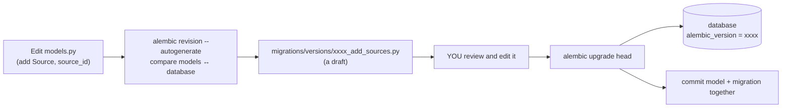

# 07 · Alembic migrations

## 1. In one sentence

**Alembic** is SQLAlchemy's migration tool (Python's `db/migrate`): each migration is a Python file with `upgrade()` and `downgrade()` functions, and `alembic revision --autogenerate` can **draft** one by comparing your models with the database, which you then **review** and apply with `alembic upgrade head`.

## 2. Why it exists

Your schema changes over the life of `kb-api`: Step 6 adds `sources` and a full-text column, Step 7 adds `chunks` with a `vector(384)` column and an HNSW index. You need what Rails migrations give you:

- a versioned, ordered history of schema changes in Git,
- one command to bring any database (laptop, CI, production) to the latest version,
- the ability to roll back.

`Base.metadata.create_all()` (used in tests and demos) only creates missing tables; it never alters existing ones. Real databases need migrations.

## 3. Rails analogy

| Rails | Alembic |
|---|---|
| `db/migrate/20261112093000_add_sources.rb` | `migrations/versions/9fcbf680ac6f_add_sources.py` |
| Timestamp version | Revision ID + `down_revision` (a linked list) |
| `schema_migrations` table | `alembic_version` table (stores the current head) |
| `bin/rails g migration AddSources` (empty) | `alembic revision -m "add sources"` (empty) |
| (no equivalent: Rails never guesses) | `alembic revision --autogenerate -m "..."` (drafted from model changes) |
| `bin/rails db:migrate` | `alembic upgrade head` |
| `bin/rails db:rollback` | `alembic downgrade -1` |
| `bin/rails db:migrate:status` | `alembic current` / `alembic history` |
| `def change` (reversible automatically) | explicit `upgrade()` and `downgrade()` |
| `add_column`, `add_index`, `create_table` | `op.add_column`, `op.create_index`, `op.create_table` |
| `execute "CREATE EXTENSION vector"` | `op.execute("CREATE EXTENSION IF NOT EXISTS vector")` |
| `algorithm: :concurrently` + `disable_ddl_transaction!` | `postgresql_concurrently=True` + running outside a transaction (`with op.get_context().autocommit_block():`) |
| `db/schema.rb` | no equivalent file; the models are the source of truth |

Where the analogy breaks: in Rails, the **database** is the source of truth and models read columns from it. In SQLAlchemy, the **models** declare the columns; Alembic's autogenerate compares them with the database to draft a migration.

## 4. How it works



### How the starter is set up

- `alembic init -t async migrations` created `alembic.ini` and `migrations/` with an **async** `env.py` (it runs migrations through an async engine).
- `migrations/env.py` was edited in two places: it sets the database URL from the app's settings (`DATABASE_URL`), and it sets `target_metadata = Base.metadata` so autogenerate can see your models.
- `Base` has a **naming convention** for constraints and indexes (`pk_documents`, `uq_sources_repo`, `fk_documents_source_id_sources`). Without it, Postgres invents names that Alembic does not know, and the generated `downgrade()` **fails**. This is a real warning from an earlier version of the starter:

```
UserWarning: Autogenerate rendered a drop_constraint() directive for an unnamed constraint on table 'documents';
the migration will fail unless a constraint name is added to the directive.
Consider using a naming convention so that constraint names are known ahead of time.
```

### What autogenerate detects, and what it misses

| Detects well | Misses or gets wrong (check by hand) |
|---|---|
| New or removed tables and columns | **Renames** (it sees a drop plus an add, which **loses data**) |
| Nullable changes, new indexes, unique constraints, foreign keys | Data migrations (backfills) |
| Many type changes | Extensions (`CREATE EXTENSION vector`), custom types, triggers |
| | Columns that exist only in the database: if you add a column with raw SQL and not in the model, the **next** autogenerate proposes dropping it |
| | Anything needing `CONCURRENTLY` or batching for large tables (Step 2 thinking applies) |

So the workflow is always: **autogenerate, read, edit, test**. Keep data backfills in separate migrations from schema changes, just as in Rails.

## 5. Minimal working example

Work in your copy of the [kb-api starter](../../starters/kb-api/README.md) with Postgres running (`docker compose up -d db`, `uv run alembic upgrade head`).

**1. Change the models.** In `src/kb_api/models.py`, add a `Source` model and a `source_id` column on `Document` (add `ForeignKey` to the `sqlalchemy` import):

```python
class Source(Base):
    __tablename__ = "sources"

    id: Mapped[int] = mapped_column(primary_key=True)
    repo: Mapped[str] = mapped_column(String(200), unique=True)  # e.g. "rails/solid_queue"
    path_prefix: Mapped[str] = mapped_column(String(200), default="")


class Document(Base):
    # ... existing columns ...
    source_id: Mapped[int | None] = mapped_column(ForeignKey("sources.id"), index=True)
```

**2. Draft the migration:**

```bash
uv run alembic revision --autogenerate -m "add sources"
```

The important lines of the output (tested):

```
INFO  [alembic.autogenerate.compare.tables] Detected added table 'sources'
INFO  [alembic.autogenerate.compare.tables] Detected added column 'documents.source_id'
INFO  [alembic.autogenerate.compare.constraints] Detected added index 'ix_documents_source_id' on '('source_id',)'
INFO  [alembic.autogenerate.compare.constraints] Detected added foreign key (source_id)(id) on table documents
Generating migrations/versions/9fcbf680ac6f_add_sources.py ...  done
```

**3. Read the generated file.** This is what autogenerate wrote:

```python
def upgrade() -> None:
    """Upgrade schema."""
    op.create_table('sources',
    sa.Column('id', sa.Integer(), nullable=False),
    sa.Column('repo', sa.String(length=200), nullable=False),
    sa.Column('path_prefix', sa.String(length=200), nullable=False),
    sa.PrimaryKeyConstraint('id', name=op.f('pk_sources')),
    sa.UniqueConstraint('repo', name=op.f('uq_sources_repo'))
    )
    op.add_column('documents', sa.Column('source_id', sa.Integer(), nullable=True))
    op.create_index(op.f('ix_documents_source_id'), 'documents', ['source_id'], unique=False)
    op.create_foreign_key(op.f('fk_documents_source_id_sources'), 'documents', 'sources', ['source_id'], ['id'])


def downgrade() -> None:
    """Downgrade schema."""
    op.drop_constraint(op.f('fk_documents_source_id_sources'), 'documents', type_='foreignkey')
    op.drop_index(op.f('ix_documents_source_id'), table_name='documents')
    op.drop_column('documents', 'source_id')
    op.drop_table('sources')
```

Check it like a Rails migration review: the new column is nullable (safe on a table with data), every constraint has a name (thanks to the naming convention), and `downgrade()` reverses `upgrade()` in the opposite order.

**4. Apply, inspect, roll back, re-apply:**

```bash
uv run alembic upgrade head
uv run alembic history
uv run alembic downgrade -1
uv run alembic upgrade head
```

Output (tested; Alembic's context lines removed):

```
INFO  [alembic.runtime.migration] Running upgrade 0001 -> 9fcbf680ac6f, add sources

0001 -> 9fcbf680ac6f (head), add sources
<base> -> 0001, create documents

INFO  [alembic.runtime.migration] Running downgrade 9fcbf680ac6f -> 0001, add sources
INFO  [alembic.runtime.migration] Running upgrade 0001 -> 9fcbf680ac6f, add sources
```

Running `downgrade -1` then `upgrade head` once, locally, is a cheap test that both directions work.

**5. Generated columns: declare them in the model.** The full-text column from lesson 09 is computed by Postgres. Declare it in `Document` with `Computed(...)`, so the model knows about it and autogenerate can draft it:

```python
from sqlalchemy import Computed, Index            # add to the existing sqlalchemy import
from sqlalchemy.dialects.postgresql import TSVECTOR  # next to ARRAY


class Document(Base):
    __tablename__ = "documents"
    __table_args__ = (Index("ix_documents_search_vector", "search_vector", postgresql_using="gin"),)
    # ... existing columns ...
    # Filled in by Postgres on every write; never set it from Python.
    search_vector: Mapped[str] = mapped_column(
        TSVECTOR, Computed("to_tsvector('english', title || ' ' || body)", persisted=True)
    )
```

`uv run alembic revision --autogenerate -m "add search vector"` then drafts (tested):

```python
op.add_column('documents', sa.Column('search_vector', postgresql.TSVECTOR(), sa.Computed("to_tsvector('english', title || ' ' || body)", persisted=True), nullable=False))
op.create_index('ix_documents_search_vector', 'documents', ['search_vector'], unique=False, postgresql_using='gin')
```

After `upgrade head`, `uv run alembic check` prints `No new upgrade operations detected.`: models and database agree. (If you add a column with raw SQL only, `alembic check` and the next autogenerate propose **dropping** it. Tested: that is exactly what happened before the column was declared in the model.)

**6. Extensions: write them by hand.** Autogenerate does not know about Postgres extensions. For Step 7's pgvector, create an empty revision (`uv run alembic revision -m "enable pgvector"`) and fill it in:

```python
def upgrade() -> None:
    op.execute("CREATE EXTENSION IF NOT EXISTS vector")


def downgrade() -> None:
    op.execute("DROP EXTENSION IF EXISTS vector")
```

## 6. Key terms

- **Revision**: one migration file, with a revision ID and a `down_revision`.
- **Head**: the latest revision; `upgrade head` applies all pending ones.
- **`alembic_version`**: the table that stores the current revision.
- **Autogenerate**: drafting a migration by comparing models and the database.
- **`op`**: Alembic's operations API (`op.create_table`, `op.add_column`, `op.execute`...).
- **Naming convention**: rules that give constraints and indexes predictable names.
- **`target_metadata`**: the models' metadata that autogenerate compares against.

## 7. Common mistakes

- **Applying autogenerated migrations without reading them.**
- **Renaming a column in the model** and accepting autogenerate's drop + add, which deletes the data. Write `op.alter_column("documents", "name", new_column_name="title")` by hand.
- **No naming convention**, so downgrades fail on unnamed constraints.
- **Schema changes and data backfills in one migration.**
- **`create_all` in application code** alongside Alembic: the two fight over the schema.
- **Editing a migration that has already run elsewhere** (in CI or production). Add a new one instead.
- **Forgetting that `env.py` must import your models**, so autogenerate "detects" that every table should be dropped.

## 8. Check your understanding

1. What is the Alembic equivalent of `bin/rails db:migrate` and `db:rollback`?
2. Why must you review an autogenerated migration before applying it? Give two things it can get wrong.
3. What problem does the naming convention in `Base.metadata` solve?
4. You rename `Document.name` to `Document.title` in the model. What does autogenerate produce, and what should you write instead?
5. Why must `CREATE EXTENSION vector` be written by hand, and why must the generated `tsvector` column be declared in the model?

<details>
<summary>Answers</summary>

1. `alembic upgrade head` and `alembic downgrade -1`.
2. It can turn a rename into drop + add (data loss), miss extensions, triggers and some defaults, propose dropping columns that exist only in the database, and it knows nothing about data backfills or large-table safety (`CONCURRENTLY`).
3. Constraints and indexes get predictable names, so Alembic can refer to them in `downgrade()` and later migrations; without names, generated drop operations fail.
4. A `drop_column("name")` plus `add_column("title")`, which loses the data. Write `op.alter_column("documents", "name", new_column_name="title")` (and the reverse in `downgrade`).
5. Autogenerate only compares what the models describe (tables, columns, indexes, constraints). Extensions are not part of any model, so you write them with `op.execute`. A generated column that is not in the model looks like an unknown column, so autogenerate would propose dropping it; declaring it with `Computed(...)` lets autogenerate draft it correctly and lets queries use `Document.search_vector`.

</details>

## 9. Go deeper (optional)

- Alembic docs: [Tutorial](https://alembic.sqlalchemy.org/en/latest/tutorial.html) and [Auto Generating Migrations](https://alembic.sqlalchemy.org/en/latest/autogenerate.html) ("What does Autogenerate Detect (and what does it not detect?)").
- Alembic docs: [The Importance of Naming Constraints](https://alembic.sqlalchemy.org/en/latest/naming.html).
- Alembic cookbook: [Using Asyncio with Alembic](https://alembic.sqlalchemy.org/en/latest/cookbook.html#using-asyncio-with-alembic).
