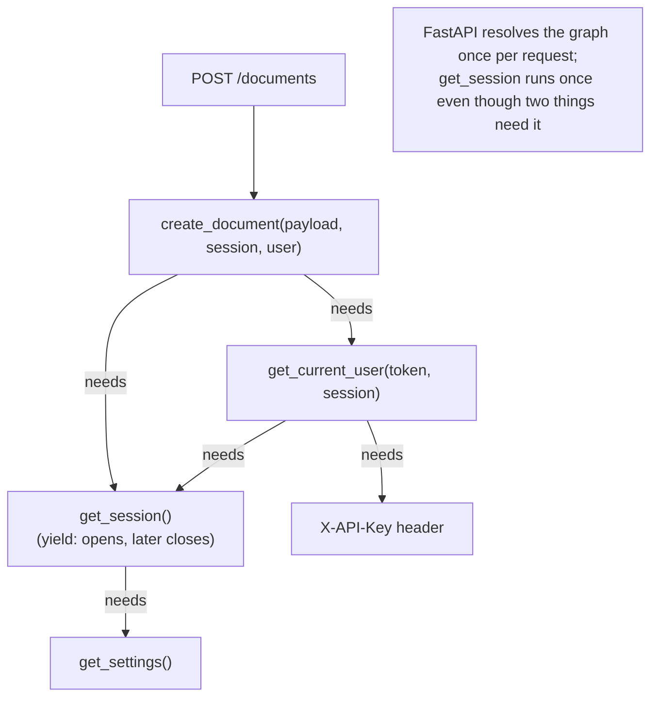

# 08 · Dependency injection in FastAPI

## 1. In one sentence

A FastAPI **dependency** is a function that FastAPI calls **before** your route to provide something the route needs (a database session, the current user, settings); you declare it with `Depends`, FastAPI resolves the whole chain for each request, and tests can **override** any dependency.

## 2. Why it exists

Every route in `kb-api` needs a database session, write routes need an API key check, and later some routes need the GitHub client or the current user. In Rails you use:

- `before_action :authenticate` for checks,
- `current_user` helper methods,
- the implicit database connection of the request.

FastAPI makes these **explicit parameters**. Benefits:

- A route's signature shows everything it depends on.
- Dependencies can depend on other dependencies (settings → session, token → user).
- A dependency with `yield` gets **cleanup after the response** (close the session), like an `around_action`.
- In tests you swap a dependency for another (`app.dependency_overrides`), for example a session inside a rolled-back transaction, without monkeypatching.

## 3. Rails analogy

| Rails | FastAPI |
|---|---|
| `before_action :require_api_key` | `dependencies=[Depends(require_api_key)]` on the route (or router) |
| `current_user` helper | `user: Annotated[User, Depends(get_current_user)]` parameter |
| `around_action` that opens and closes something | a dependency with `yield` (code after `yield` runs after the response) |
| `Rails.application.config` / credentials | `settings: Annotated[Settings, Depends(get_settings)]` |
| Request-scoped memoisation (`@current_user \|\|= ...`) | FastAPI caches each dependency's result **per request** |
| Stubbing in request specs | `app.dependency_overrides[get_session] = fake_session` |

## 4. How it works



### Writing dependencies

```python
from typing import Annotated
from fastapi import Depends, Header, HTTPException

def get_settings() -> Settings: ...

async def get_session() -> AsyncIterator[AsyncSession]:
    async with SessionLocal() as session:
        yield session              # the route runs here; afterwards the session is closed

async def get_current_user(
    session: Annotated[AsyncSession, Depends(get_session)],
    x_api_key: Annotated[str | None, Header()] = None,
) -> User:
    user = await find_user_by_key(session, x_api_key)
    if user is None:
        raise HTTPException(status_code=401, detail="Invalid API key")
    return user

SessionDep = Annotated[AsyncSession, Depends(get_session)]   # a reusable alias
CurrentUser = Annotated[User, Depends(get_current_user)]

@router.post("/documents")
async def create_document(payload: DocumentCreate, session: SessionDep, user: CurrentUser): ...
```

- **Parameter-style**: `user: CurrentUser` when the route **uses** the value.
- **Decorator-style**: `@router.post(..., dependencies=[Depends(require_api_key)])` when you only need the **check** (like a `before_action` that does not set anything).
- **Router-wide**: `APIRouter(dependencies=[...])` applies to every route in it.

### Per-request caching

If `get_current_user` and the route both depend on `get_session`, FastAPI calls `get_session` **once** per request and passes the same session to both. That is why the session in the starter is shared correctly within a request.

### Overriding in tests

```python
app.dependency_overrides[get_session] = override_session   # test DB session
app.dependency_overrides[get_settings] = lambda: Settings(api_key="test-key")
```

The keys are the **original functions**; FastAPI calls the override instead. The starter's `tests/conftest.py` overrides `get_session` this way (lesson 10).

## 5. Minimal working example

Create `deps_demo.py`. It uses an in-memory "database" so you can focus on the dependency mechanics, and prints when things open and close:

```python
from collections.abc import Iterator
from typing import Annotated

from fastapi import Depends, FastAPI, Header, HTTPException

app = FastAPI()
LOG: list[str] = []
USERS = {"key-ana": "ana", "key-ben": "ben"}


class FakeSession:
    def __init__(self) -> None:
        LOG.append("session opened")

    def find_user(self, api_key: str | None) -> str | None:
        return USERS.get(api_key or "")


def get_session() -> Iterator[FakeSession]:
    session = FakeSession()
    try:
        yield session
    finally:
        LOG.append("session closed")  # runs after the response, like an around_action


SessionDep = Annotated[FakeSession, Depends(get_session)]


def get_current_user(session: SessionDep, x_api_key: Annotated[str | None, Header()] = None) -> str:
    user = session.find_user(x_api_key)
    if user is None:
        raise HTTPException(status_code=401, detail="Invalid API key")
    return user


CurrentUser = Annotated[str, Depends(get_current_user)]


def require_admin(user: CurrentUser) -> None:
    if user != "ana":
        raise HTTPException(status_code=403, detail="Admins only")


@app.get("/me")
def me(user: CurrentUser, session: SessionDep) -> dict[str, str]:
    LOG.append(f"route ran for {user}")
    return {"user": user}


@app.delete("/documents/{doc_id}", dependencies=[Depends(require_admin)])
def delete_document(doc_id: int) -> dict[str, str]:
    return {"deleted": str(doc_id)}
```

Create `try_deps.py`:

```python
from fastapi.testclient import TestClient

from deps_demo import LOG, app, get_current_user

client = TestClient(app)

r = client.get("/me", headers={"X-API-Key": "key-ana"})
print("1.", r.status_code, r.json(), "| log:", LOG)
LOG.clear()

print("2.", client.get("/me").status_code, client.get("/me").json())
print("3.", client.delete("/documents/7", headers={"X-API-Key": "key-ben"}).json())
print("4.", client.delete("/documents/7", headers={"X-API-Key": "key-ana"}).json())

# 5. Override a dependency, as tests do.
app.dependency_overrides[get_current_user] = lambda: "test-user"
print("5.", client.get("/me").json())
app.dependency_overrides.clear()
```

```bash
uv run python try_deps.py 2>/dev/null
```

Output:

```
1. 200 {'user': 'ana'} | log: ['session opened', 'route ran for ana', 'session closed']
2. 401 {'detail': 'Invalid API key'}
3. {'detail': 'Admins only'}
4. {'deleted': '7'}
5. {'user': 'test-user'}
```

Line 1 shows the order: the session was opened **once** (even though both `get_current_user` and the route asked for it), the route ran, and the session was closed afterwards. Line 5 shows how tests replace the authentication dependency without touching the route code.

## 6. Key terms

- **Dependency**: a function whose result FastAPI injects into a route.
- **`Depends(fn)`**: declares a dependency.
- **`Annotated[Type, Depends(fn)]`**: the recommended way to declare it, reusable as an alias.
- **Sub-dependency**: a dependency that depends on another.
- **Yield dependency**: setup before `yield`, cleanup after the response.
- **Per-request cache**: each dependency runs at most once per request.
- **`dependency_overrides`**: a dict to replace dependencies (mainly in tests).

## 7. Common mistakes

- **Opening sessions or clients inside route bodies**, instead of via dependencies (harder to test, easy to leak).
- **Forgetting `try/finally` around `yield`**, so cleanup does not run when the route raises.
- **Global mutable state** instead of dependencies (for example a module-level session shared by all requests).
- **Overriding the wrong function**: the key must be the exact function used in `Depends(...)`.
- **Leaving overrides in place** between tests: clear them (`app.dependency_overrides.clear()`), or create a new app per test as the starter does.
- **Heavy work in dependencies that many routes use**, such as loading a full user profile when only the ID is needed.

## 8. Check your understanding

1. How do you express `before_action :require_api_key, only: [:create, :update, :destroy]` in FastAPI?
2. Two dependencies of a route both depend on `get_session`. How many sessions are created per request?
3. When does the code after `yield` in `get_session` run?
4. How does the starter give each test a database session inside a rolled-back transaction?
5. When would you use `dependencies=[Depends(...)]` rather than a parameter?

<details>
<summary>Answers</summary>

1. Add `dependencies=[Depends(require_api_key)]` to the create, update and delete routes (the starter uses a `WriteAccess = Depends(require_api_key)` shortcut).
2. One: FastAPI caches dependency results per request.
3. After the response has been produced (including when the route raised, if you use `try/finally`).
4. `tests/conftest.py` sets `app.dependency_overrides[get_session]` to a function that yields the test session bound to a connection with an open transaction, which is rolled back after the test.
5. When you need the dependency's side effect (a check that may raise 401/403) but not its return value.

</details>

## 9. Go deeper (optional)

- FastAPI docs: [Dependencies](https://fastapi.tiangolo.com/tutorial/dependencies/) (including "Dependencies with yield" and "Dependencies in path operation decorators").
- FastAPI docs: [Testing Dependencies with Overrides](https://fastapi.tiangolo.com/advanced/testing-dependencies/).
- FastAPI docs: [Security - First Steps](https://fastapi.tiangolo.com/tutorial/security/first-steps/) (for real authentication later).
