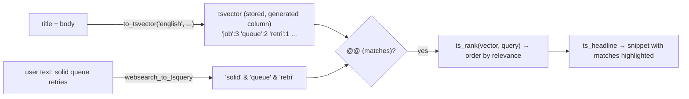

# 09 · Full-text search and cursor pagination

## 1. In one sentence

Postgres **full-text search** matches processed words (a `tsvector` column, a `tsquery` from the user's text, `ts_rank` to order by relevance), and **cursor (keyset) pagination** pages through results with "rows after id X" instead of `OFFSET`, so pages stay fast and stable while data changes.

## 2. Why it exists

`kb-api` needs `GET /search?q=...` (Saturday of week 1) and a paginated `GET /documents`. You may know full-text search from `pg_search` in Rails, and pagination from Kaminari or Pagy (which use `OFFSET`). Here you implement both directly:

- **Full-text search** is built into Postgres: no extra service, transactional, and fast with a GIN index. It is also half of Step 7's hybrid search.
- **Offset pagination** has two problems: `OFFSET 10000` makes Postgres read and discard 10,000 rows, and if rows are inserted or deleted while a client pages, it **skips or repeats** items. A **cursor** avoids both. (You met the idea in Step 3's API design.)

## 3. Rails analogy

| Rails | kb-api |
|---|---|
| `pg_search_scope :search, against: [:title, :body]` | a generated `search_vector` column + `websearch_to_tsquery` + `ts_rank` |
| `Document.search("solid queue")` | `select(Document).where(Document.search_vector.op("@@")(query)).order_by(rank.desc())` |
| `pg_search` highlight | `ts_headline(...)` |
| `Document.page(3).per(20)` (Kaminari: `OFFSET 40 LIMIT 20`) | `where(Document.id > cursor).order_by(Document.id).limit(20)` |
| `total_pages` | usually not provided with cursors; return `next_cursor` instead |

## 4. How it works

### Full-text search, step by step



- `to_tsvector('english', text)` lowercases, drops stop words, and **stems** words ("retrying" → `retri`), keeping positions.
- `websearch_to_tsquery('english', text)` parses what a user types into a web search box: words are ANDed, `"quoted phrases"` must appear together, `-word` excludes, `or` gives alternatives. It never raises a syntax error, unlike `to_tsquery`.
- `@@` tests a match; `ts_rank` scores it (more matches, closer together, rank higher).
- Make the `tsvector` a **stored generated column** with a **GIN index**, so it is computed on write and searched quickly (lesson 07, part 5, shows how to declare it in the `Document` model and generate the migration).

### Cursor (keyset) pagination

```
Page 1: SELECT ... ORDER BY id LIMIT 21                 → return 20, next_cursor = id of the 20th
Page 2: SELECT ... WHERE id > :cursor ORDER BY id LIMIT 21
```

Fetch **one extra row** (`LIMIT n + 1`): if it exists, there is a next page. The cursor must be a column (or column combination) that is **unique and ordered**: `id` works; for "newest first" use `(created_at, id)` together, because two rows can share a timestamp.

For search results ordered by rank, cursor pagination is awkward (rank is not unique); a simple, common choice is to return the top N results only, or use the rank plus id as the cursor.

## 5. Minimal working example

Create `search_demo.py` (it creates its own table in the database from `DATABASE_URL`):

```python
import asyncio
import os

from sqlalchemy import text
from sqlalchemy.ext.asyncio import create_async_engine

DATABASE_URL = os.environ.get("DATABASE_URL", "postgresql+asyncpg://kb:kb@localhost:5432/kb")

SETUP = [
    "DROP TABLE IF EXISTS fts_documents",
    """CREATE TABLE fts_documents (
         id serial PRIMARY KEY, title text NOT NULL, body text NOT NULL,
         search_vector tsvector GENERATED ALWAYS AS (to_tsvector('english', title || ' ' || body)) STORED)""",
    "CREATE INDEX ix_fts_documents_search ON fts_documents USING gin (search_vector)",
    """INSERT INTO fts_documents (title, body) VALUES
         ('Solid Queue', 'Solid Queue stores jobs in PostgreSQL and retries failed jobs.'),
         ('Retrying jobs', 'Use retry_on in the job class to retry with exponential backoff.'),
         ('Kamal', 'Kamal deploys Docker containers. Use kamal deploy.'),
         ('Puma', 'Set SOLID_QUEUE_IN_PUMA to run the queue supervisor inside Puma.'),
         ('Mission Control', 'A dashboard to inspect and retry Solid Queue jobs.')""",
]

SEARCH = text("""
    SELECT id, title,
           round(ts_rank(search_vector, q)::numeric, 3) AS rank,
           ts_headline('english', body, q, 'StartSel=[, StopSel=]') AS snippet
    FROM fts_documents, websearch_to_tsquery('english', :q) AS q
    WHERE search_vector @@ q
    ORDER BY rank DESC, id
    LIMIT :limit
""")


async def main() -> None:
    engine = create_async_engine(DATABASE_URL)
    async with engine.begin() as conn:
        for statement in SETUP:
            await conn.execute(text(statement))

    async with engine.connect() as conn:
        print(await conn.scalar(text("SELECT to_tsvector('english', 'Retrying failed jobs with Solid Queue')")))
        for query in ["retry jobs", '"solid queue" -dashboard', "kamal or puma"]:
            print(f"\nq={query!r}")
            for row in (await conn.execute(SEARCH, {"q": query, "limit": 5})).all():
                print(f"  {row.rank}  #{row.id} {row.title}: {row.snippet}")

        # Cursor pagination: 2 per page, "after" the last id seen.
        print("\nPages of 2:")
        cursor = None
        while True:
            stmt = text("SELECT id, title FROM fts_documents "
                        "WHERE id > COALESCE(CAST(:after AS integer), 0) ORDER BY id LIMIT :n")
            rows = (await conn.execute(stmt, {"after": cursor, "n": 3})).all()  # 2 + 1 extra
            page, has_more = rows[:2], len(rows) > 2
            cursor = page[-1].id if has_more else None
            print("  ", [r.title for r in page], "next_cursor =", cursor)
            if cursor is None:
                break
    await engine.dispose()


asyncio.run(main())
```

```bash
DATABASE_URL=postgresql+asyncpg://kb:kb@localhost:5432/kb uv run python search_demo.py
```

Output (tested on PostgreSQL 16):

```
'fail':2 'job':3 'queue':6 'retri':1 'solid':5

q='retry jobs'
  0.419  #2 Retrying jobs: Use [retry]_on in the [job] class to [retry] with exponential backoff.
  0.184  #1 Solid Queue: Solid Queue stores [jobs] in PostgreSQL and [retries] failed [jobs].
  0.097  #5 Mission Control: A dashboard to inspect and [retry] Solid Queue [jobs].

q='"solid queue" -dashboard'
  0.340  #1 Solid Queue: [Solid] [Queue] stores jobs in PostgreSQL and retries failed jobs.
  0.168  #4 Puma: Set [SOLID]_[QUEUE]_IN_PUMA to run the [queue] supervisor inside Puma.

q='kamal or puma'
  0.041  #3 Kamal: [Kamal] deploys Docker containers. Use [kamal] deploy.
  0.041  #4 Puma: Set SOLID_QUEUE_IN_[PUMA] to run the queue supervisor inside [Puma].

Pages of 2:
   ['Solid Queue', 'Retrying jobs'] next_cursor = 2
   ['Kamal', 'Puma'] next_cursor = 4
   ['Mission Control'] next_cursor = None
```

Things to notice:

- `retry jobs` matched "retry_on", "retries" and "retry" because of stemming, and the document with the most matches ranked first.
- `"solid queue" -dashboard` required the phrase and excluded the Mission Control document.
- Identifiers such as `SOLID_QUEUE_IN_PUMA` are split into separate words at the underscores. That is why the Puma document matched the phrase "solid queue" too. Usually helpful, but worth knowing when you search for exact identifiers.
- The pages walked through all five rows without `OFFSET`, and the last page has `next_cursor = None`.

In `kb-api`, once `search_vector` is declared in the model (lesson 07, part 5), the same query in SQLAlchemy is (tested in the starter):

```python
from sqlalchemy import func, select

query = func.websearch_to_tsquery("english", q)   # q is the user's text, sent as a bound parameter
rank = func.ts_rank(Document.search_vector, query)
stmt = (
    select(Document.path, rank.label("rank"))
    .where(Document.search_vector.op("@@")(query))
    .order_by(rank.desc())
)
rows = (await session.execute(stmt)).all()      # [('docs/retries.md', 0.186...)]
```

Or keep it as a `text()` statement with bound parameters. Never build SQL with f-strings from user input.

## 6. Key terms

- **`tsvector`**: processed, stemmed words of a document, with positions.
- **`tsquery` / `websearch_to_tsquery`**: a search query / building one safely from user text.
- **`@@`**: the match operator.
- **`ts_rank`**: relevance score; **`ts_headline`**: a snippet with matches marked.
- **Stemming / stop words**: reducing words to roots / ignoring very common words.
- **GIN index**: the index type for `tsvector` (and arrays, JSONB).
- **Generated column**: computed by Postgres from other columns, stored on write.
- **Keyset (cursor) pagination**: "rows after X", using an ordered unique key.

## 7. Common mistakes

- **Computing `to_tsvector` in the `WHERE` clause on every query**: no index use. Store it in a generated column with a GIN index.
- **`to_tsquery` on raw user text**, which raises syntax errors on input like `solid & (`.
- **Different text search configurations** (`'english'` in the column, `'simple'` in the query): nothing matches.
- **`OFFSET` pagination on large or changing tables.**
- **A non-unique cursor** (`created_at` alone): rows with equal timestamps are skipped or repeated.
- **Building SQL with f-strings**: always bind parameters (`:q`).
- **Binding `None` without a type** in raw SQL with asyncpg (`WHERE :after IS NULL ...`): asyncpg fails with "could not determine data type of parameter". Add a cast (`CAST(:after AS integer)`) or build the query with SQLAlchemy's `select()`, which knows the types (as the starter does).

## 8. Check your understanding

1. Why did the query `retry jobs` match a document containing "Retrying"?
2. What does `"solid queue" -dashboard` mean in `websearch_to_tsquery`?
3. Why fetch `limit + 1` rows in cursor pagination?
4. Why is `ORDER BY created_at` alone a bad cursor for "newest first"?
5. Why should the `tsvector` be a stored generated column with a GIN index?

<details>
<summary>Answers</summary>

1. Both the document and the query are stemmed: "Retrying" and "retry" both become `retri`.
2. The exact phrase "solid queue" must appear, and documents containing "dashboard" are excluded.
3. The extra row tells you whether a next page exists without a separate `COUNT` query.
4. Several rows can share the same timestamp, so "after this timestamp" skips or repeats rows; add the unique `id` as a tie-breaker `(created_at, id)`.
5. It is computed once on write instead of for every row on every query, and the GIN index makes `@@` searches fast.

</details>

## 9. Go deeper (optional)

- PostgreSQL docs: [Full Text Search](https://www.postgresql.org/docs/current/textsearch.html), especially "Controlling Text Search" (`websearch_to_tsquery`, `ts_rank`, `ts_headline`).
- PostgreSQL docs: [Generated Columns](https://www.postgresql.org/docs/current/ddl-generated-columns.html).
- Markus Winand, "We need tool support for keyset pagination" and *Use The Index, Luke* (use-the-index-luke.com): why `OFFSET` is slow.
