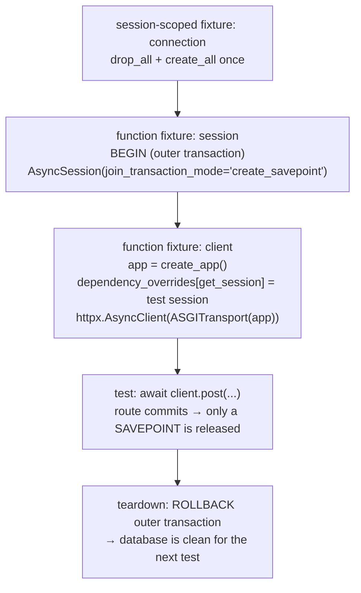

# 10 · Testing FastAPI with a real database

## 1. In one sentence

`kb-api`'s tests call the app **in memory** with `httpx.AsyncClient` + `ASGITransport` (no server), run every test inside a **database transaction that is rolled back** (like Rails' transactional fixtures), swap the app's session with `dependency_overrides`, and mock **external** HTTP (GitHub) with **respx**.

## 2. Why it exists

You want tests that are:

- **realistic**: real Postgres, real SQL, real constraints (a unique index must really raise), not an in-memory fake,
- **isolated**: each test starts from a clean state,
- **fast**: no server process, no re-creating tables per test,
- **offline**: no real calls to GitHub or model APIs.

Rails gives you this out of the box (request specs, `use_transactional_fixtures`, WebMock). In Python you assemble it from pytest fixtures, which the starter's `tests/conftest.py` already does. This lesson explains every piece so you can extend it.

## 3. Rails analogy

| Rails / RSpec | kb-api tests |
|---|---|
| Request spec: `post "/documents", params:` | `await client.post("/documents", json=...)` with `httpx.AsyncClient(transport=ASGITransport(app=app))` |
| `bin/rails db:test:prepare` | a session-scoped fixture that creates the schema once |
| `use_transactional_fixtures = true` | a fixture that opens a transaction per test and rolls it back |
| `config.before { ... }` in `rails_helper.rb` | fixtures in `tests/conftest.py` |
| Stubbing `current_user` | `app.dependency_overrides[...]` |
| WebMock `stub_request(:get, ...)` | `respx.get(...).mock(return_value=httpx.Response(...))` |
| `DatabaseCleaner` | not needed: rollback does the cleaning |
| SimpleCov | `pytest --cov` (with `concurrency = ["greenlet", "thread"]` for async SQLAlchemy) |

## 4. How it works



The tricky part is **commits inside routes**. The starter's routes call `await session.commit()`. If that were a real commit, the rollback at the end of the test could not undo it. The session is created with `join_transaction_mode="create_savepoint"`: it joins the test's outer transaction and turns each `commit()` into releasing a **savepoint**. The data is visible within the test, and the outer `ROLLBACK` removes everything afterwards.

### The fixtures in the starter's `tests/conftest.py`

| Fixture | Scope | Does |
|---|---|---|
| `anyio_backend` | session | Tells pytest's anyio plugin to run async tests on asyncio |
| `connection` | session | Connects to `TEST_DATABASE_URL`, drops and creates all tables once |
| `session` | function | Begins a transaction; yields an `AsyncSession` bound to it; rolls back afterwards |
| `client` | function | Builds the app, overrides `get_session`, yields an `httpx.AsyncClient` |
| `auth` | function | The `X-API-Key` header for write requests |

Async tests are marked with `pytestmark = pytest.mark.anyio` at the top of the test file (the anyio plugin is installed with FastAPI's dependencies). Then any `async def test_...` runs on the event loop, and async fixtures work.

### Mocking outbound HTTP with respx

Your ingestion code calls GitHub through `httpx`. In tests, **respx** intercepts those calls: you declare routes and their responses, and any unexpected request fails the test (like WebMock with net connect disabled).

## 5. Minimal working example

### Part A: run the starter's tests

```bash
cd kb-api
TEST_DATABASE_URL=postgresql+asyncpg://kb:kb@localhost:5432/kb_test uv run pytest -v
```

Output (tested against PostgreSQL 16):

```
============================= test session starts ==============================
collecting ... collected 7 items
tests/test_documents.py::test_create_and_read PASSED                     [ 14%]
tests/test_documents.py::test_writes_need_an_api_key PASSED              [ 28%]
tests/test_documents.py::test_validation_errors_are_422 PASSED           [ 42%]
tests/test_documents.py::test_duplicate_path_is_409 PASSED               [ 57%]
tests/test_documents.py::test_patch_changes_only_sent_fields PASSED      [ 71%]
tests/test_documents.py::test_cursor_pagination PASSED                   [ 85%]
tests/test_documents.py::test_missing_document_is_404 PASSED             [100%]
============================== 7 passed ===============================
```

Read [`tests/test_documents.py`](../../starters/kb-api/tests/test_documents.py) next to this lesson. Notice `test_duplicate_path_is_409`: it relies on the **real unique constraint** in Postgres, which an in-memory fake would not have. And `test_cursor_pagination` creates five documents, yet the next test starts with an empty table, thanks to the rollback.

### Part B: mock GitHub with respx

When you build `services/github_client.py` (Saturday of week 1), test it without the network.

Create `github_client.py`:

```python
import httpx


class RateLimited(Exception):
    pass


async def list_markdown_files(client: httpx.AsyncClient, repo: str) -> list[str]:
    response = await client.get(f"https://api.github.com/repos/{repo}/contents/")
    if response.status_code in (403, 429) and response.headers.get("x-ratelimit-remaining") == "0":
        raise RateLimited(f"GitHub rate limit; resets at {response.headers.get('x-ratelimit-reset')}")
    response.raise_for_status()
    return [item["path"] for item in response.json() if item["name"].endswith(".md")]
```

Create `test_github_client.py`:

```python
import httpx
import pytest
import respx

from github_client import RateLimited, list_markdown_files

pytestmark = pytest.mark.anyio
URL = "https://api.github.com/repos/rails/solid_queue/contents/"


@pytest.fixture
def anyio_backend() -> str:
    return "asyncio"


@respx.mock
async def test_lists_only_markdown_files() -> None:
    respx.get(URL).mock(return_value=httpx.Response(200, json=[
        {"name": "README.md", "path": "README.md"},
        {"name": "Gemfile", "path": "Gemfile"},
        {"name": "UPGRADING.md", "path": "UPGRADING.md"},
    ]))
    async with httpx.AsyncClient() as client:
        assert await list_markdown_files(client, "rails/solid_queue") == ["README.md", "UPGRADING.md"]


@respx.mock
async def test_rate_limit_is_reported() -> None:
    respx.get(URL).mock(return_value=httpx.Response(
        403, headers={"x-ratelimit-remaining": "0", "x-ratelimit-reset": "1767225600"}
    ))
    async with httpx.AsyncClient() as client:
        with pytest.raises(RateLimited, match="resets at 1767225600"):
            await list_markdown_files(client, "rails/solid_queue")


@respx.mock
async def test_not_found_raises() -> None:
    respx.get(URL).mock(return_value=httpx.Response(404))
    async with httpx.AsyncClient() as client:
        with pytest.raises(httpx.HTTPStatusError):
            await list_markdown_files(client, "rails/solid_queue")
```

```bash
uv add --dev respx
uv run pytest -q test_github_client.py
```

Output:

```
...                                                                      [100%]
3 passed
```

No network was used: respx answered every request. In `kb-api`, test the ingestion service the same way, plus one end-to-end test that calls `POST /sources/{id}/sync` with GitHub mocked and checks the documents that were stored.

## 6. Key terms

- **`ASGITransport`**: lets `httpx` call an ASGI app directly in memory.
- **Transactional test / rollback**: each test's changes are undone at the end.
- **Savepoint / `join_transaction_mode="create_savepoint"`**: a nested transaction; app commits become savepoint releases.
- **`dependency_overrides`**: swap a FastAPI dependency (the session) in tests.
- **Fixture scope**: `session` (once per run) vs `function` (every test).
- **anyio plugin / `pytest.mark.anyio`**: runs `async def` tests.
- **respx**: mocks `httpx` requests.
- **Coverage**: `pytest --cov`; the starter's CI fails below 85%.

## 7. Common mistakes

- **Testing against SQLite** while production is Postgres: constraints, types and full-text search differ.
- **Committing for real in tests**, which leaks data between tests (use the savepoint mode).
- **Sharing one app instance with overrides across tests** without clearing them; the starter creates a new app per test.
- **Calling real external APIs in tests**: slow, flaky and rate-limited. Mock them with respx.
- **Forgetting `pytestmark = pytest.mark.anyio`**: async tests are skipped with a warning instead of running.
- **Only happy paths**: test 401, 404, 409, 422 and rate limits too.
- **Low coverage numbers that look wrong** with async SQLAlchemy: set `concurrency = ["greenlet", "thread"]` in the coverage config (the starter does).

## 8. Check your understanding

1. How does a request in a test reach the app without a running server?
2. The route calls `session.commit()`. Why is the data still gone after the test?
3. Why test against a real Postgres rather than a fake repository object?
4. How would you test the behaviour when GitHub returns a rate-limit response?
5. Why does the starter create a new app in the `client` fixture instead of importing one global app?

<details>
<summary>Answers</summary>

1. `httpx.AsyncClient(transport=ASGITransport(app=app))` sends requests directly to the app object in the same process.
2. The session was created inside an outer transaction with `join_transaction_mode="create_savepoint"`, so the commit only released a savepoint; the fixture rolls back the outer transaction afterwards.
3. Real constraints, SQL behaviour, types and features (unique indexes, full-text search, arrays) are part of what you are testing; a fake can pass while production fails.
4. Mock the GitHub URL with respx to return 403/429 with `x-ratelimit-remaining: 0`, and assert that your code raises or reports the right error.
5. So dependency overrides and other state from one test cannot leak into the next.

</details>

## 9. Go deeper (optional)

- FastAPI docs: [Testing](https://fastapi.tiangolo.com/tutorial/testing/) and [Async Tests](https://fastapi.tiangolo.com/advanced/async-tests/).
- SQLAlchemy docs: [Joining a Session into an External Transaction (such as for test suites)](https://docs.sqlalchemy.org/en/20/orm/session_transaction.html#joining-a-session-into-an-external-transaction-such-as-for-test-suites).
- [respx docs](https://lundberg.github.io/respx/).
