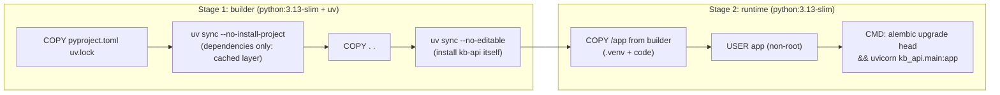

# 11 · Docker for Python services

<!-- nav:top -->
[Course home](../../README.md) › [Step 6 plan](../../steps/06-applied-python.md) › [Step 6 lessons](00-start-here.md) · [Glossary](../../GLOSSARY.md)
<!-- nav:end -->

## 1. In one sentence

A **Dockerfile** packages `kb-api` with its exact Python and dependencies into an image that runs the same everywhere, and **`compose.yaml`** starts the app together with Postgres for local development; a good Python Dockerfile installs dependencies with **uv** in a **multi-stage** build, runs as a **non-root** user and keeps the image small.

## 2. Why it exists

You deployed a Rails app with Kamal in Step 2, so you know the value: build once, run the same container on a laptop, in CI and in production. For `kb-api` you want:

- **Reproducible installs**: the image uses `uv.lock`, so production has exactly the versions you tested.
- **Fast rebuilds**: dependency layers are cached; changing your code does not reinstall FastAPI.
- **A small, safe image**: no compilers, no dev tools, not running as root.
- **One command for the whole stack**: `docker compose up` starts Postgres (with pgvector) and the API.

Rails 8 generates a production Dockerfile for you. For Python you write it yourself, which is why this lesson explains each line.

## 3. Rails analogy

| Rails 8 Dockerfile / Kamal | kb-api |
|---|---|
| `FROM ruby:3.4-slim AS base` | `FROM python:3.13-slim` |
| `bundle install` in a build stage | `uv sync --locked --no-dev` in the builder stage |
| `COPY Gemfile Gemfile.lock` before `COPY . .` (layer caching) | `COPY pyproject.toml uv.lock` before `COPY . .` |
| `BUNDLE_WITHOUT="development test"` | `--no-dev` |
| `USER rails` | `USER app` |
| `bin/docker-entrypoint` runs `db:prepare` | `CMD` runs `alembic upgrade head` before starting |
| Thruster + Puma | uvicorn |
| `.dockerignore` | `.dockerignore` |
| Kamal accessories (Postgres) for production | `compose.yaml` services for local development |

## 4. How it works



The [starter's Dockerfile](../../starters/kb-api/Dockerfile), line by line:

| Line | Why |
|---|---|
| `FROM python:3.13-slim AS builder` | A small Debian-based image with Python; `AS builder` names the first stage |
| `COPY --from=ghcr.io/astral-sh/uv:0.12 /uv /bin/uv` | Copies only the `uv` binary from the official uv image (no install script) |
| `ENV UV_COMPILE_BYTECODE=1 UV_LINK_MODE=copy UV_PYTHON_DOWNLOADS=0` | Precompile `.pyc` files for faster start-up; copy files instead of linking; use the image's Python |
| `COPY pyproject.toml uv.lock ./` then `uv sync --locked --no-install-project --no-dev` | Install **only dependencies** first. This layer is reused until the lockfile changes |
| `COPY . .` then `uv sync --locked --no-dev --no-editable` | Add your code and install the project itself as a normal (non-editable) package |
| `FROM python:3.13-slim` | A fresh, clean final stage: nothing from the build tools remains |
| `RUN useradd --create-home app` ... `USER app` | Do not run as root (limits damage if the app is compromised) |
| `COPY --from=builder --chown=app:app /app /app` | Only the virtual environment and the code |
| `ENV PATH="/app/.venv/bin:$PATH"` | So `alembic` and `uvicorn` are found |
| `CMD ["sh", "-c", "alembic upgrade head && uvicorn kb_api.main:app --host 0.0.0.0 --port 8000"]` | Migrate, then serve on all interfaces |

### Migrations at container start: a trade-off

Running `alembic upgrade head` in `CMD` is simple and fine for one container. With several replicas starting at once, they would race to migrate; then run migrations as a separate step (a one-off container, or a deploy hook, like Kamal's `pre-deploy` hook) instead.

### `compose.yaml`

The starter's compose file runs:

- `db`: `pgvector/pgvector:pg17` (Postgres 17 with the pgvector extension installed, ready for Step 7), with a named volume for data, a health check, and an init script that creates the `kb_test` database.
- `app`: built from the Dockerfile, with `DATABASE_URL` pointing at `db` (the service name is the hostname inside the compose network), started only after the database is healthy.

## 5. Minimal working example

From your `kb-api` folder (the starter already contains the `Dockerfile`, `.dockerignore` and `compose.yaml`):

```bash
docker compose up --build -d
docker compose ps
curl -s localhost:8000/healthz
docker compose logs app | tail -5
docker image ls kb-api-app
```

What to expect (container names, IDs and sizes will differ):

```
NAME            IMAGE                    STATUS                   PORTS
kb-api-db-1     pgvector/pgvector:pg17   Up (healthy)             0.0.0.0:5432->5432/tcp
kb-api-app-1    kb-api-app               Up                       0.0.0.0:8000->8000/tcp
{"status":"ok"}
INFO  [alembic.runtime.migration] Running upgrade  -> 0001, create documents
INFO:     Uvicorn running on http://0.0.0.0:8000 (Press CTRL+C to quit)
```

Honest note: the starter's Docker image was not built while preparing this course (Docker was not available on the machine used). The `uv` install steps it uses were tested outside Docker (the non-editable install runs, and Alembic and the app import from it). So treat your first `docker compose up --build` as part of Thursday's task, and fix anything it reports.

**Check the three properties** once it runs:

```bash
docker compose exec app whoami                  # app          (not root)
docker compose exec app uv --version            # fails: uv is not in the final image
docker image ls kb-api-app --format '{{.Size}}' # aim for roughly 250 MB or less
```

Then change one line in `src/kb_api/main.py` and run `docker compose build app`: the dependency layer should say `CACHED`, and the build should take seconds.

## 6. Key terms

- **Image / container**: the packaged filesystem and settings / a running instance of it.
- **Layer / layer cache**: each Dockerfile step creates a layer; unchanged layers are reused.
- **Multi-stage build**: build in one stage, copy only the results into a clean final stage.
- **Base image (`python:3.13-slim`)**: the starting image.
- **Non-root user**: running the process as an unprivileged user.
- **`.dockerignore`**: files excluded from the build context (`.venv`, `.git`, `.env`).
- **Compose service / network**: a container defined in `compose.yaml` / the private network where services find each other by name.
- **Health check**: a command that tells Docker whether a service is ready.

## 7. Common mistakes

- **`COPY . .` before installing dependencies**, so every code change reinstalls everything.
- **Copying `.venv` or `.env` into the image**: add them to `.dockerignore`.
- **Running as root.**
- **Using `localhost` for the database inside a container**: use the compose service name (`db`).
- **Not waiting for the database** to be ready: use a health check and `depends_on: condition: service_healthy`.
- **Ignoring the lockfile** (`uv sync` without `--locked`), so the image can differ from what you tested.
- **Several replicas each running migrations at start-up**; migrate once per deploy.

## 8. Check your understanding

1. Why are `pyproject.toml` and `uv.lock` copied and installed before the rest of the code?
2. What does the second `FROM` line achieve?
3. Inside the compose network, what host should `DATABASE_URL` use, and why not `localhost`?
4. Why can running `alembic upgrade head` in `CMD` be a problem in production?
5. Which three quick checks confirm the image is well built?

<details>
<summary>Answers</summary>

1. So the dependency layer is cached: changing application code does not reinstall dependencies, and rebuilds are fast.
2. It starts a clean final stage, so build tools and caches from the builder stage are not in the final image; only the copied `/app` is.
3. `db`, the service name. Inside the app container, `localhost` is the container itself, not the database.
4. Several containers starting at once can run migrations concurrently; migrations should run once per deploy, as a separate step.
5. The process runs as a non-root user; build tools (uv) are absent from the final image; the image size is reasonable (and rebuilding after a code change reuses the cached dependency layer).

</details>

## 9. Go deeper (optional)

- uv docs: [Using uv in Docker](https://docs.astral.sh/uv/guides/integration/docker/) (multi-stage builds, caching, non-editable installs).
- Docker docs: [Multi-stage builds](https://docs.docker.com/build/building/multi-stage/) and [Compose file reference](https://docs.docker.com/reference/compose-file/).
- FastAPI docs: [FastAPI in Containers - Docker](https://fastapi.tiangolo.com/deployment/docker/).

<!-- nav:bottom -->

---

[← 10 · Testing FastAPI with a real database](10-testing-fastapi.md) · [Step 6 lessons](00-start-here.md) · [12 · GitHub Actions CI →](12-github-actions-ci.md)
<!-- nav:end -->
