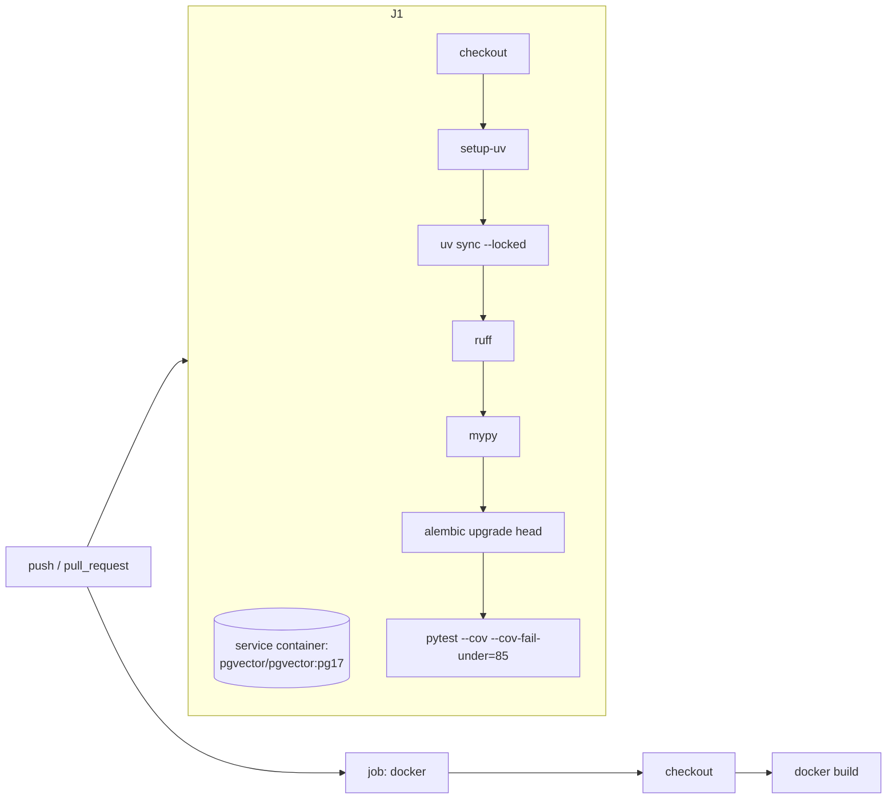

# 12 · GitHub Actions CI

## 1. In one sentence

A GitHub Actions **workflow** (a YAML file in `.github/workflows/`) runs your checks on every push and pull request: for `kb-api` that means installing with uv, then **ruff**, **mypy**, **Alembic migrations** and **pytest with coverage** against a Postgres **service container**, plus a Docker build.

## 2. Why it exists

You know CI from Rails projects: RSpec and RuboCop on every PR, a red cross that blocks the merge. For `kb-api` (and later your Step 8 tool) CI proves to reviewers, and to your manager, that:

- the code is formatted, lint-free and type-correct,
- migrations apply to an empty database,
- the tests pass against a real Postgres,
- coverage has not dropped below the bar,
- the Docker image still builds.

A green CI badge on a public repository is also part of your "proof of completion".

## 3. Rails analogy

| Rails CI (GitHub Actions) | kb-api CI |
|---|---|
| `uses: ruby/setup-ruby@v1` with `bundler-cache: true` | `uses: astral-sh/setup-uv@v7` then `uv sync --locked` |
| `services: postgres:` | the same, with the `pgvector/pgvector:pg17` image |
| `bin/rails db:schema:load` | `uv run alembic upgrade head` |
| `bundle exec rubocop` | `uv run ruff check . && uv run ruff format --check .` |
| Sorbet / Steep step | `uv run mypy src` |
| `bundle exec rspec` + SimpleCov minimum | `uv run pytest --cov --cov-fail-under=85` |
| `bin/rails ci` (Rails 8.1 local CI) | run the same `uv run ...` commands locally before pushing |

## 4. How it works



The [starter's workflow](../../starters/kb-api/.github/workflows/ci.yml), part by part:

| Part | What it does |
|---|---|
| `on: push (main) / pull_request` | Run on pushes to `main` and on every pull request |
| `jobs.test.services.postgres` | Start a Postgres container next to the job. `ports: ["5432:5432"]` makes it reachable at `localhost:5432` from the steps |
| `options: --health-cmd "pg_isready -U kb" ...` | GitHub waits until Postgres answers before running the steps |
| `env: DATABASE_URL / TEST_DATABASE_URL` | Both point at the service database |
| `actions/checkout@v7` | Check out the code |
| `astral-sh/setup-uv@v7` | Install uv (use the latest major version) |
| `uv sync --locked` | Install exactly the locked versions; **fails if `uv.lock` is out of date**, which catches "forgot to commit the lockfile" |
| `ruff check` + `ruff format --check` | Lint, and fail if any file is not formatted |
| `mypy src` | Type-check (strict mode from `pyproject.toml`) |
| `alembic upgrade head` | Prove the migrations apply to an empty database |
| `pytest --cov --cov-fail-under=85` | Run tests; fail if coverage is below 85% |
| `jobs.docker` | A separate job that builds the image (runs in parallel) |

After it runs once, make the checks **required**: repository Settings → Branches (or Rules) → require status checks to pass before merging. That turns CI from information into a gate.

## 5. Minimal working example

### Part A: run exactly what CI runs, locally

Before pushing, run the same commands (with your local test database):

```bash
export DATABASE_URL=postgresql+asyncpg://kb:kb@localhost:5432/kb_test
export TEST_DATABASE_URL=$DATABASE_URL
uv run ruff check . && uv run ruff format --check .
uv run mypy src
uv run alembic upgrade head
uv run pytest --cov --cov-fail-under=85
```

Output on the starter (tested; pytest's timing removed):

```
All checks passed!
12 files already formatted
Success: no issues found in 9 source files
INFO  [alembic.runtime.migration] Running upgrade  -> 0001, create documents
.......                                                                  [100%]
================================ tests coverage ================================
Name                          Stmts   Miss  Cover
-------------------------------------------------
src/kb_api/__init__.py            0      0   100%
src/kb_api/api/__init__.py        0      0   100%
src/kb_api/api/deps.py           10      0   100%
src/kb_api/api/documents.py      49      4    92%
src/kb_api/config.py             11      0   100%
src/kb_api/db.py                  8      2    75%
src/kb_api/main.py               17      3    82%
src/kb_api/models.py             15      0   100%
src/kb_api/schemas.py            23      0   100%
-------------------------------------------------
TOTAL                           133      9    93%
Required test coverage of 85% reached. Total coverage: 93.23%
7 passed
```

Tip: save these five lines as a script (`bin/ci`) so "run CI locally" is one command, like Rails 8.1's `bin/ci`.

### Part B: push and watch it run

```bash
git add . && git commit -m "Set up kb-api with CI"
git push -u origin main
gh run watch          # GitHub CLI: follow the latest run in your terminal
```

Then open the **Actions** tab to see each step's log. To practise reading failures, push a branch with an unformatted file or a failing test, open a pull request, and look at which step went red and why.

### Part C: the simpler workflow for Step 5 (no database)

For `python-katas`, you only need lint, types and tests:

```yaml
name: CI
on: [push, pull_request]
jobs:
  test:
    runs-on: ubuntu-latest
    steps:
      - uses: actions/checkout@v7
      - uses: astral-sh/setup-uv@v7
      - run: uv sync --locked
      - run: uv run ruff check . && uv run ruff format --check .
      - run: uv run mypy --strict src
      - run: uv run pytest
```

### Part D: add a status badge to the README

```markdown

```

## 6. Key terms

- **Workflow / job / step**: the YAML file / a group of steps on one machine / one command or action.
- **Runner**: the machine that runs a job (`ubuntu-latest`).
- **Action (`uses:`)**: a reusable step, such as `actions/checkout` or `astral-sh/setup-uv`.
- **Service container**: a container (Postgres) started next to a job.
- **Required status check**: a check that must pass before a PR can be merged.
- **`--locked`**: fail if the lockfile does not match `pyproject.toml`.
- **Coverage threshold**: the minimum coverage (`--cov-fail-under`).

## 7. Common mistakes

- **No `--locked`**, so CI silently resolves different versions than your laptop.
- **Forgetting the service health check**, so tests start before Postgres is ready.
- **Using the service hostname `postgres`** in a job that runs directly on the runner: use `localhost` (the service hostname works only when the job itself runs in a container).
- **Secrets in the workflow file**: use repository secrets (`${{ secrets.NAME }}`), and only where needed.
- **Checks that are not required**, so red builds still get merged.
- **CI that only passes in CI**: always be able to run the same commands locally.
- **Expensive steps on every push** (for example paid model calls in evals): run them on demand (`workflow_dispatch`), as in Step 8.

## 8. Check your understanding

1. How do the steps reach the Postgres service container, and why must the job wait for its health check?
2. What does `uv sync --locked` catch that `uv sync` would not?
3. Why run `alembic upgrade head` in CI when the tests create tables themselves?
4. How do you make a failing CI actually block a merge?
5. Why run CI's commands locally before pushing?

<details>
<summary>Answers</summary>

1. The service port is mapped to the runner (`5432:5432`), so steps connect to `localhost:5432`. Without waiting for the health check, the first steps could run before Postgres accepts connections and fail randomly.
2. A `uv.lock` that is out of date with `pyproject.toml` (for example, a dependency added without committing the new lockfile); `--locked` fails instead of silently re-resolving.
3. To prove the migrations themselves work on an empty database; the tests use `create_all`, which would hide a broken migration.
4. Mark the CI checks as required status checks in the branch protection rules (or rulesets) for `main`.
5. Faster feedback, fewer red builds, and the same results, because it is the same commands.

</details>

## 9. Go deeper (optional)

- GitHub docs: [Building and testing Python](https://docs.github.com/en/actions/tutorials/build-and-test-code/python) and [Creating PostgreSQL service containers](https://docs.github.com/en/actions/tutorials/use-containerized-services/create-postgresql-service-containers).
- uv docs: [Using uv in GitHub Actions](https://docs.astral.sh/uv/guides/integration/github/) (caching, Python versions).
- GitHub docs: [About protected branches](https://docs.github.com/en/repositories/configuring-branches-and-merges-in-your-repository/managing-protected-branches/about-protected-branches).
