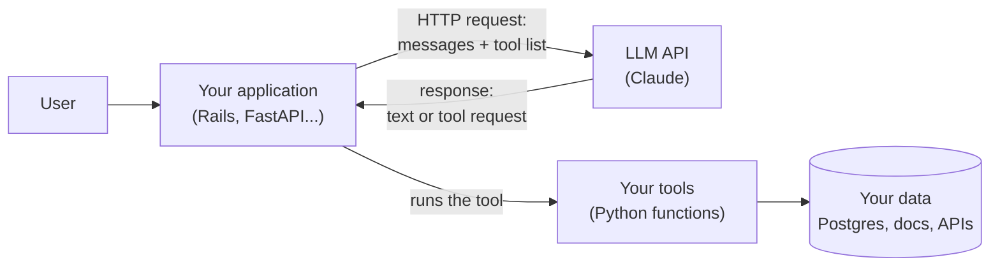
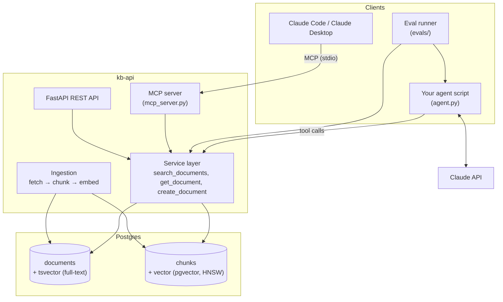

# Step 7 lessons: start here

This folder teaches everything the Step 7 plan asks you to do. You have used LLMs a lot, but you have not built an application around one yet. These lessons start from the ground up and build towards the finished system.

**How to use this folder:** every day in [the Step 7 plan](../../steps/07-agentic-ai-engineering.md) starts with a **"Read first:"** line. Read those lessons (20-40 minutes), run their small example, then do the day's tasks. If you meet a word you do not know, look it up in the [glossary](#glossary) at the bottom of this page.

## The lessons

| # | Lesson | You need it for |
|---|---|---|
| 01 | [How an LLM API call works](01-how-an-llm-api-call-works.md) | Everything: messages, tokens, `usage`, `stop_reason`, cost |
| 02 | [Tool calling from first principles](02-tool-calling.md) | Monday: letting the model ask your code to do things |
| 03 | [The agent loop](03-agent-loop.md) | Tuesday: repeating tool calls until the task is done, safely |
| 04 | [MCP concepts](04-mcp-concepts.md) | Wednesday: the standard way to share tools with AI apps |
| 05 | [Building an MCP server](05-building-an-mcp-server.md) | Wednesday: exposing `kb-api` to Claude Code and other clients |
| 06 | [Embeddings and vector search](06-embeddings-and-vector-search.md) | Thursday: search by meaning instead of by words |
| 07 | [Chunking](07-chunking.md) | Thursday: cutting documents into searchable pieces |
| 08 | [pgvector and vector indexes](08-pgvector-and-indexes.md) | Thursday: storing and searching vectors in Postgres |
| 09 | [Full-text, vector and hybrid search](09-full-text-vector-and-hybrid-search.md) | Friday: combining word search and meaning search |
| 10 | [RAG end to end](10-rag-end-to-end.md) | Friday: answering questions from your own documents |
| 11 | [Evals from zero](11-evals-from-zero.md) | Saturday: measuring quality with numbers |
| 12 | [LLM-as-judge and calibration](12-llm-as-judge.md) | Saturday: grading free-text answers automatically |
| 13 | [Cost and latency](13-cost-and-latency.md) | Sunday: what it costs, how fast it is, how to improve both |
| 14 | [Security and prompt injection](14-security-and-prompt-injection.md) | Sunday: keeping an AI app with tools safe |

## The big picture: how an AI application is built

Think of an AI application as a normal web app with one new kind of dependency: a **model API**. Your code stays in charge. The model is a very capable function that your code calls.



The model never touches your database or servers directly. It can only **return text**. Some of that text is a structured request such as "please call `search_documents` with `{"query": "solid queue"}`". Your code decides whether to run it, runs it, and sends the result back. Everything in this step builds on that one idea.

How the topics of this week fit together:

| Topic | The question it answers | Lessons |
|---|---|---|
| **LLM API** | How do I call a model from code, and what do I pay? | 01, 13 |
| **Tool calling** | How can the model ask my code to look something up or do something? | 02 |
| **Agents** | How do I let the model take several steps (search, read, answer) on its own, safely? | 03 |
| **MCP** | How do I write my tools once and use them from Claude Code, Claude Desktop, IDEs and my own agent? | 04, 05 |
| **RAG** | How does the model answer questions about *my* documents, which it has never seen? | 06-10 |
| **Evals** | How do I *know* it works, and that a change made it better, not worse? | 11, 12 |
| **Security** | What can go wrong when a model can call tools, and how do I prevent it? | 14 |

### A Rails developer's map

| AI concept | Closest Rails idea | Where the analogy breaks |
|---|---|---|
| LLM API call | Calling a third-party API with Faraday | The response is not deterministic, and you pay per word |
| Tool | A controller action that the model can "request" | The model chooses when to call it and fills in the parameters |
| Agent loop | A background job that keeps re-enqueuing itself until done | The model, not your code, decides the next step |
| MCP server | A Rails engine (or an API gem) that any app can mount | It works across languages and AI apps, via a standard protocol |
| Embedding | A computed column (like a `tsvector`) that summarises meaning as numbers | It is produced by a model, not a formula |
| RAG | `includes` for the model: load the relevant records before rendering | You must choose *which* records by searching, not by foreign keys |
| Evals | Your RSpec suite | Results are scores (for example 87%), not pass/fail, and they vary run to run |

## What you will have built by Sunday

By the end of the week, `kb-api` (your Step 6 project) has grown these parts:



- The **service layer** holds the real logic. The REST API, the MCP server and your agent all call the same functions, so there is one implementation to test.
- The **agent** (lesson 03) talks to the Claude API and runs tools from the service layer.
- The **MCP server** (lesson 05) exposes the same tools to Claude Code or Claude Desktop.
- **Search** (lessons 06-09) uses both full-text search and vector search, combined into hybrid search.
- The **eval runner** (lessons 11-12) measures retrieval quality and end-to-end answer quality.

## One-time setup for the lesson examples

Every lesson has a small example you can run. Create a scratch project once and reuse it all week:

```bash
uv init ai-lessons && cd ai-lessons
uv add anthropic "mcp[cli]" numpy fastembed "pgvector" "sqlalchemy[asyncio]" asyncpg pytest
export ANTHROPIC_API_KEY="sk-ant-..."   # from https://platform.claude.com (Settings → API keys)
```

- Put the API key in your shell profile or a `.env` file that is **not committed** (add `.env` to `.gitignore`).
- Set a **monthly spend limit** in the Claude Console before you start. The examples cost cents, but a bug in a loop can cost more.
- Model IDs used in this step: `claude-opus-5-5` (main model), `claude-sonnet-5` and `claude-haiku-4-5` (cheaper, for comparison). Check the [models overview](https://platform.claude.com/docs/en/about-claude/models/overview) for the current list and prices before you start.

## Glossary

Terms are grouped by topic. The link shows the lesson that explains each term in depth.

### Calling a model

| Term | Meaning | Lesson |
|---|---|---|
| **LLM** | Large language model: a model that reads text and predicts the text that should follow. | [01](01-how-an-llm-api-call-works.md) |
| **Messages API** | Claude's HTTP endpoint (`POST /v1/messages`). You send a conversation; it returns the next assistant message. | [01](01-how-an-llm-api-call-works.md) |
| **Message / role** | One turn of the conversation, from the `user` or the `assistant`. | [01](01-how-an-llm-api-call-works.md) |
| **System prompt** | Instructions that apply to the whole conversation (the `system` parameter), such as the assistant's job and rules. | [01](01-how-an-llm-api-call-works.md) |
| **Content block** | One piece of a message: `text`, `thinking`, `tool_use`, `tool_result`, and so on. A message is a list of blocks. | [01](01-how-an-llm-api-call-works.md) |
| **Token** | The unit models read and write, roughly ¾ of an English word. Prices and limits are counted in tokens. | [01](01-how-an-llm-api-call-works.md) |
| **Context window** | The maximum number of tokens the model can read in one request (the whole conversation, tools and documents). | [01](01-how-an-llm-api-call-works.md) |
| **`max_tokens`** | The most tokens the model may *write* in one response. If it is reached, the answer is cut off. | [01](01-how-an-llm-api-call-works.md) |
| **Stateless API** | The API remembers nothing between calls; you resend the whole conversation every time. | [01](01-how-an-llm-api-call-works.md) |
| **`usage`** | Token counts returned with every response: input, output, cache reads and cache writes. | [01](01-how-an-llm-api-call-works.md) |
| **Stop reason** | Why the model stopped: `end_turn` (finished), `tool_use` (wants a tool), `max_tokens` (cut off), `refusal` and others. | [01](01-how-an-llm-api-call-works.md) |
| **Thinking / effort** | Current models reason before answering ("thinking"). The `effort` setting controls how much, and so the cost and speed. | [01](01-how-an-llm-api-call-works.md) |
| **Streaming** | Receiving the response piece by piece as it is generated, instead of waiting for the whole thing. | [13](13-cost-and-latency.md) |

### Tools and agents

| Term | Meaning | Lesson |
|---|---|---|
| **Tool (function calling)** | A function you describe to the model (name, description, JSON Schema for inputs). The model can ask you to call it. | [02](02-tool-calling.md) |
| **JSON Schema** | A standard format for describing the shape of JSON data (types, required fields). Tool inputs are described with it. | [02](02-tool-calling.md) |
| **`tool_use` block** | The model's request to call a tool, with an `id`, the tool `name` and the `input`. | [02](02-tool-calling.md) |
| **`tool_result` block** | Your reply with the tool's output, linked by `tool_use_id`. | [02](02-tool-calling.md) |
| **Strict tools** | `strict: true` on a tool: the model's input is guaranteed to match the schema. | [02](02-tool-calling.md) |
| **Parallel tool calls** | The model asks for several tools in one response; you run them all and return all results together. | [02](02-tool-calling.md) |
| **Agent** | A program where the model decides the next step in a loop (call a tool, read the result, decide again) until the task is done. | [03](03-agent-loop.md) |
| **Agent loop** | The `while` loop that sends messages, runs requested tools and sends results back. | [03](03-agent-loop.md) |
| **Workflow** | A fixed sequence of steps written in your code (for example "search, then answer"). The opposite of an agent. | [03](03-agent-loop.md) |
| **Trace** | A log of every step of an agent run (tool, input, output size, tokens, time), used for debugging. | [03](03-agent-loop.md) |
| **Human-in-the-loop** | Asking a person to approve an action (for example a write) before the agent runs it. | [03](03-agent-loop.md) |
| **Tool Runner** | A helper in the Anthropic Python SDK that runs the agent loop for you. | [03](03-agent-loop.md) |

### MCP

| Term | Meaning | Lesson |
|---|---|---|
| **MCP (Model Context Protocol)** | An open standard for connecting AI applications to tools and data. Write a server once; use it from any MCP-capable app. | [04](04-mcp-concepts.md) |
| **MCP host** | The AI application the user works in (Claude Code, Claude Desktop, an IDE). | [04](04-mcp-concepts.md) |
| **MCP client** | The component inside the host that keeps a connection to one MCP server. | [04](04-mcp-concepts.md) |
| **MCP server** | Your program that offers tools, resources and prompts over MCP. | [04](04-mcp-concepts.md) |
| **Resource** | Read-only data an MCP server offers by URI (for example `kb://documents/42`). | [04](04-mcp-concepts.md) |
| **Prompt (MCP)** | A reusable prompt template offered by an MCP server. | [04](04-mcp-concepts.md) |
| **Transport** | How client and server exchange messages: **stdio** (local subprocess) or **Streamable HTTP** (network). | [04](04-mcp-concepts.md) |
| **JSON-RPC** | The simple request/response message format MCP uses underneath. | [04](04-mcp-concepts.md) |
| **MCP Inspector** | A browser tool for testing an MCP server by hand. | [05](05-building-an-mcp-server.md) |

### Search and RAG

| Term | Meaning | Lesson |
|---|---|---|
| **Embedding** | A list of numbers (a vector) that represents the meaning of a text. Similar meanings give nearby vectors. | [06](06-embeddings-and-vector-search.md) |
| **Vector** | An ordered list of numbers, for example `[0.12, -0.40, 0.88, ...]`. Embeddings are vectors with hundreds of numbers (dimensions). | [06](06-embeddings-and-vector-search.md) |
| **Dimensions** | How many numbers a vector has (for example 384). Fixed by the embedding model. | [06](06-embeddings-and-vector-search.md) |
| **Cosine similarity** | A measure of how closely two vectors point in the same direction: 1 = same meaning, 0 = unrelated. | [06](06-embeddings-and-vector-search.md) |
| **Cosine distance** | `1 - cosine similarity`. Smaller means more similar. pgvector's `<=>` operator returns it. | [06](06-embeddings-and-vector-search.md) |
| **Semantic / vector search** | Finding the texts whose embeddings are closest to the query's embedding. | [06](06-embeddings-and-vector-search.md) |
| **Chunk / chunking** | A piece of a document (a few paragraphs), and the process of splitting documents into such pieces before embedding. | [07](07-chunking.md) |
| **Overlap** | Repeating a little text between neighbouring chunks so that ideas at a boundary are not lost. | [07](07-chunking.md) |
| **pgvector** | A Postgres extension that adds a `vector` column type, distance operators and vector indexes. | [08](08-pgvector-and-indexes.md) |
| **Vector index / ANN** | An index for fast *approximate nearest neighbour* search: very fast, very slightly inexact. | [08](08-pgvector-and-indexes.md) |
| **HNSW** | Hierarchical Navigable Small World: the most common vector index, a layered graph of "neighbour" links. | [08](08-pgvector-and-indexes.md) |
| **`vector_cosine_ops`** | The pgvector operator class that builds an index for cosine distance (`<=>`). | [08](08-pgvector-and-indexes.md) |
| **`ef_search`** | HNSW setting: how many candidates to check per query. Higher = more accurate, slower. | [08](08-pgvector-and-indexes.md) |
| **Full-text search** | Postgres word search: `tsvector` (processed words of a document), `tsquery` (processed query), `ts_rank` (score). | [09](09-full-text-vector-and-hybrid-search.md) |
| **Stemming** | Reducing words to a root form so "retrying" matches "retry". | [09](09-full-text-vector-and-hybrid-search.md) |
| **Hybrid search** | Running full-text and vector search, then merging the two ranked lists. | [09](09-full-text-vector-and-hybrid-search.md) |
| **RRF (reciprocal rank fusion)** | A simple way to merge ranked lists: each result scores `1 / (60 + rank)` in each list; add the scores. | [09](09-full-text-vector-and-hybrid-search.md) |
| **Reranking** | A second, more expensive pass that re-orders the top results for relevance. | [09](09-full-text-vector-and-hybrid-search.md) |
| **RAG (retrieval-augmented generation)** | Search your data first, put the best pieces in the prompt, and have the model answer from them. | [10](10-rag-end-to-end.md) |
| **Grounding / citation** | Making the answer rely on (and point to) the retrieved sources. | [10](10-rag-end-to-end.md) |
| **Hallucination** | A confident answer that is not supported by the sources or by facts. | [10](10-rag-end-to-end.md) |

### Evals

| Term | Meaning | Lesson |
|---|---|---|
| **Eval** | An automated test of an AI system's quality that produces a score, not just pass/fail. | [11](11-evals-from-zero.md) |
| **Golden dataset** | A fixed, versioned set of test cases (inputs + expected outcomes) used for every eval run. | [11](11-evals-from-zero.md) |
| **recall@k** | Of the documents that *should* be found, what fraction appears in the top *k* results? | [11](11-evals-from-zero.md) |
| **precision@k** | Of the top *k* results, what fraction is relevant? | [11](11-evals-from-zero.md) |
| **MRR (mean reciprocal rank)** | Average of `1 / rank of the first relevant result`. Rewards putting the right answer first. | [11](11-evals-from-zero.md) |
| **Pass rate / task success** | The share of test cases where the system did the job correctly. | [11](11-evals-from-zero.md) |
| **Regression check** | An eval in CI that fails if a score drops below a threshold. | [11](11-evals-from-zero.md) |
| **Held-out set** | Test cases you never look at while tuning, used to report honest results. | [11](11-evals-from-zero.md) |
| **LLM-as-judge** | Using a model with a written rubric to grade another model's answer. | [12](12-llm-as-judge.md) |
| **Rubric** | The written grading criteria given to a judge. | [12](12-llm-as-judge.md) |
| **Calibration / agreement** | Checking how often the judge agrees with your own human labels. | [12](12-llm-as-judge.md) |
| **Faithfulness** | Whether every claim in an answer is supported by the retrieved sources. | [12](12-llm-as-judge.md) |

### Cost, latency and safety

| Term | Meaning | Lesson |
|---|---|---|
| **MTok** | One million tokens. Prices are quoted per MTok. | [13](13-cost-and-latency.md) |
| **Prompt caching** | The API stores the start of your prompt (tools, system prompt) so repeat requests read it at about 10% of the price. | [13](13-cost-and-latency.md) |
| **Batch API** | Send many requests to run within 24 hours at 50% of the price. Good for eval runs. | [13](13-cost-and-latency.md) |
| **Latency, TTFT** | How long a response takes; *time to first token* is how long until output starts. | [13](13-cost-and-latency.md) |
| **p50 / p95** | Percentiles: half of requests are faster than p50; 95% are faster than p95. | [13](13-cost-and-latency.md) |
| **Model tiering** | Using a cheaper, faster model where it is good enough, and a stronger one where it is needed. | [13](13-cost-and-latency.md) |
| **Prompt injection** | Text in data (a document, a web page, a tool result) that tries to give the model new instructions. | [14](14-security-and-prompt-injection.md) |
| **Least privilege** | Give each tool only the access it needs (for example a read-only DB user for read tools). | [14](14-security-and-prompt-injection.md) |
| **Excessive agency** | An agent that can do more (delete, send, pay) than its task needs. | [14](14-security-and-prompt-injection.md) |
