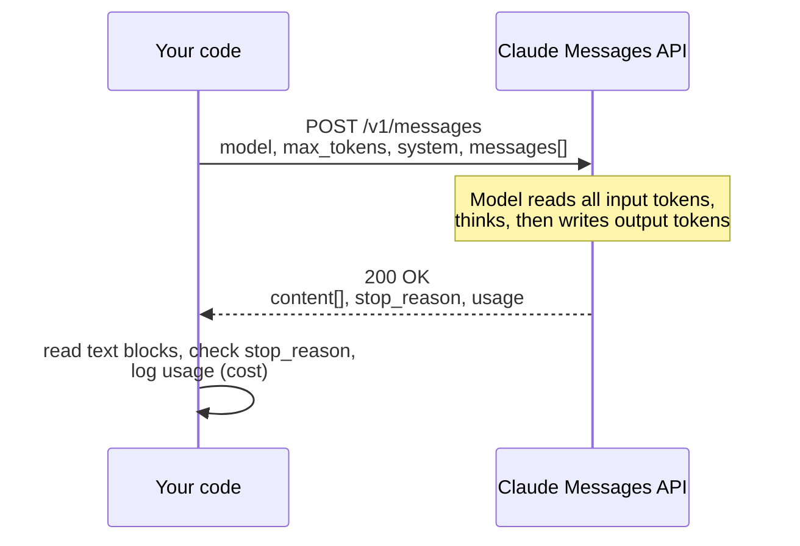
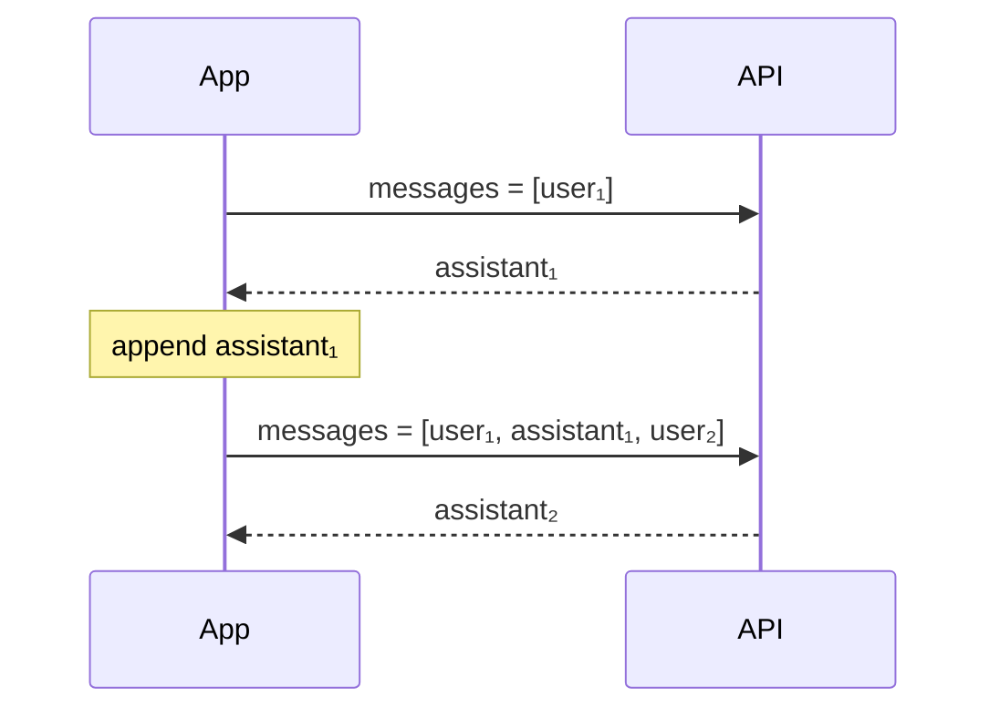

# 01 · How an LLM API call works

<!-- nav:top -->
[Course home](../../README.md) › [Step 7 plan](../../steps/07-agentic-ai-engineering.md) › [Step 7 lessons](00-start-here.md) · [Glossary](../../GLOSSARY.md)
<!-- nav:end -->

## 1. In one sentence

You send the model a **conversation** (a list of messages) over HTTP, and it sends back **the next assistant message**, plus counts of how many tokens it read and wrote, which is what you pay for.

## 2. Why it exists

As an LLM trainer you used models through a chat UI. An application cannot click buttons in a UI; it needs a programmatic interface with:

- **A clear input format**, so your code can build conversations, add documents and describe tools.
- **A clear output format**, so your code can tell a finished answer from a tool request or a cut-off answer.
- **Usage numbers**, so you can track and control cost.

Without understanding this one request/response, everything else this week (tools, agents, RAG) feels like magic. With it, they are just variations of the same call.

## 3. Rails analogy

A Messages API call is like calling any JSON API from a Rails service object with Faraday:

```ruby
# Rails: a typical third-party API call
response = Faraday.post("https://api.example.com/v1/things", { name: "x" }.to_json, headers)
JSON.parse(response.body)
```

The shape is the same (HTTP POST, JSON in, JSON out, API key in a header). Where the analogy breaks:

- **Not deterministic.** The same request can give different wording each time. You test it with evals (lesson 11), not exact-match specs.
- **Stateless in a surprising way.** There is no conversation ID on the server. To continue a chat you send *the entire history again*. It is like a controller with no session: every request must carry all the context.
- **You pay per token**, both for what you send and what you get back.

## 4. How it works



### The request

| Field | What it is | Example |
|---|---|---|
| `model` | Which model to use. | `"claude-opus-5-5"` |
| `max_tokens` | The most tokens the model may write in this response (including its thinking). | `4000` |
| `system` | Instructions for the whole conversation: role, rules, format. | `"You answer questions about Rails. Be concise."` |
| `messages` | The conversation so far: a list of `{role, content}`. It must start with a `user` message; roles usually alternate. | see below |
| `output_config` | Optional settings, such as `{"effort": "low"}`. | |

A conversation with history looks like this:

```python
messages = [
    {"role": "user", "content": "What is Solid Queue?"},
    {"role": "assistant", "content": "A database-backed Active Job backend in Rails 8."},
    {"role": "user", "content": "What database tables does it use?"},  # the new question
]
```

### The response

```json
{
  "id": "msg_01...",
  "model": "claude-opus-5-5",
  "role": "assistant",
  "content": [
    {"type": "thinking", "thinking": "", "signature": "..."},
    {"type": "text", "text": "Solid Queue is Rails 8's default Active Job backend..."}
  ],
  "stop_reason": "end_turn",
  "usage": {"input_tokens": 31, "output_tokens": 212, "cache_read_input_tokens": 0, "cache_creation_input_tokens": 0}
}
```

- **`content` is a list of blocks, not a string.** A response can contain `thinking` blocks (the model's reasoning), `text` blocks (the answer) and later `tool_use` blocks (lesson 02). Always pick blocks **by their `type`**, never by position.
- **Thinking.** Claude Opus 5.5 always thinks before answering. By default the reasoning text is hidden (the `thinking` field is an empty string), but thinking tokens are still **written and billed as output tokens**. You control how much it thinks with `output_config={"effort": ...}` (`low`, `medium` (the default for Opus 5.5), `high`, `xhigh`, `max`).
- **`stop_reason`** tells you why the model stopped:

| `stop_reason` | Meaning | What your code should do |
|---|---|---|
| `end_turn` | The answer is complete. | Use it. |
| `max_tokens` | Cut off at your `max_tokens` limit. | Raise `max_tokens` or ask for shorter output; do not treat it as a full answer. |
| `tool_use` | The model wants you to run a tool. | Run it and send the result (lesson 02). |
| `refusal` | The model declined for safety reasons. | Show a friendly message; do not retry blindly. |
| `pause_turn` | A long server-side step was paused. | Send the conversation back to continue (rare in this course). |

- **`usage`** counts tokens. `input_tokens` is everything you sent (system + messages + tool definitions). `output_tokens` is everything written (thinking + text + tool requests).

### Tokens, context window and cost

A **token** is a piece of text, often part of a word. On current Claude models (Opus 4.7 and later, including Opus 5.5 and Sonnet 5) a token is roughly 2.5 characters of English, about half a word: the docs estimate 1 million tokens ≈ 555,000 words. Older models used about 4 characters (¾ of a word) per token. Code and non-English text use more tokens. For exact numbers, read `usage` or call `client.messages.count_tokens(...)`.

- The **context window** is the most the model can read in one request. `claude-opus-5-5` and `claude-sonnet-5` accept up to 1 million tokens (`claude-haiku-4-5`: 200,000). Big is not free: every token you send is billed on every call.
- **Cost** = input tokens × input price + output tokens × output price. Prices are per **MTok** (1 million tokens). For `claude-opus-5-5`: $4 per MTok input, $20 per MTok output (check the [pricing page](https://platform.claude.com/docs/en/about-claude/pricing); prices change).

Worked example: the response above used 31 input and 212 output tokens.

```
input:  31  × $4  / 1,000,000 = $0.000124
output: 212 × $20 / 1,000,000 = $0.004240
total                         = $0.004364   (less than half a cent)
```

Output tokens cost 5× more than input tokens, so long answers and heavy thinking dominate cost. Lesson 13 goes deeper.

### The API is stateless

The server does not remember your previous call. For a multi-turn conversation, your code keeps the list of messages and sends it all each time:



When you append the assistant's reply, **append its whole `content` list** (including thinking blocks), not just the text. The API expects the history back exactly as it produced it, and some features (tool loops, caching) depend on that. For the same reason, do not edit earlier messages, the `system` prompt or the `tools` list during a conversation (verify the current rules on the [preserved thinking](https://platform.claude.com/docs/en/build-with-claude/preserved-thinking) page).

## 5. Minimal working example

Setup (once, see [00-start-here](00-start-here.md)):

```bash
cd ai-lessons
export ANTHROPIC_API_KEY="sk-ant-..."
```

Create `hello_claude.py`:

```python
import anthropic

# 1. The client reads ANTHROPIC_API_KEY from the environment.
client = anthropic.Anthropic()

MODEL = "claude-opus-5-5"
PRICE_IN, PRICE_OUT = 4.00, 20.00  # USD per million tokens for this model (verify on the pricing page)

# 2. The conversation we keep on our side (the API is stateless).
messages = [{"role": "user", "content": "In one sentence, what is Solid Queue in Rails 8?"}]


def ask(messages: list) -> anthropic.types.Message:
    return client.messages.create(
        model=MODEL,
        max_tokens=4000,  # room for thinking + answer
        system="You are a concise assistant for Rails developers.",
        messages=messages,
        output_config={"effort": "low"},  # simple question: think less, answer faster and cheaper
    )


def text_of(response: anthropic.types.Message) -> str:
    # 3. content is a list of blocks; keep only the text blocks.
    return "".join(block.text for block in response.content if block.type == "text")


def report(response: anthropic.types.Message) -> None:
    u = response.usage
    cost = u.input_tokens * PRICE_IN / 1e6 + u.output_tokens * PRICE_OUT / 1e6
    print(f"  [stop_reason={response.stop_reason} in={u.input_tokens} out={u.output_tokens} cost=${cost:.5f}]")


first = ask(messages)
print("Block types:", [block.type for block in first.content])
print("Answer 1:", text_of(first))
report(first)

# 4. Continue the conversation: append the WHOLE assistant content, then the next user turn.
messages.append({"role": "assistant", "content": first.content})
messages.append({"role": "user", "content": "Which database tables does it create? Just list three."})

second = ask(messages)
print("Answer 2:", text_of(second))
report(second)
```

Run it:

```bash
uv run python hello_claude.py
```

Example output (your wording and numbers will differ):

```
Block types: ['thinking', 'text']
Answer 1: Solid Queue is Rails 8's default, database-backed Active Job backend that stores and runs background jobs in your SQL database instead of Redis.
  [stop_reason=end_turn in=34 out=96 cost=$0.00206]
Answer 2: solid_queue_jobs, solid_queue_ready_executions, solid_queue_claimed_executions
  [stop_reason=end_turn in=141 out=74 cost=$0.00204]
```

Notice that the second call's input tokens grew: it includes the first question and answer. That growth is why long conversations get expensive.

**Try this:** set `max_tokens=20` and run again. You will see `stop_reason=max_tokens` and a cut-off (or empty) answer. That is the case your code must detect.

## 6. Key terms

- **Messages API**: the HTTP endpoint that takes a conversation and returns the next assistant message.
- **Role**: `user` (the human or your app) or `assistant` (the model).
- **System prompt**: instructions for the whole conversation, sent in `system`, not as a message.
- **Content block**: one typed piece of a message (`text`, `thinking`, `tool_use`, `tool_result`).
- **Token**: the unit of text models read and write; about 4 characters of English.
- **Context window**: the maximum input the model can read in one request.
- **`max_tokens`**: the maximum output (including thinking) for one response.
- **Effort**: how much the model thinks before answering; the main dial for speed and cost.
- **`stop_reason`**: why generation stopped.
- **`usage`**: token counts for the request, the basis of your bill.

## 7. Common mistakes

- **Reading `response.content[0].text`.** The first block is often a `thinking` block, so this crashes or returns an empty string. Filter by `block.type == "text"`.
- **Ignoring `stop_reason`.** A `max_tokens` stop looks like a normal answer that just ends early. Check it on every call.
- **`max_tokens` too small.** Thinking counts towards it. With a very low limit, the model can use it all on thinking and return no text.
- **Setting `temperature`.** Current models such as `claude-opus-5-5` reject non-default sampling parameters (`temperature`, `top_p`, `top_k`) with a 400 error, and the Python SDK (1.x) no longer accepts them at all (`TypeError`). Old tutorials still show them. Use `effort` and clear instructions instead.
- **Editing the system prompt or tools in the middle of a conversation.** Thinking blocks are tied to everything before them; on accounts created from 31 Aug 2026, replaying them after such an edit returns a 400 error. Keep the conversation append-only.
- **Putting the API key in code or in Git.** Use an environment variable and a spend limit.
- **Appending only the text of the reply to the history.** Append the full `response.content` list.
- **Assuming it remembers.** Each call only knows what you sent in that call.

## 8. Check your understanding

1. Your code prints an empty answer, and `stop_reason` is `max_tokens`. What happened, and what are two ways to fix it?
2. A conversation has 20 turns. Why does the 21st call cost more than the first, even if the new question is short?
3. Why must you select content blocks by `type` rather than by index?
4. A request has 2,000 input tokens and 500 output tokens on `claude-opus-5-5`. What does it cost?
5. Where do instructions like "always answer in British English" belong, and why?

<details>
<summary>Answers</summary>

1. The model reached the output limit before finishing (thinking and text both count). Raise `max_tokens`, lower `effort`, or ask for a shorter answer.
2. The API is stateless, so the 21st call resends all 20 previous turns as input tokens.
3. Responses can contain several block types in any order (for example `thinking` first, then `text`, then `tool_use`). Position is not stable.
4. 2,000 × $4 / 1M = $0.008; 500 × $20 / 1M = $0.010; total $0.018.
5. In the `system` prompt: it applies to the whole conversation and does not need to be repeated in user messages.

</details>

## 9. Go deeper (optional)

- Claude docs: [Messages API and models overview](https://platform.claude.com/docs/en/about-claude/models/overview) and [pricing](https://platform.claude.com/docs/en/about-claude/pricing).
- Claude docs: [Effort](https://platform.claude.com/docs/en/build-with-claude/effort) and [Adaptive thinking](https://platform.claude.com/docs/en/build-with-claude/adaptive-thinking).
- [Anthropic Python SDK README](https://github.com/anthropics/anthropic-sdk-python): client options, errors, retries.

<!-- nav:bottom -->

---

[← Step 7 lessons: start here](00-start-here.md) · [Step 7 lessons](00-start-here.md) · [02 · Tool calling from first principles →](02-tool-calling.md)
<!-- nav:end -->
