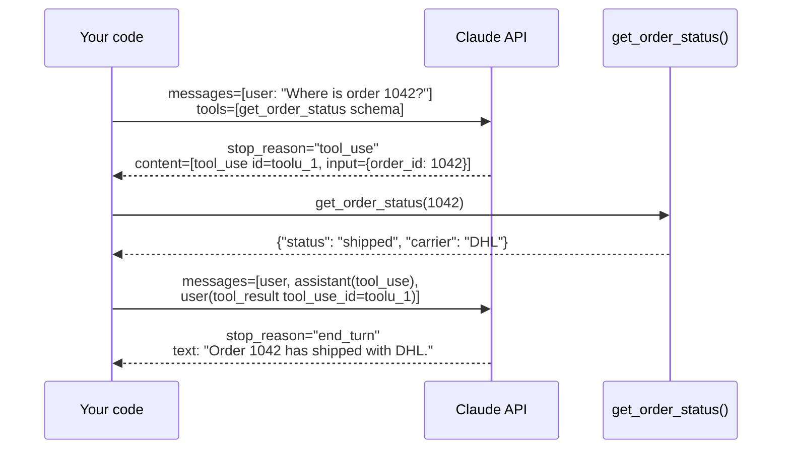

# 02 · Tool calling from first principles

## 1. In one sentence

Tool calling lets the model **ask your code to run a function** (for example "search the docs for X") by returning a structured request; your code runs it and sends the result back, and the model uses that result to answer.

## 2. Why it exists

A model on its own only knows what was in its training data and what you put in the prompt. It cannot:

- look up today's data (an order's status, the latest runbook),
- search your documents,
- take actions (create a ticket, save a document).

Before tool calling, people asked the model to "reply in JSON if you need something" and parsed the text by hand, which broke often. Tool calling makes this a **first-class, typed part of the API**: you describe functions with a schema, the model returns a `tool_use` block that matches the schema, and you reply with a `tool_result` block.

## 3. Rails analogy

Think of each tool as a **controller action with strong parameters**, and the model as a client that can call it:

| Tool calling | Rails |
|---|---|
| Tool `name` + `description` | A route and its documentation |
| `input_schema` (JSON Schema) | `params.require(:order).permit(:id)`: the allowed, typed parameters |
| `tool_use` block | An incoming request to that action |
| Your function | The controller action body |
| `tool_result` block | The JSON response |

Where it breaks: **the model decides when to call the action and what parameters to send**, based on the description you wrote. The description is not just documentation; it is the main thing that controls behaviour. And the model never calls your code directly; your code always sits in between and can refuse.

## 4. How it works



Step by step:

1. **Describe the tool.** Each tool has a `name`, a `description` (when and why to use it) and an `input_schema`: a **JSON Schema**, which is a standard way to describe JSON (types, required fields).

   ```python
   {
       "name": "get_order_status",
       "description": "Look up the current status of a customer order by its numeric ID. "
                      "Use this whenever the user asks where an order is.",
       "input_schema": {
           "type": "object",
           "properties": {"order_id": {"type": "integer", "description": "The order's numeric ID"}},
           "required": ["order_id"],
           "additionalProperties": False,
       },
       "strict": True,
   }
   ```

   `strict: True` (with `additionalProperties: False` and a `required` list) makes the API guarantee that the model's input matches the schema exactly.

2. **Send the tools with the request.** Pass `tools=[...]`. The model now knows these functions exist.

3. **The model may ask for a tool.** If it decides a tool helps, the response has `stop_reason == "tool_use"` and a block like:

   ```python
   ToolUseBlock(type="tool_use", id="toolu_01A...", name="get_order_status", input={"order_id": 1042})
   ```

   The `id` is important: you use it to link your answer to this request.

4. **Your code runs the function.** Look up the function by `name`, call it with `input`, and turn the result into a string (JSON is a good choice).

5. **Send the result back.** Append two messages to the history:
   - the assistant's full `content` (which contains the `tool_use` block), exactly as received;
   - a `user` message whose content is a list of `tool_result` blocks:

   ```python
   {"type": "tool_result", "tool_use_id": "toolu_01A...", "content": '{"status": "shipped"}'}
   ```

6. **The model answers** using the result, usually with `stop_reason == "end_turn"`. (It may also ask for another tool; handling that repeatedly is the agent loop in lesson 03.)

### Parallel tool calls

The model can request **several tools in one response** (for example, look up two orders at once). Then:

- run all of them (in any order, or concurrently),
- put **all** the `tool_result` blocks in **one** `user` message, each with its matching `tool_use_id`.

Why one message? The API treats the results as the answer to that one assistant turn. Splitting them into several messages breaks the expected pattern, and the model learns to stop making parallel calls, which makes it slower.

### Errors are results too

If a tool fails (order not found, timeout), do not drop it and do not crash. Return a `tool_result` with `"is_error": True` and a clear message. The model can then recover: try a different input, or tell the user.

```python
{"type": "tool_result", "tool_use_id": block.id, "content": "Order 99999 not found", "is_error": True}
```

### The model chooses

By default (`tool_choice` is `auto`), the model decides whether to use a tool. To encourage a tool, say so in the system prompt or the tool description. Do not rely on forcing a specific tool: newer models such as `claude-opus-5-5` reject forced tool choice (`{"type": "tool", ...}` or `{"type": "any"}`) with a 400 error.

## 5. Minimal working example

Create `tool_call.py` in your `ai-lessons` folder. It does **one** tool round trip by hand so you can see every message.

```python
import json

import anthropic

client = anthropic.Anthropic()
MODEL = "claude-opus-5-5"

# 1. Fake data and the real Python function behind the tool.
ORDERS = {1042: {"status": "shipped", "carrier": "DHL"}, 1043: {"status": "processing"}}


def get_order_status(order_id: int) -> dict:
    if order_id not in ORDERS:
        raise KeyError(f"Order {order_id} not found")
    return ORDERS[order_id]


# 2. The tool description the model sees.
TOOLS = [
    {
        "name": "get_order_status",
        "description": "Look up the current status of a customer order by its numeric ID. "
        "Use this whenever the user asks about an order.",
        "input_schema": {
            "type": "object",
            "properties": {"order_id": {"type": "integer", "description": "Numeric order ID"}},
            "required": ["order_id"],
            "additionalProperties": False,
        },
        "strict": True,
    }
]

messages = [{"role": "user", "content": "Where are orders 1042 and 1043?"}]

# 3. First call: the model should ask for the tool (maybe twice, in parallel).
response = client.messages.create(model=MODEL, max_tokens=4000, tools=TOOLS, messages=messages)
print("stop_reason:", response.stop_reason)
tool_uses = [block for block in response.content if block.type == "tool_use"]
for block in tool_uses:
    print("model requests:", block.name, block.input, "id:", block.id)

# 4. Run every requested tool and collect ALL results into one list.
results = []
for block in tool_uses:
    try:
        output = get_order_status(**block.input)
        results.append({"type": "tool_result", "tool_use_id": block.id, "content": json.dumps(output)})
    except KeyError as error:
        results.append({"type": "tool_result", "tool_use_id": block.id, "content": str(error), "is_error": True})

# 5. Append the assistant turn exactly as received, then ONE user message with all results.
messages.append({"role": "assistant", "content": response.content})
messages.append({"role": "user", "content": results})

# 6. Second call: the model answers using the results.
final = client.messages.create(model=MODEL, max_tokens=4000, tools=TOOLS, messages=messages)
print("stop_reason:", final.stop_reason)
print("answer:", "".join(b.text for b in final.content if b.type == "text"))
```

Run it:

```bash
uv run python tool_call.py
```

Example output (IDs and wording will differ):

```
stop_reason: tool_use
model requests: get_order_status {'order_id': 1042} id: toolu_01Xk...
model requests: get_order_status {'order_id': 1043} id: toolu_01Pq...
stop_reason: end_turn
answer: Order 1042 has shipped with DHL. Order 1043 is still being processed.
```

**Try this:** ask about order 99999. You will see the `is_error` result go back, and the model will tell the user the order does not exist instead of inventing a status.

## 6. Key terms

- **Tool / function calling**: describing functions to the model so it can request them.
- **JSON Schema**: a standard for describing JSON shapes; `input_schema` uses it.
- **`tool_use` block**: the model's request: `id`, `name`, `input`.
- **`tool_result` block**: your answer, linked by `tool_use_id`; may set `is_error`.
- **Strict tools**: `strict: true`; inputs are guaranteed to match the schema.
- **Parallel tool calls**: several `tool_use` blocks in one response; answer them all in one message.
- **`tool_choice`**: whether the model may, must or must not use tools; keep the default `auto`.

## 7. Common mistakes

- **Vague descriptions.** "Gets data" gives the model nothing to decide with. Say what the tool does, when to use it, and what it returns.
- **Returning huge results** (whole database rows, full documents). They cost tokens and bury the useful part. Return compact JSON with IDs.
- **One message per tool result.** Put all results for one assistant turn into one `user` message.
- **Dropping failed calls.** Every `tool_use` needs a matching `tool_result`, or the next request fails with a 400 error. Use `is_error: true`.
- **Not appending the assistant's `tool_use` turn** before the results. The `tool_result` must answer a `tool_use` in the previous assistant message.
- **Trusting the input blindly.** Even with a schema, validate business rules (for example, that the user may see this order).
- **Parsing tool input as a string.** `block.input` is already a Python dict; do not string-match it.

## 8. Check your understanding

1. What does the model actually send back when it "calls" a tool? Does it run your code?
2. The model requests three tools in one response. How many `user` messages do you send back, and what does each contain?
3. Your database lookup raises an exception. What should you send to the model?
4. Why does the description of a tool matter as much as its schema?
5. Why should a tool return `{"id": 7, "title": "...", "path": "docs/queue.md"}` rather than the whole document?

<details>
<summary>Answers</summary>

1. A `tool_use` content block (an ID, a tool name and a JSON input). It does not run anything; your code decides whether and how to run the function.
2. One `user` message containing three `tool_result` blocks, each with the matching `tool_use_id`.
3. A `tool_result` for that `tool_use_id` with `is_error: true` and a short, useful message (for example "Order 99999 not found").
4. The model decides *when* to call the tool and *with what* based on the description. A good schema with a vague description still gets called at the wrong times.
5. Smaller results cost fewer tokens, keep the model focused, and include an ID/path the model can cite or use to fetch more with another tool.

</details>

## 9. Go deeper (optional)

- Claude docs: [Tool use overview](https://platform.claude.com/docs/en/agents-and-tools/tool-use/overview): definitions, parallel calls, strict tools, errors.
- Claude docs: [Structured outputs](https://platform.claude.com/docs/en/build-with-claude/structured-outputs): when you want JSON back without a tool.
- Anthropic engineering blog: ["Writing effective tools for AI agents"](https://www.anthropic.com/engineering/writing-tools-for-agents) (naming, descriptions, returning useful errors, evaluating tools).
