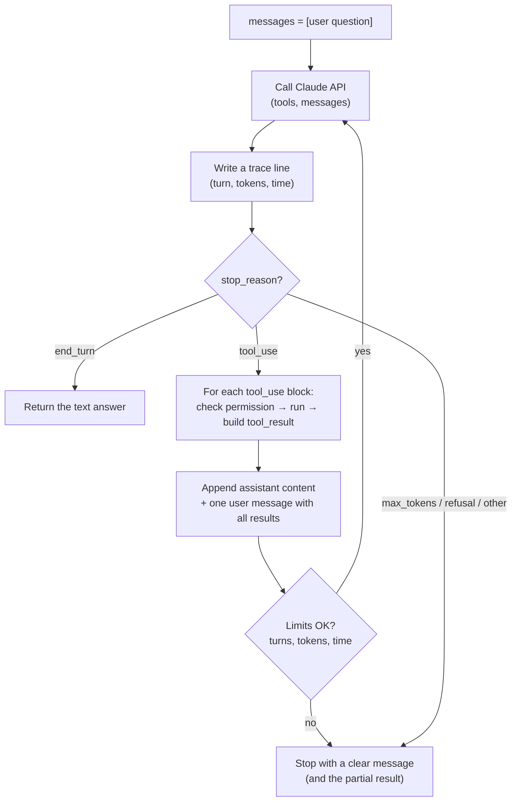

# 03 · The agent loop

<!-- nav:top -->
[Course home](../../README.md) › [Step 7 plan](../../steps/07-agentic-ai-engineering.md) › [Step 7 lessons](00-start-here.md) · [Glossary](../../GLOSSARY.md)
<!-- nav:end -->

## 1. In one sentence

An **agent** is a loop in your code that keeps calling the model, running the tools it asks for and sending back the results, **until the model says it is done** (or until your safety limits stop it).

## 2. Why it exists

Lesson 02 did one tool round trip. Real questions often need several steps that you cannot predict in advance:

> "Which of our runbooks mention Solid Queue, and what do they say about retries?"

The model might: search → see 3 results → open 2 of them → realise one is outdated → search again → answer. You do not know how many steps that takes, so you cannot hard-code it. The loop lets the model **choose the next step each time**.

Without guard rails, a loop like this can run forever, spend real money, or take an action nobody approved. So an agent loop is 20% "call the model" and 80% **engineering**: limits, error handling, tracing and approvals.

## 3. Rails analogy

An agent loop is like a **background job that re-enqueues itself** until the work is finished:

```ruby
class ResearchJob < ApplicationJob
  def perform(state)
    next_step = decide_next_step(state)       # ← in an agent, the MODEL decides this
    return finish(state) if next_step.done?
    result = run(next_step)
    ResearchJob.perform_later(state.merge(result)) if state.turns < 8   # ← your limits
  end
end
```

Like a job, it needs a maximum number of retries, timeouts, logging and idempotent side effects. Where the analogy breaks: in a job **your code** decides the next step; in an agent **the model** decides, based on the conversation so far. That is powerful, and also why you must limit what it can do.

### Workflow or agent?

Not every AI feature needs an agent. Anthropic's guidance ("Building effective agents") separates:

| | **Workflow** | **Agent** |
|---|---|---|
| Who decides the steps | Your code (fixed sequence) | The model (dynamic loop) |
| Example | Always: search → put top 5 chunks in prompt → answer | Model decides whether to search, which docs to open, when to stop |
| Cost and latency | Predictable, lower | Variable, higher |
| Best when | The steps are known in advance | The steps depend on what is found |
| Easy to test? | Yes | Harder; needs evals |

**Start with the simplest thing that works.** In Step 7 you build both: a fixed retrieve-then-answer workflow (lesson 10) and an agent that chooses when to search. Your evals tell you whether the agent is worth its extra cost.

## 4. How it works



The moving parts:

1. **The history (`messages`)** is the agent's memory. Every assistant response and every tool result is appended, in order, exactly as produced. Never edit or delete earlier entries while the loop runs; append only.
2. **Stop reasons drive the loop.** `tool_use` → run tools and continue. `end_turn` → done. Anything else (`max_tokens`, `refusal`) → stop and report.
3. **Limits** stop runaway loops:
   - **Max turns** (for example 8): the most model calls per question.
   - **Token budget**: total input + output tokens for the run (this is your cost cap).
   - **Wall-clock timeout**: the whole run must finish within, say, 2 minutes.
4. **Tool execution** is wrapped in `try/except`. Errors go back to the model as `is_error` results, so it can recover.
5. **Permissions.** Read-only tools run automatically. **Write tools** (create, update, delete, send) require **human confirmation** first. If the human says no, you return a result saying so.
6. **Tracing.** Each turn writes one JSON line: turn number, tools called, input size, output size, tokens and milliseconds. When a run goes wrong, the trace shows where.

## 5. Minimal working example

Create `agent.py` in `ai-lessons`. It uses an in-memory "knowledge base" so it runs without a database; in the Step 7 lab you replace the three functions with calls to the `kb-api` service layer.

```python
import json
import time
from pathlib import Path

import anthropic

client = anthropic.Anthropic()
MODEL = "claude-opus-5-5"
MAX_TURNS = 8
MAX_TOTAL_TOKENS = 60_000
TIMEOUT_SECONDS = 120
TRACE_FILE = Path("traces.jsonl")

SYSTEM = (
    "You answer questions about our engineering documents. "
    "Use search_documents to find documents and get_document to read one. "
    "Cite document paths in your answer. If the documents do not contain the answer, say so."
)

# --- 1. The "knowledge base" and the real functions -------------------------
DOCS = {
    1: {"title": "Solid Queue basics", "path": "docs/solid_queue.md",
        "body": "Solid Queue stores jobs in PostgreSQL. Failed jobs are kept in solid_queue_failed_executions."},
    2: {"title": "Retrying jobs", "path": "docs/retries.md",
        "body": "Use retry_on in the job class. Solid Queue retries with exponential backoff."},
    3: {"title": "Deploying with Kamal", "path": "docs/kamal.md",
        "body": "Kamal deploys Docker containers. Run kamal deploy from your laptop or CI."},
}


def search_documents(query: str, limit: int = 3) -> list[dict]:
    words = query.lower().split()
    scored = []
    for doc_id, doc in DOCS.items():
        text = f"{doc['title']} {doc['body']}".lower()
        score = sum(text.count(word) for word in words)
        if score:
            scored.append((score, doc_id))
    scored.sort(reverse=True)
    return [{"id": i, "title": DOCS[i]["title"], "path": DOCS[i]["path"]} for _, i in scored[:limit]]


def get_document(doc_id: int) -> dict:
    if doc_id not in DOCS:
        raise KeyError(f"Document {doc_id} does not exist")
    return DOCS[doc_id]


def create_document(title: str, body: str) -> dict:
    new_id = max(DOCS) + 1
    DOCS[new_id] = {"title": title, "path": f"docs/new_{new_id}.md", "body": body}
    return {"id": new_id, "path": DOCS[new_id]["path"]}


FUNCTIONS = {"search_documents": search_documents, "get_document": get_document,
             "create_document": create_document}
WRITE_TOOLS = {"create_document"}  # these need a human "yes" first


def schema(properties: dict, required: list[str]) -> dict:
    return {"type": "object", "properties": properties, "required": required, "additionalProperties": False}


TOOLS = [
    {"name": "search_documents", "strict": True,
     "description": "Keyword search over engineering documents. Returns id, title and path for each match.",
     "input_schema": schema({"query": {"type": "string"}, "limit": {"type": "integer"}}, ["query", "limit"])},
    {"name": "get_document", "strict": True,
     "description": "Return the full text of one document by id (from search_documents).",
     "input_schema": schema({"doc_id": {"type": "integer"}}, ["doc_id"])},
    {"name": "create_document", "strict": True,
     "description": "Create a new document. Only use when the user explicitly asks to save something.",
     "input_schema": schema({"title": {"type": "string"}, "body": {"type": "string"}}, ["title", "body"])},
]


# --- 2. Helpers: tracing, permission, running one tool -----------------------
def trace(event: dict) -> None:
    with TRACE_FILE.open("a") as f:
        f.write(json.dumps(event) + "\n")


def confirm(name: str, args: dict) -> bool:
    answer = input(f"\nThe agent wants to run {name}({json.dumps(args)}). Allow? [y/N] ")
    return answer.strip().lower() == "y"


def run_tool(block) -> dict:
    result = {"type": "tool_result", "tool_use_id": block.id}
    if block.name not in FUNCTIONS:
        return result | {"content": f"Unknown tool {block.name}", "is_error": True}
    if block.name in WRITE_TOOLS and not confirm(block.name, block.input):
        return result | {"content": "The user declined this action. Do not retry it.", "is_error": True}
    try:
        output = FUNCTIONS[block.name](**block.input)
        return result | {"content": json.dumps(output)}
    except Exception as error:  # any tool failure goes back to the model
        return result | {"content": f"{type(error).__name__}: {error}", "is_error": True}


# --- 3. The loop ---------------------------------------------------------------
def run_agent(question: str) -> str:
    messages = [{"role": "user", "content": question}]
    started = time.monotonic()
    total_tokens = 0

    for turn in range(1, MAX_TURNS + 1):
        if time.monotonic() - started > TIMEOUT_SECONDS:
            return "Stopped: time limit reached."

        call_started = time.monotonic()
        response = client.messages.create(
            model=MODEL, max_tokens=8000, system=SYSTEM, tools=TOOLS, messages=messages
        )
        usage = response.usage
        total_tokens += usage.input_tokens + usage.output_tokens
        tool_uses = [b for b in response.content if b.type == "tool_use"]
        trace({"turn": turn, "stop_reason": response.stop_reason,
               "tools": [{"name": b.name, "input": b.input} for b in tool_uses],
               "input_tokens": usage.input_tokens, "output_tokens": usage.output_tokens,
               "ms": round((time.monotonic() - call_started) * 1000)})

        # Append-only history: the assistant turn exactly as received.
        messages.append({"role": "assistant", "content": response.content})
        text = "".join(b.text for b in response.content if b.type == "text")

        if response.stop_reason == "end_turn":
            return text
        if response.stop_reason != "tool_use":
            return f"Stopped: stop_reason={response.stop_reason}. Partial answer: {text}"

        # One user message with ALL tool results for this turn.
        messages.append({"role": "user", "content": [run_tool(b) for b in tool_uses]})

        if total_tokens > MAX_TOTAL_TOKENS:
            return f"Stopped: token budget reached ({total_tokens} tokens)."

    return "Stopped: turn limit reached."


if __name__ == "__main__":
    print(run_agent("How does Solid Queue handle failed jobs and retries?"))
```

Run it and then look at the trace:

```bash
uv run python agent.py
cat traces.jsonl
```

Example output (wording and numbers will differ):

```
Solid Queue keeps failed jobs in the solid_queue_failed_executions table (docs/solid_queue.md).
Retries are configured in the job class with retry_on and use exponential backoff (docs/retries.md).
```

```
{"turn": 1, "stop_reason": "tool_use", "tools": [{"name": "search_documents", "input": {"query": "solid queue failed retries", "limit": 3}}], "input_tokens": 912, "output_tokens": 143, "ms": 2890}
{"turn": 2, "stop_reason": "tool_use", "tools": [{"name": "get_document", "input": {"doc_id": 1}}, {"name": "get_document", "input": {"doc_id": 2}}], "input_tokens": 1103, "output_tokens": 121, "ms": 2410}
{"turn": 3, "stop_reason": "end_turn", "tools": [], "input_tokens": 1330, "output_tokens": 188, "ms": 3120}
```

Notice turn 2: two `get_document` calls in parallel, answered in one message.

**Try this:** ask "Save a note titled 'Kamal tip' saying 'use kamal app logs'". The loop pauses for your confirmation. Answer `n` and watch the model explain that the action was declined.

### The same agent with the SDK's Tool Runner

The Anthropic Python SDK has a (beta) **Tool Runner** that writes the loop for you. You decorate functions with `@beta_tool`; the SDK builds the schema from the type hints and docstring:

```python
import json

import anthropic
from anthropic import beta_tool

client = anthropic.Anthropic()


@beta_tool
def search_documents(query: str, limit: int = 3) -> str:
    """Keyword search over engineering documents. Returns id, title and path for each match.

    Args:
        query: Words to search for.
        limit: Maximum number of results.
    """
    return json.dumps([{"id": 1, "title": "Solid Queue basics", "path": "docs/solid_queue.md"}])


runner = client.beta.messages.tool_runner(
    model="claude-opus-5-5",
    max_tokens=8000,
    max_iterations=8,  # the turn limit
    tools=[search_documents],
    messages=[{"role": "user", "content": "Which document explains Solid Queue?"}],
)
for message in runner:  # one Message per model call
    print(message.stop_reason, [block.type for block in message.content])
```

| | Manual loop | Tool Runner |
|---|---|---|
| Code to write | ~40 lines | ~10 lines |
| Control over limits, tracing, approvals | Complete | Via hooks and by inspecting each message |
| Good for learning | Yes: you see every step | After you understand the manual loop |

Build the manual loop first (this lesson), then rewrite it with the Tool Runner and compare. That is exactly Tuesday's task.

## 6. Key terms

- **Agent**: a system where the model chooses the next step in a loop.
- **Workflow**: steps fixed by your code.
- **Turn**: one model call in the loop.
- **Token budget**: the maximum tokens (so, cost) one run may use.
- **Trace**: a structured, per-turn log of the run.
- **Human-in-the-loop**: a person approves risky actions.
- **Tool Runner**: SDK helper that runs the loop for you.
- **Append-only history**: you only add to `messages`, never edit earlier entries.

## 7. Common mistakes

- **No limits.** A tool that keeps failing, or a model that keeps searching, can loop for a long time and cost real money.
- **Only checking for `end_turn`.** A `max_tokens` or `refusal` stop then looks like "tool_use without tools" and breaks the loop. Handle every stop reason.
- **Editing history mid-run** (removing old tool results, changing the system prompt). It confuses the model and breaks caching. Append only.
- **Letting write tools run automatically.** Always require approval for actions with side effects, at least until evals show they are safe.
- **No trace.** Without per-turn logs you cannot explain why a run failed or cost 10× more than usual.
- **An agent where a workflow would do.** If the steps are always the same, write them in code; it is cheaper and easier to test.

## 8. Check your understanding

1. What are the three limits in the example, and what failure does each prevent?
2. The model returns `stop_reason == "max_tokens"` in the middle of a run. What does the example do, and why not just continue?
3. Why does `run_tool` return an error result instead of raising when the user declines?
4. You need to summarise every new runbook the same way, every night. Agent or workflow? Why?
5. Looking at the example trace, why did turn 3 have more input tokens than turn 1?

<details>
<summary>Answers</summary>

1. Max turns (endless tool calling), token budget (runaway cost), timeout (a user waiting forever or hung calls).
2. It stops and returns the partial answer with the reason. Continuing could produce broken output or waste tokens; the right fix is usually a bigger `max_tokens` or a narrower task.
3. The model needs a `tool_result` for every `tool_use`. An error result tells it the action was declined, so it can explain that to the user instead of the program crashing.
4. A workflow: the steps are known (read → summarise → save). It is cheaper, faster and easier to test.
5. Each turn resends the whole history: the question, earlier assistant turns and all tool results so far.

</details>

## 9. Go deeper (optional)

- Anthropic, ["Building effective agents"](https://www.anthropic.com/engineering/building-effective-agents): workflows vs agents, common patterns.
- Claude docs: [Tool use overview](https://platform.claude.com/docs/en/agents-and-tools/tool-use/overview), including the Tool Runner.
- [Anthropic Python SDK](https://github.com/anthropics/anthropic-sdk-python): `tool_runner` examples.

<!-- nav:bottom -->

---

[← 02 · Tool calling from first principles](02-tool-calling.md) · [Step 7 lessons](00-start-here.md) · [04 · MCP concepts →](04-mcp-concepts.md)
<!-- nav:end -->
