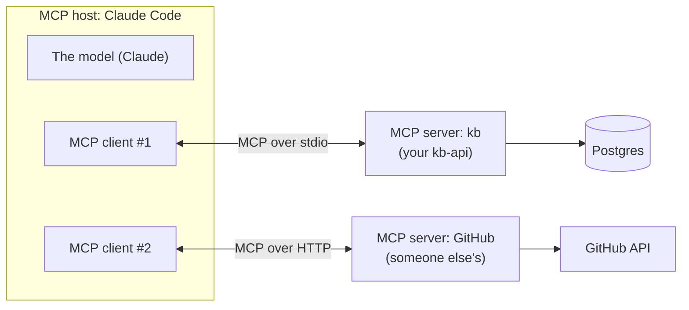
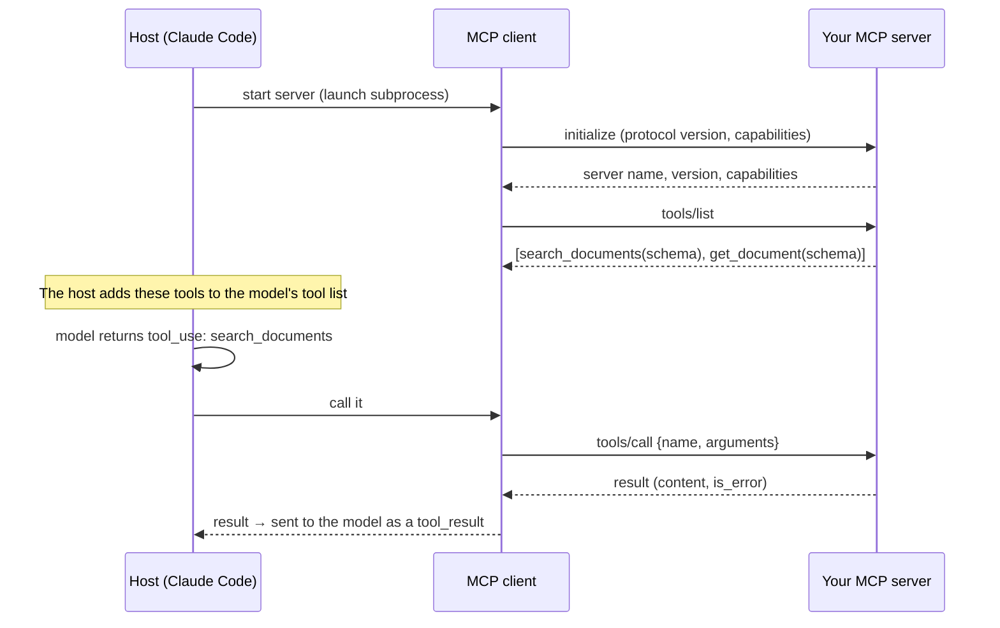

# 04 · MCP concepts

<!-- nav:top -->
[Course home](../../README.md) › [Step 7 plan](../../steps/07-agentic-ai-engineering.md) › [Step 7 lessons](00-start-here.md) · [Glossary](../../GLOSSARY.md)
<!-- nav:end -->

## 1. In one sentence

**MCP (Model Context Protocol)** is an open standard that lets you write your tools and data access **once, as an MCP server**, and use them from **any** AI application that speaks MCP: Claude Code, Claude Desktop, IDEs, or your own agent.

## 2. Why it exists

In lesson 02 you described tools inside your own script. That works for one app. Now imagine your team wants the same "search our engineering docs" tool in:

- Claude Code in the terminal,
- Claude Desktop,
- an IDE assistant,
- your own `agent.py`.

Without a standard, you would write four integrations, each with its own format. With N AI apps and M tools, that is N × M integrations. MCP turns it into N + M: each app implements the MCP **client** side once, each tool provider implements an MCP **server** once, and they all work together. It is the same idea as USB, or as Rack in Ruby: one interface between many servers and many apps.

## 3. Rails analogy

**MCP is to AI apps what Rack is to Ruby web servers.** Any Rack app runs on Puma, Unicorn or Falcon, because they agree on one interface (`call(env) → [status, headers, body]`). Any MCP server works in Claude Code, Claude Desktop or your agent, because they agree on one protocol (`tools/list`, `tools/call`, ...).

A second, closer-to-home analogy: an MCP server is like a **Rails engine or an API gem your team publishes**. It packages a set of capabilities (tools and data) that other applications can mount and use without knowing how they are implemented.

Where the analogy breaks: MCP is **language-neutral and process-separated**. Your server is its own program (often launched by the AI app as a subprocess), not code loaded into the host app.

## 4. How it works

### The three roles



| Role | What it is | Example |
|---|---|---|
| **Host** | The AI application the user works in. It contains the model conversation. | Claude Code, Claude Desktop, an IDE, your agent script |
| **Client** | A connector inside the host. Each client talks to exactly one server. | Created by Claude Code when you run `claude mcp add ...` |
| **Server** | A program that offers capabilities over MCP. | Your `kb-api` MCP server |

### What a server can offer

| Capability | What it is | Who decides to use it | kb-api example |
|---|---|---|---|
| **Tools** | Functions the model can call (same idea as lesson 02). | The model | `search_documents(query)`, `get_document(id)` |
| **Resources** | Read-only data identified by a URI, which the host or user can attach to the conversation. | The host / user | `kb://documents/42` |
| **Prompts** | Reusable prompt templates the user can pick. | The user | "Summarise runbook" |

In practice, **tools** are what you will use most. This course uses tools and one resource.

### What happens on the wire

MCP messages are **JSON-RPC 2.0**: small JSON objects with a `method`, `params` and an `id`, answered by a `result` or an `error` with the same `id`. You rarely write them by hand (the SDK does), but knowing the sequence helps when debugging:



Look at the middle: **MCP does not replace tool calling; it feeds it.** The host turns MCP tools into ordinary tool definitions for the model (lesson 02), and turns the model's `tool_use` into an MCP `tools/call`.

### Transports: how the bytes travel

| Transport | How it works | Use it when |
|---|---|---|
| **stdio** | The host launches your server as a **subprocess** and exchanges JSON-RPC messages over its standard input and output. | Local tools on the developer's machine (the common case, and this course's default). |
| **Streamable HTTP** | Your server is a web service at a URL (for example `https://kb.internal/mcp`); clients send HTTP POSTs. | A shared server for a team; remote access. Needs authentication (the MCP spec uses OAuth). |

A consequence of stdio that catches everyone once: **stdout is the protocol channel.** If your server calls `print()`, the text is mixed into the JSON-RPC stream and the connection breaks. Log to **stderr** (the SDK's logging does this for you).

### Why this matters for security

An MCP server runs with **your** permissions and is driven by a **model**. So:

- Only install servers you trust. A server's tool descriptions are shown to the model, and a malicious description can try to steer it ("tool poisoning").
- Give your own server the least access it needs (read-only by default).
- A remote (HTTP) server needs real authentication; anyone who can reach it can call its tools.

Lesson 14 covers this in more depth.

## 5. Minimal working example

This example shows the three roles in about 30 lines: a server, and a small client acting as the host. (Lesson 05 builds the real `kb` server.)

The course uses the official MCP Python SDK, version 2.x. In v2 the server class is `MCPServer` (in v1 it was called `FastMCP`; older blog posts use that name).

Create `mini_server.py`:

```python
from mcp.server import MCPServer

mcp = MCPServer("mini-kb")

DOCS = {1: "Solid Queue stores jobs in PostgreSQL.", 2: "Kamal deploys Docker containers."}


@mcp.tool()
def search_documents(query: str, limit: int = 5) -> list[dict]:
    """Search engineering documents by keyword. Returns id and text for each match."""
    hits = [{"id": i, "text": t} for i, t in DOCS.items() if query.lower() in t.lower()]
    return hits[:limit]


@mcp.resource("kb://documents/{doc_id}")
def document(doc_id: int) -> str:
    """The full text of one document."""
    return DOCS[int(doc_id)]


if __name__ == "__main__":
    mcp.run()  # stdio transport by default
```

Notice there is no JSON Schema: the SDK builds it from the type hints (`query: str, limit: int = 5`) and the docstring becomes the description.

Create `mini_client.py` (it plays the host's part: start the server, list tools, call one):

```python
import asyncio
import sys

from mcp import Client, StdioServerParameters


async def main() -> None:
    # Launch mini_server.py as a subprocess and talk to it over stdio.
    params = StdioServerParameters(command=sys.executable, args=["mini_server.py"])
    async with Client(params) as client:
        listed = await client.list_tools()
        for tool in listed.tools:
            print("tool:", tool.name, "-", tool.description)
            print("  input schema:", tool.input_schema)

        result = await client.call_tool("search_documents", {"query": "kamal"})
        print("is_error:", result.is_error)
        print("structured result:", result.structured_content)

        resource = await client.read_resource("kb://documents/1")
        print("resource text:", resource.contents[0].text)


asyncio.run(main())
```

Run it:

```bash
uv run python mini_client.py
```

Output (tested with `mcp` 2.2):

```
tool: search_documents - Search engineering documents by keyword. Returns id and text for each match.
  input schema: {'type': 'object', 'properties': {'query': {'title': 'Query', 'type': 'string'}, 'limit': {'default': 5, 'title': 'Limit', 'type': 'integer'}}, 'required': ['query'], 'title': 'search_documentsArguments'}
is_error: False
structured result: {'result': [{'id': 2, 'text': 'Kamal deploys Docker containers.'}]}
resource text: Solid Queue stores jobs in PostgreSQL.
```

Now open the same server in the **MCP Inspector**, a browser UI for testing servers (needs Node.js):

```bash
uv run mcp dev mini_server.py
```

It prints a local URL. Open it, click **Connect**, then **Tools → search_documents**, enter `kamal` and run it. You are now doing by hand what Claude Code does automatically.

## 6. Key terms

- **MCP**: Model Context Protocol, an open standard connecting AI apps to tools and data.
- **Host**: the AI app the user works in.
- **Client**: the host's connector to one server.
- **Server**: your program offering tools, resources and prompts.
- **Tool / resource / prompt**: model-invoked function / read-only data by URI / user-picked template.
- **JSON-RPC**: the request/response message format under MCP.
- **stdio transport**: server as a subprocess, messages over stdin/stdout.
- **Streamable HTTP transport**: server as a web service at a URL.
- **MCP Inspector**: browser tool to call a server's tools by hand.

## 7. Common mistakes

- **Thinking MCP replaces tool calling.** It is a way to *package and share* tools; the model still sees ordinary tool definitions and returns `tool_use` blocks.
- **`print()` in a stdio server.** It corrupts the protocol stream. Log to stderr.
- **Following v1 tutorials with the v2 SDK.** `from mcp.server.fastmcp import FastMCP` fails in v2; use `from mcp.server import MCPServer`. (Or pin `mcp<2` if you follow an older guide.)
- **Duplicating logic in the MCP server.** The server should be a thin layer over your existing service functions (lesson 05).
- **Exposing an HTTP server without authentication.**
- **Installing third-party servers without reading what they do.** They run with your permissions.

## 8. Check your understanding

1. In one sentence each: what are the host, the client and the server when you use your `kb` server from Claude Code?
2. How does a tool on an MCP server end up being called by the model? Name the two conversions the host performs.
3. When would you choose Streamable HTTP over stdio, and what extra concern does it bring?
4. Your stdio server works in tests but Claude Code shows "connection closed". You recently added `print("searching...")`. What happened?
5. What problem does MCP solve that writing tools directly in each app does not?

<details>
<summary>Answers</summary>

1. Host: Claude Code, where you chat. Client: the connector Claude Code creates for your server. Server: your `kb` program exposing the tools.
2. The host converts the server's MCP tool list into tool definitions for the model, and converts the model's `tool_use` into an MCP `tools/call` (then the result back into a `tool_result`).
3. When several people or machines need one shared server (a team service). You must add authentication and treat it like any public API.
4. `print()` wrote to stdout, which is the JSON-RPC channel for stdio; the client received invalid messages and closed the connection. Log to stderr.
5. Reuse: write the integration once and use it from every MCP-capable AI app, instead of N × M custom integrations.

</details>

## 9. Go deeper (optional)

- [modelcontextprotocol.io](https://modelcontextprotocol.io): introduction, architecture, and the specification (including security best practices).
- [MCP Python SDK](https://github.com/modelcontextprotocol/python-sdk) and its docs at https://py.sdk.modelcontextprotocol.io (v2 migration guide included).
- [MCP Inspector](https://github.com/modelcontextprotocol/inspector).

<!-- nav:bottom -->

---

[← 03 · The agent loop](03-agent-loop.md) · [Step 7 lessons](00-start-here.md) · [05 · Building an MCP server for kb-api →](05-building-an-mcp-server.md)
<!-- nav:end -->
