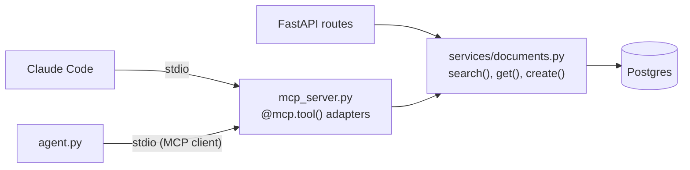

# 05 · Building an MCP server for kb-api

## 1. In one sentence

You add a small file to `kb-api` that wraps your **existing service functions** as MCP tools, so Claude Code, Claude Desktop and your own agent can all search and read your knowledge base through one implementation.

## 2. Why it exists

Lesson 04 explained what MCP is. This lesson is about doing it **well** in a real project. The common failure is a second copy of the business logic inside the MCP server: one search in the REST API, a slightly different one in the MCP server, and a third in the agent. They drift apart, and your evals measure the wrong one.

The fix is a **service layer**: plain functions that hold the logic, with thin adapters on top (REST, MCP, agent tools). Tests and evals target the service layer; the adapters stay tiny.

## 3. Rails analogy

This is the classic Rails advice "skinny controllers, service objects":

| Rails | kb-api |
|---|---|
| `app/services/document_search.rb` | `kb_api/services/documents.py` (the real logic) |
| `DocumentsController#index` calls the service | FastAPI route calls the service |
| `Api::V2::DocumentsController` calls the same service | **MCP tool** calls the same service |
| `rails runner` script calls the same service | Agent tool calls the same service |

The MCP server is just one more "controller": it validates input, calls the service, and formats the output for its client.

## 4. How it works



Design rules for the tools:

1. **Few, well-named tools.** `search_documents`, `get_document`, and (later, with approval) `create_document`. Avoid overlapping tools such as `search`, `find`, `lookup`: the model will not know which to pick.
2. **Descriptions say when to use the tool and what it returns.** The model reads them.
3. **Compact output with IDs.** Search returns `id`, `title`, `path` and a short `snippet`, not whole documents. The model calls `get_document(id)` when it needs the full text.
4. **Clamp inputs.** `limit` is capped (for example at 10) even if the model asks for 1,000.
5. **Clear errors.** Raise `ToolError("Document 42 does not exist")`. In the v2 SDK, a `ToolError` message is sent to the model; any *other* exception is reported only as a generic "Error executing tool", so the model cannot recover.
6. **Read-only by default.** Write tools get their own lesson-03-style confirmation, or are left out of the MCP server entirely at first.
7. **Log to stderr**, never `print()` (stdout carries the protocol).

### Connecting it to real clients

**Claude Code** (from your terminal; `--` separates Claude Code's options from your server command):

```bash
claude mcp add kb -- uv run --directory /absolute/path/to/kb-api python -m kb_api.mcp_server
claude mcp list          # check it is connected
```

Then, in a Claude Code session, ask: "Using the kb tools, which documents mention Solid Queue retries?"

**Claude Desktop**: add the server to `claude_desktop_config.json` (Settings → Developer → Edit Config), then restart the app:

```json
{
  "mcpServers": {
    "kb": {
      "command": "uv",
      "args": ["run", "--directory", "/absolute/path/to/kb-api", "python", "-m", "kb_api.mcp_server"]
    }
  }
}
```

**Streamable HTTP** (for a shared, remote server): run with `mcp.run(transport="streamable-http")`; the endpoint is `http://localhost:8000/mcp` by default. Put it behind authentication before anyone else can reach it.

## 5. Minimal working example

This example is complete and runnable on its own. It has the same three-layer shape as `kb-api`, with an in-memory service so you can focus on the MCP part. In the lab, you replace `kb_service.py` with your real SQLAlchemy service.

**`kb_service.py`**: the service layer (the only place with logic):

```python
from dataclasses import asdict, dataclass


@dataclass
class Document:
    id: int
    title: str
    path: str
    body: str


DOCS = [
    Document(1, "Solid Queue basics", "docs/solid_queue.md",
             "Solid Queue stores jobs in PostgreSQL. Failed jobs go to solid_queue_failed_executions."),
    Document(2, "Retrying jobs", "docs/retries.md",
             "Use retry_on in the job class. Retries use exponential backoff."),
    Document(3, "Deploying with Kamal", "docs/kamal.md", "Kamal deploys Docker containers with kamal deploy."),
]


class NotFound(Exception):
    pass


def search(query: str, limit: int) -> list[dict]:
    words = query.lower().split()
    scored = [(sum(f"{d.title} {d.body}".lower().count(w) for w in words), d) for d in DOCS]
    hits = [d for score, d in sorted(scored, key=lambda pair: -pair[0]) if score > 0]
    return [{"id": d.id, "title": d.title, "path": d.path, "snippet": d.body[:80]} for d in hits[:limit]]


def get(doc_id: int) -> dict:
    for doc in DOCS:
        if doc.id == doc_id:
            return asdict(doc)
    raise NotFound(f"Document {doc_id} does not exist")
```

**`kb_mcp_server.py`**: the thin MCP adapter:

```python
import logging

from mcp.server import MCPServer
from mcp.server.mcpserver.exceptions import ToolError

import kb_service

logging.basicConfig(level=logging.INFO)  # logs go to stderr, never stdout
log = logging.getLogger("kb_mcp")

mcp = MCPServer("kb")


@mcp.tool()
def search_documents(query: str, limit: int = 5) -> list[dict]:
    """Search the engineering knowledge base (runbooks, ADRs, guides).

    Use this first for any question about our systems. Returns id, title, path and a
    short snippet per match; call get_document with an id to read the full text.
    """
    limit = max(1, min(limit, 10))  # clamp whatever the model asked for
    log.info("search_documents query=%r limit=%d", query, limit)
    return kb_service.search(query, limit)


@mcp.tool()
def get_document(doc_id: int) -> dict:
    """Return the full text of one document by its id (from search_documents)."""
    try:
        return kb_service.get(doc_id)
    except kb_service.NotFound as error:
        raise ToolError(str(error)) from error  # this message reaches the model


@mcp.resource("kb://documents/{doc_id}")
def document_resource(doc_id: int) -> str:
    """A document's body, attachable by URI."""
    return kb_service.get(int(doc_id))["body"]


if __name__ == "__main__":
    mcp.run()
```

**`test_kb_mcp_server.py`**: test the server **in memory**, without a subprocess. `Client` accepts the server object directly:

```python
import pytest
from mcp import Client

from kb_mcp_server import mcp


@pytest.mark.anyio
async def test_search_returns_compact_hits():
    async with Client(mcp) as client:
        result = await client.call_tool("search_documents", {"query": "retry", "limit": 50})
    hits = result.structured_content["result"]
    assert hits[0]["path"] == "docs/retries.md"
    assert set(hits[0]) == {"id", "title", "path", "snippet"}


@pytest.mark.anyio
async def test_missing_document_is_a_clear_error():
    async with Client(mcp) as client:
        result = await client.call_tool("get_document", {"doc_id": 42})
    assert result.is_error
    assert "Document 42 does not exist" in result.content[0].text


@pytest.fixture
def anyio_backend():
    return "asyncio"
```

Run the tests and the Inspector:

```bash
uv run pytest -q test_kb_mcp_server.py
uv run mcp dev kb_mcp_server.py      # opens the MCP Inspector in your browser
```

Expected test output:

```
..                                                                       [100%]
2 passed
```

### Using MCP tools from your own agent

Your lesson-03 agent can use this server too. The agent becomes an MCP **host**: it lists the server's tools, gives them to Claude, and forwards each `tool_use` as an MCP call. Create `mcp_agent.py`:

```python
import asyncio
import sys

import anthropic
from mcp import Client, StdioServerParameters

claude = anthropic.AsyncAnthropic()
MODEL = "claude-opus-5-5"


async def ask(question: str, max_turns: int = 8) -> str:
    params = StdioServerParameters(command=sys.executable, args=["kb_mcp_server.py"])
    async with Client(params) as kb:
        # 1. Convert MCP tools into Claude tool definitions.
        listed = await kb.list_tools()
        tools = [{"name": t.name, "description": t.description or "", "input_schema": t.input_schema}
                 for t in listed.tools]

        messages = [{"role": "user", "content": question}]
        for _ in range(max_turns):
            response = await claude.messages.create(
                model=MODEL, max_tokens=8000, tools=tools, messages=messages
            )
            messages.append({"role": "assistant", "content": response.content})
            if response.stop_reason != "tool_use":
                return "".join(b.text for b in response.content if b.type == "text")

            # 2. Forward each tool_use to the MCP server; collect all results in one message.
            results = []
            for block in response.content:
                if block.type == "tool_use":
                    called = await kb.call_tool(block.name, block.input)
                    text = "\n".join(c.text for c in called.content if c.type == "text")
                    results.append({"type": "tool_result", "tool_use_id": block.id,
                                    "content": text, "is_error": bool(called.is_error)})
            messages.append({"role": "user", "content": results})
        return "Stopped: turn limit reached."


print(asyncio.run(ask("How do retries work for our background jobs?")))
```

```bash
uv run python mcp_agent.py
```

In Step 8 you will use exactly this pattern to compare an agent **with** and **without** your MCP server.

## 6. Key terms

- **Service layer**: plain functions holding the business logic, shared by all adapters.
- **Adapter**: a thin layer (REST route, MCP tool, agent tool) that calls the service.
- **`ToolError`**: the v2 SDK exception whose message is returned to the model as a tool error.
- **In-memory client**: `Client(mcp)` connects to a server object directly; ideal for tests.
- **`claude mcp add`**: the Claude Code command that registers an MCP server.

## 7. Common mistakes

- **Logic in the adapter.** If the MCP tool does its own SQL, the REST API and the MCP server will disagree. Call the service.
- **Returning whole documents from search.** Return snippets and IDs; let the model ask for more.
- **Raising plain exceptions for expected errors.** The model only sees "Error executing tool". Use `ToolError` with a helpful message.
- **Relative paths in client config.** Claude Code and Claude Desktop start your server from another directory. Use `--directory /absolute/path`.
- **Testing only through Claude Code.** Test tools with the in-memory `Client` and the Inspector first; it is faster and repeatable.
- **Forgetting the model sees descriptions.** Treat them as part of the product; improve them when evals show wrong tool choices.

## 8. Check your understanding

1. Why should the MCP tool call `kb_service.search` rather than contain its own search code?
2. What does the model see if `get_document` raises `KeyError`, compared with `ToolError`?
3. The model calls `search_documents` with `limit=500`. What does the server do, and why?
4. How would you run the server's tools in a unit test without starting a subprocess?
5. What two conversions does `mcp_agent.py` perform?

<details>
<summary>Answers</summary>

1. One implementation to test and evaluate; REST, MCP and agent results stay consistent.
2. `KeyError` gives a generic "Error executing tool get_document"; `ToolError("Document 42 does not exist")` passes that message, so the model can explain or try another ID.
3. It clamps `limit` to 10, protecting cost, latency and the database.
4. `async with Client(mcp) as client:` using the server object (in-memory transport), then `client.call_tool(...)`.
5. MCP tool list → Claude tool definitions; Claude `tool_use` → MCP `call_tool`, and the MCP result back into a `tool_result`.

</details>

## 9. Go deeper (optional)

- MCP Python SDK docs: https://py.sdk.modelcontextprotocol.io (servers, clients, testing).
- Claude Code docs: [Connect Claude Code to tools via MCP](https://code.claude.com/docs/en/mcp).
- MCP spec: [Security best practices](https://modelcontextprotocol.io) (under Specification).
