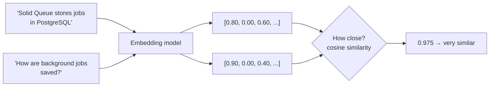

# 06 · Embeddings and vector search

<!-- nav:top -->
[Course home](../../README.md) › [Step 7 plan](../../steps/07-agentic-ai-engineering.md) › [Step 7 lessons](00-start-here.md) · [Glossary](../../GLOSSARY.md)
<!-- nav:end -->

## 1. In one sentence

An **embedding** turns a piece of text into a list of numbers (a **vector**) so that texts with **similar meaning get similar numbers**; **vector search** finds the texts whose vectors are closest to the vector of your question.

## 2. Why it exists

Your Step 6 search used Postgres full-text search: it matches **words**. That fails when the question and the document use different words for the same idea:

| Question | Document that answers it | Shared words |
|---|---|---|
| "How are background jobs saved?" | "Solid Queue **persists** **tasks** in PostgreSQL" | none that matter |
| "Why is the app slow after deploy?" | "Cold YJIT caches increase **latency** right after a **release**" | none |

People describe the same thing in many ways. Embeddings capture **meaning**, so "saved" and "persists", "background jobs" and "tasks" end up close together. That is what makes semantic search, and therefore RAG (lesson 10), work.

## 3. Rails analogy

Think of an embedding as a **computed column**, like the `tsvector` column you added in Step 6:

```ruby
# A generated column you already know: words, processed for search
t.virtual :search_vector, type: :tsvector, as: "to_tsvector('english', body)", stored: true
```

An embedding column is the same idea, except the value is computed by **a machine-learning model** instead of a SQL function, and it summarises *meaning* rather than *words*. You compute it once when the document is saved, and compare against it at query time.

Where the analogy breaks: you cannot read an embedding. `[0.021, -0.187, 0.044, ...]` has no human-readable parts, and the numbers only mean something when compared with other embeddings **from the same model**.

## 4. How it works

### From text to coordinates

Imagine a map where every sentence is a point. Sentences about background jobs cluster in one area, sentences about deployment in another. An embedding model is a function that gives each text its **coordinates** on that map.

Real maps have 2 dimensions. Embedding "maps" have hundreds (for example **384** or **1,024**). You cannot picture that many, but the maths is the same as in 2 or 3 dimensions.



### Measuring "closeness": cosine similarity

Two vectors are similar if they **point in the same direction**. **Cosine similarity** measures the angle between them:

```
cosine_similarity(a, b) = (a · b) / (|a| × |b|)

a · b  = a₁b₁ + a₂b₂ + ... (the "dot product")
|a|    = √(a₁² + a₂² + ...) (the vector's length)
```

- **1.0**: same direction → same meaning.
- **0.0**: at right angles → unrelated.
- (Negative values are possible but rare with text embedding models.)

**Worked example** with toy 3-dimensional vectors, where we *pretend* each position measures one idea: `[jobs & queues, deployment, databases]`.

| Text | Vector |
|---|---|
| Question: "How are background jobs saved in the database?" | `q = [0.9, 0.0, 0.4]` |
| Doc A: "Solid Queue stores jobs in PostgreSQL" | `a = [0.8, 0.0, 0.6]` |

```
q · a = 0.9×0.8 + 0.0×0.0 + 0.4×0.6 = 0.72 + 0 + 0.24 = 0.96
|q|   = √(0.81 + 0 + 0.16) = √0.97 = 0.985
|a|   = √(0.64 + 0 + 0.36) = √1.00 = 1.000
similarity = 0.96 / (0.985 × 1.000) = 0.975
```

0.975 is very close to 1: the document matches the question's meaning even though they share few words.

**Cosine distance** is `1 - similarity` (here 0.025). Databases usually sort by *distance* (smallest first). pgvector's `<=>` operator returns cosine distance (lesson 08).

### Vector search, step by step

1. **Ahead of time (ingestion):** embed every chunk of every document; store the vectors.
2. **At query time:** embed the question with **the same model**.
3. Compute the distance from the question vector to every stored vector (or use an index to do this quickly, lesson 08).
4. Return the *k* closest chunks (the "top k").

### Choosing an embedding model

| Option | Example | Dimensions | Cost | Notes |
|---|---|---|---|---|
| Local, small | `BAAI/bge-small-en-v1.5` via the `fastembed` library | 384 | Free; runs on your CPU | Good starting point; used in this course |
| Hosted API | Voyage AI (recommended in Anthropic's docs), OpenAI, Cohere | 512-3,072 | Paid per token | Usually higher quality; network call per batch |

Claude itself does not produce embeddings; you use a separate embedding model. Rules that apply to all of them:

- **Store which model produced each vector.** Vectors from different models are not comparable. If you change model, re-embed everything.
- **The column dimension must match the model** (`vector(384)` for bge-small).
- **Embed in batches**, not one text per call; it is much faster.
- Some models are trained with different handling for questions and documents. `fastembed` offers `query_embed()` for questions and `passage_embed()` for documents; try both styles and let your retrieval eval (lesson 11) decide.

## 5. Minimal working example

### Part A: the maths, with no model (runs anywhere)

Create `cosine_demo.py`:

```python
import numpy as np

# Toy 3-dimensional "embeddings". Pretend each position measures one idea:
#            [jobs & queues, deployment, databases]
docs = {
    "Solid Queue stores jobs in PostgreSQL": np.array([0.8, 0.0, 0.6]),
    "Retrying failed jobs with retry_on":    np.array([0.9, 0.1, 0.0]),
    "Kamal deploys Docker containers":       np.array([0.0, 1.0, 0.1]),
}
query = np.array([0.9, 0.0, 0.4])  # "How are background jobs saved in the database?"


def cosine_similarity(a: np.ndarray, b: np.ndarray) -> float:
    return float(np.dot(a, b) / (np.linalg.norm(a) * np.linalg.norm(b)))


ranked = sorted(docs.items(), key=lambda item: cosine_similarity(query, item[1]), reverse=True)
for text, vector in ranked:
    sim = cosine_similarity(query, vector)
    print(f"similarity={sim:.3f}  distance={1 - sim:.3f}  {text}")
```

```bash
uv run python cosine_demo.py
```

Output:

```
similarity=0.975  distance=0.025  Solid Queue stores jobs in PostgreSQL
similarity=0.908  distance=0.092  Retrying failed jobs with retry_on
similarity=0.040  distance=0.960  Kamal deploys Docker containers
```

That is vector search: rank by similarity, keep the top *k*.

### Part B: real embeddings with a local model

`fastembed` runs small embedding models on your CPU without PyTorch. The first run downloads the model (about 70 MB) from Hugging Face.

Create `embed_demo.py`:

```python
import numpy as np
from fastembed import TextEmbedding

model = TextEmbedding("BAAI/bge-small-en-v1.5")  # 384 dimensions

documents = [
    "Solid Queue persists tasks in PostgreSQL tables.",
    "Kamal ships Docker containers to your servers over SSH.",
    "Use retry_on in an Active Job class to retry failures with backoff.",
]
question = "How are background jobs saved?"

doc_vectors = np.array(list(model.embed(documents)))    # shape (3, 384); embed() yields one vector per text
query_vector = np.array(list(model.embed([question]))[0])

print("dimensions:", doc_vectors.shape[1])

# Cosine similarity for all documents at once.
similarities = doc_vectors @ query_vector / (
    np.linalg.norm(doc_vectors, axis=1) * np.linalg.norm(query_vector)
)
for score, text in sorted(zip(similarities, documents), reverse=True):
    print(f"{score:.3f}  {text}")
```

```bash
uv run python embed_demo.py
```

Illustrative output (the scores below are typical, not exact; your numbers will differ, but the first result should be the same):

```
dimensions: 384
0.78  Solid Queue persists tasks in PostgreSQL tables.
0.66  Use retry_on in an Active Job class to retry failures with backoff.
0.52  Kamal ships Docker containers to your servers over SSH.
```

The top result shares almost no words with the question ("saved" vs "persists", "jobs" vs "tasks"), yet it ranks first. Notice also that the scores are not spread from 0 to 1: with real models, unrelated texts often still score 0.4-0.6. **Only the ranking is meaningful**, not the absolute number, so avoid fixed thresholds like "anything above 0.7 is relevant" unless your evals support them.

## 6. Key terms

- **Embedding**: a vector representing a text's meaning, produced by an embedding model.
- **Vector**: an ordered list of numbers.
- **Dimensions**: the length of the vector; fixed per model.
- **Dot product**: sum of pairwise products; the core of similarity.
- **Norm (length)**: `√(sum of squares)`.
- **Cosine similarity / distance**: direction-based closeness; distance = 1 − similarity.
- **Top k**: the k most similar results.
- **Semantic search**: search by meaning using embeddings.

## 7. Common mistakes

- **Mixing models.** Embedding documents with one model and questions with another gives nonsense rankings.
- **Mismatched dimensions.** A `vector(1536)` column with a 384-dimension model fails on insert.
- **Embedding whole documents.** One vector for a 20-page runbook averages everything together; embed chunks (lesson 07).
- **Trusting absolute scores.** Compare rankings; tune thresholds only with evals.
- **Expecting exact identifiers to match.** Embeddings are weak at rare tokens like `SOLID_QUEUE_IN_PUMA` or error codes. Full-text search is better there; combine both (lesson 09).
- **Re-embedding unchanged content on every sync.** Store a content hash and skip unchanged chunks.

## 8. Check your understanding

1. Why can vector search find "Solid Queue persists tasks" for the question "how are jobs saved?" when full-text search cannot?
2. Compute the cosine similarity of `[1, 0]` and `[0, 1]`. What does the result mean?
3. You switch from bge-small (384 dimensions) to a hosted model with 1,024 dimensions. List two things you must change.
4. Why is "similarity > 0.7 means relevant" a risky rule?
5. A user searches for `PG::ConnectionBad`. Why might vector search miss the right runbook?

<details>
<summary>Answers</summary>

1. Embeddings place texts by meaning, so synonyms and paraphrases end up close together; full-text search needs the same (stemmed) words.
2. `(1×0 + 0×1) / (1 × 1) = 0`: the vectors are at right angles, meaning unrelated.
3. Re-embed all chunks with the new model, and change the column to `vector(1024)` (and rebuild the index). Also record the new model name.
4. Absolute scores vary by model and topic; unrelated texts can score quite high. Rankings are reliable; thresholds need evidence from evals.
5. Rare identifiers and exact strings are poorly represented in embeddings; keyword (full-text) search matches them exactly. Hybrid search fixes this.

</details>

## 9. Go deeper (optional)

- Claude docs: [Embeddings](https://platform.claude.com/docs/en/build-with-claude/embeddings): why and how to choose a provider.
- [fastembed](https://github.com/qdrant/fastembed): supported models and usage.
- Jay Alammar, "The Illustrated Word2vec" (jalammar.github.io, verify): a visual intuition for how meaning becomes vectors.

<!-- nav:bottom -->

---

[← 05 · Building an MCP server for kb-api](05-building-an-mcp-server.md) · [Step 7 lessons](00-start-here.md) · [07 · Chunking →](07-chunking.md)
<!-- nav:end -->
