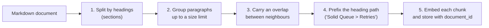

# 07 · Chunking

## 1. In one sentence

**Chunking** means cutting each document into smaller, self-contained pieces (**chunks**, usually a few paragraphs) **before** you embed them, so that search can return the exact part of a document that answers a question.

## 2. Why it exists

You could embed each whole document as one vector. It works badly:

- **Meaning gets averaged away.** A 15-page runbook covers deploys, rollbacks, alerts and on-call. One vector for all of it is "a bit about everything" and matches nothing strongly.
- **Too much text goes to the model.** If search returns whole documents, you pay for thousands of irrelevant tokens on every question, and the answer is buried.
- **Embedding models have input limits.** Many only read the first few hundred tokens; the rest is silently ignored.

Chunks fix this: each chunk is about one idea, so its vector is sharp, search returns only the relevant part, and the prompt stays small.

The opposite mistake also exists: **chunks that are too small** (one sentence) lose context. "Set it to true on small apps" means nothing without the heading that says what "it" is. Chunking is a trade-off, and the right size is found with evals.

## 3. Rails analogy

Chunking is like **pagination for search results, decided at write time**. Or, closer: like splitting a big `has_many` into sensible records. You would not store every comment of a thread in one `text` column; you store one row per comment, with a `post_id` so you can find its parent. A chunk is a row in a `chunks` table with a `document_id`, a `heading_path` for context, and its own embedding.

```ruby
# The Rails shape of what you will build in Python
class Document < ApplicationRecord
  has_many :chunks, dependent: :destroy
end

class Chunk < ApplicationRecord   # columns: document_id, position, heading_path, text, embedding
  belongs_to :document
end
```

Where it breaks: there is no "correct" way to split. You choose a strategy and measure it.

## 4. How it works



### Common strategies

| Strategy | How | Good | Bad |
|---|---|---|---|
| **Fixed size** | Every N characters or tokens | Simple | Cuts sentences and code blocks in half |
| **Recursive / paragraph** | Split on blank lines, merge paragraphs up to a limit | Keeps paragraphs whole | Ignores document structure |
| **Structure-aware (headings)** | Split on Markdown headings first, then by paragraphs | Chunks follow the author's topics; headings add context | Needs parsing; sections vary a lot in size |

For engineering docs (Markdown with headings), **structure-aware chunking** is the best starting point, and it is what this course uses.

### The main settings

- **Size.** A starting range of about **300-800 tokens** per chunk (roughly 1,200-3,200 characters, at ~4 characters per token). Smaller gives more precise matches; larger gives more context per hit.
- **Overlap.** Repeat a little text (for example the last paragraph) at the start of the next chunk, so an idea that spans a boundary appears whole in at least one chunk.
- **Context prefix.** Add the heading path ("Solid Queue > Running in Puma") to the text you embed. It costs a few tokens and makes short chunks much easier to match.
- **Metadata.** Store `document_id`, `position`, `heading_path` and a `content_hash` with each chunk, so you can cite sources and skip re-embedding unchanged text.

### Special content

- **Code blocks:** avoid splitting inside a fenced block. (The example below keeps paragraphs whole; a code block without blank lines stays in one piece.)
- **Tables:** keep a table in one chunk when you can; half a table is hard to understand.
- **Very long paragraphs:** a paragraph larger than the limit stays one oversized chunk in the simple version. That is acceptable for docs; add a sentence-level split if your evals show problems.

## 5. Minimal working example

Create `chunker.py`:

```python
import re
from dataclasses import dataclass

MAX_CHARS = 1200      # about 300 tokens (1 token ≈ 4 characters)
OVERLAP_PARAGRAPHS = 1


@dataclass
class Chunk:
    heading_path: str  # e.g. "Solid Queue > Retries"
    text: str

    def for_embedding(self) -> str:
        # Prefix the heading path so the chunk carries its context.
        return f"{self.heading_path}\n\n{self.text}"


def split_sections(markdown: str) -> list[tuple[str, str]]:
    """Split Markdown into (heading_path, body) pairs, one per heading."""
    sections: list[tuple[str, str]] = []
    path: list[str] = []
    body: list[str] = []

    def flush() -> None:
        text = "\n".join(body).strip()
        if text:
            sections.append((" > ".join(path) or "(top)", text))
        body.clear()

    for line in markdown.splitlines():
        match = re.match(r"^(#{1,6})\s+(.*)", line)
        if match:
            flush()
            level = len(match.group(1))
            path[:] = path[: level - 1] + [match.group(2).strip()]
        else:
            body.append(line)
    flush()
    return sections


def chunk_markdown(markdown: str) -> list[Chunk]:
    chunks: list[Chunk] = []
    for heading_path, text in split_sections(markdown):
        paragraphs = [p.strip() for p in text.split("\n\n") if p.strip()]
        current: list[str] = []
        for paragraph in paragraphs:
            if current and len("\n\n".join(current + [paragraph])) > MAX_CHARS:
                chunks.append(Chunk(heading_path, "\n\n".join(current)))
                current = current[-OVERLAP_PARAGRAPHS:]  # carry the last paragraph over
            current.append(paragraph)
        if current:
            chunks.append(Chunk(heading_path, "\n\n".join(current)))
    return chunks


if __name__ == "__main__":
    doc = """# Solid Queue

Solid Queue is the default Active Job backend in Rails 8. It stores jobs in database tables.

## Retries

Failed jobs are recorded in solid_queue_failed_executions.

Use retry_on in your job class to retry with exponential backoff.

## Running in Puma

Set SOLID_QUEUE_IN_PUMA=true to run the supervisor inside Puma on small apps.
"""
    for i, chunk in enumerate(chunk_markdown(doc), start=1):
        print(f"--- chunk {i} [{chunk.heading_path}] ({len(chunk.text)} chars)")
        print(chunk.for_embedding())
```

Run it:

```bash
uv run python chunker.py
```

Output:

```
--- chunk 1 [Solid Queue] (92 chars)
Solid Queue

Solid Queue is the default Active Job backend in Rails 8. It stores jobs in database tables.
--- chunk 2 [Solid Queue > Retries] (125 chars)
Solid Queue > Retries

Failed jobs are recorded in solid_queue_failed_executions.

Use retry_on in your job class to retry with exponential backoff.
--- chunk 3 [Solid Queue > Running in Puma] (77 chars)
Solid Queue > Running in Puma

Set SOLID_QUEUE_IN_PUMA=true to run the supervisor inside Puma on small apps.
```

Look at chunk 3: on its own, "Set SOLID_QUEUE_IN_PUMA=true..." is clear only because the heading path is included.

**Try this:** set `MAX_CHARS = 80` and run again. The "Retries" section splits into two chunks, and the second one starts with the last paragraph of the first: that is the overlap.

In `kb-api`, call `chunk_markdown()` during ingestion, then embed `chunk.for_embedding()` for every chunk in one batch, and store `heading_path`, `text`, `position` and the vector in the `chunks` table (lesson 08).

## 6. Key terms

- **Chunk**: a small, self-contained piece of a document that gets its own embedding.
- **Chunk size**: the maximum length of a chunk (characters or tokens).
- **Overlap**: text repeated between neighbouring chunks.
- **Heading path**: the chain of headings above a chunk, used as context.
- **Structure-aware chunking**: splitting along the document's own headings and paragraphs.
- **Content hash**: a fingerprint of the text used to skip unchanged chunks.

## 7. Common mistakes

- **One embedding per document.** Precision collapses on long documents.
- **Tiny chunks without context.** Sentences like "enable it on small apps" match nothing. Add the heading path.
- **Splitting code blocks and tables** in the middle.
- **Choosing the size by gut feeling.** Try two or three sizes and compare recall@5 (lesson 11).
- **Forgetting to delete old chunks** when a document changes. Re-chunk the document and replace all its chunks in one transaction.
- **Counting characters as tokens.** 1,200 characters is about 300 tokens, not 1,200.

## 8. Check your understanding

1. Why does one vector for a whole 15-page runbook give poor search results?
2. What problem does overlap solve? What does it cost?
3. Why prefix the heading path to the chunk text before embedding?
4. A document is edited. Which chunks should you re-embed, and how do you know?
5. How would you decide between 300-token and 800-token chunks for your docs?

<details>
<summary>Answers</summary>

1. The single vector averages all topics together, so it is not strongly similar to any one specific question.
2. Ideas that span a chunk boundary appear whole in at least one chunk. It costs extra storage and embedding work, and some duplicate text in results.
3. It gives short chunks their context (what "it" refers to), which improves both matching and the model's understanding of the retrieved text.
4. Re-chunk the document; compare each chunk's content hash with the stored one; embed only new or changed chunks and delete chunks that no longer exist (or simply replace all of that document's chunks if it is small).
5. Build a golden set of questions (lesson 11), index the docs both ways, and compare recall@5 and MRR. Pick the better one, checking prompt size too.

</details>

## 9. Go deeper (optional)

- Anthropic engineering: "Introducing Contextual Retrieval" (anthropic.com/news, verify): adding context to chunks before embedding, with measured gains.
- pgvector-python examples, including hybrid search: https://github.com/pgvector/pgvector-python/tree/master/examples
