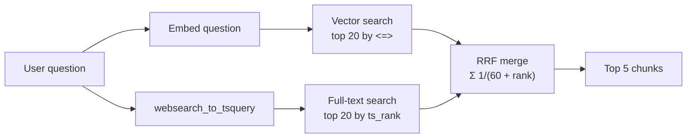

# 09 · Full-text, vector and hybrid search

## 1. In one sentence

**Full-text search** matches words, **vector search** matches meaning, and **hybrid search** runs both and merges the two ranked lists (usually with **reciprocal rank fusion**, RRF), so you get the strengths of each.

## 2. Why it exists

Each search type fails in a different way, and engineering documents trigger both failures:

| Question | Full-text search | Vector search |
|---|---|---|
| "How are background jobs saved?" (doc says "persists tasks") | ❌ no shared words | ✅ same meaning |
| "What does `SOLID_QUEUE_IN_PUMA` do?" | ✅ exact token match | ⚠️ rare identifiers are fuzzy in embeddings |
| "`PG::ConnectionBad` after deploy" | ✅ exact error name | ⚠️ may return generic "database errors" docs |
| "Why is the app slow right after a release?" | ⚠️ needs the same words | ✅ paraphrase |

You cannot know in advance which kind of question a user will ask, so you run both and combine them. In practice, hybrid search is rarely worse than either one alone, and often clearly better. Your retrieval eval (lesson 11) will show whether that is true for your data.

## 3. Rails analogy

You already know full-text search from Step 6 (and maybe from `pg_search` in Rails). Hybrid search is like a Rails search page that queries **two scopes** and merges the results:

```ruby
keyword_ids  = Chunk.full_text("solid queue retries").limit(20).pluck(:id)   # ranked by ts_rank
semantic_ids = Chunk.nearest_to(query_vector).limit(20).pluck(:id)           # ranked by distance
merged       = ReciprocalRankFusion.merge(keyword_ids, semantic_ids).first(5)
```

Where it breaks: you cannot simply add a `ts_rank` score to a cosine distance; they are on different scales. That is why RRF uses **ranks** (1st, 2nd, 3rd...), not scores.

## 4. How it works

### Full-text search in Postgres (a quick refresher)

```sql
SELECT to_tsvector('english', 'Retrying failed jobs with Solid Queue');
--  'fail':2 'job':3 'queue':6 'retri':1 'solid':5
```

- `to_tsvector` turns text into **lexemes**: lowercased, stop words ("with") removed, words **stemmed** to a root ("retrying" → `retri`, "jobs" → `job`), with positions.
- `websearch_to_tsquery('english', 'solid queue jobs')` turns what a user types into a query (it supports quotes and `-exclusions`, like a web search box).
- `tsv @@ query` means "matches"; `ts_rank(tsv, query)` gives a relevance score.
- A **GIN index** on a stored, generated `tsvector` column makes it fast (you did this in Step 6).

### Vector search (lessons 06-08)

`ORDER BY embedding <=> query_vector LIMIT k`, using the HNSW index.

### Merging with reciprocal rank fusion (RRF)

For each result, look at its **rank** in each list and add up `1 / (k + rank)`, where `k` is a constant, normally **60**:

```
RRF_score(doc) = Σ over lists  1 / (60 + rank_in_that_list)
(a document missing from a list gets 0 from that list)
```

Why this works:

- Ranks are comparable between lists; raw scores are not.
- Being near the top of **both** lists beats being first in only one.
- The constant 60 flattens the difference between rank 1 and rank 2, so one list cannot dominate.

**Worked example.** Query: "kamal docker". Vector search ranks four chunks; full-text search finds only one.

| Chunk | Vector rank | Full-text rank | RRF score |
|---|---|---|---|
| Kamal deploys Docker containers | 4 | 1 | 1/64 + 1/61 = 0.015625 + 0.016393 = **0.03202** |
| Solid Queue stores jobs in PostgreSQL | 1 | - | 1/61 = **0.01639** |
| Retrying failed jobs with Solid Queue | 2 | - | 1/62 = **0.01613** |
| Set SOLID_QUEUE_IN_PUMA... | 3 | - | 1/63 = **0.01587** |

(In this toy data the question vector was about jobs, so vector search alone would have ranked Kamal last; full-text search rescued it.) The Kamal chunk wins because it appears in both lists.



### Optional: reranking

A **reranker** is a second, slower model that reads the question together with each of the top 20-50 candidates and scores how relevant each one really is, then re-orders them. It often improves the top 5, at extra latency and cost. It is a stretch goal this week: first measure hybrid search, then decide whether reranking is worth it.

## 5. Minimal working example

### Part A: hybrid search in one SQL query

Using the `toy_chunks` table from lesson 08, add a full-text column and run both searches merged with RRF:

```sql
ALTER TABLE toy_chunks
  ADD COLUMN tsv tsvector GENERATED ALWAYS AS (to_tsvector('english', body)) STORED;
CREATE INDEX ON toy_chunks USING gin (tsv);

WITH semantic AS (
  SELECT id, row_number() OVER (ORDER BY embedding <=> '[0.85, 0.2, 0.05]') AS rank
  FROM toy_chunks
  ORDER BY embedding <=> '[0.85, 0.2, 0.05]'
  LIMIT 20
),
keyword AS (
  SELECT id, row_number() OVER (ORDER BY ts_rank(tsv, q) DESC) AS rank
  FROM toy_chunks, websearch_to_tsquery('english', 'kamal docker') q
  WHERE tsv @@ q
  ORDER BY ts_rank(tsv, q) DESC
  LIMIT 20
)
SELECT c.id, left(c.body, 40) AS body,
       round((COALESCE(1.0 / (60 + s.rank), 0) + COALESCE(1.0 / (60 + k.rank), 0))::numeric, 5) AS rrf_score
FROM semantic s
FULL OUTER JOIN keyword k ON k.id = s.id
JOIN toy_chunks c ON c.id = COALESCE(s.id, k.id)
ORDER BY rrf_score DESC
LIMIT 5;
```

Output (tested on PostgreSQL 16 + pgvector):

```
 id |                   body                   | rrf_score
----+------------------------------------------+-----------
  3 | Kamal deploys Docker containers to your  |   0.03202
  1 | Solid Queue stores background jobs in Po |   0.01639
  2 | Retrying failed jobs with Solid Queue    |   0.01613
  4 | Set SOLID_QUEUE_IN_PUMA to run jobs insi |   0.01587
```

How to read the query:

- `semantic` and `keyword` are two CTEs (like two scopes), each returning `id` and `rank`.
- `row_number() OVER (ORDER BY ...)` turns the sort order into ranks 1, 2, 3...
- `FULL OUTER JOIN` keeps chunks found by only one of the searches; `COALESCE(..., 0)` gives 0 for the missing list.

In `kb-api`, pass the question vector and text as bind parameters (`:qvec`, `:qtext`) instead of literals.

### Part B: RRF in Python (useful for evals and testing)

Save as `rrf.py`:

```python
def reciprocal_rank_fusion(*ranked_lists: list[int], k: int = 60) -> list[tuple[int, float]]:
    """Merge ranked lists of ids. Returns (id, score) pairs, best first."""
    scores: dict[int, float] = {}
    for ranked in ranked_lists:
        for rank, doc_id in enumerate(ranked, start=1):
            scores[doc_id] = scores.get(doc_id, 0.0) + 1.0 / (k + rank)
    return sorted(scores.items(), key=lambda pair: pair[1], reverse=True)


vector_results = [1, 2, 4, 3]  # ids from vector search, best first
keyword_results = [3]          # ids from full-text search, best first

for doc_id, score in reciprocal_rank_fusion(vector_results, keyword_results):
    print(doc_id, round(score, 5))
```

```bash
uv run python rrf.py
```

Output:

```
3 0.03202
1 0.01639
2 0.01613
4 0.01587
```

Same result as the SQL. Keeping a Python version lets you unit-test the merge and try variations (for example weighting one list) quickly.

## 6. Key terms

- **Full-text search**: word-based search with `tsvector`, `tsquery`, `ts_rank`.
- **Lexeme**: a normalised, stemmed word stored in a `tsvector`.
- **Stemming**: reducing words to a root (`retrying` → `retri`).
- **Stop words**: very common words ignored by full-text search ("the", "with").
- **Hybrid search**: combining keyword and vector results.
- **RRF**: merging ranked lists by summing `1 / (k + rank)`.
- **Reranker**: a model that re-scores the top candidates for relevance.

## 7. Common mistakes

- **Adding raw scores together** (`ts_rank + (1 - distance)`). The scales differ; use ranks (RRF).
- **Taking only the top 5 from each search before merging.** Take a deeper list (20 each), then merge and cut to 5.
- **Using `plainto_tsquery` or `to_tsquery` on raw user input.** `to_tsquery` raises errors on unbalanced syntax; `websearch_to_tsquery` is safe for user text.
- **Different languages in the `tsvector` and the query** (`'english'` vs `'simple'`): matches silently fail.
- **Assuming hybrid is better without measuring.** Check recall@5 for full-text, vector and hybrid on your golden set.

## 8. Check your understanding

1. Give one question where full-text search beats vector search, and one where the opposite is true.
2. Why does RRF use ranks instead of scores?
3. Compute the RRF score (k = 60) of a chunk ranked 2nd in vector search and 3rd in full-text search.
4. Why fetch 20 results from each search when you only want 5 in the end?
5. What does the `FULL OUTER JOIN` do in the SQL version?

<details>
<summary>Answers</summary>

1. Full-text wins on exact identifiers or error names (for example `SOLID_QUEUE_IN_PUMA`); vector wins on paraphrases ("saved" vs "persists").
2. `ts_rank` and cosine distance are on different, incomparable scales; ranks are comparable across any lists.
3. 1/62 + 1/63 = 0.016129 + 0.015873 = 0.032002.
4. A document that is 8th in both lists can deserve a top-5 place after fusion; if you cut each list to 5 first, you never see it.
5. It keeps results found by only one search (with a score of 0 from the other), instead of only those found by both.

</details>

## 9. Go deeper (optional)

- PostgreSQL docs: [Full Text Search](https://www.postgresql.org/docs/current/textsearch.html), especially "Controlling Text Search".
- Cormack, Clarke & Büttcher, "Reciprocal Rank Fusion outperforms Condorcet and individual Rank Learning Methods" (SIGIR 2009): the original RRF paper.
- pgvector-python hybrid search examples (full-text + vector with RRF): https://github.com/pgvector/pgvector-python/tree/master/examples/hybrid_search
