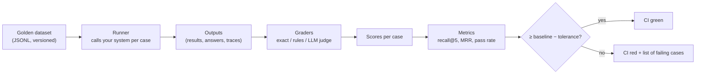

# 11 · Evals from zero

<!-- nav:top -->
[Course home](../../README.md) › [Step 7 plan](../../steps/07-agentic-ai-engineering.md) › [Step 7 lessons](00-start-here.md) · [Glossary](../../GLOSSARY.md)
<!-- nav:end -->

## 1. In one sentence

An **eval** is an automated test for an AI system that runs a fixed set of cases (a **golden dataset**) and produces **scores** (for example "recall@5 = 0.82, task pass rate = 75%"), so you can tell whether a change made things better or worse.

## 2. Why it exists

With normal code, a spec passes or fails, and the same input always gives the same output. With AI systems:

- Outputs **vary** from run to run.
- There is rarely one exact correct string: "Add `retry_on`" and "Use the `retry_on` class method" are both right.
- A change that fixes one question often **breaks** two others.

Without evals, teams judge changes by reading a handful of outputs ("vibes"). That feels fine until a prompt tweak quietly breaks a whole class of questions. Evals give you a number you can compare before and after a change, and a CI check that stops regressions, exactly like your RSpec suite does for normal code.

## 3. Rails analogy

| RSpec | Evals |
|---|---|
| `spec/fixtures` / factories | **Golden dataset** (`evals/*.jsonl`) |
| One example (`it "..."`) | One **case** (a question + what a good result looks like) |
| `expect(x).to eq(y)` | A **grader**: exact check, rule-based check, or model-graded check |
| Pass / fail | A **score** per case, averaged into a metric |
| Suite green → merge | Score ≥ threshold → merge (**regression check**) |
| Flaky spec | Natural variation between runs → run important cases more than once |

Where it breaks: an eval result is a **measurement with noise**, not a proof. A change from 70% to 72% on 20 cases may be luck. You need enough cases and, for important decisions, repeated runs.

## 4. How it works



### Two levels of evals

Evaluate retrieval and the full answer **separately**, so that when something fails you know where:

| Level | What it measures | Needs a model call? | Cost |
|---|---|---|---|
| **Retrieval eval** | Did search return the right documents? | No (only embeddings) | Nearly free, fast; run on every PR |
| **End-to-end eval** | Is the final answer correct, grounded and safe? | Yes | Costs money; run on demand or nightly |

### The golden dataset

A JSONL file (one JSON object per line), committed to Git:

```json
{"id": "q1", "question": "How do I retry failed jobs?", "relevant": ["docs/retries.md"], "kind": "paraphrase"}
{"id": "q2", "question": "What does SOLID_QUEUE_IN_PUMA do?", "relevant": ["docs/solid_queue.md", "docs/puma.md"], "kind": "identifier"}
{"id": "q3", "question": "Who is on call this week?", "relevant": ["docs/oncall.md"], "kind": "missing-doc"}
```

A good dataset for Step 7 has about **30 retrieval cases** and **20 end-to-end cases**, mixing:

- **Easy** questions (same words as the doc),
- **Paraphrases** (different words, same meaning),
- **Exact identifiers** (config keys, class names, error messages),
- **Multi-document** questions (the answer needs two sources),
- **Unanswerable** questions (the correct behaviour is "not found"),
- **Adversarial** cases (a document containing a prompt injection, lesson 14).

Where cases come from: questions real people asked (Slack, support), questions you write while reading the docs, and **every bug you find**: when a run fails in practice, add it as a case, just like adding a regression spec.

Keep a **held-out** part (for example 20% of cases) that you never look at while tuning. Report final numbers on it; otherwise you overfit the prompt to your own test set.

### Retrieval metrics, with worked numbers

Suppose search returns these top-5 lists for the three cases above:

| Case | Relevant docs | Search returned (best first) |
|---|---|---|
| q1 | retries.md | solid_queue.md, kamal.md, **retries.md**, ... |
| q2 | solid_queue.md, puma.md | **puma.md**, kamal.md, deploy.md, ... |
| q3 | oncall.md | kamal.md, deploy.md, retries.md, ... |

**recall@k**: of the relevant docs, what fraction appears in the top *k*?

```
q1: 1 of 1 relevant in top 5 → 1.0
q2: 1 of 2 relevant in top 5 → 0.5
q3: 0 of 1 relevant in top 5 → 0.0
recall@5 = (1.0 + 0.5 + 0.0) / 3 = 0.5
```

**Reciprocal rank (RR)**: `1 / position of the first relevant result` (0 if none). **MRR** is its mean. It rewards putting a right answer **first**, which matters because the model pays most attention to the top results.

```
q1: first relevant at position 3 → 1/3 = 0.333
q2: first relevant at position 1 → 1/1 = 1.0
q3: none                         → 0
MRR = (0.333 + 1.0 + 0) / 3 = 0.444
```

**precision@k** (of the top *k*, how many are relevant) is also common, but for RAG, recall matters more: a missing relevant doc cannot be fixed by the model; an extra irrelevant one usually can be ignored.

### End-to-end metrics

For each end-to-end case, graders check the answer:

| Grader type | Examples | Reliability | Cost |
|---|---|---|---|
| **Deterministic (code)** | The right tool was called; the answer mentions `retry_on`; every cited path was actually retrieved; says "not found" when expected | High | Free |
| **Model-graded** | "Is every claim supported by the sources?" (faithfulness); "Does it fully answer the question?" | Good once calibrated (lesson 12) | Costs a model call |
| **Human** | You read and label | Highest | Your time; use it to calibrate the judge |

Prefer deterministic checks wherever possible; use a model judge only for what code cannot check.

The **pass rate** is the share of cases where all checks passed. Because outputs vary, run the end-to-end suite **2-3 times** for important comparisons and report the average (and the spread).

## 5. Minimal working example

### Part A: a retrieval eval runner

Create `evals/golden_retrieval.jsonl` with the three lines shown above, then `evals/retrieval_eval.py`:

```python
import json
from pathlib import Path
from statistics import mean
from typing import Callable

SearchFn = Callable[[str, int], list[str]]  # (question, k) -> list of document paths, best first


def recall_at_k(results: list[str], relevant: set[str], k: int) -> float:
    return len(set(results[:k]) & relevant) / len(relevant)


def reciprocal_rank(results: list[str], relevant: set[str]) -> float:
    for rank, path in enumerate(results, start=1):
        if path in relevant:
            return 1.0 / rank
    return 0.0


def evaluate(search: SearchFn, dataset: Path, k: int = 5) -> dict:
    rows = []
    for line in dataset.read_text().splitlines():
        case = json.loads(line)
        results = search(case["question"], k)
        relevant = set(case["relevant"])
        rows.append({
            "id": case["id"],
            "recall": recall_at_k(results, relevant, k),
            "rr": reciprocal_rank(results, relevant),
            "results": results,
        })
    return {
        f"recall@{k}": round(mean(r["recall"] for r in rows), 3),
        "mrr": round(mean(r["rr"] for r in rows), 3),
        "failures": [r for r in rows if r["recall"] < 1.0],
    }


if __name__ == "__main__":
    # A fake search function with fixed results, to check the maths by hand.
    FIXED = {
        "How do I retry failed jobs?": ["docs/solid_queue.md", "docs/kamal.md", "docs/retries.md"],
        "What does SOLID_QUEUE_IN_PUMA do?": ["docs/puma.md", "docs/kamal.md", "docs/deploy.md"],
        "Who is on call this week?": ["docs/kamal.md", "docs/deploy.md", "docs/retries.md"],
    }
    report = evaluate(lambda question, k: FIXED[question][:k], Path("evals/golden_retrieval.jsonl"))
    print(f"recall@5 = {report['recall@5']}   MRR = {report['mrr']}")
    for failure in report["failures"]:
        print("needs work:", failure["id"], "recall:", failure["recall"], "got:", failure["results"])
```

```bash
uv run python evals/retrieval_eval.py
```

Output:

```
recall@5 = 0.5   MRR = 0.444
needs work: q2 recall: 0.5 got: ['docs/puma.md', 'docs/kamal.md', 'docs/deploy.md']
needs work: q3 recall: 0.0 got: ['docs/kamal.md', 'docs/deploy.md', 'docs/retries.md']
```

Always print the **failing cases**, not just the averages: they tell you what to fix.

In `kb-api`, pass your real search function: `evaluate(lambda q, k: [hit.path for hit in hybrid_search(q, k)], ...)`, and run it for full-text, vector and hybrid search to fill in the comparison table in the Step 7 lab.

### Part B: deterministic end-to-end graders

`evals/grade.py`:

```python
import re


def grade_answer(case: dict, answer: str, tools_called: list[str], retrieved_paths: list[str]) -> dict:
    """Deterministic checks for one end-to-end case. Each check is True/False."""
    cited = set(re.findall(r"\[([^\]]+\.md)\]", answer))
    checks = {
        "called_required_tools": all(t in tools_called for t in case.get("must_call", [])),
        "mentions_required_facts": all(f.lower() in answer.lower() for f in case.get("must_mention", [])),
        "cites_only_retrieved_docs": cited <= set(retrieved_paths),
        "says_not_found_when_expected": (not case.get("expect_not_found"))
        or "could not find" in answer.lower(),
    }
    return {"id": case["id"], "passed": all(checks.values()), "checks": checks}


case = {"id": "t1", "must_call": ["search_documents"], "must_mention": ["retry_on"]}
answer = "Add retry_on to the job class [docs/retries.md]."
print(grade_answer(case, answer, ["search_documents", "get_document"], ["docs/retries.md"]))
answer_bad = "Use Sidekiq's retry option [docs/sidekiq.md]."
print(grade_answer(case, answer_bad, ["search_documents"], ["docs/retries.md"]))
```

```bash
uv run python evals/grade.py
```

Output:

```
{'id': 't1', 'passed': True, 'checks': {'called_required_tools': True, 'mentions_required_facts': True, 'cites_only_retrieved_docs': True, 'says_not_found_when_expected': True}}
{'id': 't1', 'passed': False, 'checks': {'called_required_tools': True, 'mentions_required_facts': False, 'cites_only_retrieved_docs': False, 'says_not_found_when_expected': True}}
```

The second answer fails two checks: it never mentions `retry_on`, and it cites a document that was never retrieved (a sign of hallucination). In the lab, your agent's trace (lesson 03) gives you `tools_called` and `retrieved_paths` for free.

### Part C: evals in CI (regression check)

Store the last accepted scores in `evals/baseline.json` (for example `{"recall@5": 0.83}`) and add a pytest test:

```python
# evals/test_retrieval_regression.py
import json
from pathlib import Path

from evals.retrieval_eval import evaluate
from kb_api.search import hybrid_search  # your real search function

TOLERANCE = 0.05


def test_retrieval_does_not_regress():
    baseline = json.loads(Path("evals/baseline.json").read_text())
    report = evaluate(lambda q, k: [hit.path for hit in hybrid_search(q, k)],
                      Path("evals/golden_retrieval.jsonl"))
    assert report["recall@5"] >= baseline["recall@5"] - TOLERANCE, report["failures"]
```

Run it in GitHub Actions after ingesting a small, committed set of fixture documents into the CI database. Keep the **end-to-end** suite (which calls Claude) out of every-PR CI; run it on demand (`workflow_dispatch`) or nightly, to control cost.

## 6. Key terms

- **Eval**: automated, scored test of an AI system.
- **Golden dataset**: versioned test cases with expected outcomes.
- **Case / grader / metric**: one test / the check / the aggregated score.
- **recall@k**: share of relevant items found in the top k.
- **precision@k**: share of the top k that are relevant.
- **Reciprocal rank / MRR**: 1 / position of the first relevant item; its mean.
- **Pass rate**: share of end-to-end cases passing all checks.
- **Baseline / regression check**: accepted scores and the CI test that protects them.
- **Held-out set**: cases kept aside for honest final reporting.

## 7. Common mistakes

- **Evaluating by reading a few outputs.** Build the dataset first; it is the most valuable asset of an AI project.
- **Only happy-path cases.** Include unanswerable, identifier and adversarial cases.
- **Only end-to-end evals.** When the answer is wrong you cannot tell whether search or generation failed. Evaluate retrieval separately.
- **Trusting small differences.** 70% → 75% on 20 cases is one case; rerun and add cases before concluding.
- **Tuning and reporting on the same cases.** Keep a held-out set.
- **Averages only.** Always look at the failing cases.
- **Expensive evals on every commit.** Run cheap deterministic ones per PR; run model-graded suites on demand.

## 8. Check your understanding

1. Compute recall@3 and RR for a case with relevant `{a.md, b.md}` and results `[c.md, b.md, d.md, a.md]`.
2. Why evaluate retrieval separately from final answers?
3. Your end-to-end pass rate went from 70% to 75% on 20 cases after a prompt change. What do you do before celebrating?
4. Give three kinds of cases a good golden dataset must include beyond "easy questions".
5. Why is "cites only retrieved documents" a useful deterministic check?

<details>
<summary>Answers</summary>

1. Top 3 = c, b, d → 1 of 2 relevant → recall@3 = 0.5. First relevant (b) at position 2 → RR = 0.5.
2. To locate failures: if retrieval misses the document, no prompt change will fix the answer; if retrieval is good and answers are bad, work on the prompt or model.
3. It is one extra case out of 20. Run the suite 2-3 more times, look at which cases changed, add more cases, and check the held-out set.
4. Any three of: paraphrases, exact identifiers, multi-document questions, unanswerable questions, adversarial (prompt injection) cases.
5. Citing a path that was never retrieved means the model made it up, which is a cheap, reliable signal of hallucination.

</details>

## 9. Go deeper (optional)

- Hamel Husain, ["Your AI Product Needs Evals"](https://hamel.dev/blog/posts/evals/): practical, from a practitioner.
- Claude docs: "Define success criteria" and "Create strong empirical evaluations" (under Test & evaluate at platform.claude.com, verify paths).
- Anthropic engineering: "Demystifying evals for AI agents" (anthropic.com/engineering, verify).

<!-- nav:bottom -->

---

[← 10 · RAG end to end](10-rag-end-to-end.md) · [Step 7 lessons](00-start-here.md) · [12 · LLM-as-judge and calibration →](12-llm-as-judge.md)
<!-- nav:end -->
