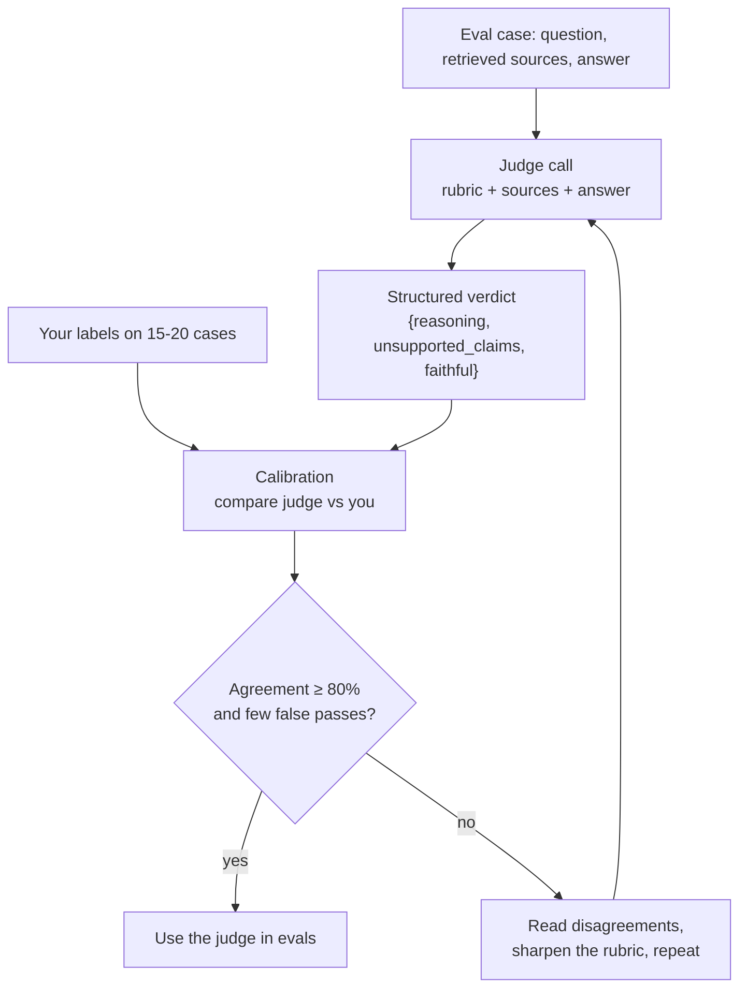

# 12 · LLM-as-judge and calibration

<!-- nav:top -->
[Course home](../../README.md) › [Step 7 plan](../../steps/07-agentic-ai-engineering.md) › [Step 7 lessons](00-start-here.md) · [Glossary](../../GLOSSARY.md)
<!-- nav:end -->

## 1. In one sentence

An **LLM judge** is a model call that grades another model's answer against a **written rubric** (for example "is every claim supported by the sources?"), and **calibration** means checking, on cases you labelled yourself, how often the judge agrees with you before you trust its scores.

## 2. Why it exists

Lesson 11's deterministic checks cover a lot (right tool called, required fact mentioned, citations valid). But some qualities cannot be checked with code:

- **Faithfulness:** is every claim in the answer supported by the retrieved text, or did the model add something?
- **Completeness:** does the answer cover the whole question?
- **Correct refusal:** did it say "not found" for the right reasons?

You could read every answer yourself, but that does not scale to 20 cases × 3 configurations × several runs, every time you change a prompt. A judge model can grade those in minutes. The catch: **a judge is itself an AI system that can be wrong**, so you must measure it before relying on it. As an LLM trainer you already know this from human annotation: graders need guidelines (the rubric) and agreement checks.

## 3. Rails analogy

A judge is like a **custom RSpec matcher that calls an external service**:

```ruby
expect(answer).to be_faithful_to(sources)   # the matcher asks a model to decide
```

Before you trust a new matcher, you would run it against examples where you know the right result, to see if it gets them right. Calibration is exactly that: testing the test.

Where it breaks: the matcher's decision is probabilistic. Even a good judge disagrees with you sometimes, so you report its **agreement rate**, not "it works".

## 4. How it works



### 1. Write a rubric that a human could apply

Good rubrics are **specific, binary (yes/no) and focused on one quality at a time**:

| Weak rubric | Strong rubric |
|---|---|
| "Rate the answer quality from 1 to 10." | "Faithful = true only if **every factual claim** in the answer is directly supported by the sources. General statements like 'Hope this helps' are not claims. Anything not in the sources makes it false." |

Why binary? A 1-10 scale drifts (what is a 6?), and it is hard to calibrate. If you need several qualities, use **one yes/no question per quality**.

### 2. Ask for reasoning, then the verdict, as structured output

Have the judge list evidence (for example, the unsupported claims) **before** the verdict, and return JSON you can parse. With the Anthropic SDK, `client.messages.parse(..., output_format=YourPydanticModel)` returns a validated object.

### 3. Give the judge everything it needs, and nothing that biases it

- **Give:** the question, the **retrieved sources**, the answer.
- **Do not give:** "the expected answer is X" when checking faithfulness (the judge then grades similarity, not support), or which configuration produced the answer (bias).

### 4. Calibrate against your own labels

1. Pick 15-20 answers covering good and bad cases.
2. Label each yourself: faithful yes/no. (Do this **before** you look at the judge's verdict.)
3. Run the judge on the same answers.
4. Build a **confusion matrix** and compute agreement.

**Worked example (20 answers):**

|  | Judge: faithful | Judge: not faithful |
|---|---|---|
| **You: faithful** (12) | 11 | 1 |
| **You: not faithful** (8) | **3** | 5 |

```
agreement   = (11 + 5) / 20 = 80%
false passes = 3 / 8 = 37.5%   ← of the answers you rejected, the judge passed 3
```

Agreement is 80%, but the judge is **too lenient**: it passed 3 of your 8 bad answers. For faithfulness, a false pass (hallucination missed) is worse than a false fail, so read those 3 cases and tighten the rubric ("a claim with a number or a name must appear in the sources"). Repeat until agreement is high **and** false passes are rare.

### 5. Choosing the judge model

- Use a capable model; judging is not a trivial task. `claude-sonnet-5` is a good balance of quality and cost for a judge; check a cheaper model like `claude-haiku-4-5` with calibration before using it.
- Ideally use a **different model** from the one being judged, to reduce the risk that it favours its own style.
- Current models do not accept `temperature`, so you cannot "set temperature 0" for consistency. Instead: a precise rubric, structured output, and (for important comparisons) running the judge more than once.

## 5. Minimal working example

### Part A: the judge

Create `judge.py`:

```python
import anthropic
from pydantic import BaseModel

client = anthropic.Anthropic()
JUDGE_MODEL = "claude-sonnet-5"

RUBRIC = """You are grading an answer for FAITHFULNESS to the provided sources.

A factual claim is any statement about our systems, code, configuration or process.
faithful = true only if EVERY factual claim in the answer is directly supported by the sources.
If any claim is missing from the sources or contradicts them, faithful = false.
Saying "I could not find this in the documents" is faithful when the sources do not answer the question.
First list every unsupported claim (empty list if none), then explain briefly, then decide."""


class Verdict(BaseModel):
    unsupported_claims: list[str]
    reasoning: str
    faithful: bool


def judge_faithfulness(question: str, sources: list[str], answer: str) -> Verdict:
    sources_block = "\n".join(f"<source>{s}</source>" for s in sources)
    response = client.messages.parse(
        model=JUDGE_MODEL,
        max_tokens=4000,
        system=RUBRIC,
        messages=[{
            "role": "user",
            "content": f"<question>{question}</question>\n<sources>\n{sources_block}\n</sources>\n"
                       f"<answer>{answer}</answer>",
        }],
        output_format=Verdict,
    )
    return response.parsed_output


if __name__ == "__main__":
    sources = ["Use retry_on in the job class. Solid Queue retries with exponential backoff."]
    good = "Add retry_on to the job class; retries use exponential backoff."
    bad = "Add retry_on to the job class; Solid Queue retries 25 times by default."
    for answer in (good, bad):
        verdict = judge_faithfulness("How do retries work?", sources, answer)
        print(verdict.faithful, verdict.unsupported_claims)
```

```bash
uv run python judge.py
```

Example output (the reasoning text will differ):

```
True []
False ['Solid Queue retries 25 times by default']
```

The second answer sounds plausible (25 is Sidekiq's default retry count), but nothing in the sources says it. That is exactly the kind of hallucination the judge exists to catch.

### Part B: calibration

Label 15-20 answers yourself, run the judge on them, and save both into `evals/judge_labels.jsonl`:

```json
{"id": "a01", "human": true, "judge": true}
{"id": "a02", "human": true, "judge": true}
```

Then `calibrate.py`:

```python
import json
from collections import Counter
from pathlib import Path

rows = [json.loads(line) for line in Path("evals/judge_labels.jsonl").read_text().splitlines()]

matrix = Counter((row["human"], row["judge"]) for row in rows)
agreement = (matrix[(True, True)] + matrix[(False, False)]) / len(rows)
human_fails = matrix[(False, True)] + matrix[(False, False)]
false_pass_rate = matrix[(False, True)] / human_fails if human_fails else 0.0

print(f"cases: {len(rows)}")
print(f"                 judge=pass  judge=fail")
print(f"human=pass       {matrix[(True, True)]:>10}  {matrix[(True, False)]:>10}")
print(f"human=fail       {matrix[(False, True)]:>10}  {matrix[(False, False)]:>10}")
print(f"agreement:       {agreement:.0%}")
print(f"false pass rate: {false_pass_rate:.0%}")
for row in rows:
    if row["human"] != row["judge"]:
        print("disagreement:", row["id"], "human:", row["human"], "judge:", row["judge"])
```

```bash
uv run python calibrate.py
```

With the 20 labels from the worked example, the output is:

```
cases: 20
                 judge=pass  judge=fail
human=pass               11           1
human=fail                3           5
agreement:       80%
false pass rate: 38%
disagreement: a04 human: True judge: False
...
```

The list of disagreements is your to-do list for improving the rubric.

## 6. Key terms

- **LLM-as-judge**: using a model to grade outputs with a rubric.
- **Rubric**: explicit grading criteria.
- **Faithfulness**: every claim is supported by the sources.
- **Structured output**: the response is JSON matching a schema you define.
- **Calibration**: comparing judge verdicts with human labels.
- **Agreement rate**: share of cases where judge and human agree.
- **Confusion matrix**: the 2×2 table of (human, judge) outcomes.
- **False pass**: the judge passes an answer a human would fail.

## 7. Common mistakes

- **Using the judge before calibrating it.** An uncalibrated judge gives you a precise-looking number with unknown meaning.
- **1-10 scales.** Hard to calibrate; use yes/no questions.
- **Giving the judge the "expected answer"** when you want to check support by sources.
- **Labelling after seeing the judge's verdict.** You will anchor on it; label first.
- **Only looking at overall agreement.** Check which way it errs (false passes vs false fails).
- **Judging with the same prompt that generated the answer.** Keep the rubric separate and specific.
- **Replacing deterministic checks with a judge.** If code can check it, use code.

## 8. Check your understanding

1. Why is a yes/no rubric better than a 1-10 score for evals?
2. In the worked example, why is 80% agreement not good enough on its own?
3. What should the judge see, and what should it not see, when grading faithfulness?
4. You cannot set `temperature` on current models. How do you make judge results as consistent as possible?
5. After calibration, the judge fails many answers you consider fine (false fails). What is the likely problem with the rubric?

<details>
<summary>Answers</summary>

1. Binary questions are easier to define precisely, easier for humans and models to apply consistently, and simple to calibrate with a confusion matrix.
2. Its errors lean the dangerous way: it passed 3 of 8 unfaithful answers (38% false passes), so it would hide hallucinations.
3. It should see the question, the retrieved sources and the answer. It should not see an expected answer, or which configuration or model produced the answer.
4. Precise binary rubric, structured output, evidence-before-verdict, and running the judge more than once for important comparisons (majority vote or average).
5. It is too strict or too vague about what counts as a "claim" (for example treating general phrasing or reasonable summaries as unsupported). Clarify with examples in the rubric.

</details>

## 9. Go deeper (optional)

- Hamel Husain, "Creating a LLM-as-a-Judge That Drives Business Results" (hamel.dev, verify title).
- Claude docs: [Structured outputs](https://platform.claude.com/docs/en/build-with-claude/structured-outputs).
- Zheng et al., "Judging LLM-as-a-Judge with MT-Bench and Chatbot Arena" (2023): known judge biases (position, verbosity, self-preference).

<!-- nav:bottom -->

---

[← 11 · Evals from zero](11-evals-from-zero.md) · [Step 7 lessons](00-start-here.md) · [13 · Cost and latency →](13-cost-and-latency.md)
<!-- nav:end -->
