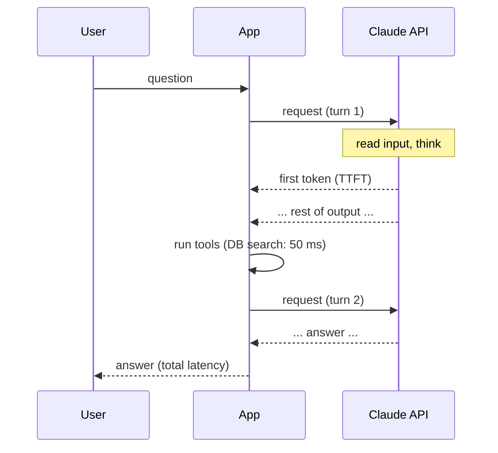

# 13 · Cost and latency

<!-- nav:top -->
[Course home](../../README.md) › [Step 7 plan](../../steps/07-agentic-ai-engineering.md) › [Step 7 lessons](00-start-here.md) · [Glossary](../../GLOSSARY.md)
<!-- nav:end -->

## 1. In one sentence

Every model call costs **money** (tokens in and out × price) and **time** (waiting for the first token, then for the rest), and you control both with a few levers: fewer and smaller calls, prompt caching, the right model and effort level, streaming, and the Batch API for offline work.

## 2. Why it exists

AI features fail in production for boring reasons as often as for quality reasons:

- **"It costs $4,000 a month."** An agent that makes 5 calls per question, each resending a long history, adds up fast.
- **"It takes 25 seconds to answer."** Users give up; Slack bots time out.

You will not optimise in the dark: first **measure** (tokens, cost and p50/p95 latency per question), then change one lever at a time and re-run your evals to confirm quality did not drop. This is the same "measure, change one thing, measure again" method you used for Rails performance in Step 1.

## 3. Rails analogy

| Rails performance | LLM cost and latency |
|---|---|
| N+1 queries | An agent that makes many model calls, each resending the whole history |
| Fragment caching | **Prompt caching** of the stable start of the prompt (tools, system prompt) |
| Choosing a bigger DB instance only where needed | **Model tiering**: a strong model where it matters, a cheaper one elsewhere |
| Background jobs for non-urgent work | **Batch API** for evals and bulk jobs (50% cheaper, results within 24 h) |
| Streaming responses (`ActionController::Live`) | **Streaming** tokens so the user sees output immediately |
| p50/p95 from your APM | p50/p95 of time-to-first-token and total time per question |

Where it breaks: in Rails, a cache hit is free. In LLM APIs, a cache **read** is cheap but not free, and a cache **write** costs a bit **more** than a normal input token, so caching only pays off when the same prefix is reused.

## 4. How it works

### Where the money goes

```
cost of one call = input_tokens × input_price + output_tokens × output_price
                 (+ cache writes × write price + cache reads × read price, if caching)
```

Prices per million tokens (MTok) at the time of writing. **Always check the [pricing page](https://platform.claude.com/docs/en/about-claude/pricing) before using these numbers.**

| Model | Input | Output | Cache read | Notes |
|---|---|---|---|---|
| `claude-opus-5-5` | $4 | $20 | $0.20 (5% of input) | Strongest; default in this course |
| `claude-sonnet-5` | $2 | $10 | $0.20 (10% of input) | Good balance; good judge model |
| `claude-haiku-4-5` | $1 | $5 | $0.10 (10% of input) | Fastest and cheapest; may be retired from 15 Oct 2026 (see below) |

Cache **writes** cost 1.25× the normal input price for the 5-minute cache and 2× for the 1-hour cache. On `claude-opus-5-5` a prompt must be at least 512 tokens to be cached. The [Batch API](https://platform.claude.com/docs/en/build-with-claude/batch-processing) halves both prices for work that can wait (for example nightly eval runs).

Claude Haiku 4.5's retirement date on the Claude API is "not sooner than 15 October 2026". Before you use it, check the [model deprecations](https://platform.claude.com/docs/en/about-claude/model-deprecations) page; if it has been retired, skip the optional Haiku comparison.

Two facts drive most costs:

1. **Output is 5× the price of input**, and thinking tokens count as output. Effort (`low`/`medium`/`high`) changes how much the model thinks.
2. **Agent loops resend everything.** Turn 3's input includes turns 1 and 2. Costs grow faster than the number of turns.

### Worked cost calculation

An agent answers a typical question in 3 turns (lesson 03). From the trace:

| Turn | Input tokens | Output tokens |
|---|---|---|
| 1 (system 300 + tools 700 + question) | 2,000 | 300 |
| 2 (+ turn 1 + search results) | 3,500 | 250 |
| 3 (+ turn 2 + documents) | 5,500 | 400 |
| **Total** | **11,000** | **950** |

**On `claude-opus-5-5`, no caching:**

```
input:  11,000 × $4  / 1,000,000 = $0.0440
output:    950 × $20 / 1,000,000 = $0.0190
per question                     = $0.0630
```

**Per month** for 50 engineers × 10 questions/day × 22 working days = 11,000 questions:

```
11,000 × $0.063 = $693 per month
```

**Lever 1: prompt caching of the stable prefix.** The system prompt + tool definitions (1,000 tokens) are identical in every call. With caching, after the first write they are read at $0.20/MTok instead of $4/MTok. With steady traffic (the cache lives 5 minutes by default and is refreshed on each use), per call:

```
saved per call   = 1,000 × ($4 − $0.20) / 1,000,000 = $0.0038
3 calls/question = $0.0114 saved → about $0.052 per question (−18%)
```

Caching the **conversation history** as well (turn 3 re-reads turns 1-2 from the cache) saves more. Measure it with `usage.cache_read_input_tokens`.

**Lever 2: model tiering.** The same token counts on `claude-sonnet-5`:

```
11,000 × $2 / 1M + 950 × $10 / 1M = $0.022 + $0.0095 = $0.0315 per question (−50%)
```

That is only a saving **if quality holds**. Your eval table (Step 7 lab) exists to answer exactly that question.

**Lever 3: fewer tokens.** Return compact tool results (snippets, not whole documents), limit `top_k`, and keep the system prompt short. Halving the tool-result size often cuts input cost by a third.

**Lever 4: Batch API for evals.** Eval runs are not urgent. The Message Batches API processes requests within 24 hours at **50%** of the normal price. Running 20 cases × 3 configurations × 3 repetitions = 180 runs at half price adds up over a project.

### Where the time goes



- **Time to first token (TTFT)**: mostly reading the input plus thinking. Longer prompts and higher effort increase it.
- **Generation time**: grows with the number of output tokens (including thinking).
- **Number of turns**: each turn adds a full round trip. An agent with 4 turns is roughly 4× the latency of a single call.

Latency levers:

| Lever | Effect |
|---|---|
| **Stream** the final answer | The user sees text after the TTFT, not after the whole answer |
| **Lower `effort`** for simple routes | Less thinking → faster and cheaper; check quality with evals |
| **Fewer turns** | Workflow instead of agent where possible; tools that return enough in one call |
| **Parallel tool calls** | The model requests several tools at once; run them concurrently |
| **Smaller prompts / prompt caching** | Less input to process → lower TTFT |
| **A smaller model** | Faster per token, if quality holds |

Always report **p50 and p95**, not averages: users feel the slow tail.

## 5. Minimal working example

Create `measure.py`. It streams 5 identical requests, measures TTFT and total time, and prints cost and percentiles. Run it twice: once as is, once with `EFFORT = "high"`, and compare.

```python
import statistics
import time

import anthropic

client = anthropic.Anthropic()
MODEL = "claude-opus-5-5"
PRICE_IN, PRICE_OUT, PRICE_CACHE_READ, PRICE_CACHE_WRITE = 4.00, 20.00, 0.20, 5.00  # USD per MTok
EFFORT = "low"
RUNS = 5

SYSTEM = "You are a concise assistant for Rails developers. " * 60  # long enough (~600 tokens) to be cached


def one_run() -> dict:
    started = time.monotonic()
    ttft = None
    with client.messages.stream(
        model=MODEL,
        max_tokens=2000,
        system=[{"type": "text", "text": SYSTEM, "cache_control": {"type": "ephemeral"}}],
        messages=[{"role": "user", "content": "In two sentences: when should I use Solid Cache?"}],
        output_config={"effort": EFFORT},
    ) as stream:
        for _ in stream.text_stream:  # iterate the text as it arrives
            if ttft is None:
                ttft = time.monotonic() - started
        message = stream.get_final_message()
    u = message.usage
    cost = (u.input_tokens * PRICE_IN + u.output_tokens * PRICE_OUT
            + (u.cache_read_input_tokens or 0) * PRICE_CACHE_READ
            + (u.cache_creation_input_tokens or 0) * PRICE_CACHE_WRITE) / 1_000_000
    return {"ttft": ttft or 0.0, "total": time.monotonic() - started, "cost": cost,
            "cache_read": u.cache_read_input_tokens or 0, "output": u.output_tokens}


def p(values: list[float], percentile: int) -> float:
    return statistics.quantiles(values, n=100, method="inclusive")[percentile - 1]


runs = [one_run() for _ in range(RUNS)]
for i, r in enumerate(runs, start=1):
    print(f"run {i}: ttft={r['ttft']:.2f}s total={r['total']:.2f}s out={r['output']} "
          f"cache_read={r['cache_read']} cost=${r['cost']:.5f}")
for key in ("ttft", "total"):
    values = [r[key] for r in runs]
    print(f"{key}: p50={p(values, 50):.2f}s p95={p(values, 95):.2f}s")
print(f"average cost per call: ${statistics.mean(r['cost'] for r in runs):.5f}")
```

```bash
uv run python measure.py
```

Example output (your numbers will differ):

```
run 1: ttft=1.84s total=2.61s out=88 cache_read=0 cost=$0.00490
run 2: ttft=1.12s total=1.79s out=74 cache_read=612 cost=$0.00168
run 3: ttft=1.09s total=1.83s out=81 cache_read=612 cost=$0.00182
run 4: ttft=1.21s total=1.92s out=79 cache_read=612 cost=$0.00178
run 5: ttft=1.15s total=1.88s out=85 cache_read=612 cost=$0.00190
ttft: p50=1.15s p95=1.71s
total: p50=1.88s p95=2.47s
average cost per call: $0.00242
```

What to notice:

- **Run 1** writes the cache (`cache_read=0`); runs 2-5 read it (`cache_read=612`) and cost much less.
- If `cache_read` stays 0 on every run, something in the prefix changes between calls (a timestamp, a random ID, a different tool order), or the prefix is too short to be cached (there is a minimum length per model).
- With `EFFORT = "high"`, expect more output tokens (thinking), a higher TTFT and a higher cost.

## 6. Key terms

- **MTok**: one million tokens; the unit of pricing.
- **Prompt caching**: reusing the processed start of a prompt at a lower price.
- **Cache write / cache read**: storing a prefix (slightly more expensive) / reusing it (much cheaper).
- **`cache_control`**: marks where the cacheable prefix ends.
- **Model tiering**: using the cheapest model that passes your evals for each route.
- **Batch API**: asynchronous requests at 50% of the price, results within 24 hours.
- **TTFT**: time to first token.
- **p50 / p95**: median and 95th percentile latency.
- **Streaming**: receiving output incrementally.

## 7. Common mistakes

- **Optimising without a baseline.** Record tokens, cost and p50/p95 per question first.
- **Changing the model to save money without re-running evals.**
- **Something variable at the start of the prompt** (current time, request ID) that breaks caching. Put variable content at the end.
- **Huge tool results** that dominate input tokens on every later turn.
- **Averages instead of percentiles.**
- **Forgetting that thinking is billed as output.** Use a lower effort where evals allow.
- **Running eval suites synchronously at full price** when the Batch API would do.

## 8. Check your understanding

1. A call has 4,000 input and 600 output tokens on `claude-opus-5-5`. What does it cost without caching?
2. Why does an agent's cost grow faster than its number of turns?
3. Your cache hit rate is zero. Name two likely causes.
4. When is switching from `claude-opus-5-5` to `claude-sonnet-5` a real saving, and how do you check?
5. Which latency lever helps the user even when total time stays the same?

<details>
<summary>Answers</summary>

1. 4,000 × $4/1M = $0.016; 600 × $20/1M = $0.012; total $0.028.
2. Every turn resends the full history (earlier turns and tool results), so each turn's input is bigger than the last.
3. Any two of: variable content (timestamp, ID) early in the prompt; tools or system prompt changing between calls; the prefix is shorter than the minimum cacheable length; calls more than 5 minutes apart.
4. When the eval scores (retrieval, pass rate, faithfulness) stay within your tolerance on the cheaper model. Run the same eval suite on both models and compare quality and cost per task.
5. Streaming: users see text after the time to first token instead of waiting for the full answer.

</details>

## 9. Go deeper (optional)

- Claude docs: [Prompt caching](https://platform.claude.com/docs/en/build-with-claude/prompt-caching) and [Batch processing](https://platform.claude.com/docs/en/build-with-claude/batch-processing).
- Claude docs: [Effort](https://platform.claude.com/docs/en/build-with-claude/effort) and [Streaming](https://platform.claude.com/docs/en/build-with-claude/streaming).
- Claude docs: [Pricing](https://platform.claude.com/docs/en/about-claude/pricing) and [Token counting](https://platform.claude.com/docs/en/build-with-claude/token-counting).

<!-- nav:bottom -->

---

[← 12 · LLM-as-judge and calibration](12-llm-as-judge.md) · [Step 7 lessons](00-start-here.md) · [14 · Security and prompt injection →](14-security-and-prompt-injection.md)
<!-- nav:end -->
