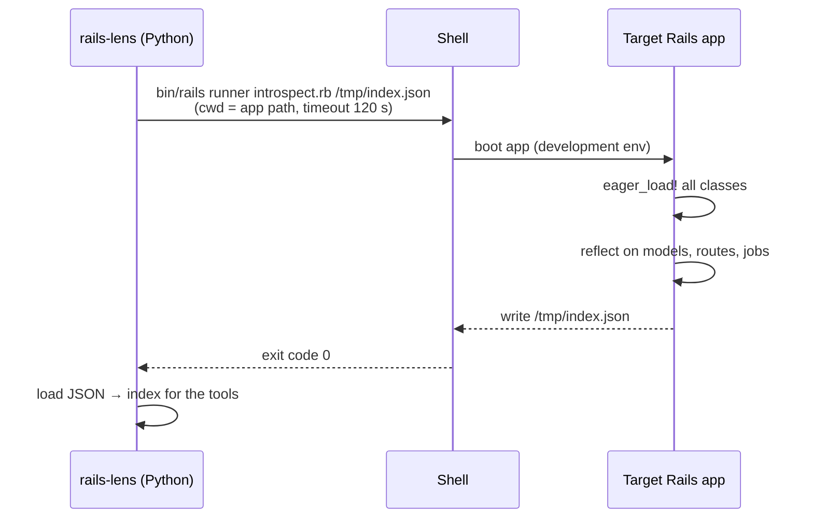

# 01 · Rails introspection with `bin/rails runner`

<!-- nav:top -->
[Course home](../../README.md) › [Step 8 plan](../../steps/08-ai-tool-mvp.md) › [Step 8 lessons](00-start-here.md) · [Glossary](../../GLOSSARY.md)
<!-- nav:end -->

## 1. In one sentence

**Introspection** means asking the running Rails app to describe itself (every model, its columns, associations, validations and callbacks, every route and job) by running a small Ruby script with `bin/rails runner` and saving the answer as JSON.

## 2. Why it exists

To answer "what depends on `Order#status`?" correctly, an AI assistant needs facts that are hard to get by reading files:

- **Associations defined indirectly**: in concerns, by gems (`acts_as_*`), or by metaprogramming.
- **Implicit validations**: `belongs_to :customer` adds a presence validation you never wrote.
- **Routes**: `resources :orders, only: [...]` with nesting expands into routes that are not written anywhere.
- **Columns**: they live in the database schema, not in the model file.

Grep sees text; Rails knows the truth. Rails has public **reflection** APIs that return exactly these facts. Your tool calls them once, saves a JSON "index", and answers questions from it quickly and accurately.

## 3. Rails analogy

You already use pieces of this every day:

| You already know | What it does | Used by introspect.rb |
|---|---|---|
| `bin/rails routes` | Lists every route | `Rails.application.routes.routes` |
| `Order.column_names` in the console | Lists columns | `Order.columns` |
| `Order.reflect_on_association(:customer)` | Describes one association | `reflect_on_all_associations` |
| `Order.validators` | Lists validators | same |
| `bin/rails runner "puts User.count"` | Runs Ruby inside the booted app | runs the whole script |

The introspection script is just a `rails console` session you wrote down, which prints JSON instead of text for humans.

## 4. How it works



The important parts:

1. **`bin/rails runner script.rb arg`** boots the app (initializers, gems, database connection) and runs your script. Anything after the script path is available in `ARGV`.
2. **`Rails.application.eager_load!`** loads every class. In development, Rails loads classes lazily (Zeitwerk autoloading), so without this `ApplicationRecord.descendants` would only list the models already used.
3. **Reflection APIs** (all public, stable Rails APIs):

| API | Returns |
|---|---|
| `Model.columns` | Column objects: `name`, `type`, `null`, `default` |
| `Model.reflect_on_all_associations` | Reflection objects: `name`, `macro` (`:belongs_to`, `:has_many`...), `class_name`, `foreign_key`, `options` (`:through`, `:dependent`) |
| `Model.validators` | Validator objects: `kind` (`:presence`, `:inclusion`...), `attributes`, `options` |
| `Model.__callbacks[:save]` etc. | Callback chains (internal-looking API, see below) |
| `Rails.application.routes.routes` | Route objects: `verb`, `path.spec`, `defaults[:controller]`, `defaults[:action]`, `name` |
| `Object.const_source_location("Order")` | The file (and line) where a constant is defined |

4. **Callbacks need filtering.** `__callbacks` also contains callbacks that Rails adds internally (for autosave, attribute normalisation...). The script keeps only callbacks whose method is defined **under the app's `app/` directory**, using `instance_method(name).source_location`.
5. **Output as JSON to a file.** Writing to a file (not stdout) avoids mixing your JSON with any warnings that gems print during boot.

### Safety: running someone's app is running their code

`bin/rails runner` executes the app's initializers. That is fine on your own machine for your own app, but remember:

- Use the **development** environment, never production credentials.
- Run with a **timeout**; a broken initializer can hang.
- The script must be **read-only**: no writes, no jobs enqueued, no network calls.
- If boot fails (missing credentials, database down), fall back to **static mode** (lesson 02) instead of crashing.

## 5. Minimal working example

Save this as `introspect.rb` (in Step 8 it ships inside your Python package). It was tested with Ruby 3.3 and Rails 8.1.

```ruby
# Usage: bin/rails runner path/to/introspect.rb [output.json]
# Prints a JSON description of the app's models, routes and jobs.
require "json"

Rails.application.eager_load! # load every class so descendants lists are complete

def source_file(klass)
  file, _line = Object.const_source_location(klass.name)
  file&.delete_prefix("#{Rails.root}/")
end

def associations_for(model)
  model.reflect_on_all_associations.map do |a|
    {
      name: a.name,
      macro: a.macro,                       # :belongs_to, :has_many, :has_one, ...
      class_name: a.class_name,
      foreign_key: a.foreign_key.to_s,
      through: a.options[:through],
      dependent: a.options[:dependent]
    }.compact
  end
end

def validations_for(model)
  model.validators.map do |v|
    { kind: v.kind, attributes: v.attributes, options: v.options.except(:if, :unless) }
  end
end

CALLBACK_CHAINS = %i[validation save create update destroy commit].freeze

# True if the method is defined in the app's own code (not in Rails or a gem).
def app_method?(model, method_name)
  file, _line = model.instance_method(method_name).source_location
  file.to_s.start_with?(Rails.root.join("app").to_s)
rescue NameError
  false
end

def callbacks_for(model)
  CALLBACK_CHAINS.flat_map do |chain|
    model.__callbacks[chain].filter_map do |cb|
      next unless cb.filter.is_a?(Symbol) && app_method?(model, cb.filter)
      { chain: chain, kind: cb.kind, method: cb.filter }
    end
  end
end

def columns_for(model)
  model.columns.map { |c| { name: c.name, type: c.type, null: c.null, default: c.default } }
end

models = ApplicationRecord.descendants.reject(&:abstract_class?).sort_by(&:name).map do |model|
  {
    name: model.name,
    file: source_file(model),
    table: model.table_name,
    columns: columns_for(model),
    associations: associations_for(model),
    validations: validations_for(model),
    callbacks: callbacks_for(model)
  }
end

routes = Rails.application.routes.routes.filter_map do |route|
  controller = route.defaults[:controller]
  next if controller.nil? || controller.start_with?("rails/", "action_mailbox/", "active_storage/")
  {
    verb: route.verb,
    path: route.path.spec.to_s.delete_suffix("(.:format)"),
    action: "#{controller}##{route.defaults[:action]}",
    name: route.name
  }
end

jobs = ApplicationJob.descendants.sort_by(&:name).map do |job|
  { name: job.name, queue: job.queue_name, file: source_file(job) }
end

index = { rails_version: Rails.version, ruby_version: RUBY_VERSION, models:, routes:, jobs: }
json = JSON.pretty_generate(index)

if ARGV[0]
  File.write(ARGV[0], json)
  warn "Wrote #{models.size} models, #{routes.size} routes, #{jobs.size} jobs to #{ARGV[0]}"
else
  puts json
end
```

Run it against `shop-lab` (or any Rails 7.1+ app on Ruby 3.1+):

```bash
cd ~/code/shop-lab
bin/rails runner ~/code/rails-lens-mcp/introspect.rb /tmp/rails_index.json
```

Output on a test app with `Customer`, `Order`, `LineItem` and `Product` models:

```
Wrote 4 models, 7 routes, 1 jobs to /tmp/rails_index.json
```

An excerpt of `/tmp/rails_index.json` for this `Order` model:

```ruby
class Order < ApplicationRecord
  belongs_to :customer
  has_many :line_items, dependent: :destroy
  has_many :products, through: :line_items
  validates :status, inclusion: { in: %w[pending paid shipped] }
  before_validation :set_default_status
  after_create_commit :send_receipt
  # ...
end
```

```json
{
  "name": "Order",
  "file": "app/models/order.rb",
  "table": "orders",
  "associations": [
    { "name": "customer", "macro": "belongs_to", "class_name": "Customer", "foreign_key": "customer_id" },
    { "name": "line_items", "macro": "has_many", "class_name": "LineItem", "foreign_key": "order_id", "dependent": "destroy" },
    { "name": "products", "macro": "has_many", "class_name": "Product", "foreign_key": "product_id", "through": "line_items" }
  ],
  "validations": [
    { "kind": "presence", "attributes": ["customer"], "options": { "message": "required" } },
    { "kind": "inclusion", "attributes": ["status"], "options": { "in": ["pending", "paid", "shipped"] } }
  ],
  "callbacks": [
    { "chain": "validation", "kind": "before", "method": "set_default_status" },
    { "chain": "commit", "kind": "after", "method": "send_receipt" }
  ]
}
```

Notice the first validation: `presence` of `customer`, which nobody wrote. Rails adds it for `belongs_to` (required by default since Rails 5). This is exactly the kind of fact grep misses and introspection gets right.

### Calling it from Python

```python
import json
import os
import subprocess
from pathlib import Path


def build_live_index(app_path: Path, script: Path, output: Path, timeout: int = 120) -> dict:
    """Boot the Rails app, run introspect.rb, and return the parsed index."""
    subprocess.run(
        ["bin/rails", "runner", str(script), str(output)],
        cwd=app_path,
        env={**os.environ, "RAILS_ENV": "development"},
        timeout=timeout,
        check=True,            # raise CalledProcessError on a non-zero exit
        capture_output=True,   # keep the app's boot noise out of our stdout
        text=True,
    )
    return json.loads(output.read_text())
```

If this raises `subprocess.CalledProcessError` or `subprocess.TimeoutExpired`, log `stderr` and fall back to static mode.

## 6. Key terms

- **Introspection**: a program describing itself at runtime.
- **Reflection (Active Record)**: public APIs describing models (`reflect_on_all_associations`, `validators`, `columns`).
- **`bin/rails runner`**: runs Ruby inside the booted app.
- **`eager_load!`**: loads all application classes at once.
- **Zeitwerk**: Rails' autoloader, which loads classes lazily in development.
- **Callback chain**: the ordered list of callbacks for an event (`save`, `commit`...).
- **Codebase index**: the JSON snapshot your tools answer from.

## 7. Common mistakes

- **Forgetting `eager_load!`**: the model list is incomplete in development.
- **Printing JSON to stdout** while gems print warnings: the output is no longer valid JSON. Write to a file.
- **Including Rails-internal callbacks** (autosave, normalisation): noise that confuses the model. Filter by source location.
- **No timeout** on the subprocess.
- **Running with production credentials** or `RAILS_ENV=production`.
- **Assuming it works on every app**: engines, multiple databases (`ApplicationRecord` per database), or non-standard base classes need small adjustments. Test on at least two real apps.

## 8. Check your understanding

1. Why can't grep reliably tell you all associations of a model?
2. What does `Rails.application.eager_load!` change, and why is it needed in development?
3. Why does the script write JSON to a file instead of printing it?
4. Where does the `presence` validation on `customer` come from?
5. What should rails-lens do if `bin/rails runner` fails because the database is not running?

<details>
<summary>Answers</summary>

1. Associations can come from concerns, gems or metaprogramming, and the same text ("has_many") can appear in comments or other classes. Rails' reflection returns the associations that actually exist.
2. It loads every class up front; without it, Zeitwerk loads classes only when they are first used, so `descendants` lists would be incomplete.
3. Gems and initializers may print warnings to stdout during boot, which would corrupt the JSON.
4. `belongs_to` associations are required by default, so Rails adds a presence validation for them.
5. Catch the error (log the stderr), and fall back to static mode (parse `db/schema.rb`), telling the user which facts are missing.

</details>

## 9. Go deeper (optional)

- Rails API: [`ActiveRecord::Reflection::ClassMethods`](https://api.rubyonrails.org/classes/ActiveRecord/Reflection/ClassMethods.html) and [`ActiveModel::Validations::ClassMethods#validators`](https://api.rubyonrails.org/classes/ActiveModel/Validations/ClassMethods.html).
- Rails Guides: [Autoloading and Reloading Constants](https://guides.rubyonrails.org/autoloading_and_reloading_constants.html) (eager loading).
- Rails Guides: [The Rails Command Line](https://guides.rubyonrails.org/command_line.html) (`bin/rails runner`).

<!-- nav:bottom -->

---

[← Step 8 lessons: start here](00-start-here.md) · [Step 8 lessons](00-start-here.md) · [02 · Static mode: parsing `schema.rb` without booting Rails →](02-static-mode-parsing-schema-rb.md)
<!-- nav:end -->
